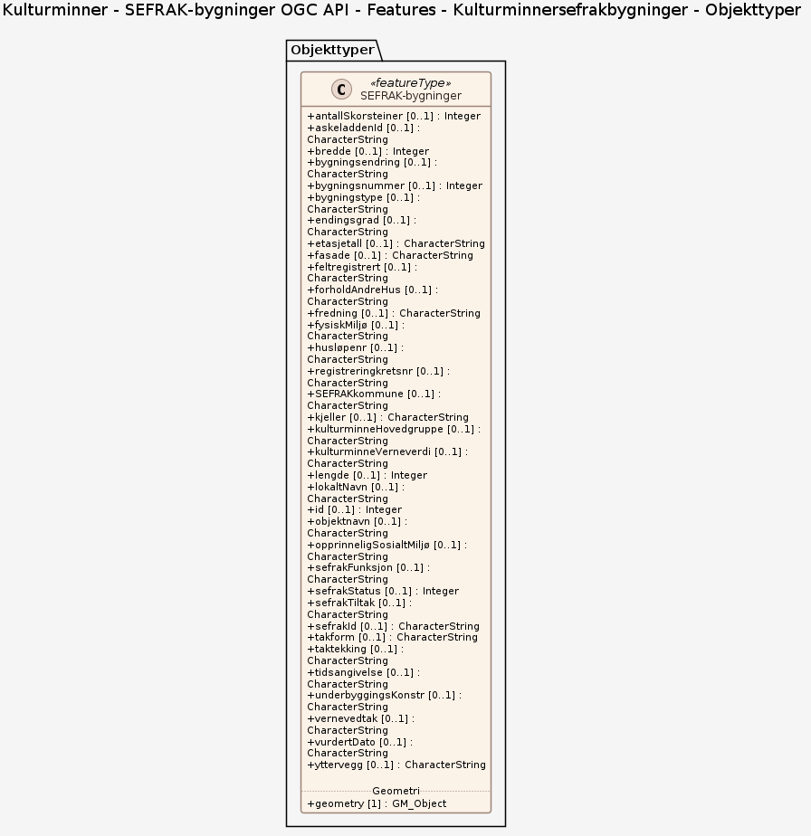

# Produktspesifikasjon: Kulturminner - SEFRAK-bygninger OGC API - Features

*REST-API som følger produktspesifikasjonen med samme navn.

OGC-API er en gruppe standarder som blir utviklet av Open Geospatial Consortium for lettere å kunne tilgjengeliggjøre geografiske data på web. Ikke alle standardene som sammen utgjør OGC API, er fullførte. Denne implementasjonen kan derfor inneholde funksjonalitet som representerer uferdige versjoner av standarder (der det har kommet så langt at det finnes forslag). Det kan forekomme endringer der slikt er implementert. For oversikt over hvilke standarder som er ferdige, se OGC sine nettsider. I API-ets metadata ligger det dessuten informasjon om hvilke av standardenes konformitetsklasser som er implementert.*

**Nøkkelord:** Bygning, KulturminneBygning, Vern_Fredning, KulturminneBetegnelse, Ajourføring, FredningRubrikk, SefrakId, KulturminneDateringInfo, Hovedmålrubrikk, SefrakFunksjon, Endringsvurdering, Bygningsendring, Vern, Feltregistrert, vernedatoFredning, vernelovFredning, verneparagrafFredning, vernetypeFredning, objektnavn, bygningsnummer, bygningstype, ufullstendigAreal, ajourførtDato, ajourførtAv, fredning, sefrakKommune, registreringKretsnr, husLøpenr, sefrakTiltak, tidsangivelse, lengde, bredde, sefrakFunksjonskode, sefrakFunksjonsstatus, endringsgrad, vurdertDato, bygningsendringskode, endringsløpenummer, vernedato, vernelov, verneparagraf, vernetype, sefrakStatus, lokaltnavn, vernevedtak, fysiskMiljø, opprinneligSosialtMiljø, miljøovervåking, kulturminneHovedgruppe, kulturminneVerneverdi, forholdAndreHus, etasjetall, fasade, antallSkorsteiner, takform, taktekking, underbygningKonstr, yttervegg, kjeller, askeladdenID, feltregistrertAv

**Emnekategorier:** 

**Geografisk utstrekning**:

- **Vest**: 2.0
- **Øst**: 33.0
- **Sør**: 57.0
- **Nord**: 72.0

**Tidsmessig utstrekning**:

- **Tidsperiode**:
  - **Fra**: 2024-12-09
  - **Til**: 2024-12-09

## Om spesifikasjonen

> **Denne versjonen av produktspesifikasjonen:**  
> **Opprettet dato:** 2024-12-09 
> **Endret dato:** 2024-12-09 
> **Språk:**  
> **Kontaktinformasjon:** Riksantikvaren, [datatjenester@ra.no](mailto:datatjenester@ra.no)

## Om produktet Kulturminner - SEFRAK-bygninger OGC API - Features

> **Romlig representasjonstype:**  
> **Unik identifikator:** 61a7b45b-5375-41d0-9fc6-57e63c9c7f56 
> **Kontaktinformasjon:** Riksantikvaren, [datatjenester@ra.no](mailto:datatjenester@ra.no)
>
> **Romlig oppløsning:**
>
>
>
> **Begrensninger:**
>
> **Juridiske begrensninger**:
>
> - **Tilgangsbegrensninger**: Åpne data
> - **Bruksbegrensninger**: Lisens
> - **Lisens**: Norsk lisens for offentlige data (NLOD) 2.0
> - **Lisenslenke**: <https://data.norge.no/nlod/no/2.0>

## Omfang

### Hele datasettet

**Nivå**: dataset

**Nivåbeskrivelse**: Gjelder hele datasettet. Hvis omfang ikke er oppgitt under en overskrift, gjelder teksten for hele datasettet og alle leveranser

### Kulturminnersefrakbygninger

**Nivå**: dataset

**Nivåbeskrivelse**: OGC API-Features fra Riksantikvaren

## Datainnhold og struktur

### Datamodell - Kulturminnersefrakbygninger

➡️ [Se full datamodell for omfang "Kulturminnersefrakbygninger" (diagram per pakke og objektkatalog)](kulturminnersefrakbygninger/objektkatalog.html)

## Datakvalitet

**Nivå**: service

- **Kvalitetsmål**: SOSI produktspesifikasjon: Kulturminner - SEFRAK
  **Målebeskrivelse**: Dataene er ikke vurdert iht produktspesifikasjonen
  **Beskrivende resultat**: Dataene er ikke vurdert iht produktspesifikasjonen

## Vedlikehold

**Vedlikeholdsfrekvens**: Daglig

## Leveranse

| Tjeneste | Endepunkt | Type | Format | Leveranseenheter |
| --- | --- | --- | --- | --- |
| OGC API-Features | [Lenke](https://api.ra.no/KulturminnerSEFRAKbygninger) | OGC:API-Features | GeoJSON |  |

## Metadata

**Metadatastandard**: ISO19115

**Metadatastandardversjon**: 2003

**Metadatadato**: 2025-03-19

**språk**: nor

**Kontakt**:

- **Organisasjon**: Riksantikvaren
- **Logo**: <https://register.geonorge.no/data/organizations/974760819_riksantikvaren_liten.png>
- **Epost**: datatjenester@ra.no
- **rolle**: pointOfContact

**Metadataidentifikator**:

- **Utsteder**: Geonorge
- **kode**: 61a7b45b-5375-41d0-9fc6-57e63c9c7f56
- **koderom**: <https://kartkatalog.geonorge.no/metadata/>
- **Metadatalenke**: <https://kartkatalog.geonorge.no/metadata/61a7b45b-5375-41d0-9fc6-57e63c9c7f56>

