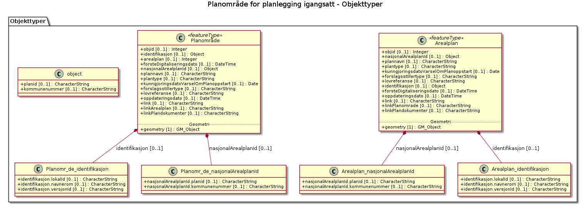

# Produktspesifikasjon: Planområde for planlegging igangsatt

## Generelt om spesifikasjonen

### Unik identifisering

779a554b-fc3e-48a6-b202-561b07e9d4c2

#### Fullstendig navn

Planområde for planlegging igangsatt

#### Versjon

2025-10-17

### Referansedato

2025-10-17

### Ansvarlig organisasjon

Direktoratet for byggkvalitet

### Språk

nor

### Hovedtema

planområde, planomriss, Arealplan, Plan

### Temakategori

Plan og eiendom

### Sammendrag

Datasettet viser område(r) hvor det er varslet at planlegging skal igangsettes etter plan- og bygningsloven (pbl). Formålet er å kunne identifisere og vise hvor planarbeid er startet, slik at naboer, berørte parter, høringsmyndigheter og kommunen får informasjon om planinitiativet.

### Formål

Formålet er å kunne identifisere og vise hvor planarbeid er startet, slik at naboer, berørte parter, høringsmyndigheter og kommunen får informasjon om planinitiativet og kan medvirke i prosessen.

## Spesifikasjonsomfang

**Nivå**: dataset

**Utstrekning**:

- **romlig**: - **romlig omfang**: National
- **tidsmessig**: - **intervall**: - 2025-10-17, 2025-10-17

**Juridiske begrensninger**:

- **Tilgangsbegrensninger**: Åpne data
- **Bruksbegrensninger**: Lisens
- **Lisens**: Norsk lisens for offentlige data (NLOD) 2.0
- **Lisenslenke**: <https://data.norge.no/nlod/no/2.0>
- **Sikkerhetsbegrensninger**: Ugradert

## Innhold og struktur

**Bruk**: Datasettet brukes som grunnlag ved oversendelse av planinitiativ til kommunen og høringsparter, i varsel om oppstart av planarbeid, som underlag i saksbehandling, uttalelser fra høringsmyndigheter og registrering i  kommunale planregister, samt for visning i kartløsninger.

### Datamodell

#### Arealplan

Dataobjekt for igangsatt planlegging etter pbl

Geometri:
- itemType: feature
- type: geometry-any
- storageCrs:
  - <a href="http://www.opengis.net/def/crs/OGC/1.3/CRS84"><http://www.opengis.net/def/crs/OGC/1.3/CRS84></a>
- crs:
  - <a href="http://www.opengis.net/def/crs/OGC/1.3/CRS84"><http://www.opengis.net/def/crs/OGC/1.3/CRS84></a>

Egenskaper

<table class="feature-attribute-table">
  <colgroup>
    <col style="width: 35%;" />
    <col style="width: 65%;" />
  </colgroup>
  <tbody>
    <tr>
      <th scope="row">Navn:</th>
      <td><strong>geometry</strong></td>
    </tr>
    <tr>
      <th scope="row">Definisjon:</th>
      <td>Elementtype: feature</td>
    </tr>
    <tr>
      <th scope="row">Type:</th>
      <td>geometry-any</td>
    </tr>
    <tr>
      <th scope="row">OGC-rolle:</th>
      <td>primary-geometry</td>
    </tr>
  </tbody>
</table>

<table class="feature-attribute-table">
  <colgroup>
    <col style="width: 35%;" />
    <col style="width: 65%;" />
  </colgroup>
  <tbody>
    <tr>
      <th scope="row">Navn:</th>
      <td><strong>objid</strong></td>
    </tr>
    <tr>
      <th scope="row">Definisjon:</th>
      <td>objid</td>
    </tr>
    <tr>
      <th scope="row">Multiplisitet:</th>
      <td>0..1</td>
    </tr>
    <tr>
      <th scope="row">Type:</th>
      <td>integer</td>
    </tr>
    <tr>
      <th scope="row">OGC-rolle:</th>
      <td>id</td>
    </tr>
  </tbody>
</table>

<table class="feature-attribute-table">
  <colgroup>
    <col style="width: 35%;" />
    <col style="width: 65%;" />
  </colgroup>
  <tbody>
    <tr>
      <th scope="row">Navn:</th>
      <td><strong>nasjonalArealplanId</strong></td>
    </tr>
    <tr>
      <th scope="row">Multiplisitet:</th>
      <td>0..1</td>
    </tr>
    <tr>
      <th scope="row">Type:</th>
      <td>object</td>
    </tr>
  </tbody>
</table>

<table class="feature-attribute-table">
  <colgroup>
    <col style="width: 35%;" />
    <col style="width: 65%;" />
  </colgroup>
  <tbody>
    <tr>
      <th scope="row">Navn:</th>
      <td><strong>nasjonalArealplanId.planid</strong></td>
    </tr>
    <tr>
      <th scope="row">Definisjon:</th>
      <td>nasjonalArealplanId.planid</td>
    </tr>
    <tr>
      <th scope="row">Multiplisitet:</th>
      <td>0..1</td>
    </tr>
    <tr>
      <th scope="row">Type:</th>
      <td>string</td>
    </tr>
  </tbody>
</table>

<table class="feature-attribute-table">
  <colgroup>
    <col style="width: 35%;" />
    <col style="width: 65%;" />
  </colgroup>
  <tbody>
    <tr>
      <th scope="row">Navn:</th>
      <td><strong>nasjonalArealplanId.kommunenummer</strong></td>
    </tr>
    <tr>
      <th scope="row">Definisjon:</th>
      <td>nasjonalArealplanId.kommunenummer</td>
    </tr>
    <tr>
      <th scope="row">Multiplisitet:</th>
      <td>0..1</td>
    </tr>
    <tr>
      <th scope="row">Type:</th>
      <td>string</td>
    </tr>
  </tbody>
</table>

<table class="feature-attribute-table">
  <colgroup>
    <col style="width: 35%;" />
    <col style="width: 65%;" />
  </colgroup>
  <tbody>
    <tr>
      <th scope="row">Navn:</th>
      <td><strong>plannavn</strong></td>
    </tr>
    <tr>
      <th scope="row">Definisjon:</th>
      <td>plannavn</td>
    </tr>
    <tr>
      <th scope="row">Multiplisitet:</th>
      <td>0..1</td>
    </tr>
    <tr>
      <th scope="row">Type:</th>
      <td>string</td>
    </tr>
  </tbody>
</table>

<table class="feature-attribute-table">
  <colgroup>
    <col style="width: 35%;" />
    <col style="width: 65%;" />
  </colgroup>
  <tbody>
    <tr>
      <th scope="row">Navn:</th>
      <td><strong>plantype</strong></td>
    </tr>
    <tr>
      <th scope="row">Definisjon:</th>
      <td>plantype</td>
    </tr>
    <tr>
      <th scope="row">Multiplisitet:</th>
      <td>0..1</td>
    </tr>
    <tr>
      <th scope="row">Type:</th>
      <td>string</td>
    </tr>
  </tbody>
</table>

<table class="feature-attribute-table">
  <colgroup>
    <col style="width: 35%;" />
    <col style="width: 65%;" />
  </colgroup>
  <tbody>
    <tr>
      <th scope="row">Navn:</th>
      <td><strong>kunngjoringsdatoVarselOmPlanoppstart</strong></td>
    </tr>
    <tr>
      <th scope="row">Definisjon:</th>
      <td>kunngjoringsdatoVarselOmPlanoppstart</td>
    </tr>
    <tr>
      <th scope="row">Multiplisitet:</th>
      <td>0..1</td>
    </tr>
    <tr>
      <th scope="row">Type:</th>
      <td>date (string)</td>
    </tr>
  </tbody>
</table>

<table class="feature-attribute-table">
  <colgroup>
    <col style="width: 35%;" />
    <col style="width: 65%;" />
  </colgroup>
  <tbody>
    <tr>
      <th scope="row">Navn:</th>
      <td><strong>forslagsstillertype</strong></td>
    </tr>
    <tr>
      <th scope="row">Definisjon:</th>
      <td>forslagsstillertype</td>
    </tr>
    <tr>
      <th scope="row">Multiplisitet:</th>
      <td>0..1</td>
    </tr>
    <tr>
      <th scope="row">Type:</th>
      <td>string</td>
    </tr>
  </tbody>
</table>

<table class="feature-attribute-table">
  <colgroup>
    <col style="width: 35%;" />
    <col style="width: 65%;" />
  </colgroup>
  <tbody>
    <tr>
      <th scope="row">Navn:</th>
      <td><strong>lovreferanse</strong></td>
    </tr>
    <tr>
      <th scope="row">Definisjon:</th>
      <td>lovreferanse</td>
    </tr>
    <tr>
      <th scope="row">Multiplisitet:</th>
      <td>0..1</td>
    </tr>
    <tr>
      <th scope="row">Type:</th>
      <td>string</td>
    </tr>
  </tbody>
</table>

<table class="feature-attribute-table">
  <colgroup>
    <col style="width: 35%;" />
    <col style="width: 65%;" />
  </colgroup>
  <tbody>
    <tr>
      <th scope="row">Navn:</th>
      <td><strong>identifikasjon</strong></td>
    </tr>
    <tr>
      <th scope="row">Multiplisitet:</th>
      <td>0..1</td>
    </tr>
    <tr>
      <th scope="row">Type:</th>
      <td>object</td>
    </tr>
  </tbody>
</table>

<table class="feature-attribute-table">
  <colgroup>
    <col style="width: 35%;" />
    <col style="width: 65%;" />
  </colgroup>
  <tbody>
    <tr>
      <th scope="row">Navn:</th>
      <td><strong>identifikasjon.lokalId</strong></td>
    </tr>
    <tr>
      <th scope="row">Definisjon:</th>
      <td>identifikasjon.lokalId</td>
    </tr>
    <tr>
      <th scope="row">Multiplisitet:</th>
      <td>0..1</td>
    </tr>
    <tr>
      <th scope="row">Type:</th>
      <td>string</td>
    </tr>
  </tbody>
</table>

<table class="feature-attribute-table">
  <colgroup>
    <col style="width: 35%;" />
    <col style="width: 65%;" />
  </colgroup>
  <tbody>
    <tr>
      <th scope="row">Navn:</th>
      <td><strong>identifikasjon.navnerom</strong></td>
    </tr>
    <tr>
      <th scope="row">Definisjon:</th>
      <td>identifikasjon.navnerom</td>
    </tr>
    <tr>
      <th scope="row">Multiplisitet:</th>
      <td>0..1</td>
    </tr>
    <tr>
      <th scope="row">Type:</th>
      <td>string</td>
    </tr>
  </tbody>
</table>

<table class="feature-attribute-table">
  <colgroup>
    <col style="width: 35%;" />
    <col style="width: 65%;" />
  </colgroup>
  <tbody>
    <tr>
      <th scope="row">Navn:</th>
      <td><strong>identifikasjon.versjonId</strong></td>
    </tr>
    <tr>
      <th scope="row">Definisjon:</th>
      <td>identifikasjon.versjonId</td>
    </tr>
    <tr>
      <th scope="row">Multiplisitet:</th>
      <td>0..1</td>
    </tr>
    <tr>
      <th scope="row">Type:</th>
      <td>string</td>
    </tr>
  </tbody>
</table>

<table class="feature-attribute-table">
  <colgroup>
    <col style="width: 35%;" />
    <col style="width: 65%;" />
  </colgroup>
  <tbody>
    <tr>
      <th scope="row">Navn:</th>
      <td><strong>forsteDigitaliseringsdato</strong></td>
    </tr>
    <tr>
      <th scope="row">Definisjon:</th>
      <td>forsteDigitaliseringsdato</td>
    </tr>
    <tr>
      <th scope="row">Multiplisitet:</th>
      <td>0..1</td>
    </tr>
    <tr>
      <th scope="row">Type:</th>
      <td>date-time (string)</td>
    </tr>
  </tbody>
</table>

<table class="feature-attribute-table">
  <colgroup>
    <col style="width: 35%;" />
    <col style="width: 65%;" />
  </colgroup>
  <tbody>
    <tr>
      <th scope="row">Navn:</th>
      <td><strong>oppdateringsdato</strong></td>
    </tr>
    <tr>
      <th scope="row">Definisjon:</th>
      <td>oppdateringsdato</td>
    </tr>
    <tr>
      <th scope="row">Multiplisitet:</th>
      <td>0..1</td>
    </tr>
    <tr>
      <th scope="row">Type:</th>
      <td>date-time (string)</td>
    </tr>
  </tbody>
</table>

<table class="feature-attribute-table">
  <colgroup>
    <col style="width: 35%;" />
    <col style="width: 65%;" />
  </colgroup>
  <tbody>
    <tr>
      <th scope="row">Navn:</th>
      <td><strong>link</strong></td>
    </tr>
    <tr>
      <th scope="row">Definisjon:</th>
      <td>link</td>
    </tr>
    <tr>
      <th scope="row">Multiplisitet:</th>
      <td>0..1</td>
    </tr>
    <tr>
      <th scope="row">Type:</th>
      <td>string</td>
    </tr>
  </tbody>
</table>

<table class="feature-attribute-table">
  <colgroup>
    <col style="width: 35%;" />
    <col style="width: 65%;" />
  </colgroup>
  <tbody>
    <tr>
      <th scope="row">Navn:</th>
      <td><strong>linkPlanomrade</strong></td>
    </tr>
    <tr>
      <th scope="row">Definisjon:</th>
      <td>linkPlanomrade</td>
    </tr>
    <tr>
      <th scope="row">Multiplisitet:</th>
      <td>0..1</td>
    </tr>
    <tr>
      <th scope="row">Type:</th>
      <td>string</td>
    </tr>
  </tbody>
</table>

<table class="feature-attribute-table">
  <colgroup>
    <col style="width: 35%;" />
    <col style="width: 65%;" />
  </colgroup>
  <tbody>
    <tr>
      <th scope="row">Navn:</th>
      <td><strong>linkPlandokumenter</strong></td>
    </tr>
    <tr>
      <th scope="row">Definisjon:</th>
      <td>linkPlandokumenter</td>
    </tr>
    <tr>
      <th scope="row">Multiplisitet:</th>
      <td>0..1</td>
    </tr>
    <tr>
      <th scope="row">Type:</th>
      <td>string</td>
    </tr>
  </tbody>
</table>

#### Planområde

Geometriske områder og tilhørende metadata fra "Varsel om Oppstart av Reguleringsplanarbeider"-databasen

Geometri:
- itemType: feature
- type: geometry-any
- storageCrs:
  - <a href="http://www.opengis.net/def/crs/EPSG/0/25833"><http://www.opengis.net/def/crs/EPSG/0/25833></a>
- crs:
  - <a href="http://www.opengis.net/def/crs/OGC/1.3/CRS84"><http://www.opengis.net/def/crs/OGC/1.3/CRS84></a>
  - <a href="http://www.opengis.net/def/crs/EPSG/0/25832"><http://www.opengis.net/def/crs/EPSG/0/25832></a>
  - <a href="http://www.opengis.net/def/crs/EPSG/0/25833"><http://www.opengis.net/def/crs/EPSG/0/25833></a>
  - <a href="http://www.opengis.net/def/crs/EPSG/0/25835"><http://www.opengis.net/def/crs/EPSG/0/25835></a>
  - <a href="http://www.opengis.net/def/crs/EPSG/0/4258"><http://www.opengis.net/def/crs/EPSG/0/4258></a>
  - <a href="http://www.opengis.net/def/crs/EPSG/0/4326"><http://www.opengis.net/def/crs/EPSG/0/4326></a>
  - <a href="http://www.opengis.net/def/crs/EPSG/0/3857"><http://www.opengis.net/def/crs/EPSG/0/3857></a>

Egenskaper

<table class="feature-attribute-table">
  <colgroup>
    <col style="width: 35%;" />
    <col style="width: 65%;" />
  </colgroup>
  <tbody>
    <tr>
      <th scope="row">Navn:</th>
      <td><strong>geometry</strong></td>
    </tr>
    <tr>
      <th scope="row">Definisjon:</th>
      <td>Elementtype: feature</td>
    </tr>
    <tr>
      <th scope="row">Type:</th>
      <td>geometry-any</td>
    </tr>
    <tr>
      <th scope="row">OGC-rolle:</th>
      <td>primary-geometry</td>
    </tr>
  </tbody>
</table>

<table class="feature-attribute-table">
  <colgroup>
    <col style="width: 35%;" />
    <col style="width: 65%;" />
  </colgroup>
  <tbody>
    <tr>
      <th scope="row">Navn:</th>
      <td><strong>objid</strong></td>
    </tr>
    <tr>
      <th scope="row">Definisjon:</th>
      <td>objid</td>
    </tr>
    <tr>
      <th scope="row">Multiplisitet:</th>
      <td>0..1</td>
    </tr>
    <tr>
      <th scope="row">Type:</th>
      <td>integer</td>
    </tr>
    <tr>
      <th scope="row">OGC-rolle:</th>
      <td>id</td>
    </tr>
  </tbody>
</table>

<table class="feature-attribute-table">
  <colgroup>
    <col style="width: 35%;" />
    <col style="width: 65%;" />
  </colgroup>
  <tbody>
    <tr>
      <th scope="row">Navn:</th>
      <td><strong>identifikasjon</strong></td>
    </tr>
    <tr>
      <th scope="row">Multiplisitet:</th>
      <td>0..1</td>
    </tr>
    <tr>
      <th scope="row">Type:</th>
      <td>object</td>
    </tr>
  </tbody>
</table>

<table class="feature-attribute-table">
  <colgroup>
    <col style="width: 35%;" />
    <col style="width: 65%;" />
  </colgroup>
  <tbody>
    <tr>
      <th scope="row">Navn:</th>
      <td><strong>identifikasjon.lokalId</strong></td>
    </tr>
    <tr>
      <th scope="row">Definisjon:</th>
      <td>identifikasjon.lokalId</td>
    </tr>
    <tr>
      <th scope="row">Multiplisitet:</th>
      <td>0..1</td>
    </tr>
    <tr>
      <th scope="row">Type:</th>
      <td>string</td>
    </tr>
  </tbody>
</table>

<table class="feature-attribute-table">
  <colgroup>
    <col style="width: 35%;" />
    <col style="width: 65%;" />
  </colgroup>
  <tbody>
    <tr>
      <th scope="row">Navn:</th>
      <td><strong>identifikasjon.navnerom</strong></td>
    </tr>
    <tr>
      <th scope="row">Definisjon:</th>
      <td>identifikasjon.navnerom</td>
    </tr>
    <tr>
      <th scope="row">Multiplisitet:</th>
      <td>0..1</td>
    </tr>
    <tr>
      <th scope="row">Type:</th>
      <td>string</td>
    </tr>
  </tbody>
</table>

<table class="feature-attribute-table">
  <colgroup>
    <col style="width: 35%;" />
    <col style="width: 65%;" />
  </colgroup>
  <tbody>
    <tr>
      <th scope="row">Navn:</th>
      <td><strong>identifikasjon.versjonId</strong></td>
    </tr>
    <tr>
      <th scope="row">Definisjon:</th>
      <td>identifikasjon.versjonId</td>
    </tr>
    <tr>
      <th scope="row">Multiplisitet:</th>
      <td>0..1</td>
    </tr>
    <tr>
      <th scope="row">Type:</th>
      <td>string</td>
    </tr>
  </tbody>
</table>

<table class="feature-attribute-table">
  <colgroup>
    <col style="width: 35%;" />
    <col style="width: 65%;" />
  </colgroup>
  <tbody>
    <tr>
      <th scope="row">Navn:</th>
      <td><strong>arealplan</strong></td>
    </tr>
    <tr>
      <th scope="row">Definisjon:</th>
      <td>arealplan</td>
    </tr>
    <tr>
      <th scope="row">Multiplisitet:</th>
      <td>0..1</td>
    </tr>
    <tr>
      <th scope="row">Type:</th>
      <td>integer</td>
    </tr>
  </tbody>
</table>

<table class="feature-attribute-table">
  <colgroup>
    <col style="width: 35%;" />
    <col style="width: 65%;" />
  </colgroup>
  <tbody>
    <tr>
      <th scope="row">Navn:</th>
      <td><strong>forsteDigitaliseringsdato</strong></td>
    </tr>
    <tr>
      <th scope="row">Definisjon:</th>
      <td>forsteDigitaliseringsdato</td>
    </tr>
    <tr>
      <th scope="row">Multiplisitet:</th>
      <td>0..1</td>
    </tr>
    <tr>
      <th scope="row">Type:</th>
      <td>date-time (string)</td>
    </tr>
  </tbody>
</table>

<table class="feature-attribute-table">
  <colgroup>
    <col style="width: 35%;" />
    <col style="width: 65%;" />
  </colgroup>
  <tbody>
    <tr>
      <th scope="row">Navn:</th>
      <td><strong>nasjonalArealplanId</strong></td>
    </tr>
    <tr>
      <th scope="row">Multiplisitet:</th>
      <td>0..1</td>
    </tr>
    <tr>
      <th scope="row">Type:</th>
      <td>object</td>
    </tr>
  </tbody>
</table>

<table class="feature-attribute-table">
  <colgroup>
    <col style="width: 35%;" />
    <col style="width: 65%;" />
  </colgroup>
  <tbody>
    <tr>
      <th scope="row">Navn:</th>
      <td><strong>nasjonalArealplanId.planid</strong></td>
    </tr>
    <tr>
      <th scope="row">Definisjon:</th>
      <td>nasjonalArealplanId.planid</td>
    </tr>
    <tr>
      <th scope="row">Multiplisitet:</th>
      <td>0..1</td>
    </tr>
    <tr>
      <th scope="row">Type:</th>
      <td>string</td>
    </tr>
  </tbody>
</table>

<table class="feature-attribute-table">
  <colgroup>
    <col style="width: 35%;" />
    <col style="width: 65%;" />
  </colgroup>
  <tbody>
    <tr>
      <th scope="row">Navn:</th>
      <td><strong>nasjonalArealplanId.kommunenummer</strong></td>
    </tr>
    <tr>
      <th scope="row">Definisjon:</th>
      <td>nasjonalArealplanId.kommunenummer</td>
    </tr>
    <tr>
      <th scope="row">Multiplisitet:</th>
      <td>0..1</td>
    </tr>
    <tr>
      <th scope="row">Type:</th>
      <td>string</td>
    </tr>
  </tbody>
</table>

<table class="feature-attribute-table">
  <colgroup>
    <col style="width: 35%;" />
    <col style="width: 65%;" />
  </colgroup>
  <tbody>
    <tr>
      <th scope="row">Navn:</th>
      <td><strong>plannavn</strong></td>
    </tr>
    <tr>
      <th scope="row">Definisjon:</th>
      <td>plannavn</td>
    </tr>
    <tr>
      <th scope="row">Multiplisitet:</th>
      <td>0..1</td>
    </tr>
    <tr>
      <th scope="row">Type:</th>
      <td>string</td>
    </tr>
  </tbody>
</table>

<table class="feature-attribute-table">
  <colgroup>
    <col style="width: 35%;" />
    <col style="width: 65%;" />
  </colgroup>
  <tbody>
    <tr>
      <th scope="row">Navn:</th>
      <td><strong>plantype</strong></td>
    </tr>
    <tr>
      <th scope="row">Definisjon:</th>
      <td>plantype</td>
    </tr>
    <tr>
      <th scope="row">Multiplisitet:</th>
      <td>0..1</td>
    </tr>
    <tr>
      <th scope="row">Type:</th>
      <td>string</td>
    </tr>
  </tbody>
</table>

<table class="feature-attribute-table">
  <colgroup>
    <col style="width: 35%;" />
    <col style="width: 65%;" />
  </colgroup>
  <tbody>
    <tr>
      <th scope="row">Navn:</th>
      <td><strong>kunngjoringsdatoVarselOmPlanoppstart</strong></td>
    </tr>
    <tr>
      <th scope="row">Definisjon:</th>
      <td>kunngjoringsdatoVarselOmPlanoppstart</td>
    </tr>
    <tr>
      <th scope="row">Multiplisitet:</th>
      <td>0..1</td>
    </tr>
    <tr>
      <th scope="row">Type:</th>
      <td>date (string)</td>
    </tr>
  </tbody>
</table>

<table class="feature-attribute-table">
  <colgroup>
    <col style="width: 35%;" />
    <col style="width: 65%;" />
  </colgroup>
  <tbody>
    <tr>
      <th scope="row">Navn:</th>
      <td><strong>forslagsstillertype</strong></td>
    </tr>
    <tr>
      <th scope="row">Definisjon:</th>
      <td>forslagsstillertype</td>
    </tr>
    <tr>
      <th scope="row">Multiplisitet:</th>
      <td>0..1</td>
    </tr>
    <tr>
      <th scope="row">Type:</th>
      <td>string</td>
    </tr>
  </tbody>
</table>

<table class="feature-attribute-table">
  <colgroup>
    <col style="width: 35%;" />
    <col style="width: 65%;" />
  </colgroup>
  <tbody>
    <tr>
      <th scope="row">Navn:</th>
      <td><strong>lovreferanse</strong></td>
    </tr>
    <tr>
      <th scope="row">Definisjon:</th>
      <td>lovreferanse</td>
    </tr>
    <tr>
      <th scope="row">Multiplisitet:</th>
      <td>0..1</td>
    </tr>
    <tr>
      <th scope="row">Type:</th>
      <td>string</td>
    </tr>
  </tbody>
</table>

<table class="feature-attribute-table">
  <colgroup>
    <col style="width: 35%;" />
    <col style="width: 65%;" />
  </colgroup>
  <tbody>
    <tr>
      <th scope="row">Navn:</th>
      <td><strong>oppdateringsdato</strong></td>
    </tr>
    <tr>
      <th scope="row">Definisjon:</th>
      <td>oppdateringsdato</td>
    </tr>
    <tr>
      <th scope="row">Multiplisitet:</th>
      <td>0..1</td>
    </tr>
    <tr>
      <th scope="row">Type:</th>
      <td>date-time (string)</td>
    </tr>
  </tbody>
</table>

<table class="feature-attribute-table">
  <colgroup>
    <col style="width: 35%;" />
    <col style="width: 65%;" />
  </colgroup>
  <tbody>
    <tr>
      <th scope="row">Navn:</th>
      <td><strong>link</strong></td>
    </tr>
    <tr>
      <th scope="row">Definisjon:</th>
      <td>link</td>
    </tr>
    <tr>
      <th scope="row">Multiplisitet:</th>
      <td>0..1</td>
    </tr>
    <tr>
      <th scope="row">Type:</th>
      <td>string</td>
    </tr>
  </tbody>
</table>

<table class="feature-attribute-table">
  <colgroup>
    <col style="width: 35%;" />
    <col style="width: 65%;" />
  </colgroup>
  <tbody>
    <tr>
      <th scope="row">Navn:</th>
      <td><strong>linkArealplan</strong></td>
    </tr>
    <tr>
      <th scope="row">Definisjon:</th>
      <td>linkArealplan</td>
    </tr>
    <tr>
      <th scope="row">Multiplisitet:</th>
      <td>0..1</td>
    </tr>
    <tr>
      <th scope="row">Type:</th>
      <td>string</td>
    </tr>
  </tbody>
</table>

<table class="feature-attribute-table">
  <colgroup>
    <col style="width: 35%;" />
    <col style="width: 65%;" />
  </colgroup>
  <tbody>
    <tr>
      <th scope="row">Navn:</th>
      <td><strong>linkPlandokumenter</strong></td>
    </tr>
    <tr>
      <th scope="row">Definisjon:</th>
      <td>linkPlandokumenter</td>
    </tr>
    <tr>
      <th scope="row">Multiplisitet:</th>
      <td>0..1</td>
    </tr>
    <tr>
      <th scope="row">Type:</th>
      <td>string</td>
    </tr>
  </tbody>
</table>

## Referansesystem

**Romlig representasjonstype**: Vektor

## Kvalitet

**Nivå**: dataset

## Datavedlikehold

**Vedlikeholdsfrekvens**: Kontinuerlig

**Vedlikeholdsnotat**: Datasettet brukes som grunnlag ved oversendelse av planinitiativ til kommunen og høringsparter, i varsel om oppstart av planarbeid, som underlag i saksbehandling, uttalelser fra høringsmyndigheter og registrering i  kommunale planregister, samt for visning i kartløsninger.

**Status**: Planlagt

## Leveranse

**Distribusjoner**:

- **format**: - **format**: OGC:API-Features
  **tilgang**:

  - **lenke**: <https://plandata.ft.dibk.no/services/rest/planleggingigangsatt>
  - **protokoll**: OGC:API-Features

- **tittel**: OGC API-Features
  **format**: - **format**: OGC API-Features
  **tilgang**:

  - **lenke**: <https://plandata.ft.dibk.no/services/rest/planleggingigangsatt>
  - **protokoll**: OGC:API-Features

- **tittel**: Planområde for planlegging igangsatt
  **format**: - **format**: PNG
  **tilgang**:

  - **lenke**: <https://plandata.ft.dibk.no/services/wms/planleggingigangsatt/?service=WMS&request=GetCapabilities>
  - **protokoll**: WMS-tjeneste
  - **Lisens**: Åpne data
  **Notater**: Tjeneste

## Metadata

**Standard**: ISO19115

**Standardversjon**: 2003

**Metadatadato**: 2025-12-16

**språk**: nor

**Kontaktpunkt**:

- **organisasjon**: Direktoratet for byggkvalitet
- **epost**: ftb@dibk.no
- **rolle**: pointOfContact

**Identifikatorer**:

- **Utsteder**: geonorge
  **kode**: 779a554b-fc3e-48a6-b202-561b07e9d4c2

**Metadatalenke**:
<https://www.geonorge.no/geonetwork/srv/nor/csw?service=CSW&request=GetRecordById&version=2.0.2&outputSchema=http://www.isotc211.org/2005/gmd&elementSetName=full&id=779a554b-fc3e-48a6-b202-561b07e9d4c2>
