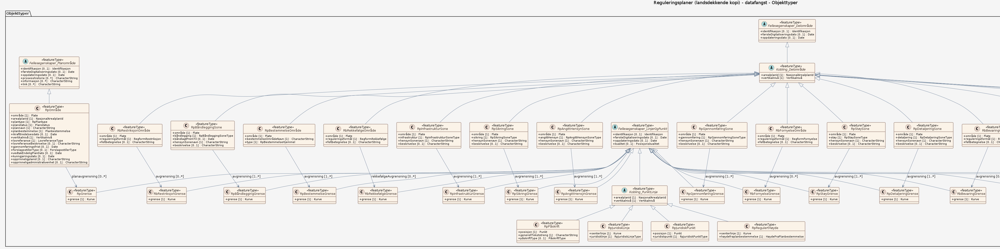

### Datamodell

#### Fellesegenskaper_Delområde (abstrakt)

abstrakt objekt som bærer en rekke egenskaper som er fagområde-uavhengige og kan benyttes for alle objekttyper  Merknad: Spesielt i produktspesifikasjonsarbeid vil en velge egenskaper og avgrensningslinjer fra denne klassen.   -- Definition -- abstract object which carries a number of attributes which are independent of specific disciplines and may be used for all object types

Egenskaper

<table class="feature-attribute-table">
  <colgroup>
    <col style="width: 35%;" />
    <col style="width: 65%;" />
  </colgroup>
  <tbody>
    <tr>
      <th scope="row">Navn:</th>
      <td><strong>identifikasjon</strong></td>
    </tr>
    <tr>
      <th scope="row">Multiplisitet:</th>
      <td>0..1</td>
    </tr>
    <tr>
      <th scope="row">Type:</th>
      <td>Identifikasjon</td>
    </tr>
  </tbody>
</table>

<table class="feature-attribute-table">
  <colgroup>
    <col style="width: 35%;" />
    <col style="width: 65%;" />
  </colgroup>
  <tbody>
    <tr>
      <th scope="row">Navn:</th>
      <td><strong>identifikasjon.lokalId</strong></td>
    </tr>
    <tr>
      <th scope="row">Definisjon:</th>
      <td>lokal identifikator, tildelt av dataleverendør/dataforvalter. Den lokale identifikatoren er unik innenfor navnerommet, ingen andre objekter har samme identifikator.  NOTE: Det er data leverendørens ansvar å sørge for at denne lokale identifikatoren er unik innenfor navnerommet.</td>
    </tr>
    <tr>
      <th scope="row">Multiplisitet:</th>
      <td>1</td>
    </tr>
    <tr>
      <th scope="row">Type:</th>
      <td>CharacterString</td>
    </tr>
  </tbody>
</table>

<table class="feature-attribute-table">
  <colgroup>
    <col style="width: 35%;" />
    <col style="width: 65%;" />
  </colgroup>
  <tbody>
    <tr>
      <th scope="row">Navn:</th>
      <td><strong>identifikasjon.navnerom</strong></td>
    </tr>
    <tr>
      <th scope="row">Definisjon:</th>
      <td>navnerom som unikt identifiserer datakilden til objektet, starter med to bokstavs kode jfr ISO 3166. Benytter understreking  ("_") dersom data produsenten ikke er assosiert med bare et land.  NOTE 1 : Verdien for nanverom vil eies av den dataprodusent som har ansvar for de unike identifikatorene og vil registreres i "INSPIRE external  Object Identifier Namespaces Register"  Eksempel: NO for Norge.</td>
    </tr>
    <tr>
      <th scope="row">Multiplisitet:</th>
      <td>1</td>
    </tr>
    <tr>
      <th scope="row">Type:</th>
      <td>CharacterString</td>
    </tr>
  </tbody>
</table>

<table class="feature-attribute-table">
  <colgroup>
    <col style="width: 35%;" />
    <col style="width: 65%;" />
  </colgroup>
  <tbody>
    <tr>
      <th scope="row">Navn:</th>
      <td><strong>identifikasjon.versjonId</strong></td>
    </tr>
    <tr>
      <th scope="row">Definisjon:</th>
      <td>identifikasjon av en spesiell versjon av et geografisk objekt (instans), maksimum lengde på 25 karakterers. Dersom spesifikasjonen av et geografisk objekt med en identifikasjon inkludererer livsløpssyklusinformasjon, benyttes denne versjonId for å skille mellom ulike versjoner av samme objekt. versjonId er en unik  identifikasjon av versjonen.  NOTE Maksimum lengde er valgt for å tillate tidsregistrering i henhold til  ISO 8601, slik som  "2007-02-12T12:12:12+05:30" som versjonId.</td>
    </tr>
    <tr>
      <th scope="row">Multiplisitet:</th>
      <td>0..1</td>
    </tr>
    <tr>
      <th scope="row">Type:</th>
      <td>CharacterString</td>
    </tr>
  </tbody>
</table>

<table class="feature-attribute-table">
  <colgroup>
    <col style="width: 35%;" />
    <col style="width: 65%;" />
  </colgroup>
  <tbody>
    <tr>
      <th scope="row">Navn:</th>
      <td><strong>førsteDigitaliseringsdato</strong></td>
    </tr>
    <tr>
      <th scope="row">Definisjon:</th>
      <td>dato når en representasjon av objektet i digital form første gang ble etablert  Merknad: førsteDigitaliseringsdato kan skille seg fra førsteDatafangstdato ved at den første datafangsten skjedde analogt og gjort om til digital form senere i en produksjonsprosess. Eventuelt at innlegging i databasen skjedde på et senere tidspunkt enn registreringen /observasjonen / målingen av objektet.  -- Definition -- date when a representation of the object in digital form was established for the first time    Note: firstDigitisationDate may differ from firstDataCaptureDate by the first data capture having been analog and converted into digital form later in a production ??</td>
    </tr>
    <tr>
      <th scope="row">Multiplisitet:</th>
      <td>0..1</td>
    </tr>
    <tr>
      <th scope="row">Type:</th>
      <td>DateTime</td>
    </tr>
  </tbody>
</table>

<table class="feature-attribute-table">
  <colgroup>
    <col style="width: 35%;" />
    <col style="width: 65%;" />
  </colgroup>
  <tbody>
    <tr>
      <th scope="row">Navn:</th>
      <td><strong>oppdateringsdato</strong></td>
    </tr>
    <tr>
      <th scope="row">Definisjon:</th>
      <td>dato for siste endring på objektetdataene  Merknad: Oppdateringsdato kan være forskjellig fra Datafangsdato ved at data som er registrert kan bufres en kortere eller lengre periode før disse legges inn i datasystemet (databasen).  -- Definition -- date of latest modification of object data    Note: Date of updating may differ from date of data capture in that data which is registered may be buffered for a shorter or longer period of time, before being entered into the computer system (the database).</td>
    </tr>
    <tr>
      <th scope="row">Multiplisitet:</th>
      <td>0..1</td>
    </tr>
    <tr>
      <th scope="row">Type:</th>
      <td>DateTime</td>
    </tr>
  </tbody>
</table>

#### Fellesegenskaper_Planområde (abstrakt)

abstrakt objekt som bærer en rekke egenskaper som er fagområde-uavhengige og kan benyttes for alle objekttyper  Merknad: Spesielt i produktspesifikasjonsarbeid vil en velge egenskaper og av grensningslinjer fra denne klassen.   -- Definition -- abstract object which carries a number of attributes which are independent of specific disciplines and may be used for all object types

Egenskaper

<table class="feature-attribute-table">
  <colgroup>
    <col style="width: 35%;" />
    <col style="width: 65%;" />
  </colgroup>
  <tbody>
    <tr>
      <th scope="row">Navn:</th>
      <td><strong>identifikasjon</strong></td>
    </tr>
    <tr>
      <th scope="row">Multiplisitet:</th>
      <td>0..1</td>
    </tr>
    <tr>
      <th scope="row">Type:</th>
      <td>Identifikasjon</td>
    </tr>
  </tbody>
</table>

<table class="feature-attribute-table">
  <colgroup>
    <col style="width: 35%;" />
    <col style="width: 65%;" />
  </colgroup>
  <tbody>
    <tr>
      <th scope="row">Navn:</th>
      <td><strong>identifikasjon.lokalId</strong></td>
    </tr>
    <tr>
      <th scope="row">Definisjon:</th>
      <td>lokal identifikator, tildelt av dataleverendør/dataforvalter. Den lokale identifikatoren er unik innenfor navnerommet, ingen andre objekter har samme identifikator.  NOTE: Det er data leverendørens ansvar å sørge for at denne lokale identifikatoren er unik innenfor navnerommet.</td>
    </tr>
    <tr>
      <th scope="row">Multiplisitet:</th>
      <td>1</td>
    </tr>
    <tr>
      <th scope="row">Type:</th>
      <td>CharacterString</td>
    </tr>
  </tbody>
</table>

<table class="feature-attribute-table">
  <colgroup>
    <col style="width: 35%;" />
    <col style="width: 65%;" />
  </colgroup>
  <tbody>
    <tr>
      <th scope="row">Navn:</th>
      <td><strong>identifikasjon.navnerom</strong></td>
    </tr>
    <tr>
      <th scope="row">Definisjon:</th>
      <td>navnerom som unikt identifiserer datakilden til objektet, starter med to bokstavs kode jfr ISO 3166. Benytter understreking  ("_") dersom data produsenten ikke er assosiert med bare et land.  NOTE 1 : Verdien for nanverom vil eies av den dataprodusent som har ansvar for de unike identifikatorene og vil registreres i "INSPIRE external  Object Identifier Namespaces Register"  Eksempel: NO for Norge.</td>
    </tr>
    <tr>
      <th scope="row">Multiplisitet:</th>
      <td>1</td>
    </tr>
    <tr>
      <th scope="row">Type:</th>
      <td>CharacterString</td>
    </tr>
  </tbody>
</table>

<table class="feature-attribute-table">
  <colgroup>
    <col style="width: 35%;" />
    <col style="width: 65%;" />
  </colgroup>
  <tbody>
    <tr>
      <th scope="row">Navn:</th>
      <td><strong>identifikasjon.versjonId</strong></td>
    </tr>
    <tr>
      <th scope="row">Definisjon:</th>
      <td>identifikasjon av en spesiell versjon av et geografisk objekt (instans), maksimum lengde på 25 karakterers. Dersom spesifikasjonen av et geografisk objekt med en identifikasjon inkludererer livsløpssyklusinformasjon, benyttes denne versjonId for å skille mellom ulike versjoner av samme objekt. versjonId er en unik  identifikasjon av versjonen.  NOTE Maksimum lengde er valgt for å tillate tidsregistrering i henhold til  ISO 8601, slik som  "2007-02-12T12:12:12+05:30" som versjonId.</td>
    </tr>
    <tr>
      <th scope="row">Multiplisitet:</th>
      <td>0..1</td>
    </tr>
    <tr>
      <th scope="row">Type:</th>
      <td>CharacterString</td>
    </tr>
  </tbody>
</table>

<table class="feature-attribute-table">
  <colgroup>
    <col style="width: 35%;" />
    <col style="width: 65%;" />
  </colgroup>
  <tbody>
    <tr>
      <th scope="row">Navn:</th>
      <td><strong>førsteDigitaliseringsdato</strong></td>
    </tr>
    <tr>
      <th scope="row">Definisjon:</th>
      <td>dato når en representasjon av objektet i digital form første gang ble etablert  Merknad: førsteDigitaliseringsdato kan skille seg fra førsteDatafangstdato ved at den første datafangsten skjedde analogt og gjort om til digital form senere i en produksjonsprosess. Eventuelt at innlegging i databasen skjedde på et senere tidspunkt enn registreringen /observasjonen / målingen av objektet.  -- Definition -- date when a representation of the object in digital form was established for the first time    Note: firstDigitisationDate may differ from firstDataCaptureDate by the first data capture having been analog and converted into digital form later in a production ??</td>
    </tr>
    <tr>
      <th scope="row">Multiplisitet:</th>
      <td>0..1</td>
    </tr>
    <tr>
      <th scope="row">Type:</th>
      <td>DateTime</td>
    </tr>
  </tbody>
</table>

<table class="feature-attribute-table">
  <colgroup>
    <col style="width: 35%;" />
    <col style="width: 65%;" />
  </colgroup>
  <tbody>
    <tr>
      <th scope="row">Navn:</th>
      <td><strong>oppdateringsdato</strong></td>
    </tr>
    <tr>
      <th scope="row">Definisjon:</th>
      <td>dato for siste endring på objektetdataene  Merknad: Oppdateringsdato kan være forskjellig fra Datafangsdato ved at data som er registrert kan bufres en kortere eller lengre periode før disse legges inn i datasystemet (databasen).  -- Definition -- date of latest modification of object data    Note: Date of updating may differ from date of data capture in that data which is registered may be buffered for a shorter or longer period of time, before being entered into the computer system (the database).</td>
    </tr>
    <tr>
      <th scope="row">Multiplisitet:</th>
      <td>0..1</td>
    </tr>
    <tr>
      <th scope="row">Type:</th>
      <td>DateTime</td>
    </tr>
  </tbody>
</table>

<table class="feature-attribute-table">
  <colgroup>
    <col style="width: 35%;" />
    <col style="width: 65%;" />
  </colgroup>
  <tbody>
    <tr>
      <th scope="row">Navn:</th>
      <td><strong>prosesshistorie</strong></td>
    </tr>
    <tr>
      <th scope="row">Definisjon:</th>
      <td>beskrivelse av de prosesser som dataene er gått gjennom som kan ha betydning for kvaliteten og bruken av dataene  Merknad: Prosesshistorie vil kunne inneholde informasjon om transformasjoner. Hva slags informasjon som angis er ofte gitt i andre standarder, f.eks kvalitet og kvalitetsikring.  -- Definition -- description of the processes through which the data has gone, and which may be significant for the quality and use of the data    Note: ProcessHistory may contain information on transformations. What kind of information is given is often indicated in other standards ??</td>
    </tr>
    <tr>
      <th scope="row">Multiplisitet:</th>
      <td>0..*</td>
    </tr>
    <tr>
      <th scope="row">Type:</th>
      <td>CharacterString</td>
    </tr>
  </tbody>
</table>

<table class="feature-attribute-table">
  <colgroup>
    <col style="width: 35%;" />
    <col style="width: 65%;" />
  </colgroup>
  <tbody>
    <tr>
      <th scope="row">Navn:</th>
      <td><strong>informasjon</strong></td>
    </tr>
    <tr>
      <th scope="row">Definisjon:</th>
      <td>generell opplysning  Merknad: mulighet til å legge inn utfyllende informasjon om objektet  -- Definition -- general information    Note: allows for entry of supplemental information about the object</td>
    </tr>
    <tr>
      <th scope="row">Multiplisitet:</th>
      <td>0..*</td>
    </tr>
    <tr>
      <th scope="row">Type:</th>
      <td>CharacterString</td>
    </tr>
  </tbody>
</table>

<table class="feature-attribute-table">
  <colgroup>
    <col style="width: 35%;" />
    <col style="width: 65%;" />
  </colgroup>
  <tbody>
    <tr>
      <th scope="row">Navn:</th>
      <td><strong>link</strong></td>
    </tr>
    <tr>
      <th scope="row">Definisjon:</th>
      <td>referanse  til et informasjonselement, enten lokalt eller globalt</td>
    </tr>
    <tr>
      <th scope="row">Multiplisitet:</th>
      <td>0..*</td>
    </tr>
    <tr>
      <th scope="row">Type:</th>
      <td>CharacterString</td>
    </tr>
  </tbody>
</table>

#### Fellesegenskaper_LinjerOgPunkt (abstrakt)

abstrakt objekt som bærer en rekke egenskaper som er fagområde-uavhengige og kan benyttes for alle objekttyper  Merknad: Spesielt i produktspesifikasjonsarbeid vil en velge egenskaper og av grensningslinjer fra denne klassen.   -- Definition -- abstract object which carries a number of attributes which are independent of specific disciplines and may be used for all object types

Egenskaper

<table class="feature-attribute-table">
  <colgroup>
    <col style="width: 35%;" />
    <col style="width: 65%;" />
  </colgroup>
  <tbody>
    <tr>
      <th scope="row">Navn:</th>
      <td><strong>identifikasjon</strong></td>
    </tr>
    <tr>
      <th scope="row">Multiplisitet:</th>
      <td>0..1</td>
    </tr>
    <tr>
      <th scope="row">Type:</th>
      <td>Identifikasjon</td>
    </tr>
  </tbody>
</table>

<table class="feature-attribute-table">
  <colgroup>
    <col style="width: 35%;" />
    <col style="width: 65%;" />
  </colgroup>
  <tbody>
    <tr>
      <th scope="row">Navn:</th>
      <td><strong>identifikasjon.lokalId</strong></td>
    </tr>
    <tr>
      <th scope="row">Definisjon:</th>
      <td>lokal identifikator, tildelt av dataleverendør/dataforvalter. Den lokale identifikatoren er unik innenfor navnerommet, ingen andre objekter har samme identifikator.  NOTE: Det er data leverendørens ansvar å sørge for at denne lokale identifikatoren er unik innenfor navnerommet.</td>
    </tr>
    <tr>
      <th scope="row">Multiplisitet:</th>
      <td>1</td>
    </tr>
    <tr>
      <th scope="row">Type:</th>
      <td>CharacterString</td>
    </tr>
  </tbody>
</table>

<table class="feature-attribute-table">
  <colgroup>
    <col style="width: 35%;" />
    <col style="width: 65%;" />
  </colgroup>
  <tbody>
    <tr>
      <th scope="row">Navn:</th>
      <td><strong>identifikasjon.navnerom</strong></td>
    </tr>
    <tr>
      <th scope="row">Definisjon:</th>
      <td>navnerom som unikt identifiserer datakilden til objektet, starter med to bokstavs kode jfr ISO 3166. Benytter understreking  ("_") dersom data produsenten ikke er assosiert med bare et land.  NOTE 1 : Verdien for nanverom vil eies av den dataprodusent som har ansvar for de unike identifikatorene og vil registreres i "INSPIRE external  Object Identifier Namespaces Register"  Eksempel: NO for Norge.</td>
    </tr>
    <tr>
      <th scope="row">Multiplisitet:</th>
      <td>1</td>
    </tr>
    <tr>
      <th scope="row">Type:</th>
      <td>CharacterString</td>
    </tr>
  </tbody>
</table>

<table class="feature-attribute-table">
  <colgroup>
    <col style="width: 35%;" />
    <col style="width: 65%;" />
  </colgroup>
  <tbody>
    <tr>
      <th scope="row">Navn:</th>
      <td><strong>identifikasjon.versjonId</strong></td>
    </tr>
    <tr>
      <th scope="row">Definisjon:</th>
      <td>identifikasjon av en spesiell versjon av et geografisk objekt (instans), maksimum lengde på 25 karakterers. Dersom spesifikasjonen av et geografisk objekt med en identifikasjon inkludererer livsløpssyklusinformasjon, benyttes denne versjonId for å skille mellom ulike versjoner av samme objekt. versjonId er en unik  identifikasjon av versjonen.  NOTE Maksimum lengde er valgt for å tillate tidsregistrering i henhold til  ISO 8601, slik som  "2007-02-12T12:12:12+05:30" som versjonId.</td>
    </tr>
    <tr>
      <th scope="row">Multiplisitet:</th>
      <td>0..1</td>
    </tr>
    <tr>
      <th scope="row">Type:</th>
      <td>CharacterString</td>
    </tr>
  </tbody>
</table>

<table class="feature-attribute-table">
  <colgroup>
    <col style="width: 35%;" />
    <col style="width: 65%;" />
  </colgroup>
  <tbody>
    <tr>
      <th scope="row">Navn:</th>
      <td><strong>førsteDigitaliseringsdato</strong></td>
    </tr>
    <tr>
      <th scope="row">Definisjon:</th>
      <td>dato når en representasjon av objektet i digital form første gang ble etablert  Merknad: førsteDigitaliseringsdato kan skille seg fra førsteDatafangstdato ved at den første datafangsten skjedde analogt og gjort om til digital form senere i en produksjonsprosess. Eventuelt at innlegging i databasen skjedde på et senere tidspunkt enn registreringen /observasjonen / målingen av objektet.  -- Definition -- date when a representation of the object in digital form was established for the first time    Note: firstDigitisationDate may differ from firstDataCaptureDate by the first data capture having been analog and converted into digital form later in a production ??</td>
    </tr>
    <tr>
      <th scope="row">Multiplisitet:</th>
      <td>0..1</td>
    </tr>
    <tr>
      <th scope="row">Type:</th>
      <td>DateTime</td>
    </tr>
  </tbody>
</table>

<table class="feature-attribute-table">
  <colgroup>
    <col style="width: 35%;" />
    <col style="width: 65%;" />
  </colgroup>
  <tbody>
    <tr>
      <th scope="row">Navn:</th>
      <td><strong>oppdateringsdato</strong></td>
    </tr>
    <tr>
      <th scope="row">Definisjon:</th>
      <td>dato for siste endring på objektetdataene  Merknad: Oppdateringsdato kan være forskjellig fra Datafangsdato ved at data som er registrert kan bufres en kortere eller lengre periode før disse legges inn i datasystemet (databasen).  -- Definition -- date of latest modification of object data    Note: Date of updating may differ from date of data capture in that data which is registered may be buffered for a shorter or longer period of time, before being entered into the computer system (the database).</td>
    </tr>
    <tr>
      <th scope="row">Multiplisitet:</th>
      <td>0..1</td>
    </tr>
    <tr>
      <th scope="row">Type:</th>
      <td>DateTime</td>
    </tr>
  </tbody>
</table>

<table class="feature-attribute-table">
  <colgroup>
    <col style="width: 35%;" />
    <col style="width: 65%;" />
  </colgroup>
  <tbody>
    <tr>
      <th scope="row">Navn:</th>
      <td><strong>kvalitet</strong></td>
    </tr>
    <tr>
      <th scope="row">Definisjon:</th>
      <td>beskrivelse av kvaliteten på stedfestingen  Merknad: Denne er identisk med ..KVALITET i tidligere versjoner av SOSI.  -- Definition -- description of the quality of the localization    Note: This is identical to ..KVALITET (quality) in previous ersions of SOSI.</td>
    </tr>
    <tr>
      <th scope="row">Multiplisitet:</th>
      <td>0..1</td>
    </tr>
    <tr>
      <th scope="row">Type:</th>
      <td>Posisjonskvalitet</td>
    </tr>
  </tbody>
</table>

<table class="feature-attribute-table">
  <colgroup>
    <col style="width: 35%;" />
    <col style="width: 65%;" />
  </colgroup>
  <tbody>
    <tr>
      <th scope="row">Navn:</th>
      <td><strong>kvalitet.målemetode</strong></td>
    </tr>
    <tr>
      <th scope="row">Definisjon:</th>
      <td>metode for måling i grunnriss (x,y), og høyde (z) når metoden er den samme som ved måling i grunnriss  -- Definition -- method for measuring in ground outline (x,y), and height (z) when the method is the same as when measuring in ground outline</td>
    </tr>
    <tr>
      <th scope="row">Multiplisitet:</th>
      <td>1</td>
    </tr>
    <tr>
      <th scope="row">Type:</th>
      <td>Målemetode</td>
    </tr>
    <tr>
      <th scope="row">Tillatte verdier:</th>
      <td>- Terrengmålt: Uspesifisert måleinstrument – Målt i terrenget , uspesifisert metode/måleinstrument - Terrengmålt: Totalstasjon – Målt i terrenget med totalstasjon - Terrengmålt: Teodolitt og el avstandsmåler – Målt i terrenget med teodolitt og elektronisk avstandsmåler - Terrengmålt: Teodolitt og målebånd – Målt i terrenget med teodolitt og målebånd - Terrengmålt: Ortogonalmetoden – Målt i terrenget, ortogonalmetoden - Utmål – Punkt beregnet på bakgrunn av måling mot andre punkter, slik som to avstander eller avstand og retning

-- Definition --
Point calculated on the basis of other items, such as two distances or distance + direction. - Tatt fra plan – Tatt fra plan eller godkjent tiltak - Annet  (denne har ingen mening, bør fjernes?) – Annet - Stereoinstrument – Målt i stereoinstrument, uspesifisert instrument - Aerotriangulert – Punkt beregnet ved aerotriangulering

-- Definition --
Point calculated by aerotriangulation - Stereoinstrument: Analytisk plotter – Målt i stereoinstrument, analytisk plotter - Stereoinstrument: Autograf – Målt i stereoinstrument, autograf, analogt instrument - Stereoinstrument: Digitalt – Målt i stereoinstrument, digitalt instrument - Scannet fra kart – Geometri overført fra kart maskinelt ved hjelp av skanner, uspesifisert kartmedium - Skannet fra kart: Blyantoriginal – Geometri overført fra kart maskinelt ved hjelp av skanner. Kartmedium er blyantoriginal - Skannet fra kart: Rissefolie – Geometri overført fra kart maskinelt ved hjelp av skanner. Kartmedium er rissefolie - Skannet fra kart: Transparent folie, god kvalitet – Geometri overført fra kart maskinelt ved hjelp av skanner. Kartmedium er transparent folie av  god kvalitet. - Skannet fra kart: Transparent folie, mindre god kvalitet – Geometri overført fra kart maskinelt ved hjelp av skanner. Kartmedium er transparent folie av mindre god kvalitet - Skannet fra kart: Papirkopi – Geometri overført fra kart maskinelt ved hjelp av skanner. Kartmedium er papirkopi. - Flybåren laserscanner – Målt med laserskanner fra fly - Bilbåren laser – Målt med laserskanner plassert i kjøretøy - Lineær referanse – brukes for objekter som er stedfestet med lineær referanse, enten disse leveres med stedfesting kun som lineære referanser, eller med koordinatgeometri avledet fra lineære referanser - Digitaliseringbord: Ortofoto eller flybilde – Geometri overført fra ortofoto eller flybilde ved hjelp av manuell registrering på et digitaliseringsbord, uspesifisert bildemedium - Digitaliseringbord: Ortofoto, film – Geometri overført fra ortofoto ved hjelp av manuell registrering på et digitaliseringsbord. Bildemedium er film - Digitaliseringbord: Ortofoto, fotokopi – Geometri overført fra ortofoto ved hjelp av manuell registrering på et digitaliseringsbord. Bildemedium er fotokopi - Digitaliseringbord: Flybilde, film – Geometri overført fra flybilde ved hjelp av manuell registrering på et digitaliseringsbord. Bildemedium er film - Digitaliseringbord: Flybilde, fotokopi – Geometri overført fra flybilde ved hjelp av manuell registrering på et digitaliseringsbord. Bildemedium er fotokopi - Digitalisert på skjerm fra ortofoto – Geometri overført fra ortofoto ved hjelp av manuell registrering på skjerm - Digitalisert på skjerm fra satellittbilde – Geometri overført fra satellittbilde ved hjelp av manuell registrering på skjerm - Digitalisert på skjerm fra andre digitale rasterdata - Digitalisert på skjerm fra tolkning av seismikk - Vektorisering av laserdata – Vektorisering fra laserdata, brukes også der vektoriseringen støttes av ortofoto - Digitaliseringsbord: Kart – Geometri overført fra kart ved hjelp av manuell registrering på et digitaliseringsbord, medium uspesifisert - Digitaliseringsbord: Kart, blyantoriginal – Geometri overført fra kart ved hjelp av manuell registrering på et digitaliseringsbord. Kartmedium er blyantoriginal - Digitaliseringsbord: Kart, rissefoile – Geometri overført fra kart ved hjelp av manuell registrering på et digitaliseringsbord. Kartmedium er rissefolie - Digitaliseringsbord: Kart, transparent foile, god kvalitet – Geometri overført fra kart ved hjelp av manuell registrering på et digitaliseringsbord. Kartmedium er transparent folie av god kvalitet, samkopi - Digitaliseringsbord: Kart, transparent foile, mindre god kvalitet – Geometri overført fra kart ved hjelp av manuell registrering på et digitaliseringsbord. Kartmedium er transparent folie av mindre god kvalitet, samkopi - Digitaliseringsbord: Kart, papirkopi – Geometri overført fra kart ved hjelp av manuell registrering på et digitaliseringsbord. Kartmedium er papirkopi - Digitalisert på skjerm fra skannet kart – Geometri overført fra kart ved hjelp av manuell registrering på skjerm, medium skannet kart (raster), samkopi - Genererte data (interpolasjon) – Genererte data, interpolasjonsmetode. Ikke nærmere spesifisert - Genererte data (interpolasjon): Terrengmodell – Genererte data, interpolasjonsmetode, fra terrengmodell - Genererte data (interpolasjon): Vektet middel – Genererte data, interpolasjonsmetode, vektet middel - Genererte data: Fra annen geometri – Genererte data: Sirkelgeometri, korridor eller annen geometri generert ut fra f.eks et punkt eller en linje (f.eks midtlinje veg) - Genererte data: Generalisering - Genererte data: Sentralpunkt - Genererte data: Sammenknytningspunkt, randpunkt – Genererte data: Sammenknytningspunkt (f.eks mellom ulike kartlegginger), randpunkt (f.eks mellom ulike kilder til kart) - Koordinater hentet fra GAB – Koordinater hentet fra GAB, forløperen til registerdelen av matrikkelen - Koordinater hentet fra JREG – Koordinater hentet fra JREG, jordregisteret - Beregnet – Beregnet, uspesifisert hvordan - Spesielle metoder – Spesielle metoder, uspesifisert - Spesielle metoder: Målt med stikkstang - Spesielle metoder: Målt med waterstang - Spesielle metoder: Målt med målehjul - Spesielle metoder: Målt med stigningsmåler - Fastsatt punkt – Punkt fastsatt ut fra et grunnlag (kart, bilde), f.eks ved partenes enighet ved en oppmålingsforretning - Fastsatt ved dom eller kongelig resolusjon – Geometri fastsatt ved dom, lov, traktat eller kongelig resolusjon - Annet (spesifiseres i filhode) ( bør vel fjernes, blir borte ved overføring mellom systemer) – Annet (spesifiseres i filhode) - Frihåndstegning – Digitalisert ut fra frihåndstegning.  Frihåndstegning er basert på svært grovt grunnlag eller ikke noe grunnlag - Frihåndstegning på kart – Digitalisert fra krokering på kart, dvs grovt skissert på kart - Frihåndstegning på skjerm – Digitalisert ut fra frihåndstegning (direkte på skjerm). Frihåndstegning er basert på svært grovt grunnlag eller ikke noe grunnlag - Treghetsstedfesting - GNSS: Kodemåling, relative målinger – Innmålt med satellittbaserte systemer for navigasjon og posisjonering med global dekning (f.eks GPS, GLONASS, GALILEO): Kodemåling, relative målinger. - GNSS: Kodemåling, enkle målinger – Innmålt med satellittbaserte systemer for navigasjon og posisjonering med global dekning (f.eks GPS, GLONASS, GALILEO): Kodemåling, enkle målinger. - GNSS: Fasemåling, statisk måling – Innmålt med satellittbaserte systemer for navigasjon og posisjonering med global dekning (f.eks GPS, GLONASS, GALILEO): Fasemåling statisk måling. - GNSS: Fasemåling, andre metoder – Innmålt med satellittbaserte systemer for navigasjon og posisjonering med global dekning (f.eks GPS, GLONASS, GALILEO): Fasemåling andre metoder. - Kombinasjon av GNSS/Treghet – Kombinasjon av GPS/Treghet - GNSS: Fasemåling RTK – Innmålt med satellittbaserte systemer for navigasjon og posisjonering med global dekning (f.eks GPS, GLONASS, GALILEO).: Fasemåling RTK (realtids kinematisk måling) - GNSS: Fasemåling , float-løsning – Innmålt med satellittbaserte systemer for navigasjon og posisjonering med global dekning (f.eks GPS, GLONASS, GALILEO). Fasemåling float-løsning - Ukjent målemetode – Målemetode er ukjent</td>
    </tr>
  </tbody>
</table>

<table class="feature-attribute-table">
  <colgroup>
    <col style="width: 35%;" />
    <col style="width: 65%;" />
  </colgroup>
  <tbody>
    <tr>
      <th scope="row">Navn:</th>
      <td><strong>kvalitet.nøyaktighet</strong></td>
    </tr>
    <tr>
      <th scope="row">Definisjon:</th>
      <td>punktstandardavviket i grunnriss for punkter samt tverravvik for linjer  Merknad: Oppgitt i cm  -- Definition -- the point standard deviation in ground outline for points as well as lateral deviation of lines    Note: Stated in cm</td>
    </tr>
    <tr>
      <th scope="row">Multiplisitet:</th>
      <td>0..1</td>
    </tr>
    <tr>
      <th scope="row">Type:</th>
      <td>Integer</td>
    </tr>
  </tbody>
</table>

#### RpGrense

grense for regulerings- og bebyggelsesplan/områderegulering eller detaljregulering (pbl. 1985 §§ 22 og 24 og 28-2, eller pbl. §§ 12-1, 12-2 og 12-3)

Egenskaper

<table class="feature-attribute-table">
  <colgroup>
    <col style="width: 35%;" />
    <col style="width: 65%;" />
  </colgroup>
  <tbody>
    <tr>
      <th scope="row">Navn:</th>
      <td><strong>grense</strong></td>
    </tr>
    <tr>
      <th scope="row">Definisjon:</th>
      <td>forløp som følger overgang mellom ulike fenomener</td>
    </tr>
    <tr>
      <th scope="row">Multiplisitet:</th>
      <td>1</td>
    </tr>
    <tr>
      <th scope="row">Type:</th>
      <td>Kurve</td>
    </tr>
  </tbody>
</table>

Relasjoner

**Arv**
Fellesegenskaper_LinjerOgPunkt

#### Kobling_Delområde (abstrakt)

abstrakt objekt som bærer en rekke egenskaper som er fagområde-uavhengige og kan benyttes for alle objekttyper

Egenskaper

<table class="feature-attribute-table">
  <colgroup>
    <col style="width: 35%;" />
    <col style="width: 65%;" />
  </colgroup>
  <tbody>
    <tr>
      <th scope="row">Navn:</th>
      <td><strong>arealplanId</strong></td>
    </tr>
    <tr>
      <th scope="row">Definisjon:</th>
      <td>entydig identifikasjon for en plan innen en kommune eller et fylke (pbl. 1985 § 18, § 19-1, sjette ledd, § 20-1 andre og femte ledd og § 22 og § 28-2/pbl. §§ 6-4, 8-1, 9-1, 11-1 og § 12-1, samt kart- og planforskriften § 9 andre og sjette ledd)</td>
    </tr>
    <tr>
      <th scope="row">Multiplisitet:</th>
      <td>1</td>
    </tr>
    <tr>
      <th scope="row">Type:</th>
      <td>NasjonalArealplanId</td>
    </tr>
  </tbody>
</table>

<table class="feature-attribute-table">
  <colgroup>
    <col style="width: 35%;" />
    <col style="width: 65%;" />
  </colgroup>
  <tbody>
    <tr>
      <th scope="row">Navn:</th>
      <td><strong>arealplanId.kommunenummer</strong></td>
    </tr>
    <tr>
      <th scope="row">Definisjon:</th>
      <td>nummerering av kommuner i henhold til SSB sin offisielle liste  Merknad: Det presiseres at kommune alltid skal ha 4 siffer, dvs. eventuelt med ledende null. Kommune benyttes for kopling mot en rekke andre registre som også benytter 4 siffer.</td>
    </tr>
    <tr>
      <th scope="row">Multiplisitet:</th>
      <td>0..1</td>
    </tr>
    <tr>
      <th scope="row">Type:</th>
      <td>Kommunenummer</td>
    </tr>
    <tr>
      <th scope="row">Tillatte verdier:</th>
      <td>- 0101 – Halden - 0102 – Sarpsborg (utgått) - 0103 – Fredrikstad (utgått) - 0104 – Moss - 0105 – Sarpsborg - 0106 – Fredrikstad - 0111 – Hvaler - 0113 – Borge (utgått) - 0114 – Varteig (utgått) - 0115 – Skjeberg (utgått) - 0118 – Aremark - 0119 – Marker - 0121 – Rømskog - 0122 – Trøgstad - 0123 – Spydeberg - 0124 – Askim - 0125 – Eidsberg - 0127 – Skiptvet - 0128 – Rakkestad - 0130 – Tune (utgått) - 0131 – Rolvsøy (utgått) - 0133 – Kråkerøy (utgått) - 0134 – Onsøy (utgått) - 0135 – Råde - 0136 – Rygge - 0137 – Våler i Østfold - 0138 – Hobøl - 0211 – Vestby - 0213 – Ski - 0214 – Ås - 0215 – Frogn - 0216 – Nesodden - 0217 – Oppegård - 0219 – Bærum - 0220 – Asker - 0221 – Aurskog-Høland - 0226 – Sørum - 0227 – Fet - 0228 – Rælingen - 0229 – Enebakk - 0230 – Lørenskog - 0231 – Skedsmo - 0233 – Nittedal - 0234 – Gjerdrum - 0235 – Ullensaker - 0236 – Nes i Akershus - 0237 – Eidsvoll - 0238 – Nannestad - 0239 – Hurdal - 0301 – Oslo - 0401 – Hamar (utgått) - 0402 – Kongsvinger - 0403 – Hamar - 0412 – Ringsaker - 0414 – Vang (utgått) - 0415 – Løten - 0417 – Stange - 0418 – Nord-Odal - 0419 – Sør-Odal - 0420 – Eidskog - 0423 – Grue - 0425 – Åsnes - 0426 – Våler i Hedmark - 0427 – Elverum - 0428 – Trysil - 0429 – Åmot - 0430 – Stor-Elvdal - 0432 – Rendalen - 0434 – Engerdal - 0436 – Tolga - 0437 – Tynset - 0438 – Alvdal - 0439 – Folldal - 0441 – Os i Hedmark - 0501 – Lillehammer - 0502 – Gjøvik - 0511 – Dovre - 0512 – Lesja - 0513 – Skjåk - 0514 – Lom - 0515 – Vågå - 0516 – Nord-Fron - 0517 – Sel - 0519 – Sør-Fron - 0520 – Ringebu - 0521 – Øyer - 0522 – Gausdal - 0528 – Østre Toten - 0529 – Vestre Toten - 0532 – Jevnaker - 0533 – Lunner - 0534 – Gran - 0536 – Søndre Land - 0538 – Nordre Land - 0540 – Sør-Aurdal - 0541 – Etnedal - 0542 – Nord-Aurdal - 0543 – Vestre Slidre - 0544 – Øystre Slidre - 0545 – Vang - 0602 – Drammen - 0604 – Kongsberg - 0605 – Ringerike - 0612 – Hole - 0615 – Flå - 0616 – Nes i Buskerud - 0617 – Gol - 0618 – Hemsedal - 0619 – Ål - 0620 – Hol - 0621 – Sigdal - 0622 – Krødsherad - 0623 – Modum - 0624 – Øvre Eiker - 0625 – Nedre Eiker - 0626 – Lier - 0627 – Røyken - 0628 – Hurum - 0631 – Flesberg - 0632 – Rollag - 0633 – Nore og Uvdal - 0701 – Horten - 0702 – Holmestrand (utgått) - 0703 – Horten (utgått) - 0704 – Tønsberg - 0705 – Tønsberg (utgått) - 0706 – Sandefjord (utgått) - 0707 – Larvik (utgått) - 0708 – Stavern (utgått) - 0709 – Larvik (utgått) - 0710 – Sandefjord - 0711 – Svelvik - 0713 – Sande i Vestfold - 0714 – Hof (utgått) - 0716 – Re - 0717 – Borre (utgått) - 0718 – Ramnes (utgått) - 0719 – Andebu (utgått) - 0720 – Stokke (utgått) - 0721 – Sem (utgått) - 0722 – Nøtterøy (utgått) - 0723 – Tjøme (utgått) - 0725 – Tjølling (utgått) - 0726 – Brunlanes (utgått) - 0727 – Hedrum (utgått) - 0728 – Lardal (utgått) - 0805 – Porsgrunn - 0806 – Skien - 0807 – Notodden - 0811 – Siljan - 0814 – Bamble - 0815 – Kragerø - 0817 – Drangedal - 0819 – Nome - 0821 – Bø i Telemark - 0822 – Sauherad - 0826 – Tinn - 0827 – Hjartdal - 0828 – Seljord - 0829 – Kviteseid - 0830 – Nissedal - 0831 – Fyresdal - 0833 – Tokke - 0834 – Vinje - 0901 – Risør - 0903 – Arendal (utgått) - 0904 – Grimstad - 0906 – Arendal - 0911 – Gjerstad - 0912 – Vegårshei - 0914 – Tvedestrand - 0918 – Moland (utgått) - 0919 – Froland - 0920 – Øyestad (utgått) - 0921 – Tromøy (utgått) - 0922 – Hisøy (utgått) - 0926 – Lillesand - 0928 – Birkenes - 0929 – Åmli - 0935 – Iveland - 0937 – Evje og Hornnes - 0938 – Bygland - 0940 – Valle - 0941 – Bykle - 1001 – Kristiansand - 1002 – Mandal - 1003 – Farsund - 1004 – Flekkefjord - 1014 – Vennesla - 1017 – Songdalen - 1018 – Søgne - 1021 – Marnardal - 1026 – Åseral - 1027 – Audnedal - 1029 – Lindesnes - 1032 – Lyngdal - 1034 – Hægebostad - 1037 – Kvinesdal - 1046 – Sirdal - 1101 – Eigersund - 1102 – Sandnes - 1103 – Stavanger - 1106 – Haugesund - 1111 – Sokndal - 1112 – Lund - 1114 – Bjerkreim - 1119 – Hå - 1120 – Klepp - 1121 – Time - 1122 – Gjesdal - 1124 – Sola - 1127 – Randaberg - 1129 – Forsand - 1130 – Strand - 1133 – Hjelmeland - 1134 – Suldal - 1135 – Sauda - 1141 – Finnøy - 1142 – Rennesøy - 1144 – Kvitsøy - 1145 – Bokn - 1146 – Tysvær - 1149 – Karmøy - 1151 – Utsira - 1154 – Vindafjord ((utgått) - 1159 – Ølen (utgått) - 1160 – Vindafjord - 1201 – Bergen - 1211 – Etne - 1214 – Ølen (utgått) - 1216 – Sveio - 1219 – Bømlo - 1221 – Stord - 1222 – Fitjar - 1223 – Tysnes - 1224 – Kvinnherad - 1227 – Jondal - 1228 – Odda - 1231 – Ullensvang - 1232 – Eidfjord - 1233 – Ulvik - 1234 – Granvin - 1235 – Voss - 1238 – Kvam - 1241 – Fusa - 1242 – Samnanger - 1243 – Os i Hordaland - 1244 – Austevoll - 1245 – Sund - 1246 – Fjell - 1247 – Askøy - 1251 – Vaksdal - 1252 – Modalen - 1253 – Osterøy - 1256 – Meland - 1259 – Øygarden - 1260 – Radøy - 1263 – Lindås - 1264 – Austrheim - 1265 – Fedje - 1266 – Masfjorden - 1401 – Flora - 1411 – Gulen - 1412 – Solund - 1413 – Hyllestad - 1416 – Høyanger - 1417 – Vik - 1418 – Balestrand - 1419 – Leikanger - 1420 – Sogndal - 1421 – Aurland - 1422 – Lærdal - 1424 – Årdal - 1426 – Luster - 1428 – Askvoll - 1429 – Fjaler - 1430 – Gaular - 1431 – Jølster - 1432 – Førde - 1433 – Naustdal - 1438 – Bremanger - 1439 – Vågsøy - 1441 – Selje - 1443 – Eid - 1444 – Hornindal - 1445 – Gloppen - 1449 – Stryn - 1502 – Molde - 1504 – Ålesund - 1505 – Kristiansund - 1511 – Vanylven - 1514 – Sande i Møre og Romsdal - 1515 – Herøy i Møre og Romsdal - 1516 – Ulstein - 1517 – Hareid - 1519 – Volda - 1520 – Ørsta - 1523 – Ørskog - 1524 – Norddal - 1525 – Stranda - 1526 – Stordal - 1528 – Sykkylven - 1529 – Skodje - 1531 – Sula - 1532 – Giske - 1534 – Haram - 1535 – Vestnes - 1539 – Rauma - 1543 – Nesset - 1545 – Midsund - 1546 – Sandøy - 1547 – Aukra - 1548 – Fræna - 1551 – Eide - 1554 – Averøy - 1557 – Gjemnes - 1560 – Tingvoll - 1563 – Sunndal - 1566 – Surnadal - 1567 – Rindal - 1569 – Aure (utgått) - 1571 – Halsa - 1572 – Tustna (utgått) - 1573 – Smøla - 1576 – Aure - 1601 – Trondheim (utgått) - 1612 – Hemne (utgått) - 1613 – Snillfjord (utgått) - 1617 – Hitra (utgått) - 1620 – Frøya (utgått) - 1621 – Ørland (utgått) - 1622 – Agdenes (utgått) - 1624 – Rissa (utgått) - 1627 – Bjugn (utgått) - 1630 – Åfjord (utgått) - 1632 – Roan (utgått) - 1633 – Osen (utgått) - 1634 – Oppdal (utgått) - 1635 – Rennebu (utgått) - 1636 – Meldal (utgått) - 1638 – Orkdal (utgått) - 1640 – Røros (utgått) - 1644 – Holtålen (utgått) - 1648 – Midtre Gauldal (utgått) - 1653 – Melhus (utgått) - 1657 – Skaun (utgått) - 1662 – Klæbu (utgått) - 1663 – Malvik (utgått) - 1664 – Selbu (utgått) - 1665 – Tydal (utgått) - 1702 – Steinkjer (utgått) - 1703 – Namsos (utgått) - 1711 – Meråker (utgått) - 1714 – Stjørdal (utgått) - 1717 – Frosta (utgått) - 1718 – Leksvik (utgått) - 1719 – Levanger (utgått) - 1721 – Verdal (utgått) - 1723 – Mosvik (utgått) - 1724 – Verran (utgått) - 1725 – Namdalseid (utgått) - 1729 – Inderøy (utgått) - 1736 – Snåase – Snåsa (utgått) - 1738 – Lierne (utgått) - 1739 – Raarvihke – Røyrvik (utgått) - 1740 – Namsskogan (utgått) - 1742 – Grong (utgått) - 1743 – Høylandet (utgått) - 1744 – Overhalla (utgått) - 1748 – Fosnes (utgått) - 1749 – Flatanger (utgått) - 1750 – Vikna (utgått) - 1751 – Nærøy (utgått) - 1755 – Leka (utgått) - 1756 – Inderøy (utgått) - 1804 – Bodø - 1805 – Narvik - 1811 – Bindal - 1812 – Sømna - 1813 – Brønnøy - 1815 – Vega - 1816 – Vevelstad - 1818 – Herøy i Nordland - 1820 – Alstahaug - 1822 – Leirfjord - 1824 – Vefsn - 1825 – Grane - 1826 – Hattfjelldal - 1827 – Dønna - 1828 – Nesna - 1832 – Hemnes - 1833 – Rana - 1834 – Lurøy - 1835 – Træna - 1836 – Rødøy - 1837 – Meløy - 1838 – Gildeskål - 1839 – Beiarn - 1840 – Saltdal - 1841 – Fauske – Fuossko - 1842 – Skjerstad (utgått) - 1845 – Sørfold - 1848 – Steigen - 1849 – Hamarøy – Hábmer - 1850 – Divtasvuodna – Tysfjord - 1851 – Lødingen - 1852 – Tjeldsund - 1853 – Evenes - 1854 – Ballangen - 1856 – Røst - 1857 – Værøy - 1859 – Flakstad - 1860 – Vestvågøy - 1865 – Vågan - 1866 – Hadsel - 1867 – Bø i Nordland - 1868 – Øksnes - 1870 – Sortland – Suortá - 1871 – Andøy - 1874 – Moskenes - 1901 – Harstad (utgått) - 1902 – Tromsø - 1903 – Harstad – Hárstták - 1911 – Kvæfjord - 1913 – Skånland - 1915 – Bjarkøy (utgått) - 1917 – Ibestad - 1919 – Gratangen - 1920 – Loabák – Lavangen - 1922 – Bardu - 1923 – Salangen - 1924 – Målselv - 1925 – Sørreisa - 1926 – Dyrøy - 1927 – Tranøy - 1928 – Torsken - 1929 – Berg - 1931 – Lenvik - 1933 – Balsfjord - 1936 – Karlsøy - 1938 – Lyngen - 1939 – Storfjord – Omasvuotna – Omasvuono - 1940 – Gáivuotna – Kåfjord – Kaivuono - 1941 – Skjervøy - 1942 – Nordreisa - 1943 – Kvænangen - 2001 – Hammerfest (utgått) - 2002 – Vardø - 2003 – Vadsø - 2004 – Hammerfest - 2011 – Guovdageaidnu – Kautokeino - 2012 – Alta - 2014 – Loppa - 2015 – Hasvik - 2016 – Sørøysund (utgått) - 2017 – Kvalsund - 2018 – Måsøy - 2019 – Nordkapp - 2020 – Porsanger – Porsá?gu – Porsanki - 2021 – Kárášjohka – Karasjok - 2022 – Lebesby - 2023 – Gamvik - 2024 – Berlevåg - 2025 – Deatnu – Tana - 2027 – Unjárga – Nesseby - 2028 – Båtsfjord - 2030 – Sør-Varanger - 2111 – Spitsbergen - 2121 – Bjørnøya - 2131 – Hopen - 2211 – Jan Mayen - 2311 – Sokkelen sør for 62 grader Nord - 2321 – Sokkelen nord for 62 grader Nord - 5001 – Trondheim - 5004 – Steinkjer - 5005 – Namsos - 5011 – Hemne - 5012 – Snillfjord - 5013 – Hitra - 5014 – Frøya - 5015 – Ørland - 5016 – Agdenes - 5017 – Bjugn - 5018 – Åfjord - 5019 – Roan - 5020 – Osen - 5021 – Oppdal - 5022 – Rennebu - 5023 – Meldal - 5024 – Orkdal - 5025 – Røros - 5026 – Holtålen - 5027 – Midtre Gauldal - 5028 – Melhus - 5029 – Skaun - 5030 – Klæbu - 5031 – Malvik - 5032 – Selbu - 5033 – Tydal - 5034 – Meråker - 5035 – Stjørdal - 5036 – Frosta - 5037 – Levanger - 5038 – Verdal - 5039 – Verran - 5040 – Namdalseid - 5041 – Snåase – Snåsa - 5042 – Lierne - 5043 – Raarvihke – Røyrvik - 5044 – Namsskogan - 5045 – Grong - 5046 – Høylandet - 5047 – Overhalla - 5048 – Frosnes - 5049 – Flatanger - 5050 – Vikna - 5051 – Nærøy - 5052 – Leka - 5053 – Inderøy - 5054 – Indre Fosen - 0712 – Larvik - 0715 – Holmestrand - 0729 – Færder - 5061 – Rindal får kommunenummer 5061 fra 1.1.2019</td>
    </tr>
  </tbody>
</table>

<table class="feature-attribute-table">
  <colgroup>
    <col style="width: 35%;" />
    <col style="width: 65%;" />
  </colgroup>
  <tbody>
    <tr>
      <th scope="row">Navn:</th>
      <td><strong>arealplanId.landkode</strong></td>
    </tr>
    <tr>
      <th scope="row">Definisjon:</th>
      <td>entydig nummer for staten (1)</td>
    </tr>
    <tr>
      <th scope="row">Multiplisitet:</th>
      <td>0..1</td>
    </tr>
    <tr>
      <th scope="row">Type:</th>
      <td>Landskode</td>
    </tr>
    <tr>
      <th scope="row">Tillatte verdier:</th>
      <td>- Norge</td>
    </tr>
  </tbody>
</table>

<table class="feature-attribute-table">
  <colgroup>
    <col style="width: 35%;" />
    <col style="width: 65%;" />
  </colgroup>
  <tbody>
    <tr>
      <th scope="row">Navn:</th>
      <td><strong>arealplanId.planidentifikasjon</strong></td>
    </tr>
    <tr>
      <th scope="row">Definisjon:</th>
      <td>entydig identifikasjon for en plan innen en kommune eller et fylke (pbl. 1985 § 18, § 19-1 sjette ledd, § 20-1 andre og femte ledd og § 22 og § 28-2/pbl. §§ 6-4, 8-1, 9-1, 11-1 og § 12-1, samt kart- og planforskriften § 9 andre og sjette ledd)</td>
    </tr>
    <tr>
      <th scope="row">Multiplisitet:</th>
      <td>1</td>
    </tr>
    <tr>
      <th scope="row">Type:</th>
      <td>CharacterString</td>
    </tr>
  </tbody>
</table>

<table class="feature-attribute-table">
  <colgroup>
    <col style="width: 35%;" />
    <col style="width: 65%;" />
  </colgroup>
  <tbody>
    <tr>
      <th scope="row">Navn:</th>
      <td><strong>vertikalnivå</strong></td>
    </tr>
    <tr>
      <th scope="row">Definisjon:</th>
      <td>planens eller innholdets beliggenhet i forhold til jordoverflaten (pbl. § 19-1 sjette ledd, § 20-1 andre og femte ledd og § 22 og § 28-2)</td>
    </tr>
    <tr>
      <th scope="row">Multiplisitet:</th>
      <td>1</td>
    </tr>
    <tr>
      <th scope="row">Type:</th>
      <td>Vertikalnivå</td>
    </tr>
    <tr>
      <th scope="row">Tillatte verdier:</th>
      <td>- Under grunnen (tunnel) - På grunnen/vannoverflate - Over grunnen (bru) - På bunnen (vann/sjø) - I vannsøylen</td>
    </tr>
  </tbody>
</table>

Relasjoner

**Arv**
Fellesegenskaper_Delområde

#### Kobling_PunktLinje (abstrakt)

abstrakt objekt som bærer en rekke egenskaper som er fagområde-uavhengige og kan benyttes for alle objekttyper

Egenskaper

<table class="feature-attribute-table">
  <colgroup>
    <col style="width: 35%;" />
    <col style="width: 65%;" />
  </colgroup>
  <tbody>
    <tr>
      <th scope="row">Navn:</th>
      <td><strong>arealplanId</strong></td>
    </tr>
    <tr>
      <th scope="row">Definisjon:</th>
      <td>entydig identifikasjon for en plan innen en kommune eller et fylke (pbl. 1985 § 18, § 19-1, sjette ledd, § 20-1 andre og femte ledd og § 22 og § 28-2/pbl. §§ 6-4, 8-1, 9-1, 11-1 og § 12-1, samt kart- og planforskriften § 9 andre og sjette ledd)</td>
    </tr>
    <tr>
      <th scope="row">Multiplisitet:</th>
      <td>1</td>
    </tr>
    <tr>
      <th scope="row">Type:</th>
      <td>NasjonalArealplanId</td>
    </tr>
  </tbody>
</table>

<table class="feature-attribute-table">
  <colgroup>
    <col style="width: 35%;" />
    <col style="width: 65%;" />
  </colgroup>
  <tbody>
    <tr>
      <th scope="row">Navn:</th>
      <td><strong>arealplanId.kommunenummer</strong></td>
    </tr>
    <tr>
      <th scope="row">Definisjon:</th>
      <td>nummerering av kommuner i henhold til SSB sin offisielle liste  Merknad: Det presiseres at kommune alltid skal ha 4 siffer, dvs. eventuelt med ledende null. Kommune benyttes for kopling mot en rekke andre registre som også benytter 4 siffer.</td>
    </tr>
    <tr>
      <th scope="row">Multiplisitet:</th>
      <td>0..1</td>
    </tr>
    <tr>
      <th scope="row">Type:</th>
      <td>Kommunenummer</td>
    </tr>
    <tr>
      <th scope="row">Tillatte verdier:</th>
      <td>- 0101 – Halden - 0102 – Sarpsborg (utgått) - 0103 – Fredrikstad (utgått) - 0104 – Moss - 0105 – Sarpsborg - 0106 – Fredrikstad - 0111 – Hvaler - 0113 – Borge (utgått) - 0114 – Varteig (utgått) - 0115 – Skjeberg (utgått) - 0118 – Aremark - 0119 – Marker - 0121 – Rømskog - 0122 – Trøgstad - 0123 – Spydeberg - 0124 – Askim - 0125 – Eidsberg - 0127 – Skiptvet - 0128 – Rakkestad - 0130 – Tune (utgått) - 0131 – Rolvsøy (utgått) - 0133 – Kråkerøy (utgått) - 0134 – Onsøy (utgått) - 0135 – Råde - 0136 – Rygge - 0137 – Våler i Østfold - 0138 – Hobøl - 0211 – Vestby - 0213 – Ski - 0214 – Ås - 0215 – Frogn - 0216 – Nesodden - 0217 – Oppegård - 0219 – Bærum - 0220 – Asker - 0221 – Aurskog-Høland - 0226 – Sørum - 0227 – Fet - 0228 – Rælingen - 0229 – Enebakk - 0230 – Lørenskog - 0231 – Skedsmo - 0233 – Nittedal - 0234 – Gjerdrum - 0235 – Ullensaker - 0236 – Nes i Akershus - 0237 – Eidsvoll - 0238 – Nannestad - 0239 – Hurdal - 0301 – Oslo - 0401 – Hamar (utgått) - 0402 – Kongsvinger - 0403 – Hamar - 0412 – Ringsaker - 0414 – Vang (utgått) - 0415 – Løten - 0417 – Stange - 0418 – Nord-Odal - 0419 – Sør-Odal - 0420 – Eidskog - 0423 – Grue - 0425 – Åsnes - 0426 – Våler i Hedmark - 0427 – Elverum - 0428 – Trysil - 0429 – Åmot - 0430 – Stor-Elvdal - 0432 – Rendalen - 0434 – Engerdal - 0436 – Tolga - 0437 – Tynset - 0438 – Alvdal - 0439 – Folldal - 0441 – Os i Hedmark - 0501 – Lillehammer - 0502 – Gjøvik - 0511 – Dovre - 0512 – Lesja - 0513 – Skjåk - 0514 – Lom - 0515 – Vågå - 0516 – Nord-Fron - 0517 – Sel - 0519 – Sør-Fron - 0520 – Ringebu - 0521 – Øyer - 0522 – Gausdal - 0528 – Østre Toten - 0529 – Vestre Toten - 0532 – Jevnaker - 0533 – Lunner - 0534 – Gran - 0536 – Søndre Land - 0538 – Nordre Land - 0540 – Sør-Aurdal - 0541 – Etnedal - 0542 – Nord-Aurdal - 0543 – Vestre Slidre - 0544 – Øystre Slidre - 0545 – Vang - 0602 – Drammen - 0604 – Kongsberg - 0605 – Ringerike - 0612 – Hole - 0615 – Flå - 0616 – Nes i Buskerud - 0617 – Gol - 0618 – Hemsedal - 0619 – Ål - 0620 – Hol - 0621 – Sigdal - 0622 – Krødsherad - 0623 – Modum - 0624 – Øvre Eiker - 0625 – Nedre Eiker - 0626 – Lier - 0627 – Røyken - 0628 – Hurum - 0631 – Flesberg - 0632 – Rollag - 0633 – Nore og Uvdal - 0701 – Horten - 0702 – Holmestrand (utgått) - 0703 – Horten (utgått) - 0704 – Tønsberg - 0705 – Tønsberg (utgått) - 0706 – Sandefjord (utgått) - 0707 – Larvik (utgått) - 0708 – Stavern (utgått) - 0709 – Larvik (utgått) - 0710 – Sandefjord - 0711 – Svelvik - 0713 – Sande i Vestfold - 0714 – Hof (utgått) - 0716 – Re - 0717 – Borre (utgått) - 0718 – Ramnes (utgått) - 0719 – Andebu (utgått) - 0720 – Stokke (utgått) - 0721 – Sem (utgått) - 0722 – Nøtterøy (utgått) - 0723 – Tjøme (utgått) - 0725 – Tjølling (utgått) - 0726 – Brunlanes (utgått) - 0727 – Hedrum (utgått) - 0728 – Lardal (utgått) - 0805 – Porsgrunn - 0806 – Skien - 0807 – Notodden - 0811 – Siljan - 0814 – Bamble - 0815 – Kragerø - 0817 – Drangedal - 0819 – Nome - 0821 – Bø i Telemark - 0822 – Sauherad - 0826 – Tinn - 0827 – Hjartdal - 0828 – Seljord - 0829 – Kviteseid - 0830 – Nissedal - 0831 – Fyresdal - 0833 – Tokke - 0834 – Vinje - 0901 – Risør - 0903 – Arendal (utgått) - 0904 – Grimstad - 0906 – Arendal - 0911 – Gjerstad - 0912 – Vegårshei - 0914 – Tvedestrand - 0918 – Moland (utgått) - 0919 – Froland - 0920 – Øyestad (utgått) - 0921 – Tromøy (utgått) - 0922 – Hisøy (utgått) - 0926 – Lillesand - 0928 – Birkenes - 0929 – Åmli - 0935 – Iveland - 0937 – Evje og Hornnes - 0938 – Bygland - 0940 – Valle - 0941 – Bykle - 1001 – Kristiansand - 1002 – Mandal - 1003 – Farsund - 1004 – Flekkefjord - 1014 – Vennesla - 1017 – Songdalen - 1018 – Søgne - 1021 – Marnardal - 1026 – Åseral - 1027 – Audnedal - 1029 – Lindesnes - 1032 – Lyngdal - 1034 – Hægebostad - 1037 – Kvinesdal - 1046 – Sirdal - 1101 – Eigersund - 1102 – Sandnes - 1103 – Stavanger - 1106 – Haugesund - 1111 – Sokndal - 1112 – Lund - 1114 – Bjerkreim - 1119 – Hå - 1120 – Klepp - 1121 – Time - 1122 – Gjesdal - 1124 – Sola - 1127 – Randaberg - 1129 – Forsand - 1130 – Strand - 1133 – Hjelmeland - 1134 – Suldal - 1135 – Sauda - 1141 – Finnøy - 1142 – Rennesøy - 1144 – Kvitsøy - 1145 – Bokn - 1146 – Tysvær - 1149 – Karmøy - 1151 – Utsira - 1154 – Vindafjord ((utgått) - 1159 – Ølen (utgått) - 1160 – Vindafjord - 1201 – Bergen - 1211 – Etne - 1214 – Ølen (utgått) - 1216 – Sveio - 1219 – Bømlo - 1221 – Stord - 1222 – Fitjar - 1223 – Tysnes - 1224 – Kvinnherad - 1227 – Jondal - 1228 – Odda - 1231 – Ullensvang - 1232 – Eidfjord - 1233 – Ulvik - 1234 – Granvin - 1235 – Voss - 1238 – Kvam - 1241 – Fusa - 1242 – Samnanger - 1243 – Os i Hordaland - 1244 – Austevoll - 1245 – Sund - 1246 – Fjell - 1247 – Askøy - 1251 – Vaksdal - 1252 – Modalen - 1253 – Osterøy - 1256 – Meland - 1259 – Øygarden - 1260 – Radøy - 1263 – Lindås - 1264 – Austrheim - 1265 – Fedje - 1266 – Masfjorden - 1401 – Flora - 1411 – Gulen - 1412 – Solund - 1413 – Hyllestad - 1416 – Høyanger - 1417 – Vik - 1418 – Balestrand - 1419 – Leikanger - 1420 – Sogndal - 1421 – Aurland - 1422 – Lærdal - 1424 – Årdal - 1426 – Luster - 1428 – Askvoll - 1429 – Fjaler - 1430 – Gaular - 1431 – Jølster - 1432 – Førde - 1433 – Naustdal - 1438 – Bremanger - 1439 – Vågsøy - 1441 – Selje - 1443 – Eid - 1444 – Hornindal - 1445 – Gloppen - 1449 – Stryn - 1502 – Molde - 1504 – Ålesund - 1505 – Kristiansund - 1511 – Vanylven - 1514 – Sande i Møre og Romsdal - 1515 – Herøy i Møre og Romsdal - 1516 – Ulstein - 1517 – Hareid - 1519 – Volda - 1520 – Ørsta - 1523 – Ørskog - 1524 – Norddal - 1525 – Stranda - 1526 – Stordal - 1528 – Sykkylven - 1529 – Skodje - 1531 – Sula - 1532 – Giske - 1534 – Haram - 1535 – Vestnes - 1539 – Rauma - 1543 – Nesset - 1545 – Midsund - 1546 – Sandøy - 1547 – Aukra - 1548 – Fræna - 1551 – Eide - 1554 – Averøy - 1557 – Gjemnes - 1560 – Tingvoll - 1563 – Sunndal - 1566 – Surnadal - 1567 – Rindal - 1569 – Aure (utgått) - 1571 – Halsa - 1572 – Tustna (utgått) - 1573 – Smøla - 1576 – Aure - 1601 – Trondheim (utgått) - 1612 – Hemne (utgått) - 1613 – Snillfjord (utgått) - 1617 – Hitra (utgått) - 1620 – Frøya (utgått) - 1621 – Ørland (utgått) - 1622 – Agdenes (utgått) - 1624 – Rissa (utgått) - 1627 – Bjugn (utgått) - 1630 – Åfjord (utgått) - 1632 – Roan (utgått) - 1633 – Osen (utgått) - 1634 – Oppdal (utgått) - 1635 – Rennebu (utgått) - 1636 – Meldal (utgått) - 1638 – Orkdal (utgått) - 1640 – Røros (utgått) - 1644 – Holtålen (utgått) - 1648 – Midtre Gauldal (utgått) - 1653 – Melhus (utgått) - 1657 – Skaun (utgått) - 1662 – Klæbu (utgått) - 1663 – Malvik (utgått) - 1664 – Selbu (utgått) - 1665 – Tydal (utgått) - 1702 – Steinkjer (utgått) - 1703 – Namsos (utgått) - 1711 – Meråker (utgått) - 1714 – Stjørdal (utgått) - 1717 – Frosta (utgått) - 1718 – Leksvik (utgått) - 1719 – Levanger (utgått) - 1721 – Verdal (utgått) - 1723 – Mosvik (utgått) - 1724 – Verran (utgått) - 1725 – Namdalseid (utgått) - 1729 – Inderøy (utgått) - 1736 – Snåase – Snåsa (utgått) - 1738 – Lierne (utgått) - 1739 – Raarvihke – Røyrvik (utgått) - 1740 – Namsskogan (utgått) - 1742 – Grong (utgått) - 1743 – Høylandet (utgått) - 1744 – Overhalla (utgått) - 1748 – Fosnes (utgått) - 1749 – Flatanger (utgått) - 1750 – Vikna (utgått) - 1751 – Nærøy (utgått) - 1755 – Leka (utgått) - 1756 – Inderøy (utgått) - 1804 – Bodø - 1805 – Narvik - 1811 – Bindal - 1812 – Sømna - 1813 – Brønnøy - 1815 – Vega - 1816 – Vevelstad - 1818 – Herøy i Nordland - 1820 – Alstahaug - 1822 – Leirfjord - 1824 – Vefsn - 1825 – Grane - 1826 – Hattfjelldal - 1827 – Dønna - 1828 – Nesna - 1832 – Hemnes - 1833 – Rana - 1834 – Lurøy - 1835 – Træna - 1836 – Rødøy - 1837 – Meløy - 1838 – Gildeskål - 1839 – Beiarn - 1840 – Saltdal - 1841 – Fauske – Fuossko - 1842 – Skjerstad (utgått) - 1845 – Sørfold - 1848 – Steigen - 1849 – Hamarøy – Hábmer - 1850 – Divtasvuodna – Tysfjord - 1851 – Lødingen - 1852 – Tjeldsund - 1853 – Evenes - 1854 – Ballangen - 1856 – Røst - 1857 – Værøy - 1859 – Flakstad - 1860 – Vestvågøy - 1865 – Vågan - 1866 – Hadsel - 1867 – Bø i Nordland - 1868 – Øksnes - 1870 – Sortland – Suortá - 1871 – Andøy - 1874 – Moskenes - 1901 – Harstad (utgått) - 1902 – Tromsø - 1903 – Harstad – Hárstták - 1911 – Kvæfjord - 1913 – Skånland - 1915 – Bjarkøy (utgått) - 1917 – Ibestad - 1919 – Gratangen - 1920 – Loabák – Lavangen - 1922 – Bardu - 1923 – Salangen - 1924 – Målselv - 1925 – Sørreisa - 1926 – Dyrøy - 1927 – Tranøy - 1928 – Torsken - 1929 – Berg - 1931 – Lenvik - 1933 – Balsfjord - 1936 – Karlsøy - 1938 – Lyngen - 1939 – Storfjord – Omasvuotna – Omasvuono - 1940 – Gáivuotna – Kåfjord – Kaivuono - 1941 – Skjervøy - 1942 – Nordreisa - 1943 – Kvænangen - 2001 – Hammerfest (utgått) - 2002 – Vardø - 2003 – Vadsø - 2004 – Hammerfest - 2011 – Guovdageaidnu – Kautokeino - 2012 – Alta - 2014 – Loppa - 2015 – Hasvik - 2016 – Sørøysund (utgått) - 2017 – Kvalsund - 2018 – Måsøy - 2019 – Nordkapp - 2020 – Porsanger – Porsá?gu – Porsanki - 2021 – Kárášjohka – Karasjok - 2022 – Lebesby - 2023 – Gamvik - 2024 – Berlevåg - 2025 – Deatnu – Tana - 2027 – Unjárga – Nesseby - 2028 – Båtsfjord - 2030 – Sør-Varanger - 2111 – Spitsbergen - 2121 – Bjørnøya - 2131 – Hopen - 2211 – Jan Mayen - 2311 – Sokkelen sør for 62 grader Nord - 2321 – Sokkelen nord for 62 grader Nord - 5001 – Trondheim - 5004 – Steinkjer - 5005 – Namsos - 5011 – Hemne - 5012 – Snillfjord - 5013 – Hitra - 5014 – Frøya - 5015 – Ørland - 5016 – Agdenes - 5017 – Bjugn - 5018 – Åfjord - 5019 – Roan - 5020 – Osen - 5021 – Oppdal - 5022 – Rennebu - 5023 – Meldal - 5024 – Orkdal - 5025 – Røros - 5026 – Holtålen - 5027 – Midtre Gauldal - 5028 – Melhus - 5029 – Skaun - 5030 – Klæbu - 5031 – Malvik - 5032 – Selbu - 5033 – Tydal - 5034 – Meråker - 5035 – Stjørdal - 5036 – Frosta - 5037 – Levanger - 5038 – Verdal - 5039 – Verran - 5040 – Namdalseid - 5041 – Snåase – Snåsa - 5042 – Lierne - 5043 – Raarvihke – Røyrvik - 5044 – Namsskogan - 5045 – Grong - 5046 – Høylandet - 5047 – Overhalla - 5048 – Frosnes - 5049 – Flatanger - 5050 – Vikna - 5051 – Nærøy - 5052 – Leka - 5053 – Inderøy - 5054 – Indre Fosen - 0712 – Larvik - 0715 – Holmestrand - 0729 – Færder - 5061 – Rindal får kommunenummer 5061 fra 1.1.2019</td>
    </tr>
  </tbody>
</table>

<table class="feature-attribute-table">
  <colgroup>
    <col style="width: 35%;" />
    <col style="width: 65%;" />
  </colgroup>
  <tbody>
    <tr>
      <th scope="row">Navn:</th>
      <td><strong>arealplanId.landkode</strong></td>
    </tr>
    <tr>
      <th scope="row">Definisjon:</th>
      <td>entydig nummer for staten (1)</td>
    </tr>
    <tr>
      <th scope="row">Multiplisitet:</th>
      <td>0..1</td>
    </tr>
    <tr>
      <th scope="row">Type:</th>
      <td>Landskode</td>
    </tr>
    <tr>
      <th scope="row">Tillatte verdier:</th>
      <td>- Norge</td>
    </tr>
  </tbody>
</table>

<table class="feature-attribute-table">
  <colgroup>
    <col style="width: 35%;" />
    <col style="width: 65%;" />
  </colgroup>
  <tbody>
    <tr>
      <th scope="row">Navn:</th>
      <td><strong>arealplanId.planidentifikasjon</strong></td>
    </tr>
    <tr>
      <th scope="row">Definisjon:</th>
      <td>entydig identifikasjon for en plan innen en kommune eller et fylke (pbl. 1985 § 18, § 19-1 sjette ledd, § 20-1 andre og femte ledd og § 22 og § 28-2/pbl. §§ 6-4, 8-1, 9-1, 11-1 og § 12-1, samt kart- og planforskriften § 9 andre og sjette ledd)</td>
    </tr>
    <tr>
      <th scope="row">Multiplisitet:</th>
      <td>1</td>
    </tr>
    <tr>
      <th scope="row">Type:</th>
      <td>CharacterString</td>
    </tr>
  </tbody>
</table>

<table class="feature-attribute-table">
  <colgroup>
    <col style="width: 35%;" />
    <col style="width: 65%;" />
  </colgroup>
  <tbody>
    <tr>
      <th scope="row">Navn:</th>
      <td><strong>vertikalnivå</strong></td>
    </tr>
    <tr>
      <th scope="row">Definisjon:</th>
      <td>planens eller innholdets beliggenhet i forhold til jordoverflaten (pbl. § 19-1 sjette ledd, § 20-1 andre og femte ledd og § 22 og § 28-2)</td>
    </tr>
    <tr>
      <th scope="row">Multiplisitet:</th>
      <td>1</td>
    </tr>
    <tr>
      <th scope="row">Type:</th>
      <td>Vertikalnivå</td>
    </tr>
    <tr>
      <th scope="row">Tillatte verdier:</th>
      <td>- Under grunnen (tunnel) - På grunnen/vannoverflate - Over grunnen (bru) - På bunnen (vann/sjø) - I vannsøylen</td>
    </tr>
  </tbody>
</table>

Relasjoner

**Arv**
Fellesegenskaper_LinjerOgPunkt

#### RpOmråde

område for regulerings- og bebyggelsesplan/områderegulering, eller detaljregulering, jf. pbl. 1985 §§ 22 og 24 og 28-2, eller pbl. §§ 12-1, 12-2 og 12-3

Egenskaper

<table class="feature-attribute-table">
  <colgroup>
    <col style="width: 35%;" />
    <col style="width: 65%;" />
  </colgroup>
  <tbody>
    <tr>
      <th scope="row">Navn:</th>
      <td><strong>område</strong></td>
    </tr>
    <tr>
      <th scope="row">Definisjon:</th>
      <td>objektets utstrekning</td>
    </tr>
    <tr>
      <th scope="row">Multiplisitet:</th>
      <td>1</td>
    </tr>
    <tr>
      <th scope="row">Type:</th>
      <td>Flate</td>
    </tr>
  </tbody>
</table>

<table class="feature-attribute-table">
  <colgroup>
    <col style="width: 35%;" />
    <col style="width: 65%;" />
  </colgroup>
  <tbody>
    <tr>
      <th scope="row">Navn:</th>
      <td><strong>arealplanId</strong></td>
    </tr>
    <tr>
      <th scope="row">Definisjon:</th>
      <td>entydig identifikasjon for en plan innen en kommune eller et fylke (pbl. 1985 § 18, § 19-1, sjette ledd, § 20-1 andre og femte ledd og § 22 og § 28-2/pbl. §§ 6-4, 8-1, 9-1, 11-1 og § 12-1, samt kart- og planforskriften § 9 andre og sjette ledd)</td>
    </tr>
    <tr>
      <th scope="row">Multiplisitet:</th>
      <td>1</td>
    </tr>
    <tr>
      <th scope="row">Type:</th>
      <td>NasjonalArealplanId</td>
    </tr>
  </tbody>
</table>

<table class="feature-attribute-table">
  <colgroup>
    <col style="width: 35%;" />
    <col style="width: 65%;" />
  </colgroup>
  <tbody>
    <tr>
      <th scope="row">Navn:</th>
      <td><strong>arealplanId.kommunenummer</strong></td>
    </tr>
    <tr>
      <th scope="row">Definisjon:</th>
      <td>nummerering av kommuner i henhold til SSB sin offisielle liste  Merknad: Det presiseres at kommune alltid skal ha 4 siffer, dvs. eventuelt med ledende null. Kommune benyttes for kopling mot en rekke andre registre som også benytter 4 siffer.</td>
    </tr>
    <tr>
      <th scope="row">Multiplisitet:</th>
      <td>0..1</td>
    </tr>
    <tr>
      <th scope="row">Type:</th>
      <td>Kommunenummer</td>
    </tr>
    <tr>
      <th scope="row">Tillatte verdier:</th>
      <td>- 0101 – Halden - 0102 – Sarpsborg (utgått) - 0103 – Fredrikstad (utgått) - 0104 – Moss - 0105 – Sarpsborg - 0106 – Fredrikstad - 0111 – Hvaler - 0113 – Borge (utgått) - 0114 – Varteig (utgått) - 0115 – Skjeberg (utgått) - 0118 – Aremark - 0119 – Marker - 0121 – Rømskog - 0122 – Trøgstad - 0123 – Spydeberg - 0124 – Askim - 0125 – Eidsberg - 0127 – Skiptvet - 0128 – Rakkestad - 0130 – Tune (utgått) - 0131 – Rolvsøy (utgått) - 0133 – Kråkerøy (utgått) - 0134 – Onsøy (utgått) - 0135 – Råde - 0136 – Rygge - 0137 – Våler i Østfold - 0138 – Hobøl - 0211 – Vestby - 0213 – Ski - 0214 – Ås - 0215 – Frogn - 0216 – Nesodden - 0217 – Oppegård - 0219 – Bærum - 0220 – Asker - 0221 – Aurskog-Høland - 0226 – Sørum - 0227 – Fet - 0228 – Rælingen - 0229 – Enebakk - 0230 – Lørenskog - 0231 – Skedsmo - 0233 – Nittedal - 0234 – Gjerdrum - 0235 – Ullensaker - 0236 – Nes i Akershus - 0237 – Eidsvoll - 0238 – Nannestad - 0239 – Hurdal - 0301 – Oslo - 0401 – Hamar (utgått) - 0402 – Kongsvinger - 0403 – Hamar - 0412 – Ringsaker - 0414 – Vang (utgått) - 0415 – Løten - 0417 – Stange - 0418 – Nord-Odal - 0419 – Sør-Odal - 0420 – Eidskog - 0423 – Grue - 0425 – Åsnes - 0426 – Våler i Hedmark - 0427 – Elverum - 0428 – Trysil - 0429 – Åmot - 0430 – Stor-Elvdal - 0432 – Rendalen - 0434 – Engerdal - 0436 – Tolga - 0437 – Tynset - 0438 – Alvdal - 0439 – Folldal - 0441 – Os i Hedmark - 0501 – Lillehammer - 0502 – Gjøvik - 0511 – Dovre - 0512 – Lesja - 0513 – Skjåk - 0514 – Lom - 0515 – Vågå - 0516 – Nord-Fron - 0517 – Sel - 0519 – Sør-Fron - 0520 – Ringebu - 0521 – Øyer - 0522 – Gausdal - 0528 – Østre Toten - 0529 – Vestre Toten - 0532 – Jevnaker - 0533 – Lunner - 0534 – Gran - 0536 – Søndre Land - 0538 – Nordre Land - 0540 – Sør-Aurdal - 0541 – Etnedal - 0542 – Nord-Aurdal - 0543 – Vestre Slidre - 0544 – Øystre Slidre - 0545 – Vang - 0602 – Drammen - 0604 – Kongsberg - 0605 – Ringerike - 0612 – Hole - 0615 – Flå - 0616 – Nes i Buskerud - 0617 – Gol - 0618 – Hemsedal - 0619 – Ål - 0620 – Hol - 0621 – Sigdal - 0622 – Krødsherad - 0623 – Modum - 0624 – Øvre Eiker - 0625 – Nedre Eiker - 0626 – Lier - 0627 – Røyken - 0628 – Hurum - 0631 – Flesberg - 0632 – Rollag - 0633 – Nore og Uvdal - 0701 – Horten - 0702 – Holmestrand (utgått) - 0703 – Horten (utgått) - 0704 – Tønsberg - 0705 – Tønsberg (utgått) - 0706 – Sandefjord (utgått) - 0707 – Larvik (utgått) - 0708 – Stavern (utgått) - 0709 – Larvik (utgått) - 0710 – Sandefjord - 0711 – Svelvik - 0713 – Sande i Vestfold - 0714 – Hof (utgått) - 0716 – Re - 0717 – Borre (utgått) - 0718 – Ramnes (utgått) - 0719 – Andebu (utgått) - 0720 – Stokke (utgått) - 0721 – Sem (utgått) - 0722 – Nøtterøy (utgått) - 0723 – Tjøme (utgått) - 0725 – Tjølling (utgått) - 0726 – Brunlanes (utgått) - 0727 – Hedrum (utgått) - 0728 – Lardal (utgått) - 0805 – Porsgrunn - 0806 – Skien - 0807 – Notodden - 0811 – Siljan - 0814 – Bamble - 0815 – Kragerø - 0817 – Drangedal - 0819 – Nome - 0821 – Bø i Telemark - 0822 – Sauherad - 0826 – Tinn - 0827 – Hjartdal - 0828 – Seljord - 0829 – Kviteseid - 0830 – Nissedal - 0831 – Fyresdal - 0833 – Tokke - 0834 – Vinje - 0901 – Risør - 0903 – Arendal (utgått) - 0904 – Grimstad - 0906 – Arendal - 0911 – Gjerstad - 0912 – Vegårshei - 0914 – Tvedestrand - 0918 – Moland (utgått) - 0919 – Froland - 0920 – Øyestad (utgått) - 0921 – Tromøy (utgått) - 0922 – Hisøy (utgått) - 0926 – Lillesand - 0928 – Birkenes - 0929 – Åmli - 0935 – Iveland - 0937 – Evje og Hornnes - 0938 – Bygland - 0940 – Valle - 0941 – Bykle - 1001 – Kristiansand - 1002 – Mandal - 1003 – Farsund - 1004 – Flekkefjord - 1014 – Vennesla - 1017 – Songdalen - 1018 – Søgne - 1021 – Marnardal - 1026 – Åseral - 1027 – Audnedal - 1029 – Lindesnes - 1032 – Lyngdal - 1034 – Hægebostad - 1037 – Kvinesdal - 1046 – Sirdal - 1101 – Eigersund - 1102 – Sandnes - 1103 – Stavanger - 1106 – Haugesund - 1111 – Sokndal - 1112 – Lund - 1114 – Bjerkreim - 1119 – Hå - 1120 – Klepp - 1121 – Time - 1122 – Gjesdal - 1124 – Sola - 1127 – Randaberg - 1129 – Forsand - 1130 – Strand - 1133 – Hjelmeland - 1134 – Suldal - 1135 – Sauda - 1141 – Finnøy - 1142 – Rennesøy - 1144 – Kvitsøy - 1145 – Bokn - 1146 – Tysvær - 1149 – Karmøy - 1151 – Utsira - 1154 – Vindafjord ((utgått) - 1159 – Ølen (utgått) - 1160 – Vindafjord - 1201 – Bergen - 1211 – Etne - 1214 – Ølen (utgått) - 1216 – Sveio - 1219 – Bømlo - 1221 – Stord - 1222 – Fitjar - 1223 – Tysnes - 1224 – Kvinnherad - 1227 – Jondal - 1228 – Odda - 1231 – Ullensvang - 1232 – Eidfjord - 1233 – Ulvik - 1234 – Granvin - 1235 – Voss - 1238 – Kvam - 1241 – Fusa - 1242 – Samnanger - 1243 – Os i Hordaland - 1244 – Austevoll - 1245 – Sund - 1246 – Fjell - 1247 – Askøy - 1251 – Vaksdal - 1252 – Modalen - 1253 – Osterøy - 1256 – Meland - 1259 – Øygarden - 1260 – Radøy - 1263 – Lindås - 1264 – Austrheim - 1265 – Fedje - 1266 – Masfjorden - 1401 – Flora - 1411 – Gulen - 1412 – Solund - 1413 – Hyllestad - 1416 – Høyanger - 1417 – Vik - 1418 – Balestrand - 1419 – Leikanger - 1420 – Sogndal - 1421 – Aurland - 1422 – Lærdal - 1424 – Årdal - 1426 – Luster - 1428 – Askvoll - 1429 – Fjaler - 1430 – Gaular - 1431 – Jølster - 1432 – Førde - 1433 – Naustdal - 1438 – Bremanger - 1439 – Vågsøy - 1441 – Selje - 1443 – Eid - 1444 – Hornindal - 1445 – Gloppen - 1449 – Stryn - 1502 – Molde - 1504 – Ålesund - 1505 – Kristiansund - 1511 – Vanylven - 1514 – Sande i Møre og Romsdal - 1515 – Herøy i Møre og Romsdal - 1516 – Ulstein - 1517 – Hareid - 1519 – Volda - 1520 – Ørsta - 1523 – Ørskog - 1524 – Norddal - 1525 – Stranda - 1526 – Stordal - 1528 – Sykkylven - 1529 – Skodje - 1531 – Sula - 1532 – Giske - 1534 – Haram - 1535 – Vestnes - 1539 – Rauma - 1543 – Nesset - 1545 – Midsund - 1546 – Sandøy - 1547 – Aukra - 1548 – Fræna - 1551 – Eide - 1554 – Averøy - 1557 – Gjemnes - 1560 – Tingvoll - 1563 – Sunndal - 1566 – Surnadal - 1567 – Rindal - 1569 – Aure (utgått) - 1571 – Halsa - 1572 – Tustna (utgått) - 1573 – Smøla - 1576 – Aure - 1601 – Trondheim (utgått) - 1612 – Hemne (utgått) - 1613 – Snillfjord (utgått) - 1617 – Hitra (utgått) - 1620 – Frøya (utgått) - 1621 – Ørland (utgått) - 1622 – Agdenes (utgått) - 1624 – Rissa (utgått) - 1627 – Bjugn (utgått) - 1630 – Åfjord (utgått) - 1632 – Roan (utgått) - 1633 – Osen (utgått) - 1634 – Oppdal (utgått) - 1635 – Rennebu (utgått) - 1636 – Meldal (utgått) - 1638 – Orkdal (utgått) - 1640 – Røros (utgått) - 1644 – Holtålen (utgått) - 1648 – Midtre Gauldal (utgått) - 1653 – Melhus (utgått) - 1657 – Skaun (utgått) - 1662 – Klæbu (utgått) - 1663 – Malvik (utgått) - 1664 – Selbu (utgått) - 1665 – Tydal (utgått) - 1702 – Steinkjer (utgått) - 1703 – Namsos (utgått) - 1711 – Meråker (utgått) - 1714 – Stjørdal (utgått) - 1717 – Frosta (utgått) - 1718 – Leksvik (utgått) - 1719 – Levanger (utgått) - 1721 – Verdal (utgått) - 1723 – Mosvik (utgått) - 1724 – Verran (utgått) - 1725 – Namdalseid (utgått) - 1729 – Inderøy (utgått) - 1736 – Snåase – Snåsa (utgått) - 1738 – Lierne (utgått) - 1739 – Raarvihke – Røyrvik (utgått) - 1740 – Namsskogan (utgått) - 1742 – Grong (utgått) - 1743 – Høylandet (utgått) - 1744 – Overhalla (utgått) - 1748 – Fosnes (utgått) - 1749 – Flatanger (utgått) - 1750 – Vikna (utgått) - 1751 – Nærøy (utgått) - 1755 – Leka (utgått) - 1756 – Inderøy (utgått) - 1804 – Bodø - 1805 – Narvik - 1811 – Bindal - 1812 – Sømna - 1813 – Brønnøy - 1815 – Vega - 1816 – Vevelstad - 1818 – Herøy i Nordland - 1820 – Alstahaug - 1822 – Leirfjord - 1824 – Vefsn - 1825 – Grane - 1826 – Hattfjelldal - 1827 – Dønna - 1828 – Nesna - 1832 – Hemnes - 1833 – Rana - 1834 – Lurøy - 1835 – Træna - 1836 – Rødøy - 1837 – Meløy - 1838 – Gildeskål - 1839 – Beiarn - 1840 – Saltdal - 1841 – Fauske – Fuossko - 1842 – Skjerstad (utgått) - 1845 – Sørfold - 1848 – Steigen - 1849 – Hamarøy – Hábmer - 1850 – Divtasvuodna – Tysfjord - 1851 – Lødingen - 1852 – Tjeldsund - 1853 – Evenes - 1854 – Ballangen - 1856 – Røst - 1857 – Værøy - 1859 – Flakstad - 1860 – Vestvågøy - 1865 – Vågan - 1866 – Hadsel - 1867 – Bø i Nordland - 1868 – Øksnes - 1870 – Sortland – Suortá - 1871 – Andøy - 1874 – Moskenes - 1901 – Harstad (utgått) - 1902 – Tromsø - 1903 – Harstad – Hárstták - 1911 – Kvæfjord - 1913 – Skånland - 1915 – Bjarkøy (utgått) - 1917 – Ibestad - 1919 – Gratangen - 1920 – Loabák – Lavangen - 1922 – Bardu - 1923 – Salangen - 1924 – Målselv - 1925 – Sørreisa - 1926 – Dyrøy - 1927 – Tranøy - 1928 – Torsken - 1929 – Berg - 1931 – Lenvik - 1933 – Balsfjord - 1936 – Karlsøy - 1938 – Lyngen - 1939 – Storfjord – Omasvuotna – Omasvuono - 1940 – Gáivuotna – Kåfjord – Kaivuono - 1941 – Skjervøy - 1942 – Nordreisa - 1943 – Kvænangen - 2001 – Hammerfest (utgått) - 2002 – Vardø - 2003 – Vadsø - 2004 – Hammerfest - 2011 – Guovdageaidnu – Kautokeino - 2012 – Alta - 2014 – Loppa - 2015 – Hasvik - 2016 – Sørøysund (utgått) - 2017 – Kvalsund - 2018 – Måsøy - 2019 – Nordkapp - 2020 – Porsanger – Porsá?gu – Porsanki - 2021 – Kárášjohka – Karasjok - 2022 – Lebesby - 2023 – Gamvik - 2024 – Berlevåg - 2025 – Deatnu – Tana - 2027 – Unjárga – Nesseby - 2028 – Båtsfjord - 2030 – Sør-Varanger - 2111 – Spitsbergen - 2121 – Bjørnøya - 2131 – Hopen - 2211 – Jan Mayen - 2311 – Sokkelen sør for 62 grader Nord - 2321 – Sokkelen nord for 62 grader Nord - 5001 – Trondheim - 5004 – Steinkjer - 5005 – Namsos - 5011 – Hemne - 5012 – Snillfjord - 5013 – Hitra - 5014 – Frøya - 5015 – Ørland - 5016 – Agdenes - 5017 – Bjugn - 5018 – Åfjord - 5019 – Roan - 5020 – Osen - 5021 – Oppdal - 5022 – Rennebu - 5023 – Meldal - 5024 – Orkdal - 5025 – Røros - 5026 – Holtålen - 5027 – Midtre Gauldal - 5028 – Melhus - 5029 – Skaun - 5030 – Klæbu - 5031 – Malvik - 5032 – Selbu - 5033 – Tydal - 5034 – Meråker - 5035 – Stjørdal - 5036 – Frosta - 5037 – Levanger - 5038 – Verdal - 5039 – Verran - 5040 – Namdalseid - 5041 – Snåase – Snåsa - 5042 – Lierne - 5043 – Raarvihke – Røyrvik - 5044 – Namsskogan - 5045 – Grong - 5046 – Høylandet - 5047 – Overhalla - 5048 – Frosnes - 5049 – Flatanger - 5050 – Vikna - 5051 – Nærøy - 5052 – Leka - 5053 – Inderøy - 5054 – Indre Fosen - 0712 – Larvik - 0715 – Holmestrand - 0729 – Færder - 5061 – Rindal får kommunenummer 5061 fra 1.1.2019</td>
    </tr>
  </tbody>
</table>

<table class="feature-attribute-table">
  <colgroup>
    <col style="width: 35%;" />
    <col style="width: 65%;" />
  </colgroup>
  <tbody>
    <tr>
      <th scope="row">Navn:</th>
      <td><strong>arealplanId.landkode</strong></td>
    </tr>
    <tr>
      <th scope="row">Definisjon:</th>
      <td>entydig nummer for staten (1)</td>
    </tr>
    <tr>
      <th scope="row">Multiplisitet:</th>
      <td>0..1</td>
    </tr>
    <tr>
      <th scope="row">Type:</th>
      <td>Landskode</td>
    </tr>
    <tr>
      <th scope="row">Tillatte verdier:</th>
      <td>- Norge</td>
    </tr>
  </tbody>
</table>

<table class="feature-attribute-table">
  <colgroup>
    <col style="width: 35%;" />
    <col style="width: 65%;" />
  </colgroup>
  <tbody>
    <tr>
      <th scope="row">Navn:</th>
      <td><strong>arealplanId.planidentifikasjon</strong></td>
    </tr>
    <tr>
      <th scope="row">Definisjon:</th>
      <td>entydig identifikasjon for en plan innen en kommune eller et fylke (pbl. 1985 § 18, § 19-1 sjette ledd, § 20-1 andre og femte ledd og § 22 og § 28-2/pbl. §§ 6-4, 8-1, 9-1, 11-1 og § 12-1, samt kart- og planforskriften § 9 andre og sjette ledd)</td>
    </tr>
    <tr>
      <th scope="row">Multiplisitet:</th>
      <td>1</td>
    </tr>
    <tr>
      <th scope="row">Type:</th>
      <td>CharacterString</td>
    </tr>
  </tbody>
</table>

<table class="feature-attribute-table">
  <colgroup>
    <col style="width: 35%;" />
    <col style="width: 65%;" />
  </colgroup>
  <tbody>
    <tr>
      <th scope="row">Navn:</th>
      <td><strong>plantype</strong></td>
    </tr>
    <tr>
      <th scope="row">Definisjon:</th>
      <td>type plan (pbl. 1985 § 19-1 sjette ledd, § 20-1 andre og femte ledd og § 22 og § 28-2/pbl. §§ 8-1, 11-5, 12-2 og 12-3)</td>
    </tr>
    <tr>
      <th scope="row">Multiplisitet:</th>
      <td>1</td>
    </tr>
    <tr>
      <th scope="row">Type:</th>
      <td>RpPlantype</td>
    </tr>
    <tr>
      <th scope="row">Tillatte verdier:</th>
      <td>- Eldre reguleringsplan - Mindre reguleringsendring - Bebyggelsesplan ihht. Reguleringsplan – Bebyggelsesplan i henhold til reguleringsplan - Bebyggelsesplan ihht kommunepl. arealdel – Bebyggelsesplan i henhold til kommuneplanens arealdel - Områderegulering - Detaljregulering</td>
    </tr>
  </tbody>
</table>

<table class="feature-attribute-table">
  <colgroup>
    <col style="width: 35%;" />
    <col style="width: 65%;" />
  </colgroup>
  <tbody>
    <tr>
      <th scope="row">Navn:</th>
      <td><strong>planstatus</strong></td>
    </tr>
    <tr>
      <th scope="row">Definisjon:</th>
      <td>planens behandling (pbl. 1985 §§ 19-4, 20-5, 27-1, 27-2, 28-1 og 28-2) samt planens virkning (pbl. 1985 §§ 19-6, 20-6, 28-2 og 31/pbl. §§ 8-3, 8-4, 9-3, 9-4, §§ 11-12 til 11-15, og §§ 12-8 til 12-12)</td>
    </tr>
    <tr>
      <th scope="row">Multiplisitet:</th>
      <td>1</td>
    </tr>
    <tr>
      <th scope="row">Type:</th>
      <td>Planstatus</td>
    </tr>
    <tr>
      <th scope="row">Tillatte verdier:</th>
      <td>- Endelig vedtatt arealplan - Opphevet - Utgått/erstattet - Vedtatt plan med utsatt rettsvirkning - Overstyrt</td>
    </tr>
  </tbody>
</table>

<table class="feature-attribute-table">
  <colgroup>
    <col style="width: 35%;" />
    <col style="width: 65%;" />
  </colgroup>
  <tbody>
    <tr>
      <th scope="row">Navn:</th>
      <td><strong>plannavn</strong></td>
    </tr>
    <tr>
      <th scope="row">Definisjon:</th>
      <td>planens navn (pbl. 1985 § 19-1 sjette ledd, § 20-1 andre og femte ledd og § 22 og § 28-2/pbl. §§ 6-4, 8-1, 9-1, 11-1 og § 12-1, samt kart- og planforskriften § 9 sjette ledd)</td>
    </tr>
    <tr>
      <th scope="row">Multiplisitet:</th>
      <td>1</td>
    </tr>
    <tr>
      <th scope="row">Type:</th>
      <td>CharacterString</td>
    </tr>
  </tbody>
</table>

<table class="feature-attribute-table">
  <colgroup>
    <col style="width: 35%;" />
    <col style="width: 65%;" />
  </colgroup>
  <tbody>
    <tr>
      <th scope="row">Navn:</th>
      <td><strong>planbestemmelse</strong></td>
    </tr>
    <tr>
      <th scope="row">Definisjon:</th>
      <td>angir om plan har bestemmelser, i så fall om de er egen tekst, og om de er påført plankartet (pbl. 1985 § 20-4 andre ledd bokstav a til h og § 26/pbl. §§ 11-9, 11-10 og 11-11, samt § 12-7)</td>
    </tr>
    <tr>
      <th scope="row">Multiplisitet:</th>
      <td>1</td>
    </tr>
    <tr>
      <th scope="row">Type:</th>
      <td>Planbestemmelse</td>
    </tr>
    <tr>
      <th scope="row">Tillatte verdier:</th>
      <td>- Med bestemmelser som egen tekst - Uten bestemmelser - Planbestemmelser fremgår kun av kartet – Planbestemmelser fremgår kun av kartet (bygghøyder mv.) - Planbestemmelser både kart og tekst – Planbestemmelser både på kart og som egen tekst</td>
    </tr>
  </tbody>
</table>

<table class="feature-attribute-table">
  <colgroup>
    <col style="width: 35%;" />
    <col style="width: 65%;" />
  </colgroup>
  <tbody>
    <tr>
      <th scope="row">Navn:</th>
      <td><strong>ikrafttredelsesdato</strong></td>
    </tr>
    <tr>
      <th scope="row">Definisjon:</th>
      <td>dato for ikrafttredelse av planer (pbl. 1985 §§ 18, 19-1 sjette ledd, 20-1 andre ledd, 22 og 28-2, samt pbl. §§ 8-4, 8-5, 11-6, 11- 15, 11-16, 12-4, 12-12 og 12-13)</td>
    </tr>
    <tr>
      <th scope="row">Multiplisitet:</th>
      <td>0..1</td>
    </tr>
    <tr>
      <th scope="row">Type:</th>
      <td>Date</td>
    </tr>
  </tbody>
</table>

<table class="feature-attribute-table">
  <colgroup>
    <col style="width: 35%;" />
    <col style="width: 65%;" />
  </colgroup>
  <tbody>
    <tr>
      <th scope="row">Navn:</th>
      <td><strong>vertikalnivå</strong></td>
    </tr>
    <tr>
      <th scope="row">Definisjon:</th>
      <td>planens eller innholdets beliggenhet i forhold til jordoverflaten (pbl. § 19-1 sjette ledd, § 20-1 andre og femte ledd og § 22 og § 28-2)</td>
    </tr>
    <tr>
      <th scope="row">Multiplisitet:</th>
      <td>1</td>
    </tr>
    <tr>
      <th scope="row">Type:</th>
      <td>Vertikalnivå</td>
    </tr>
    <tr>
      <th scope="row">Tillatte verdier:</th>
      <td>- Under grunnen (tunnel) - På grunnen/vannoverflate - Over grunnen (bru) - På bunnen (vann/sjø) - I vannsøylen</td>
    </tr>
  </tbody>
</table>

<table class="feature-attribute-table">
  <colgroup>
    <col style="width: 35%;" />
    <col style="width: 65%;" />
  </colgroup>
  <tbody>
    <tr>
      <th scope="row">Navn:</th>
      <td><strong>lovreferanse</strong></td>
    </tr>
    <tr>
      <th scope="row">Definisjon:</th>
      <td>kode for hvilken lov planen er vedtatt etter</td>
    </tr>
    <tr>
      <th scope="row">Multiplisitet:</th>
      <td>1</td>
    </tr>
    <tr>
      <th scope="row">Type:</th>
      <td>LovreferanseType</td>
    </tr>
    <tr>
      <th scope="row">Tillatte verdier:</th>
      <td>- Før BL 1924 – Før bygningsloven av 1924 - BL 1924 – Bygningsloven av 1924 - BL 1965 – Bygningsloven av 1965 - PBL 1985 – Plan- og bygningsloven av 1985 - PBL 1985 eller før – Plan- og bygningsloven av 1985 eller før - PBL 2008 – Plan- og bygningsloven av 2008</td>
    </tr>
  </tbody>
</table>

<table class="feature-attribute-table">
  <colgroup>
    <col style="width: 35%;" />
    <col style="width: 65%;" />
  </colgroup>
  <tbody>
    <tr>
      <th scope="row">Navn:</th>
      <td><strong>lovreferanseBeskrivelse</strong></td>
    </tr>
    <tr>
      <th scope="row">Definisjon:</th>
      <td>tekstlig beskrivelse av hvilken lov planen er vedtatt med hjemmel i</td>
    </tr>
    <tr>
      <th scope="row">Multiplisitet:</th>
      <td>0..1</td>
    </tr>
    <tr>
      <th scope="row">Type:</th>
      <td>CharacterString</td>
    </tr>
  </tbody>
</table>

<table class="feature-attribute-table">
  <colgroup>
    <col style="width: 35%;" />
    <col style="width: 65%;" />
  </colgroup>
  <tbody>
    <tr>
      <th scope="row">Navn:</th>
      <td><strong>gjennomføringsfrist</strong></td>
    </tr>
    <tr>
      <th scope="row">Definisjon:</th>
      <td>frist for gjennomføring av private detaljplaner (pbl. § 12-4 femte ledd)</td>
    </tr>
    <tr>
      <th scope="row">Multiplisitet:</th>
      <td>0..1</td>
    </tr>
    <tr>
      <th scope="row">Type:</th>
      <td>Date</td>
    </tr>
  </tbody>
</table>

<table class="feature-attribute-table">
  <colgroup>
    <col style="width: 35%;" />
    <col style="width: 65%;" />
  </colgroup>
  <tbody>
    <tr>
      <th scope="row">Navn:</th>
      <td><strong>forslagsstillerType</strong></td>
    </tr>
    <tr>
      <th scope="row">Definisjon:</th>
      <td>om forslagsstiller er privat eller offentlig planmyndighet</td>
    </tr>
    <tr>
      <th scope="row">Multiplisitet:</th>
      <td>0..1</td>
    </tr>
    <tr>
      <th scope="row">Type:</th>
      <td>ForslagsstillerType</td>
    </tr>
    <tr>
      <th scope="row">Tillatte verdier:</th>
      <td>- offentlig - privat</td>
    </tr>
  </tbody>
</table>

<table class="feature-attribute-table">
  <colgroup>
    <col style="width: 35%;" />
    <col style="width: 65%;" />
  </colgroup>
  <tbody>
    <tr>
      <th scope="row">Navn:</th>
      <td><strong>vedtakEndeligPlanDato</strong></td>
    </tr>
    <tr>
      <th scope="row">Definisjon:</th>
      <td>dato når arealplanen med tilhørende bestemmelser gjennom statlig, regionalt eller kommunalt vedtak etter plan- og bygningsloven har fått rettsvirkning</td>
    </tr>
    <tr>
      <th scope="row">Multiplisitet:</th>
      <td>0..1</td>
    </tr>
    <tr>
      <th scope="row">Type:</th>
      <td>Date</td>
    </tr>
  </tbody>
</table>

<table class="feature-attribute-table">
  <colgroup>
    <col style="width: 35%;" />
    <col style="width: 65%;" />
  </colgroup>
  <tbody>
    <tr>
      <th scope="row">Navn:</th>
      <td><strong>kunngjøringsdato</strong></td>
    </tr>
    <tr>
      <th scope="row">Definisjon:</th>
      <td>dato når endelig vedtatt arealplan eller planbestemmelse ble kunngjort, pbl. § 6-3, 8-5 siste ledd, 11-15 tredje ledd og 12-12 siste ledd</td>
    </tr>
    <tr>
      <th scope="row">Multiplisitet:</th>
      <td>0..1</td>
    </tr>
    <tr>
      <th scope="row">Type:</th>
      <td>Date</td>
    </tr>
  </tbody>
</table>

<table class="feature-attribute-table">
  <colgroup>
    <col style="width: 35%;" />
    <col style="width: 65%;" />
  </colgroup>
  <tbody>
    <tr>
      <th scope="row">Navn:</th>
      <td><strong>opprinneligplanid</strong></td>
    </tr>
    <tr>
      <th scope="row">Definisjon:</th>
      <td>planidentifikasjon for opprinnelig plan. Brukes kun dersom planen har fått ny NasjonalArealplanid.</td>
    </tr>
    <tr>
      <th scope="row">Multiplisitet:</th>
      <td>0..1</td>
    </tr>
    <tr>
      <th scope="row">Type:</th>
      <td>CharacterString</td>
    </tr>
  </tbody>
</table>

<table class="feature-attribute-table">
  <colgroup>
    <col style="width: 35%;" />
    <col style="width: 65%;" />
  </colgroup>
  <tbody>
    <tr>
      <th scope="row">Navn:</th>
      <td><strong>opprinneligadministrativenhet</strong></td>
    </tr>
    <tr>
      <th scope="row">Definisjon:</th>
      <td>administrativEnhet for opprinnelig plan. Brukes kun dersom planen har fått ny NasjonalArealplanid.</td>
    </tr>
    <tr>
      <th scope="row">Multiplisitet:</th>
      <td>0..1</td>
    </tr>
    <tr>
      <th scope="row">Type:</th>
      <td>CharacterString</td>
    </tr>
  </tbody>
</table>

Relasjoner

**Arv**
Fellesegenskaper_Planområde

**Assosiasjoner**
RpGrense – rolle: planavgrensning – kardinalitet: 0..*

#### RbFormålOmråde

område for reguleringsformål i regulerings- og bebyggelsesplan (pbl. 1985 § 25, første ledd)

Egenskaper

<table class="feature-attribute-table">
  <colgroup>
    <col style="width: 35%;" />
    <col style="width: 65%;" />
  </colgroup>
  <tbody>
    <tr>
      <th scope="row">Navn:</th>
      <td><strong>område</strong></td>
    </tr>
    <tr>
      <th scope="row">Definisjon:</th>
      <td>objektets utstrekning</td>
    </tr>
    <tr>
      <th scope="row">Multiplisitet:</th>
      <td>1</td>
    </tr>
    <tr>
      <th scope="row">Type:</th>
      <td>Flate</td>
    </tr>
  </tbody>
</table>

<table class="feature-attribute-table">
  <colgroup>
    <col style="width: 35%;" />
    <col style="width: 65%;" />
  </colgroup>
  <tbody>
    <tr>
      <th scope="row">Navn:</th>
      <td><strong>reguleringsformål</strong></td>
    </tr>
    <tr>
      <th scope="row">Definisjon:</th>
      <td>type reguleringsformål (pbl. 1985 § 25 første ledd)</td>
    </tr>
    <tr>
      <th scope="row">Multiplisitet:</th>
      <td>1</td>
    </tr>
    <tr>
      <th scope="row">Type:</th>
      <td>RegformBrukFormål</td>
    </tr>
    <tr>
      <th scope="row">Tillatte verdier:</th>
      <td>- Byggeområde – Byggeområde  (pbl. 1985 § 25 første ledd, nr. 1), (For generalisering) - Boliger – Område for boliger med tilhørende anlegg - Frittliggende småhusbebyggelse - Konsentrert småhusbebyggelse - Blokkbebyggelse - Garasje – Garasjer i boligområder - Forretning – Områder for forretning - Kontor – Områder for kontor - Industri – Områder for industri - Fritidsbebyggelse – Områder for fritidsbebyggelse - Offentlig bebyggelse – Område for offentlige bygninger (stat, fylke, kommune), (for generalisering) - Offentlig bygg - barnehage - Offentlig bygg - undervisning - Offentlig bygg - institusjon - Offentlig bygg - kirke - Offentlig bygg - forsamlingslokale - Offentlig bygg - administrativt bygg - Almennyttig formål – Område for særskilt angitt Allmennyttig formål. (eieren angis såvidt mulig), (For generalisering) - Almennyttig formål - barnehage - Almennyttig formål - undervisning - Almennyttig formål - institusjon - Almennyttig formål - kirke - Almennyttig formål - forsamlingslokale - Almennyttig formål - administrativt bygg - Herberge og bevertningssted – Område for herberger og bevertningssteder (For generalisering) - Hotell – Hotell med tilhørende anlegg - Bevertning - Garasjeanlegg/bensinstasjon – Område for garasjeanlegg/bensinstasjoner (For generalisering) - Garasjeanlegg - Bensinstasjon – Område for garasjeanlegg og bensinstasjoner (For generalisering) - Annet byggeområde – Annet byggeområde. Bruken må spesifiseres i bestemmelsene og må være innenfor rammen av pbl. § 25 første ledd nr. 1.

Merknad:
detaljering må angis som reguleringsfomålsutdyping - Landbruksområde – Landbruksområde  (pbl. 1985 § 25 første ledd, nr. 2), (For generalisering) - Jord- og skogbruk – Område for jord- og skogbruk - Landbruksområde reindrift – Område for reindrift - Gartneri – Område for gartneri - Parsellhage – Område for parsellhager - Annet landbruksområde – Annet landbruksområde. Bruken må spesifiseres i bestemmelsene og må være innenfor rammen av pbl. 1985 § 25.

Merknad:
detaljering må angis som reguleringsfomålsutdyping - Offentlig trafikkområde – Offentlige trafikkområder  (pbl. 1985 § 25 første ledd, nr. 3), (For generalisering) - Kjørevei - Gate m/fortau - Annen veigrunn - Gang-/sykkelvei - Sykkelvei - Gangvei - Gatetun - Torg - Rasteplass - Parkeringsplass - Kollektivanlegg - Bussterminal - Bussholdeplass - Drosjeholdeplass - Jernbane - Sporvei/forstadsbane - Flyplass med administrasjonsbygg – Flyplass med administrasjonsbygninger - Flyplass/taxebane - Hangarer, verksteder, admin. bygg – Hangarer, verksteder, administrasjonsbygg - Havneområde – Havneområde  (anlegg på land) - Kai - Småbåtanlegg – Småbåtanlegg, (anlegg på land) - Trafikkområde i sjø og vassdrag - Skipsled - Havneområde i sjø - Annet trafikkområde i sjø/vassdrag – Annet trafikkområde i sjø/vassdrag. Bruken må spesifiseres i bestemmelsene og må være innenfor rammen av pbl. 1985 § 25 første ledd nr. 3.

Merknad:
detaljering må angis som reguleringsfomålsutdyping - Annet trafikkområde – Annet trafikkområde (på land). Bruken må spesifiseres i bestemmelsene og må være innenfor rammen av pbl. 1985 § 25 første ledd nr. 3.

Merknad:
detaljering må angis som reguleringsfomålsutdyping - Offentlig friområde – Offentlig friområde  (pbl. 1985 § 25 første ledd, nr. 4), (For generalisering) - Park - Turvei - Skiløype - Anlegg for lek - Anlegg for idrett og sport - Leirplass - Annet friområde – Annet friområde. Bruken må spesifiseres i bestemmelsene og må være innenfor rammen av pbl. 1985 § 25 første ledd nr. 4.

Merknad:
detaljering må angis som reguleringsfomålsutdyping - Friområde i sjø og vassdrag – Friområde i sjø og vassdrag (for generalisering) - Badeområde - Småbåthavn - Regattabane - Annet friområde i sjø/vassdrag – Må være innenfor rammen av pbl. 1985 § 25 første ledd nr.4 - Spesialområde – Spesialområde (pbl. 1985 § 25 første ledd, nr. 6), (For generalisering) - Privat veie - Parkbelte i industriområde - Campingplass - Friluftsområde – Friluftsområde på land (også turvei / skiløype) - Friluftsområde i sjø/vassdrag - Idrettsanl., ikke offentlig tilgjengelig – Idrettsanlegg som ikke er offentlig tilgjengelig - Golfbane - Grav- og urnelund - Privat småbåtanlegg – Privat småbåtanlegg (anlegg på land) - Privat småbåthavn – Privat småbåthavn (anlegg på sjø) - Anlegg i grunnen – Område for anlegg i grunnen - Kommunalteknisk virksomhet – vOmråde for anlegg og drift av kommunalteknisk virksomhet - Drikkevannsmagasin - Vann- og avløpsanlegg - Fjernvarmeanlegg – Område for bygging og drift av  fjernvarmeanlegg - Anlegg for telekommunikasjon - Anlegg for forsvaret – Øvingsområde med tilhørende.anlegg for forsvaret/sivilforsvaret - Anlegg for radionavigasjon – Område og anlegg for drift av radionavigasjonshjelpemidler utenfor flyplass - Fiskebruk - Andre anlegg i vassdrag/sjø – Annet område for anlegg i vassdrag eller i sjøen. Må være innenfor rammen av pbl. 1985 § 25 første ledd nr.6 (NB: detaljering må angis som reguleringsformålutdyping (REGFORMUTDYP)) - Naturvernområde - Naturvernområde i sjø/vassdrag - Klimavernsone - Steinbrudd og masseuttak – Områder for steinbrudd og masseuttak - Vesentlige terrenginngrep – Andre områder for vesentlige terrenginngrep - Spesialområde reindrift - Pelsdyranlegg - Handlesgartneri - Særskilt anlegg – Område for særskilte anlegg (for generalisering) - Taubane - Fornøyelsespark - Vindkraft – Område for vindkraft - Annet spesialområde – Annet spesialområde. Bruken må spesifiseres i bestemmelsene og må være innenfor rammen av pbl. 1985 § 25 første ledd nr. 6.

Merknad:
detaljering må angis som reguleringsfomålsutdyping. - Fellesområde – Fellesområde  (pbl. 1985 § 25 første ledd nr. 7), (For generalisering) - Felles avkjørsel - Felles gangareal - Felles parkeringsplass - Felles lekeareal – Felles lekeareal for barn - Felles gårdsplass - Felles garasjeanlegg – Fellesareal for garasjer - Felles grøntareal - Annet fellesareal – Annet fellesareal for flere eiendommer - Kombinert formål – Kombinert formål (pbl. 1985 § 25 andre ledd), (For generalisering). Må være innen rammen av pbl. 1985 § 25 andre ledd - Bolig/Forretning – Kombinert formål: Bolig/Forretning - Bolig/Forretning/Kontor – Kombinert formål: Bolig/Forretning/Kontor - Bolig/Kontor – Kombinert formål: Bolig/Kontor - Bolig/Offentlig – Kombinert formål: Bolig/Offentlig - Forretning/Kontor – Kombinert formål: Forretning/Kontor - Forretning/Kontor/Industri – Kombinert formål: Forretning/Kontor/Industri - Forretning/Industri – Kombinert formål: Forretning/Industri - Forretning/Kontor/Offentlig – Kombinert formål: Forretning/Kontor/Offentlig - Forretning/Offentlig – Kombinert formål: Forretning/Offentlig - Kontor/Industri - Kontor/Offentlig – Kombinert formål: Kontor/Offentlig - Kontor/Bensinstasjon – Kombinert formål: Kontor/Bensinstasjon - Offentlig/Almennyttig – Kombinert formål: Offentlig/Allmennyttig - Bevertning/Bensinstasjon – Kombinert formål: Veiserviceanlegg (Bevertning/Bensinstasjon) - Annet kombinert formål – Annet kombinert formål. Må være innen rammen av pbl. 1985 § 25 andre ledd.

Merknad:
detaljering må angis som reguleringsfomålsutdyping - Unyansert formål – Unyansert formål (kun for eldre planer)

Merknad:
detaljering må angis som reguleringsfomålsutdyping</td>
    </tr>
  </tbody>
</table>

<table class="feature-attribute-table">
  <colgroup>
    <col style="width: 35%;" />
    <col style="width: 65%;" />
  </colgroup>
  <tbody>
    <tr>
      <th scope="row">Navn:</th>
      <td><strong>reguleringsformålsutdyping</strong></td>
    </tr>
    <tr>
      <th scope="row">Definisjon:</th>
      <td>utdyping av reguleringsformål (pbl. 1985 § 25 første ledd)</td>
    </tr>
    <tr>
      <th scope="row">Multiplisitet:</th>
      <td>0..1</td>
    </tr>
    <tr>
      <th scope="row">Type:</th>
      <td>CharacterString</td>
    </tr>
  </tbody>
</table>

<table class="feature-attribute-table">
  <colgroup>
    <col style="width: 35%;" />
    <col style="width: 65%;" />
  </colgroup>
  <tbody>
    <tr>
      <th scope="row">Navn:</th>
      <td><strong>feltbetegnelse</strong></td>
    </tr>
    <tr>
      <th scope="row">Definisjon:</th>
      <td>navn/betegnelse på formålsfelt innen regulerings- og bebyggelsesplan (pbl. 1985 § 25, 1 første ledd)</td>
    </tr>
    <tr>
      <th scope="row">Multiplisitet:</th>
      <td>0..1</td>
    </tr>
    <tr>
      <th scope="row">Type:</th>
      <td>CharacterString</td>
    </tr>
  </tbody>
</table>

<table class="feature-attribute-table">
  <colgroup>
    <col style="width: 35%;" />
    <col style="width: 65%;" />
  </colgroup>
  <tbody>
    <tr>
      <th scope="row">Navn:</th>
      <td><strong>utnytting</strong></td>
    </tr>
    <tr>
      <th scope="row">Definisjon:</th>
      <td>grad av utnytting (pbl. § 20-4 andre ledd bokstav b og § 26 første ledd og forskrift TEK kap. III)</td>
    </tr>
    <tr>
      <th scope="row">Multiplisitet:</th>
      <td>0..1</td>
    </tr>
    <tr>
      <th scope="row">Type:</th>
      <td>Utnytting</td>
    </tr>
  </tbody>
</table>

<table class="feature-attribute-table">
  <colgroup>
    <col style="width: 35%;" />
    <col style="width: 65%;" />
  </colgroup>
  <tbody>
    <tr>
      <th scope="row">Navn:</th>
      <td><strong>utnytting.utnyttingstype</strong></td>
    </tr>
    <tr>
      <th scope="row">Definisjon:</th>
      <td>type grad av utnytting (pbl. 1985 §§ 20-4 annet ledd bokstav b, 26 første ledd og forskrift TEK kap. III, pbl. § 12-7 første ledd nr 5 og TEK10 kap. 5)</td>
    </tr>
    <tr>
      <th scope="row">Multiplisitet:</th>
      <td>1</td>
    </tr>
    <tr>
      <th scope="row">Type:</th>
      <td>Utnyttingstype</td>
    </tr>
    <tr>
      <th scope="row">Tillatte verdier:</th>
      <td>- BYA-87 – Tillatt bebygd areal i prosent etter byggeforskrift 1987 - BRA-87 – Tillatt bruksareal i kvm (byggeforskrift 69 og tidligere) - TU – Tillatt tomteutnyttelse i prosent - U – Tillatt grad av utnytting (byggeforskrift 1985 og tidligere) - F – Tillatt flateutnyttelse i prosent - BGA – Brutto gulvareal (BGA i kvm) - BFA – Bebygd flate (BFA i kvm) - Ikke tillatt å bebygge - Ikke tillatt med ytterligere bebyggelse - %-BYA-97 – Tillatt bebygd areal i prosent etter byggeforskrift 1997 - T-BRA – Tillatt bruksareal i kvm etter byggeforskrift 1997 - %-TU – Prosent tomteutnyttelse etter byggeforskrift 1997 - BYA – Bebygd areal i kvm etter TEK 2007/TEK10 - %-BYA – Bebygd areal i prosent etter TEK 2007/TEK10 - BRA – Bruksareal i kvm etter TEK 2007/TEK10 - %-BRA – Prosent bruksareal etter TEK 2007/TEK10</td>
    </tr>
  </tbody>
</table>

<table class="feature-attribute-table">
  <colgroup>
    <col style="width: 35%;" />
    <col style="width: 65%;" />
  </colgroup>
  <tbody>
    <tr>
      <th scope="row">Navn:</th>
      <td><strong>utnytting.utnyttingstall</strong></td>
    </tr>
    <tr>
      <th scope="row">Definisjon:</th>
      <td>tallverdi for grad av utnytting (pbl. 1985 §§ 20-4 annet ledd bokstav b, 26 første ledd og forskrift TEK kap. III, pbl. §12-7 første ledd nr 5 og TEK10 kap. 5 )</td>
    </tr>
    <tr>
      <th scope="row">Multiplisitet:</th>
      <td>0..1</td>
    </tr>
    <tr>
      <th scope="row">Type:</th>
      <td>Real</td>
    </tr>
  </tbody>
</table>

<table class="feature-attribute-table">
  <colgroup>
    <col style="width: 35%;" />
    <col style="width: 65%;" />
  </colgroup>
  <tbody>
    <tr>
      <th scope="row">Navn:</th>
      <td><strong>utnytting.utnyttingstall_minimum</strong></td>
    </tr>
    <tr>
      <th scope="row">Definisjon:</th>
      <td>tallverdi for minste utnyttingsgrad (pbl. §12-7 første ledd nr 5 og TEK10 kap 5 )</td>
    </tr>
    <tr>
      <th scope="row">Multiplisitet:</th>
      <td>0..1</td>
    </tr>
    <tr>
      <th scope="row">Type:</th>
      <td>Real</td>
    </tr>
  </tbody>
</table>

<table class="feature-attribute-table">
  <colgroup>
    <col style="width: 35%;" />
    <col style="width: 65%;" />
  </colgroup>
  <tbody>
    <tr>
      <th scope="row">Navn:</th>
      <td><strong>uteoppholdsareal</strong></td>
    </tr>
    <tr>
      <th scope="row">Definisjon:</th>
      <td>minste uteoppholdsareal (pbl. 1985 § 26 andre ledd og forskrift TEK kap. III)</td>
    </tr>
    <tr>
      <th scope="row">Multiplisitet:</th>
      <td>0..1</td>
    </tr>
    <tr>
      <th scope="row">Type:</th>
      <td>Integer</td>
    </tr>
  </tbody>
</table>

<table class="feature-attribute-table">
  <colgroup>
    <col style="width: 35%;" />
    <col style="width: 65%;" />
  </colgroup>
  <tbody>
    <tr>
      <th scope="row">Navn:</th>
      <td><strong>byggverkbestemmelse</strong></td>
    </tr>
    <tr>
      <th scope="row">Definisjon:</th>
      <td>planbestemmelse om bygningers plassering, utforming mv. (pbl. 1985 § 20-4 andre ledd bokstav a og § 26 første ledd og § 28-2, samt pbl. 1985 §§ 11-10 nr. 1 og 12-7 nr. 1 og 2)</td>
    </tr>
    <tr>
      <th scope="row">Multiplisitet:</th>
      <td>0..1</td>
    </tr>
    <tr>
      <th scope="row">Type:</th>
      <td>Byggverkbestemmelse</td>
    </tr>
    <tr>
      <th scope="row">Tillatte verdier:</th>
      <td>- Fastsatt plassering - Fastsatt høyde - Fastsatt plassering/høyde - Fastsatt møneretning - Fastsatt plassering/møneretning - Fastsatt plassering/høyde/møneretning - Fastsatt utforming</td>
    </tr>
  </tbody>
</table>

<table class="feature-attribute-table">
  <colgroup>
    <col style="width: 35%;" />
    <col style="width: 65%;" />
  </colgroup>
  <tbody>
    <tr>
      <th scope="row">Navn:</th>
      <td><strong>avkjørselsbestemmelse</strong></td>
    </tr>
    <tr>
      <th scope="row">Definisjon:</th>
      <td>planbestemmelse om avkjørsel (pbl. 1985 §§ 25 og 26 første ledd, og pbl. 1985 § 11-10 nr. 4)  Merknad: Angir om avkjørsel til formålsområdet tillates eller ikke tillates, eller om det i planbestemmelser er tillatt avkjørsel via annet formål enn vei (via gangvei, turvei e.l.).  I sistnevnte situasjon knyttes egenskapen til det formålsområdet det er tillatt å passere</td>
    </tr>
    <tr>
      <th scope="row">Multiplisitet:</th>
      <td>0..1</td>
    </tr>
    <tr>
      <th scope="row">Type:</th>
      <td>Avkjørselsbestemmelse</td>
    </tr>
    <tr>
      <th scope="row">Tillatte verdier:</th>
      <td>- Avkjørsel tillatt - Avkjørsel ikke tillatt</td>
    </tr>
  </tbody>
</table>

Relasjoner

**Arv**
Kobling_Delområde

**Assosiasjoner**
RpFormålGrense – rolle: avgrensning – kardinalitet: 0..*

#### RpFormålGrense

grense for reguleringsformål i regulerings- og bebyggelsesplan/områderegulering og detaljregulering (pbl. 1985 § 25 første ledd, eller pbl. § 12-5)

Egenskaper

<table class="feature-attribute-table">
  <colgroup>
    <col style="width: 35%;" />
    <col style="width: 65%;" />
  </colgroup>
  <tbody>
    <tr>
      <th scope="row">Navn:</th>
      <td><strong>grense</strong></td>
    </tr>
    <tr>
      <th scope="row">Definisjon:</th>
      <td>forløp som følger overgang mellom ulike fenomener</td>
    </tr>
    <tr>
      <th scope="row">Multiplisitet:</th>
      <td>1</td>
    </tr>
    <tr>
      <th scope="row">Type:</th>
      <td>Kurve</td>
    </tr>
  </tbody>
</table>

Relasjoner

**Arv**
Fellesegenskaper_LinjerOgPunkt

#### RpArealformålOmråde

område med arealformål i reguleringsplan (pbl. § 12-5)

Egenskaper

<table class="feature-attribute-table">
  <colgroup>
    <col style="width: 35%;" />
    <col style="width: 65%;" />
  </colgroup>
  <tbody>
    <tr>
      <th scope="row">Navn:</th>
      <td><strong>område</strong></td>
    </tr>
    <tr>
      <th scope="row">Definisjon:</th>
      <td>objektets utstrekning</td>
    </tr>
    <tr>
      <th scope="row">Multiplisitet:</th>
      <td>1</td>
    </tr>
    <tr>
      <th scope="row">Type:</th>
      <td>Flate</td>
    </tr>
  </tbody>
</table>

<table class="feature-attribute-table">
  <colgroup>
    <col style="width: 35%;" />
    <col style="width: 65%;" />
  </colgroup>
  <tbody>
    <tr>
      <th scope="row">Navn:</th>
      <td><strong>eierform</strong></td>
    </tr>
    <tr>
      <th scope="row">Definisjon:</th>
      <td>planbestemmelse om arealet skal eies av private eller det offentlige, eller være fellesarealer for flere eiendommer (pbl. § 11-10 nr .3 og § 12-7 nr. 14)</td>
    </tr>
    <tr>
      <th scope="row">Multiplisitet:</th>
      <td>1</td>
    </tr>
    <tr>
      <th scope="row">Type:</th>
      <td>EierformType</td>
    </tr>
    <tr>
      <th scope="row">Tillatte verdier:</th>
      <td>- offentlig formål - felles - annen eierform</td>
    </tr>
  </tbody>
</table>

<table class="feature-attribute-table">
  <colgroup>
    <col style="width: 35%;" />
    <col style="width: 65%;" />
  </colgroup>
  <tbody>
    <tr>
      <th scope="row">Navn:</th>
      <td><strong>arealformål</strong></td>
    </tr>
    <tr>
      <th scope="row">Definisjon:</th>
      <td>arealformål - formålet må angis nærmere (pbl. § 12-5)</td>
    </tr>
    <tr>
      <th scope="row">Multiplisitet:</th>
      <td>1</td>
    </tr>
    <tr>
      <th scope="row">Type:</th>
      <td>RpArealformål</td>
    </tr>
    <tr>
      <th scope="row">Tillatte verdier:</th>
      <td>- Bebyggelse og anlegg - Boligbebyggelse - Boligbebyggelse-frittliggende småhusbebyggelse - Boligbebyggelse-konsentrert småhusbebyggelse - Boligbebyggelse-blokkbebyggelse - Garasjeanlegg for bolig-/fritidsbebyggelse - Fritidsbebyggelse - Fritidsbebyggelse-frittliggende - Fritidsbebyggelse-konsentrert - Fritidsbebyggelse-blokk - Kolonihage - Sentrumsformål - Kjøpesenter - Forretninger - Offentlig eller privat tjenesteyting - Barnehage - Undervisning - Forsamlingslokale for religionsutøvelse - Administrasjon - Kulturinstitusjon - Helse-/omsorgsinstitusjon - Annen offentlig eller privat tjenesteyting - Fritids- og turistformål - Utleiehytter - Fornøyelsespark eller temapark - Campingplass - Leirplass - Råstoffutvinning - Steinbrudd og masseuttak - Næringsbebyggelse - Kontor - Hotell/overnatting - Bevertning - Industri - Lager - Bensinstasjon/vegserviceanlegg - Annen næring - Idrettsanlegg - Skianlegg - Skiløypetrasé - Idrettsstadion - Nærmiljøanlegg - Golfbane - Motorsportanlegg - Skytebane - Andre idrettsanlegg - Andre typer bebyggelse og anlegg - Godsterminal - Godslager - Energianlegg - Fjernvarmeanlegg - Vindkraftanlegg - Vann- og avløpanlegg - Vannforsyningsanlegg - Avløpsanlegg - Renovasjonsanlegg - Øvrige kommunaltekniske anlegg - Telekommunikasjonsanlegg - Småbåtanlegg i sjø og vassdrag – (NB! Ny 1. januar 2011 som erstatter tidligere 6730) - Småbåtanlegg i sjø og vassdrag med tilhørende strandsone – (NB! Ny 1. januar 2011 som erstatter tidligere 6740) - Uthus/naust/badehus – (NB! Ny  1. januar 2011 som erstatter tidligere 6750) - Annen særskilt angitt bebyggelse og anlegg - Uteoppholdsareal - Lekeplass - Gårdsplass - Parsellhage - Annet uteoppholdsareal - Grav-og urnelund - Krematorium - Nødvendige bygg og anlegg for grav- og urnelund - Kombinert bebyggelse og anleggsformål - Bolig/forretning - Bolig/forretning/kontor - Bolig/tjenesteyting - Bolig/kontor - Forretning/kontor - Forretning/kontor/industri - Forretning/industri - Forretning/kontor/tjenesteyting - Forretning/tjenesteyting - Næring/tjenesteyting - Kontor/lager - Industri/lager - Kontor/industri - Kontor/tjenesteyting - Angitt bebyggelse og anleggsformål kombinert med andre angitte hovedformål - Samferdselsanlegg og teknisk infrastruktur (arealer) - Veg - Kjøreveg - Fortau - Torg - Gatetun - Gang-/sykkelveg - Gangveg/gangareal/gågate - Sykkelanlegg - Annen veggrunn - tekniske anlegg - Annen veggrunn - grøntareal - Bane (nærmere angitt baneformål) - Trasé for jernbane - Trasé for sporveg/forstadsbane - Trasé for taubane - Stasjons-/terminalbygg - Holdeplass/plattform - Leskur/plattformtak - Tekniske bygg/konstruksjoner - Annen banegrunn - tekniske anlegg - Annen banegrunn - grøntareal - Lufthavn generelt - Lufthavn - landings-/taxebane - Lufthavn - terminalbygg - Lufthavn- hangarer/administrasjonsbygg - Landingsplass for helikopter o.a. - Havn - Kai - Havneterminaler - Havnelager - Molo - Navigasjonsinstallasjon - Hovednett for sykkel - Kollektivnett - Trase for nærmere angitt kollektivtransport - Kollektivknutepunkt - Kollektivanlegg - Kollektivterminal - Kollektivholdeplass - Pendler-/innfartsparkering - Parkering - Rasteplass - Parkeringsplasser - Parkeringshus/-anlegg - Teknisk infrastruktur - Energinett - Fjernvarmenett - Vann- og avløpsnett - Vannforsyningsnett - Avløpsnett - Overvannsnett - Avfallssug - Telekommunikasjonsnett - Sikringsanlegg - Andre tekniske infrastrukturtraseer - Kombinerte tekniske infrastrukturtraseer - Kombinerte formål for samferdselsanlegg og/eller teknisk infrastrukturtraseer - Angitte samferdselsanlegg og/eller teknisk infrastrukturtraseer kombinert med andre angitte hovedformål - Blågrønnstruktur - Naturområde - grønnstruktur - Turdrag - Turveg - Friområde - Badeplass/-område - Park - Vegetasjonsskjerm - Vannspeil - Overvannstiltak - Infiltrasjon/fordrøyning/avledning - Kombinerte grøntstrukturformål - Angitt grøntstruktur kombinert med andre angitte hovedformål - Forsvaret - Ulike typer militære formål - Skytefelt/øvingsområde - Forlegning/leir - Kombinerte militærformål - LNFR areal for nødvendige tiltak for landbruk og reindrift og gårdstilknyttet næringsvirksomhet basert på gårdens ressursgrunnlag – &lt;u&gt;(Lagt inn på nytt etter justering av forskrift 1. januar 2011)&lt;/u&gt; - Landbruksformål - Jordbruk - Skogbruk - Seterområde - Gartneri - Pelsdyranlegg - Naturformål av LNFR - Friluftsformål - Reindriftformål - LNFR areal for spredt bolig- fritids- eller næringsbebyggelse, mv - Spredt boligbebyggelse - Spredt  fritidsbebyggelse - Spredt  næringsbebyggelse - Naturvern - Jordvern - Særlige landskapshensyn - Vern av kulturmiljø eller kulturminne - LNFR formål kombinert med andre angitte hovedformål - Bruk og vern av sjø og vassdrag med tilhørende strandsone - Ferdsel - Ankringsomåde - Opplagsomåde - Riggområde - Farled - Hoved-/biled - Havneområde i sjø - Småbåthavn - Bøyehavn - Fiske - Fiskeområde - Låssettingsplasser - Oppvekstområde for yngel - Akvakultur - Akvakulturanlegg i sjø og vassdrag - Akvakulturanlegg i sjø og vassdrag med tilhørende strandsone – 19. desember 2011: Tidligere navn "Akvakulturanlegg i sjø og vassdrag med tilhørende landanlegg" erstattet for å være i samsvar med pbl. § 11-7 andre ledd nr. 6, jf. Ag9-vedtak 4. november 2011 - Fangstbasert levendelagring - Drikkevann - Naturområde - Naturområde i sjø og vassdrag - Naturområde i sjø og vassdrag med tilhørende strandsone - Friluftsområde - Friluftsområde i sjø og vassdrag - Friluftsområde i sjø og vassdrag med tilhørende strandsone - Idrett/vannsport - Badeområde - Kombinerte formål i sjø og vassdrag med eller uten tilhørende strandsone - Angitt formål i sjø og vassdrag med eller uten tilhørende strandsone kombinert med andre angitte hovedformål - Bebyggelse og anlegg - generalisert (utgått) – Ikke tillatt brukt på planer vedtatt iht. SOSI 4.5 - Institusjon (utgått) – Utgår fra SOSI Plan 4.5.2. Erstattes av kodene 1167 Kulturinstitusjon og 1168 Helse-/omsorgsinstitusjon - Forsamlingslokale (utgått) – Utgår fra SOSI Plan 4.5.2 - Næring/kontor (utgått) – NB! Utgått. Skal ikke benyttes på planer vedtatt etter 1. januar 2011 - Næring/kontor/industri (utgått) – NB! Utgått. Skal ikke benyttes på planer vedtatt etter 1. januar 2011 - Næring/industri (utgått) – NB! Utgått. Skal ikke benyttes på planer vedtatt etter 1. januar 2011 - Næring/kontor/tjenesteyting (utgått) – NB! Utgått. Skal ikke benyttes på planer vedtatt etter 1. januar 2011 - Samferdselsanlegg og teknisk infrastruktur (arealer) - generalisert (utgått) – Ikke tillatt brukt på planer vedtatt iht. SOSI 4.5 - Trase for teknisk infrastruktur (utgått) – Utgår fra SOSI Plan 4.5.2. Skal kun brukes på kommuneplan - Grønnstruktur - generalisert (utgått) – Ikke tillatt brukt på planer vedtatt iht. SOSI 4.5 - Forsvaret - generalisert (utgått) – Ikke tillatt brukt på planer vedtatt iht. SOSI 4.5 - Landbruks-, natur- og friluftsformål samt reindrift (LNFR) - generalisert (utgått) – Ikke tillatt brukt på planer vedtatt iht. SOSI 4.5 - Landbruks-, natur- og friluftsformål samt reindrift (LNFR) (utgått) – NB! Utgått. Skal ikke brukes på planer vedtatt etter 1. januar 2011, jf. justering i kart- og planforskriften - Bruk og vern av sjø og vassdrag med tilhørende strandsone - generalisert (utgått) – Ikke tillatt brukt på planer vedtatt iht. SOSI 4.5 - Skipsled (utgått) – Utgått. Ikke tillatt brukt i nye planer vedtatt etter SOSI Plan 4.5. "Farled" / 6200 benyttes i stedet. - Småbåtanlegg i sjø og vassdrag (utgått) – NB! Utgått pr 1. januar 2011, erstattet av kodeverdi 1587. - Småbåtanlegg i sjø og vassdrag med tilhørende strandsone (utgått) – NB! Utgått pr 1. januar 2011, erstattet av kodeverdi 1588. - Uthus/naust/badehus (utgått) – NB! Utgått pr 1. januar 2011, erstattet av kodeverdi 1589. - Angitt militært formål kombinert med andre angitte hovedformål</td>
    </tr>
  </tbody>
</table>

<table class="feature-attribute-table">
  <colgroup>
    <col style="width: 35%;" />
    <col style="width: 65%;" />
  </colgroup>
  <tbody>
    <tr>
      <th scope="row">Navn:</th>
      <td><strong>beskrivelse</strong></td>
    </tr>
    <tr>
      <th scope="row">Definisjon:</th>
      <td>beskrivelse kan benyttes der loven gir anledning til detaljering, for eks, "andre anlegg", men der lov/forskrift ikke definerer detaljeringen i form av spesifikke arealformål</td>
    </tr>
    <tr>
      <th scope="row">Multiplisitet:</th>
      <td>0..1</td>
    </tr>
    <tr>
      <th scope="row">Type:</th>
      <td>CharacterString</td>
    </tr>
  </tbody>
</table>

<table class="feature-attribute-table">
  <colgroup>
    <col style="width: 35%;" />
    <col style="width: 65%;" />
  </colgroup>
  <tbody>
    <tr>
      <th scope="row">Navn:</th>
      <td><strong>feltbetegnelse</strong></td>
    </tr>
    <tr>
      <th scope="row">Definisjon:</th>
      <td>navn/betegnelse på formålsfelt innen regulerings- og bebyggelsesplan (pbl. 1985 § 25 første ledd/pbl. § 12-5 første ledd/pbl. § 12-7 nr. 4, samt TEK10 § 5-6 og kap. 8)</td>
    </tr>
    <tr>
      <th scope="row">Multiplisitet:</th>
      <td>0..1</td>
    </tr>
    <tr>
      <th scope="row">Type:</th>
      <td>CharacterString</td>
    </tr>
  </tbody>
</table>

<table class="feature-attribute-table">
  <colgroup>
    <col style="width: 35%;" />
    <col style="width: 65%;" />
  </colgroup>
  <tbody>
    <tr>
      <th scope="row">Navn:</th>
      <td><strong>utnytting</strong></td>
    </tr>
    <tr>
      <th scope="row">Definisjon:</th>
      <td>grad av utnytting (pbl. 1985 § 20-4 andre ledd bokstav b og § 26 første ledd og forskrift TEK kap. III/pbl. §§ 11-9 nr. 5 og 12-7 nr. 5, samt TEK10 kap. 5)</td>
    </tr>
    <tr>
      <th scope="row">Multiplisitet:</th>
      <td>0..*</td>
    </tr>
    <tr>
      <th scope="row">Type:</th>
      <td>Utnytting</td>
    </tr>
  </tbody>
</table>

<table class="feature-attribute-table">
  <colgroup>
    <col style="width: 35%;" />
    <col style="width: 65%;" />
  </colgroup>
  <tbody>
    <tr>
      <th scope="row">Navn:</th>
      <td><strong>utnytting.utnyttingstype</strong></td>
    </tr>
    <tr>
      <th scope="row">Definisjon:</th>
      <td>type grad av utnytting (pbl. 1985 §§ 20-4 annet ledd bokstav b, 26 første ledd og forskrift TEK kap. III, pbl. § 12-7 første ledd nr 5 og TEK10 kap. 5)</td>
    </tr>
    <tr>
      <th scope="row">Multiplisitet:</th>
      <td>1</td>
    </tr>
    <tr>
      <th scope="row">Type:</th>
      <td>Utnyttingstype</td>
    </tr>
    <tr>
      <th scope="row">Tillatte verdier:</th>
      <td>- BYA-87 – Tillatt bebygd areal i prosent etter byggeforskrift 1987 - BRA-87 – Tillatt bruksareal i kvm (byggeforskrift 69 og tidligere) - TU – Tillatt tomteutnyttelse i prosent - U – Tillatt grad av utnytting (byggeforskrift 1985 og tidligere) - F – Tillatt flateutnyttelse i prosent - BGA – Brutto gulvareal (BGA i kvm) - BFA – Bebygd flate (BFA i kvm) - Ikke tillatt å bebygge - Ikke tillatt med ytterligere bebyggelse - %-BYA-97 – Tillatt bebygd areal i prosent etter byggeforskrift 1997 - T-BRA – Tillatt bruksareal i kvm etter byggeforskrift 1997 - %-TU – Prosent tomteutnyttelse etter byggeforskrift 1997 - BYA – Bebygd areal i kvm etter TEK 2007/TEK10 - %-BYA – Bebygd areal i prosent etter TEK 2007/TEK10 - BRA – Bruksareal i kvm etter TEK 2007/TEK10 - %-BRA – Prosent bruksareal etter TEK 2007/TEK10</td>
    </tr>
  </tbody>
</table>

<table class="feature-attribute-table">
  <colgroup>
    <col style="width: 35%;" />
    <col style="width: 65%;" />
  </colgroup>
  <tbody>
    <tr>
      <th scope="row">Navn:</th>
      <td><strong>utnytting.utnyttingstall</strong></td>
    </tr>
    <tr>
      <th scope="row">Definisjon:</th>
      <td>tallverdi for grad av utnytting (pbl. 1985 §§ 20-4 annet ledd bokstav b, 26 første ledd og forskrift TEK kap. III, pbl. §12-7 første ledd nr 5 og TEK10 kap. 5 )</td>
    </tr>
    <tr>
      <th scope="row">Multiplisitet:</th>
      <td>0..1</td>
    </tr>
    <tr>
      <th scope="row">Type:</th>
      <td>Real</td>
    </tr>
  </tbody>
</table>

<table class="feature-attribute-table">
  <colgroup>
    <col style="width: 35%;" />
    <col style="width: 65%;" />
  </colgroup>
  <tbody>
    <tr>
      <th scope="row">Navn:</th>
      <td><strong>utnytting.utnyttingstall_minimum</strong></td>
    </tr>
    <tr>
      <th scope="row">Definisjon:</th>
      <td>tallverdi for minste utnyttingsgrad (pbl. §12-7 første ledd nr 5 og TEK10 kap 5 )</td>
    </tr>
    <tr>
      <th scope="row">Multiplisitet:</th>
      <td>0..1</td>
    </tr>
    <tr>
      <th scope="row">Type:</th>
      <td>Real</td>
    </tr>
  </tbody>
</table>

<table class="feature-attribute-table">
  <colgroup>
    <col style="width: 35%;" />
    <col style="width: 65%;" />
  </colgroup>
  <tbody>
    <tr>
      <th scope="row">Navn:</th>
      <td><strong>uteoppholdsareal</strong></td>
    </tr>
    <tr>
      <th scope="row">Definisjon:</th>
      <td>minste uteoppholdsareal (pbl. § 26, andre ledd og forskrift TEK kap III)</td>
    </tr>
    <tr>
      <th scope="row">Multiplisitet:</th>
      <td>0..1</td>
    </tr>
    <tr>
      <th scope="row">Type:</th>
      <td>Integer</td>
    </tr>
  </tbody>
</table>

<table class="feature-attribute-table">
  <colgroup>
    <col style="width: 35%;" />
    <col style="width: 65%;" />
  </colgroup>
  <tbody>
    <tr>
      <th scope="row">Navn:</th>
      <td><strong>byggverkbestemmelse</strong></td>
    </tr>
    <tr>
      <th scope="row">Definisjon:</th>
      <td>planbestemmelse om bygningers plassering, utforming mv. (pbl. 1985 § 20-4, andre ledd bokstav a og § 26, 1. ledd og § 28-2, samt pbl. §§ 11-10 nr. 1 og 12-7 nr. 1 og 2, samt TEK10 kap. 7 og § 8-3)</td>
    </tr>
    <tr>
      <th scope="row">Multiplisitet:</th>
      <td>0..1</td>
    </tr>
    <tr>
      <th scope="row">Type:</th>
      <td>Byggverkbestemmelse</td>
    </tr>
    <tr>
      <th scope="row">Tillatte verdier:</th>
      <td>- Fastsatt plassering - Fastsatt høyde - Fastsatt plassering/høyde - Fastsatt møneretning - Fastsatt plassering/møneretning - Fastsatt plassering/høyde/møneretning - Fastsatt utforming</td>
    </tr>
  </tbody>
</table>

<table class="feature-attribute-table">
  <colgroup>
    <col style="width: 35%;" />
    <col style="width: 65%;" />
  </colgroup>
  <tbody>
    <tr>
      <th scope="row">Navn:</th>
      <td><strong>avkjørselsbestemmelse</strong></td>
    </tr>
    <tr>
      <th scope="row">Definisjon:</th>
      <td>planbestemmelse om avkjørsel (pbl. 1985 §§ 25 og 26, 1. ledd, og pbl. § 11-10 nr. 4 og TEK10 § 8-8)  Merknad: Angir om avkjørsel til formålsområde tillates eller ikke tillates, eller om det i plan / bestemmelser er tillatt avkjørsel via annet formål enn vei (via gangvei, turvei e.l.).  I sistnevnte situasjon knyttes egenskapen til det formålsområde det er tillatt å passere</td>
    </tr>
    <tr>
      <th scope="row">Multiplisitet:</th>
      <td>0..1</td>
    </tr>
    <tr>
      <th scope="row">Type:</th>
      <td>Avkjørselsbestemmelse</td>
    </tr>
    <tr>
      <th scope="row">Tillatte verdier:</th>
      <td>- Avkjørsel tillatt - Avkjørsel ikke tillatt</td>
    </tr>
  </tbody>
</table>

Relasjoner

**Arv**
Kobling_Delområde

**Assosiasjoner**
RpFormålGrense – rolle: avgrensning – kardinalitet: 1..*

#### RpStøySone

område for hensynssone for støyssone i reguleringsplan (pbl. § 12-6, jf. § 11-8 tredje ledd bokstav a)

Egenskaper

<table class="feature-attribute-table">
  <colgroup>
    <col style="width: 35%;" />
    <col style="width: 65%;" />
  </colgroup>
  <tbody>
    <tr>
      <th scope="row">Navn:</th>
      <td><strong>område</strong></td>
    </tr>
    <tr>
      <th scope="row">Definisjon:</th>
      <td>objektets utstrekning</td>
    </tr>
    <tr>
      <th scope="row">Multiplisitet:</th>
      <td>1</td>
    </tr>
    <tr>
      <th scope="row">Type:</th>
      <td>Flate</td>
    </tr>
  </tbody>
</table>

<table class="feature-attribute-table">
  <colgroup>
    <col style="width: 35%;" />
    <col style="width: 65%;" />
  </colgroup>
  <tbody>
    <tr>
      <th scope="row">Navn:</th>
      <td><strong>støy</strong></td>
    </tr>
    <tr>
      <th scope="row">Definisjon:</th>
      <td>hensynssone - støysone (pbl. § 12-6, jf. § 11-8 tredje ledd bokstav a)</td>
    </tr>
    <tr>
      <th scope="row">Multiplisitet:</th>
      <td>1</td>
    </tr>
    <tr>
      <th scope="row">Type:</th>
      <td>RpStøySoneType</td>
    </tr>
    <tr>
      <th scope="row">Tillatte verdier:</th>
      <td>- Rød sone iht. T-1442 - Gul sone iht. T-1442 - Grønn sone iht. T-1442 - Andre støysoner</td>
    </tr>
  </tbody>
</table>

<table class="feature-attribute-table">
  <colgroup>
    <col style="width: 35%;" />
    <col style="width: 65%;" />
  </colgroup>
  <tbody>
    <tr>
      <th scope="row">Navn:</th>
      <td><strong>hensynSonenavn</strong></td>
    </tr>
    <tr>
      <th scope="row">Definisjon:</th>
      <td>identifikasjon av hensynssone (pbl. § 11-8, jf. § 12-6)</td>
    </tr>
    <tr>
      <th scope="row">Multiplisitet:</th>
      <td>1</td>
    </tr>
    <tr>
      <th scope="row">Type:</th>
      <td>CharacterString</td>
    </tr>
  </tbody>
</table>

<table class="feature-attribute-table">
  <colgroup>
    <col style="width: 35%;" />
    <col style="width: 65%;" />
  </colgroup>
  <tbody>
    <tr>
      <th scope="row">Navn:</th>
      <td><strong>beskrivelse</strong></td>
    </tr>
    <tr>
      <th scope="row">Definisjon:</th>
      <td>beskrivelse kan benyttes der loven gir anledning til detaljering, f.eks. "andre anlegg", men der lov/forskrift ikke definerer detaljeringen i form av spesifikke arealformål</td>
    </tr>
    <tr>
      <th scope="row">Multiplisitet:</th>
      <td>0..1</td>
    </tr>
    <tr>
      <th scope="row">Type:</th>
      <td>CharacterString</td>
    </tr>
  </tbody>
</table>

Relasjoner

**Arv**
Kobling_Delområde

**Assosiasjoner**
RpStøyGrense – rolle: avgrensning – kardinalitet: 1..*

#### RpDetaljeringSone

videreføring av reguleringsplan (pbl. § 11-8 tredje ledd bokstav f, jf. § 12-6)

Egenskaper

<table class="feature-attribute-table">
  <colgroup>
    <col style="width: 35%;" />
    <col style="width: 65%;" />
  </colgroup>
  <tbody>
    <tr>
      <th scope="row">Navn:</th>
      <td><strong>område</strong></td>
    </tr>
    <tr>
      <th scope="row">Multiplisitet:</th>
      <td>1</td>
    </tr>
    <tr>
      <th scope="row">Type:</th>
      <td>Flate</td>
    </tr>
  </tbody>
</table>

<table class="feature-attribute-table">
  <colgroup>
    <col style="width: 35%;" />
    <col style="width: 65%;" />
  </colgroup>
  <tbody>
    <tr>
      <th scope="row">Navn:</th>
      <td><strong>detaljering</strong></td>
    </tr>
    <tr>
      <th scope="row">Definisjon:</th>
      <td>hensynssone - videreføring av gjeldende reguleringsplan (pbl. § 12-6, jf. §11-8 bokstav f)</td>
    </tr>
    <tr>
      <th scope="row">Multiplisitet:</th>
      <td>1</td>
    </tr>
    <tr>
      <th scope="row">Type:</th>
      <td>RpDetaljeringSoneType</td>
    </tr>
    <tr>
      <th scope="row">Tillatte verdier:</th>
      <td>- Reguleringsplan skal fortsatt gjelde - Reguleringsplan skal fortsatt gjelde - generalisert (utgått) – Ikke gyldig f.o.m. SOSI 4.5 desember 2011</td>
    </tr>
  </tbody>
</table>

<table class="feature-attribute-table">
  <colgroup>
    <col style="width: 35%;" />
    <col style="width: 65%;" />
  </colgroup>
  <tbody>
    <tr>
      <th scope="row">Navn:</th>
      <td><strong>hensynSonenavn</strong></td>
    </tr>
    <tr>
      <th scope="row">Definisjon:</th>
      <td>identifikasjon av hensynssone (pbl. § 11-8, jf. § 12-6)</td>
    </tr>
    <tr>
      <th scope="row">Multiplisitet:</th>
      <td>1</td>
    </tr>
    <tr>
      <th scope="row">Type:</th>
      <td>CharacterString</td>
    </tr>
  </tbody>
</table>

<table class="feature-attribute-table">
  <colgroup>
    <col style="width: 35%;" />
    <col style="width: 65%;" />
  </colgroup>
  <tbody>
    <tr>
      <th scope="row">Navn:</th>
      <td><strong>beskrivelse</strong></td>
    </tr>
    <tr>
      <th scope="row">Definisjon:</th>
      <td>beskrivelse kan benyttes der loven gir anledning til detaljering, for eks, "andre anlegg", men der lov/forskrift ikke definerer detaljeringen i form av spesifikke arealformål</td>
    </tr>
    <tr>
      <th scope="row">Multiplisitet:</th>
      <td>0..1</td>
    </tr>
    <tr>
      <th scope="row">Type:</th>
      <td>CharacterString</td>
    </tr>
  </tbody>
</table>

Relasjoner

**Arv**
Kobling_Delområde

**Assosiasjoner**
RpDetaljeringGrense – rolle: avgrensning – kardinalitet: 1..*

#### RpDetaljeringGrense

grense for videreføring av regulerings- og bebyggelsesplan/detaljregulerings-plan (pbl. § 12-6, jf. § 11-8 tredje ledd bokstav f)

Egenskaper

<table class="feature-attribute-table">
  <colgroup>
    <col style="width: 35%;" />
    <col style="width: 65%;" />
  </colgroup>
  <tbody>
    <tr>
      <th scope="row">Navn:</th>
      <td><strong>grense</strong></td>
    </tr>
    <tr>
      <th scope="row">Multiplisitet:</th>
      <td>1</td>
    </tr>
    <tr>
      <th scope="row">Type:</th>
      <td>Kurve</td>
    </tr>
  </tbody>
</table>

Relasjoner

**Arv**
Fellesegenskaper_LinjerOgPunkt

#### RpBåndleggingGrense

grense for hensynssone for båndlegging i reguleringsplan (pbl. § 12-6, jf. § 11-8 tredje ledd bokstav d)

Egenskaper

<table class="feature-attribute-table">
  <colgroup>
    <col style="width: 35%;" />
    <col style="width: 65%;" />
  </colgroup>
  <tbody>
    <tr>
      <th scope="row">Navn:</th>
      <td><strong>grense</strong></td>
    </tr>
    <tr>
      <th scope="row">Multiplisitet:</th>
      <td>1</td>
    </tr>
    <tr>
      <th scope="row">Type:</th>
      <td>Kurve</td>
    </tr>
  </tbody>
</table>

Relasjoner

**Arv**
Fellesegenskaper_LinjerOgPunkt

#### RpInfrastrukturSone

område for hensynssone med særlige krav til infrasturkturinfrastruktur i reguleringsplan (pbl. § 12-6, jf. § 11-8 tredje ledd bokstav b)

Egenskaper

<table class="feature-attribute-table">
  <colgroup>
    <col style="width: 35%;" />
    <col style="width: 65%;" />
  </colgroup>
  <tbody>
    <tr>
      <th scope="row">Navn:</th>
      <td><strong>område</strong></td>
    </tr>
    <tr>
      <th scope="row">Multiplisitet:</th>
      <td>1</td>
    </tr>
    <tr>
      <th scope="row">Type:</th>
      <td>Flate</td>
    </tr>
  </tbody>
</table>

<table class="feature-attribute-table">
  <colgroup>
    <col style="width: 35%;" />
    <col style="width: 65%;" />
  </colgroup>
  <tbody>
    <tr>
      <th scope="row">Navn:</th>
      <td><strong>infrastruktur</strong></td>
    </tr>
    <tr>
      <th scope="row">Definisjon:</th>
      <td>hensynssone - krav til infrastruktur (pbl. § 12-6, jf. § 11-8 tredje ledd bokstav b)</td>
    </tr>
    <tr>
      <th scope="row">Multiplisitet:</th>
      <td>1</td>
    </tr>
    <tr>
      <th scope="row">Type:</th>
      <td>RpInfrastrukturSoneType</td>
    </tr>
    <tr>
      <th scope="row">Tillatte verdier:</th>
      <td>- Krav vedrørende infrastruktur - Rekkefølgekrav infrastruktur - Rekkefølgekrav samfunnservice - Rekkefølgekrav grønnstruktur</td>
    </tr>
  </tbody>
</table>

<table class="feature-attribute-table">
  <colgroup>
    <col style="width: 35%;" />
    <col style="width: 65%;" />
  </colgroup>
  <tbody>
    <tr>
      <th scope="row">Navn:</th>
      <td><strong>hensynSonenavn</strong></td>
    </tr>
    <tr>
      <th scope="row">Definisjon:</th>
      <td>identifikasjon av hensynssone (pbl. § 11-8, jf. § 12-6)</td>
    </tr>
    <tr>
      <th scope="row">Multiplisitet:</th>
      <td>1</td>
    </tr>
    <tr>
      <th scope="row">Type:</th>
      <td>CharacterString</td>
    </tr>
  </tbody>
</table>

<table class="feature-attribute-table">
  <colgroup>
    <col style="width: 35%;" />
    <col style="width: 65%;" />
  </colgroup>
  <tbody>
    <tr>
      <th scope="row">Navn:</th>
      <td><strong>beskrivelse</strong></td>
    </tr>
    <tr>
      <th scope="row">Definisjon:</th>
      <td>beskrivelse kan benyttes der loven gir anledning til detaljering, for eks, "andre anlegg", men der lov/forskrift ikke definerer detaljeringen i form av spesifikke arealformål</td>
    </tr>
    <tr>
      <th scope="row">Multiplisitet:</th>
      <td>0..1</td>
    </tr>
    <tr>
      <th scope="row">Type:</th>
      <td>CharacterString</td>
    </tr>
  </tbody>
</table>

Relasjoner

**Arv**
Kobling_Delområde

**Assosiasjoner**
RpInfrastrukturGrense – rolle: avgrensning – kardinalitet: 1..*

#### RpGjennomføringGrense

grense for hensynssone for gjennomføringssone i reguleringsplan (pbl. § 12-6, jf. § 11-8 tredje ledd bokstav e)

Egenskaper

<table class="feature-attribute-table">
  <colgroup>
    <col style="width: 35%;" />
    <col style="width: 65%;" />
  </colgroup>
  <tbody>
    <tr>
      <th scope="row">Navn:</th>
      <td><strong>grense</strong></td>
    </tr>
    <tr>
      <th scope="row">Definisjon:</th>
      <td>forløp som følger overgang mellom ulike fenomener</td>
    </tr>
    <tr>
      <th scope="row">Multiplisitet:</th>
      <td>1</td>
    </tr>
    <tr>
      <th scope="row">Type:</th>
      <td>Kurve</td>
    </tr>
  </tbody>
</table>

Relasjoner

**Arv**
Fellesegenskaper_LinjerOgPunkt

#### RbFornyelseGrense

grense for fornyelse i regulerings- og bebyggelsesplan (pbl. 1985 § 25 første ledd nr. 8)

Egenskaper

<table class="feature-attribute-table">
  <colgroup>
    <col style="width: 35%;" />
    <col style="width: 65%;" />
  </colgroup>
  <tbody>
    <tr>
      <th scope="row">Navn:</th>
      <td><strong>grense</strong></td>
    </tr>
    <tr>
      <th scope="row">Definisjon:</th>
      <td>forløp som følger overgang mellom ulike fenomener</td>
    </tr>
    <tr>
      <th scope="row">Multiplisitet:</th>
      <td>1</td>
    </tr>
    <tr>
      <th scope="row">Type:</th>
      <td>Kurve</td>
    </tr>
  </tbody>
</table>

Relasjoner

**Arv**
Fellesegenskaper_LinjerOgPunkt

#### RpBestemmelseGrense

grense for bestemmelse illustrert på kart (pbl. § 12-7 nr. 1-14)

Egenskaper

<table class="feature-attribute-table">
  <colgroup>
    <col style="width: 35%;" />
    <col style="width: 65%;" />
  </colgroup>
  <tbody>
    <tr>
      <th scope="row">Navn:</th>
      <td><strong>grense</strong></td>
    </tr>
    <tr>
      <th scope="row">Multiplisitet:</th>
      <td>1</td>
    </tr>
    <tr>
      <th scope="row">Type:</th>
      <td>Kurve</td>
    </tr>
  </tbody>
</table>

Relasjoner

**Arv**
Fellesegenskaper_LinjerOgPunkt

#### RbRekkefølgeOmråde

område med formålsrekkefølge i regulerings- og bebyggelsesplan (pbl. 1985 § 25 andre ledd, § 26 og § 28-2)

Egenskaper

<table class="feature-attribute-table">
  <colgroup>
    <col style="width: 35%;" />
    <col style="width: 65%;" />
  </colgroup>
  <tbody>
    <tr>
      <th scope="row">Navn:</th>
      <td><strong>område</strong></td>
    </tr>
    <tr>
      <th scope="row">Definisjon:</th>
      <td>objektets utstrekning</td>
    </tr>
    <tr>
      <th scope="row">Multiplisitet:</th>
      <td>1</td>
    </tr>
    <tr>
      <th scope="row">Type:</th>
      <td>Flate</td>
    </tr>
  </tbody>
</table>

<table class="feature-attribute-table">
  <colgroup>
    <col style="width: 35%;" />
    <col style="width: 65%;" />
  </colgroup>
  <tbody>
    <tr>
      <th scope="row">Navn:</th>
      <td><strong>reguleringsformål</strong></td>
    </tr>
    <tr>
      <th scope="row">Definisjon:</th>
      <td>type reguleringsformål (pbl. § 25 første ledd)</td>
    </tr>
    <tr>
      <th scope="row">Multiplisitet:</th>
      <td>1</td>
    </tr>
    <tr>
      <th scope="row">Type:</th>
      <td>RegformRekkefølge</td>
    </tr>
    <tr>
      <th scope="row">Tillatte verdier:</th>
      <td>- Formålsrekkefølge - Midlertidig trafikkområde</td>
    </tr>
  </tbody>
</table>

<table class="feature-attribute-table">
  <colgroup>
    <col style="width: 35%;" />
    <col style="width: 65%;" />
  </colgroup>
  <tbody>
    <tr>
      <th scope="row">Navn:</th>
      <td><strong>feltbetegnelse</strong></td>
    </tr>
    <tr>
      <th scope="row">Definisjon:</th>
      <td>navn/betegnelse på formålsfelt innen regulerings- og bebyggelsesplan (pbl. 1985 § 25 første ledd)</td>
    </tr>
    <tr>
      <th scope="row">Multiplisitet:</th>
      <td>0..1</td>
    </tr>
    <tr>
      <th scope="row">Type:</th>
      <td>CharacterString</td>
    </tr>
  </tbody>
</table>

Relasjoner

**Arv**
Kobling_Delområde

**Assosiasjoner**
RbRekkefølgeGrense – rolle: rekkefølgeAvgrensning – kardinalitet: 0..*

#### RpBåndleggingSone

hensynssone - båndlegging (pbl. § 12-6, jf. § 11-8 tredje ledd bokstav d)

Egenskaper

<table class="feature-attribute-table">
  <colgroup>
    <col style="width: 35%;" />
    <col style="width: 65%;" />
  </colgroup>
  <tbody>
    <tr>
      <th scope="row">Navn:</th>
      <td><strong>område</strong></td>
    </tr>
    <tr>
      <th scope="row">Definisjon:</th>
      <td>objektets utstrekning</td>
    </tr>
    <tr>
      <th scope="row">Multiplisitet:</th>
      <td>1</td>
    </tr>
    <tr>
      <th scope="row">Type:</th>
      <td>Flate</td>
    </tr>
  </tbody>
</table>

<table class="feature-attribute-table">
  <colgroup>
    <col style="width: 35%;" />
    <col style="width: 65%;" />
  </colgroup>
  <tbody>
    <tr>
      <th scope="row">Navn:</th>
      <td><strong>båndlegging</strong></td>
    </tr>
    <tr>
      <th scope="row">Definisjon:</th>
      <td>hensynssone - båndlegging (pbl. § 12-6, jf. § 11-8 tredje ledd bokstav d)</td>
    </tr>
    <tr>
      <th scope="row">Multiplisitet:</th>
      <td>1</td>
    </tr>
    <tr>
      <th scope="row">Type:</th>
      <td>RpBåndleggingSoneType</td>
    </tr>
    <tr>
      <th scope="row">Tillatte verdier:</th>
      <td>- Båndlegging for regulering etter pbl. - Båndlegging etter lov om naturvern - Båndlegging etter lov om kulturminner - Båndlegging etter lov om naturområder i Oslo og nærliggende kommuner (markalova) – Ny iht. vedtak i SOSI Ag9 4. november 2011 sak 14. - Båndlegging etter andre lover - Båndlegging i forhold til avkjøringsklasser etter vegloven - Båndlegging - generalisert (utgått) – Ikke tillatt brukt på planer vedtatt iht. SOSI 4.5 - Båndlegging i henhold til reguleringsbestemmelser § 12-7 (utgått) – Ikke tillatt brukt på planer vedtatt iht. SOSI 4.5.
Er feilaktig kommet med i kodelistene i SOSI, ikke vært med i kart- og planforskriften.</td>
    </tr>
  </tbody>
</table>

<table class="feature-attribute-table">
  <colgroup>
    <col style="width: 35%;" />
    <col style="width: 65%;" />
  </colgroup>
  <tbody>
    <tr>
      <th scope="row">Navn:</th>
      <td><strong>båndlagtFremTil</strong></td>
    </tr>
    <tr>
      <th scope="row">Definisjon:</th>
      <td>planbestemmelsen om midlertidig båndlagt i påvente av vedtak etter pbl., eller særlov, med angivelse av hvilke rådighetsbegrensinger som gjelder inntil det er utarbeidet et nytt forvaltningsgrunnlag for arealet (pbl. § 11-8 tredje ledd bokstav d)</td>
    </tr>
    <tr>
      <th scope="row">Multiplisitet:</th>
      <td>0..1</td>
    </tr>
    <tr>
      <th scope="row">Type:</th>
      <td>Date</td>
    </tr>
  </tbody>
</table>

<table class="feature-attribute-table">
  <colgroup>
    <col style="width: 35%;" />
    <col style="width: 65%;" />
  </colgroup>
  <tbody>
    <tr>
      <th scope="row">Navn:</th>
      <td><strong>hensynSonenavn</strong></td>
    </tr>
    <tr>
      <th scope="row">Definisjon:</th>
      <td>identifikasjon av hensynssone (pbl. § 11-8, jf. § 12-6)</td>
    </tr>
    <tr>
      <th scope="row">Multiplisitet:</th>
      <td>1</td>
    </tr>
    <tr>
      <th scope="row">Type:</th>
      <td>CharacterString</td>
    </tr>
  </tbody>
</table>

<table class="feature-attribute-table">
  <colgroup>
    <col style="width: 35%;" />
    <col style="width: 65%;" />
  </colgroup>
  <tbody>
    <tr>
      <th scope="row">Navn:</th>
      <td><strong>beskrivelse</strong></td>
    </tr>
    <tr>
      <th scope="row">Definisjon:</th>
      <td>beskrivelse kan benyttes der loven gir anledning til detaljering, for eks, "andre anlegg", men der lov/forskrift ikke definerer detaljeringen i form av spesifikke arealformål</td>
    </tr>
    <tr>
      <th scope="row">Multiplisitet:</th>
      <td>0..1</td>
    </tr>
    <tr>
      <th scope="row">Type:</th>
      <td>CharacterString</td>
    </tr>
  </tbody>
</table>

Relasjoner

**Arv**
Kobling_Delområde

**Assosiasjoner**
RpBåndleggingGrense – rolle: avgrensning – kardinalitet: 1..*

#### RpAngittHensynGrense

grense for hensynssone i reguleringsplan (pbl. § 12-6, jf. § 11-8)

Egenskaper

<table class="feature-attribute-table">
  <colgroup>
    <col style="width: 35%;" />
    <col style="width: 65%;" />
  </colgroup>
  <tbody>
    <tr>
      <th scope="row">Navn:</th>
      <td><strong>grense</strong></td>
    </tr>
    <tr>
      <th scope="row">Multiplisitet:</th>
      <td>1</td>
    </tr>
    <tr>
      <th scope="row">Type:</th>
      <td>Kurve</td>
    </tr>
  </tbody>
</table>

Relasjoner

**Arv**
Fellesegenskaper_LinjerOgPunkt

#### RbRekkefølgeGrense

grense for formålsrekkefølge i regulerings- og bebyggelsesplan (pbl. 1985 § 25 andre ledd, § 26 og § 28-2)

Egenskaper

<table class="feature-attribute-table">
  <colgroup>
    <col style="width: 35%;" />
    <col style="width: 65%;" />
  </colgroup>
  <tbody>
    <tr>
      <th scope="row">Navn:</th>
      <td><strong>grense</strong></td>
    </tr>
    <tr>
      <th scope="row">Definisjon:</th>
      <td>forløp som følger overgang mellom ulike fenomener</td>
    </tr>
    <tr>
      <th scope="row">Multiplisitet:</th>
      <td>1</td>
    </tr>
    <tr>
      <th scope="row">Type:</th>
      <td>Kurve</td>
    </tr>
  </tbody>
</table>

Relasjoner

**Arv**
Fellesegenskaper_LinjerOgPunkt

#### RpInfrastrukturGrense

grense for hensynssone med særlige krav til infrasturkturinfrastruktur i reguleringsplan (pbl. § 12-6, jf. § 11-8 tredje ledd bokstav b)

Egenskaper

<table class="feature-attribute-table">
  <colgroup>
    <col style="width: 35%;" />
    <col style="width: 65%;" />
  </colgroup>
  <tbody>
    <tr>
      <th scope="row">Navn:</th>
      <td><strong>grense</strong></td>
    </tr>
    <tr>
      <th scope="row">Multiplisitet:</th>
      <td>1</td>
    </tr>
    <tr>
      <th scope="row">Type:</th>
      <td>Kurve</td>
    </tr>
  </tbody>
</table>

Relasjoner

**Arv**
Fellesegenskaper_LinjerOgPunkt

#### RbRestriksjonGrense

grense for restriksjon i regulerings- og bebyggelsesplan (pbl. 1985 § 25 første ledd nr. 6, § 26 og § 28-2)

Egenskaper

<table class="feature-attribute-table">
  <colgroup>
    <col style="width: 35%;" />
    <col style="width: 65%;" />
  </colgroup>
  <tbody>
    <tr>
      <th scope="row">Navn:</th>
      <td><strong>grense</strong></td>
    </tr>
    <tr>
      <th scope="row">Definisjon:</th>
      <td>forløp som følger overgang mellom ulike fenomener</td>
    </tr>
    <tr>
      <th scope="row">Multiplisitet:</th>
      <td>1</td>
    </tr>
    <tr>
      <th scope="row">Type:</th>
      <td>Kurve</td>
    </tr>
  </tbody>
</table>

Relasjoner

**Arv**
Fellesegenskaper_LinjerOgPunkt

#### RpStøyGrense

grense for hensynssone for støyssone i reguleringsplan (pbl. § 12-6, jf. § 11-8 tredje ledd bokstav a)

Egenskaper

<table class="feature-attribute-table">
  <colgroup>
    <col style="width: 35%;" />
    <col style="width: 65%;" />
  </colgroup>
  <tbody>
    <tr>
      <th scope="row">Navn:</th>
      <td><strong>grense</strong></td>
    </tr>
    <tr>
      <th scope="row">Multiplisitet:</th>
      <td>1</td>
    </tr>
    <tr>
      <th scope="row">Type:</th>
      <td>Kurve</td>
    </tr>
  </tbody>
</table>

Relasjoner

**Arv**
Fellesegenskaper_LinjerOgPunkt

#### RpSikringSone

område for hensynssone for sikringssone i reguleringsplan (pbl. § 12-6, jf. § 11-8 tredje ledd bokstav a)

Egenskaper

<table class="feature-attribute-table">
  <colgroup>
    <col style="width: 35%;" />
    <col style="width: 65%;" />
  </colgroup>
  <tbody>
    <tr>
      <th scope="row">Navn:</th>
      <td><strong>område</strong></td>
    </tr>
    <tr>
      <th scope="row">Multiplisitet:</th>
      <td>1</td>
    </tr>
    <tr>
      <th scope="row">Type:</th>
      <td>Flate</td>
    </tr>
  </tbody>
</table>

<table class="feature-attribute-table">
  <colgroup>
    <col style="width: 35%;" />
    <col style="width: 65%;" />
  </colgroup>
  <tbody>
    <tr>
      <th scope="row">Navn:</th>
      <td><strong>sikring</strong></td>
    </tr>
    <tr>
      <th scope="row">Definisjon:</th>
      <td>hensynssone - sikringssone (pbl. § 12-6, jf. § 11-8 tredje ledd bokstav a)</td>
    </tr>
    <tr>
      <th scope="row">Multiplisitet:</th>
      <td>1</td>
    </tr>
    <tr>
      <th scope="row">Type:</th>
      <td>RpSikringSoneType</td>
    </tr>
    <tr>
      <th scope="row">Tillatte verdier:</th>
      <td>- Nedslagsfelt drikkevann - Område for grunnvannsforsyning - Byggeforbud rundt veg, bane og flyplass - Frisikt - Andre sikringssoner</td>
    </tr>
  </tbody>
</table>

<table class="feature-attribute-table">
  <colgroup>
    <col style="width: 35%;" />
    <col style="width: 65%;" />
  </colgroup>
  <tbody>
    <tr>
      <th scope="row">Navn:</th>
      <td><strong>hensynSonenavn</strong></td>
    </tr>
    <tr>
      <th scope="row">Definisjon:</th>
      <td>identifikasjon av hensynssone (pbl. § 11-8, jf. § 12-6)</td>
    </tr>
    <tr>
      <th scope="row">Multiplisitet:</th>
      <td>1</td>
    </tr>
    <tr>
      <th scope="row">Type:</th>
      <td>CharacterString</td>
    </tr>
  </tbody>
</table>

<table class="feature-attribute-table">
  <colgroup>
    <col style="width: 35%;" />
    <col style="width: 65%;" />
  </colgroup>
  <tbody>
    <tr>
      <th scope="row">Navn:</th>
      <td><strong>beskrivelse</strong></td>
    </tr>
    <tr>
      <th scope="row">Definisjon:</th>
      <td>beskrivelse kan benyttes der loven gir anledning til detaljering, for eks, "andre anlegg", men der lov/forskrift ikke definerer detaljeringen i form av spesifikke arealformål</td>
    </tr>
    <tr>
      <th scope="row">Multiplisitet:</th>
      <td>0..1</td>
    </tr>
    <tr>
      <th scope="row">Type:</th>
      <td>CharacterString</td>
    </tr>
  </tbody>
</table>

Relasjoner

**Arv**
Kobling_Delområde

**Assosiasjoner**
RpSikringGrense – rolle: avgrensning – kardinalitet: 1..*

#### RpAngittHensynSone

områder med hensynssone i reguleringsplan (pbl. § 12-6, jf. § 11-8)

Egenskaper

<table class="feature-attribute-table">
  <colgroup>
    <col style="width: 35%;" />
    <col style="width: 65%;" />
  </colgroup>
  <tbody>
    <tr>
      <th scope="row">Navn:</th>
      <td><strong>område</strong></td>
    </tr>
    <tr>
      <th scope="row">Multiplisitet:</th>
      <td>1</td>
    </tr>
    <tr>
      <th scope="row">Type:</th>
      <td>Flate</td>
    </tr>
  </tbody>
</table>

<table class="feature-attribute-table">
  <colgroup>
    <col style="width: 35%;" />
    <col style="width: 65%;" />
  </colgroup>
  <tbody>
    <tr>
      <th scope="row">Navn:</th>
      <td><strong>angittHensyn</strong></td>
    </tr>
    <tr>
      <th scope="row">Definisjon:</th>
      <td>hensynssone  - særlig hensyn med angivelse av interesse (pbl. §12-6, jf. § 11-8 tredje ledd bokstav c)</td>
    </tr>
    <tr>
      <th scope="row">Multiplisitet:</th>
      <td>1</td>
    </tr>
    <tr>
      <th scope="row">Type:</th>
      <td>RpAngittHensynSoneType</td>
    </tr>
    <tr>
      <th scope="row">Tillatte verdier:</th>
      <td>- Hensyn landbruk - Hensyn reindrift - Hensyn friluftsliv - Hensyn grønnstruktur - Hensyn landskap - Bevaring naturmiljø - Bevaring kulturmiljø - Randområder til nasjonalpark/landskapsvernområde - Hensynssone for sikring av mineralressurser</td>
    </tr>
  </tbody>
</table>

<table class="feature-attribute-table">
  <colgroup>
    <col style="width: 35%;" />
    <col style="width: 65%;" />
  </colgroup>
  <tbody>
    <tr>
      <th scope="row">Navn:</th>
      <td><strong>hensynSonenavn</strong></td>
    </tr>
    <tr>
      <th scope="row">Definisjon:</th>
      <td>identifikasjon av hensynssone (pbl. § 11-8, jf. § 12-6)</td>
    </tr>
    <tr>
      <th scope="row">Multiplisitet:</th>
      <td>1</td>
    </tr>
    <tr>
      <th scope="row">Type:</th>
      <td>CharacterString</td>
    </tr>
  </tbody>
</table>

<table class="feature-attribute-table">
  <colgroup>
    <col style="width: 35%;" />
    <col style="width: 65%;" />
  </colgroup>
  <tbody>
    <tr>
      <th scope="row">Navn:</th>
      <td><strong>beskrivelse</strong></td>
    </tr>
    <tr>
      <th scope="row">Definisjon:</th>
      <td>beskrivelse kan benyttes der loven gir anledning til detaljering, for eks, "andre anlegg", men der lov/forskrift ikke definerer detaljeringen i form av spesifikke arealformål</td>
    </tr>
    <tr>
      <th scope="row">Multiplisitet:</th>
      <td>0..1</td>
    </tr>
    <tr>
      <th scope="row">Type:</th>
      <td>CharacterString</td>
    </tr>
  </tbody>
</table>

Relasjoner

**Arv**
Kobling_Delområde

**Assosiasjoner**
RpAngittHensynGrense – rolle: avgrensning – kardinalitet: 1..*

#### RbFornyelseOmråde

område for fornyelse i regulerings- og bebyggelsesplan (pbl. § 25 første ledd nr. 8)

Egenskaper

<table class="feature-attribute-table">
  <colgroup>
    <col style="width: 35%;" />
    <col style="width: 65%;" />
  </colgroup>
  <tbody>
    <tr>
      <th scope="row">Navn:</th>
      <td><strong>område</strong></td>
    </tr>
    <tr>
      <th scope="row">Definisjon:</th>
      <td>objektets utstrekning</td>
    </tr>
    <tr>
      <th scope="row">Multiplisitet:</th>
      <td>1</td>
    </tr>
    <tr>
      <th scope="row">Type:</th>
      <td>Flate</td>
    </tr>
  </tbody>
</table>

<table class="feature-attribute-table">
  <colgroup>
    <col style="width: 35%;" />
    <col style="width: 65%;" />
  </colgroup>
  <tbody>
    <tr>
      <th scope="row">Navn:</th>
      <td><strong>reguleringsformål</strong></td>
    </tr>
    <tr>
      <th scope="row">Definisjon:</th>
      <td>type reguleringsformål (pbl. 1985 § 25 første ledd)</td>
    </tr>
    <tr>
      <th scope="row">Multiplisitet:</th>
      <td>1</td>
    </tr>
    <tr>
      <th scope="row">Type:</th>
      <td>RegformFornyelse</td>
    </tr>
    <tr>
      <th scope="row">Tillatte verdier:</th>
      <td>- Fornyelsesområde – Fornyelsesområde  (pbl. 1985 § 25 første ledd, nr. 8), (For generalisering)</td>
    </tr>
  </tbody>
</table>

<table class="feature-attribute-table">
  <colgroup>
    <col style="width: 35%;" />
    <col style="width: 65%;" />
  </colgroup>
  <tbody>
    <tr>
      <th scope="row">Navn:</th>
      <td><strong>feltbetegnelse</strong></td>
    </tr>
    <tr>
      <th scope="row">Definisjon:</th>
      <td>navn/betegnelse på formålsfelt innen regulerings- og bebyggelsesplan (pbl. 1985 § 25 første ledd)</td>
    </tr>
    <tr>
      <th scope="row">Multiplisitet:</th>
      <td>0..1</td>
    </tr>
    <tr>
      <th scope="row">Type:</th>
      <td>CharacterString</td>
    </tr>
  </tbody>
</table>

Relasjoner

**Arv**
Kobling_Delområde

**Assosiasjoner**
RbFornyelseGrense – rolle: avgrensning – kardinalitet: 0..*

#### PblMidlByggAnleggGrense

grense for bestemmelsesområde for midlertidig bygge- og anlegg, jfr. PBL paragraf 12-7 nr. 1.

Egenskaper

<table class="feature-attribute-table">
  <colgroup>
    <col style="width: 35%;" />
    <col style="width: 65%;" />
  </colgroup>
  <tbody>
    <tr>
      <th scope="row">Navn:</th>
      <td><strong>grense</strong></td>
    </tr>
    <tr>
      <th scope="row">Definisjon:</th>
      <td>forløp som følger overgang mellom ulike fenomener</td>
    </tr>
    <tr>
      <th scope="row">Multiplisitet:</th>
      <td>1</td>
    </tr>
    <tr>
      <th scope="row">Type:</th>
      <td>Kurve</td>
    </tr>
  </tbody>
</table>

Relasjoner

**Arv**
Fellesegenskaper_LinjerOgPunkt

#### RbFareOmråde

område med fare i regulerings- og bebyggelsesplan (pbl. 1985 § 25 første ledd, nr. 5)

Egenskaper

<table class="feature-attribute-table">
  <colgroup>
    <col style="width: 35%;" />
    <col style="width: 65%;" />
  </colgroup>
  <tbody>
    <tr>
      <th scope="row">Navn:</th>
      <td><strong>område</strong></td>
    </tr>
    <tr>
      <th scope="row">Definisjon:</th>
      <td>objektets utstrekning</td>
    </tr>
    <tr>
      <th scope="row">Multiplisitet:</th>
      <td>1</td>
    </tr>
    <tr>
      <th scope="row">Type:</th>
      <td>Flate</td>
    </tr>
  </tbody>
</table>

<table class="feature-attribute-table">
  <colgroup>
    <col style="width: 35%;" />
    <col style="width: 65%;" />
  </colgroup>
  <tbody>
    <tr>
      <th scope="row">Navn:</th>
      <td><strong>reguleringsformål</strong></td>
    </tr>
    <tr>
      <th scope="row">Definisjon:</th>
      <td>type reguleringsformål (pbl. 1985 § 25 første ledd)</td>
    </tr>
    <tr>
      <th scope="row">Multiplisitet:</th>
      <td>1</td>
    </tr>
    <tr>
      <th scope="row">Type:</th>
      <td>RegformFare</td>
    </tr>
    <tr>
      <th scope="row">Tillatte verdier:</th>
      <td>- Fareområde – Fareområde  (pbl. 1985 § 25, første ledd, nr. 5),  (For generalisering) - Høyspenningsanlegg - Skytebane - Ildsfarlig opplag ol – Ildsfarlig opplag og andre innretninger som kan være farlige for allmenheten - Rasfare – Område med rasfare - Flomfare – Område med flomfare - Særskilt angitt fare – område med særskilt angitt fare

Merknad:
detaljering må angis som reguleringsformålsutdyping</td>
    </tr>
  </tbody>
</table>

<table class="feature-attribute-table">
  <colgroup>
    <col style="width: 35%;" />
    <col style="width: 65%;" />
  </colgroup>
  <tbody>
    <tr>
      <th scope="row">Navn:</th>
      <td><strong>feltbetegnelse</strong></td>
    </tr>
    <tr>
      <th scope="row">Definisjon:</th>
      <td>navn/betegnelse på formålsfelt innen regulerings- og bebyggelsesplan (pbl. 1985 § 25 første ledd)</td>
    </tr>
    <tr>
      <th scope="row">Multiplisitet:</th>
      <td>0..1</td>
    </tr>
    <tr>
      <th scope="row">Type:</th>
      <td>CharacterString</td>
    </tr>
  </tbody>
</table>

<table class="feature-attribute-table">
  <colgroup>
    <col style="width: 35%;" />
    <col style="width: 65%;" />
  </colgroup>
  <tbody>
    <tr>
      <th scope="row">Navn:</th>
      <td><strong>reguleringsformålsutdyping</strong></td>
    </tr>
    <tr>
      <th scope="row">Definisjon:</th>
      <td>utdyping av reguleringsformål (pbl. 1985 § 25 første ledd)</td>
    </tr>
    <tr>
      <th scope="row">Multiplisitet:</th>
      <td>0..1</td>
    </tr>
    <tr>
      <th scope="row">Type:</th>
      <td>CharacterString</td>
    </tr>
  </tbody>
</table>

Relasjoner

**Arv**
Kobling_Delområde

**Assosiasjoner**
RpFareGrense – rolle: avgrensning – kardinalitet: 0..*

#### RbBevaringOmråde

område for bevaring i regulerings- og bebyggelsesplan (pbl. 1985 § 25 første ledd nr. 6)

Egenskaper

<table class="feature-attribute-table">
  <colgroup>
    <col style="width: 35%;" />
    <col style="width: 65%;" />
  </colgroup>
  <tbody>
    <tr>
      <th scope="row">Navn:</th>
      <td><strong>område</strong></td>
    </tr>
    <tr>
      <th scope="row">Definisjon:</th>
      <td>objektets utstrekning</td>
    </tr>
    <tr>
      <th scope="row">Multiplisitet:</th>
      <td>1</td>
    </tr>
    <tr>
      <th scope="row">Type:</th>
      <td>Flate</td>
    </tr>
  </tbody>
</table>

<table class="feature-attribute-table">
  <colgroup>
    <col style="width: 35%;" />
    <col style="width: 65%;" />
  </colgroup>
  <tbody>
    <tr>
      <th scope="row">Navn:</th>
      <td><strong>reguleringsformål</strong></td>
    </tr>
    <tr>
      <th scope="row">Definisjon:</th>
      <td>type reguleringsformål (pbl. § 25 første ledd)</td>
    </tr>
    <tr>
      <th scope="row">Multiplisitet:</th>
      <td>1</td>
    </tr>
    <tr>
      <th scope="row">Type:</th>
      <td>RegformBevaring</td>
    </tr>
    <tr>
      <th scope="row">Tillatte verdier:</th>
      <td>- Bevaringsområde – Bevaring av bygninger og anlegg - Bevaring av bygninger - Bevaring av anlegg - Bevaring av landskap og vegetasjon</td>
    </tr>
  </tbody>
</table>

<table class="feature-attribute-table">
  <colgroup>
    <col style="width: 35%;" />
    <col style="width: 65%;" />
  </colgroup>
  <tbody>
    <tr>
      <th scope="row">Navn:</th>
      <td><strong>feltbetegnelse</strong></td>
    </tr>
    <tr>
      <th scope="row">Definisjon:</th>
      <td>navn/betegnelse på formålsfelt innen regulerings- og bebyggelsesplan (pbl. 1985 § 25 første ledd)</td>
    </tr>
    <tr>
      <th scope="row">Multiplisitet:</th>
      <td>0..1</td>
    </tr>
    <tr>
      <th scope="row">Type:</th>
      <td>CharacterString</td>
    </tr>
  </tbody>
</table>

Relasjoner

**Arv**
Kobling_Delområde

**Assosiasjoner**
RbBevaringGrense – rolle: avgrensning – kardinalitet: 0..*

#### RpSikringGrense

grense for hensynssone for sikringssone i reguleringsplan (pbl. § 12-6, jf. § 11-8 tredje ledd bokstav a)

Egenskaper

<table class="feature-attribute-table">
  <colgroup>
    <col style="width: 35%;" />
    <col style="width: 65%;" />
  </colgroup>
  <tbody>
    <tr>
      <th scope="row">Navn:</th>
      <td><strong>grense</strong></td>
    </tr>
    <tr>
      <th scope="row">Multiplisitet:</th>
      <td>1</td>
    </tr>
    <tr>
      <th scope="row">Type:</th>
      <td>Kurve</td>
    </tr>
  </tbody>
</table>

Relasjoner

**Arv**
Fellesegenskaper_LinjerOgPunkt

#### PblMidlByggAnleggOmråde

bestemmelsesområde for midlertidig bygge- og anlegg, jfr. PBL paragraf 12-7 nr. 1.

Egenskaper

<table class="feature-attribute-table">
  <colgroup>
    <col style="width: 35%;" />
    <col style="width: 65%;" />
  </colgroup>
  <tbody>
    <tr>
      <th scope="row">Navn:</th>
      <td><strong>område</strong></td>
    </tr>
    <tr>
      <th scope="row">Definisjon:</th>
      <td>objektets utstrekning</td>
    </tr>
    <tr>
      <th scope="row">Multiplisitet:</th>
      <td>1</td>
    </tr>
    <tr>
      <th scope="row">Type:</th>
      <td>Flate</td>
    </tr>
  </tbody>
</table>

<table class="feature-attribute-table">
  <colgroup>
    <col style="width: 35%;" />
    <col style="width: 65%;" />
  </colgroup>
  <tbody>
    <tr>
      <th scope="row">Navn:</th>
      <td><strong>bestemmelseOmrådeNavn</strong></td>
    </tr>
    <tr>
      <th scope="row">Definisjon:</th>
      <td>planbestemmelse knyttet til navngitt område</td>
    </tr>
    <tr>
      <th scope="row">Multiplisitet:</th>
      <td>1</td>
    </tr>
    <tr>
      <th scope="row">Type:</th>
      <td>CharacterString</td>
    </tr>
  </tbody>
</table>

<table class="feature-attribute-table">
  <colgroup>
    <col style="width: 35%;" />
    <col style="width: 65%;" />
  </colgroup>
  <tbody>
    <tr>
      <th scope="row">Navn:</th>
      <td><strong>saksnummer</strong></td>
    </tr>
    <tr>
      <th scope="row">Definisjon:</th>
      <td>entydig nummer for enkeltsaker og enkeltvedtak (pbl. 1985 § 93, fra 1. juli 2010 pbl. kap 20)</td>
    </tr>
    <tr>
      <th scope="row">Multiplisitet:</th>
      <td>0..1</td>
    </tr>
    <tr>
      <th scope="row">Type:</th>
      <td>Saksnummer</td>
    </tr>
  </tbody>
</table>

<table class="feature-attribute-table">
  <colgroup>
    <col style="width: 35%;" />
    <col style="width: 65%;" />
  </colgroup>
  <tbody>
    <tr>
      <th scope="row">Navn:</th>
      <td><strong>saksnummer.saksår</strong></td>
    </tr>
    <tr>
      <th scope="row">Definisjon:</th>
      <td>Årstallet saken ble initiert</td>
    </tr>
    <tr>
      <th scope="row">Multiplisitet:</th>
      <td>1</td>
    </tr>
    <tr>
      <th scope="row">Type:</th>
      <td>Integer</td>
    </tr>
  </tbody>
</table>

<table class="feature-attribute-table">
  <colgroup>
    <col style="width: 35%;" />
    <col style="width: 65%;" />
  </colgroup>
  <tbody>
    <tr>
      <th scope="row">Navn:</th>
      <td><strong>saksnummer.sakssekvensnummer</strong></td>
    </tr>
    <tr>
      <th scope="row">Definisjon:</th>
      <td>løpenummer for saken innenfor året.  NB! attributtnavnet forandret fra sekvensnummer til sakssekvensnummer desember 2011, for å tilpasses NOARK 5.</td>
    </tr>
    <tr>
      <th scope="row">Multiplisitet:</th>
      <td>1</td>
    </tr>
    <tr>
      <th scope="row">Type:</th>
      <td>Integer</td>
    </tr>
  </tbody>
</table>

<table class="feature-attribute-table">
  <colgroup>
    <col style="width: 35%;" />
    <col style="width: 65%;" />
  </colgroup>
  <tbody>
    <tr>
      <th scope="row">Navn:</th>
      <td><strong>avgjørelsesdato</strong></td>
    </tr>
    <tr>
      <th scope="row">Definisjon:</th>
      <td>dato for vedtak/avgjørelse av enkeltvedtak (pbl. 1985 § 93, fra 1 juli 2010 pbl. kap. 20)</td>
    </tr>
    <tr>
      <th scope="row">Multiplisitet:</th>
      <td>1</td>
    </tr>
    <tr>
      <th scope="row">Type:</th>
      <td>Date</td>
    </tr>
  </tbody>
</table>

<table class="feature-attribute-table">
  <colgroup>
    <col style="width: 35%;" />
    <col style="width: 65%;" />
  </colgroup>
  <tbody>
    <tr>
      <th scope="row">Navn:</th>
      <td><strong>GyldigTilDato</strong></td>
    </tr>
    <tr>
      <th scope="row">Multiplisitet:</th>
      <td>1</td>
    </tr>
    <tr>
      <th scope="row">Type:</th>
      <td>Date</td>
    </tr>
  </tbody>
</table>

Relasjoner

**Arv**
Kobling_Delområde

**Assosiasjoner**
PblMidlByggAnleggGrense – rolle: avgrensning – kardinalitet: 0..*

#### RbRestriksjonOmråde

område med restriksjon i regulerings- og bebyggelsesplan (pbl. 1985 § 25 første ledd nr. 6, § 26 og § 28-2)

Egenskaper

<table class="feature-attribute-table">
  <colgroup>
    <col style="width: 35%;" />
    <col style="width: 65%;" />
  </colgroup>
  <tbody>
    <tr>
      <th scope="row">Navn:</th>
      <td><strong>område</strong></td>
    </tr>
    <tr>
      <th scope="row">Definisjon:</th>
      <td>objektets utstrekning</td>
    </tr>
    <tr>
      <th scope="row">Multiplisitet:</th>
      <td>1</td>
    </tr>
    <tr>
      <th scope="row">Type:</th>
      <td>Flate</td>
    </tr>
  </tbody>
</table>

<table class="feature-attribute-table">
  <colgroup>
    <col style="width: 35%;" />
    <col style="width: 65%;" />
  </colgroup>
  <tbody>
    <tr>
      <th scope="row">Navn:</th>
      <td><strong>reguleringsformål</strong></td>
    </tr>
    <tr>
      <th scope="row">Definisjon:</th>
      <td>type reguleringsformål (pbl. § 25 første ledd)</td>
    </tr>
    <tr>
      <th scope="row">Multiplisitet:</th>
      <td>1</td>
    </tr>
    <tr>
      <th scope="row">Type:</th>
      <td>RegformRestriksjon</td>
    </tr>
    <tr>
      <th scope="row">Tillatte verdier:</th>
      <td>- Frisiktsone – Frisiktsone ved vei - Restriksjonsområde flyplass – Restriksjonsområde rundt flyplass - Grunnvannsmagasin - Nedslagsfelt for drikkevann</td>
    </tr>
  </tbody>
</table>

<table class="feature-attribute-table">
  <colgroup>
    <col style="width: 35%;" />
    <col style="width: 65%;" />
  </colgroup>
  <tbody>
    <tr>
      <th scope="row">Navn:</th>
      <td><strong>feltbetegnelse</strong></td>
    </tr>
    <tr>
      <th scope="row">Definisjon:</th>
      <td>navn/betegnelse på formålsfelt innen regulerings- og bebyggelsesplan (pbl. 1985 § 25 første ledd)</td>
    </tr>
    <tr>
      <th scope="row">Multiplisitet:</th>
      <td>0..1</td>
    </tr>
    <tr>
      <th scope="row">Type:</th>
      <td>CharacterString</td>
    </tr>
  </tbody>
</table>

Relasjoner

**Arv**
Kobling_Delområde

**Assosiasjoner**
RbRestriksjonGrense – rolle: avgrensning – kardinalitet: 0..*

#### RpFareGrense

grense for fare i regulerings- og bebyggelsesplan/områderegulering og detaljregulering (pbl. 1985 § 25 første ledd nr. 5, eller pbl. § 12-5)

Egenskaper

<table class="feature-attribute-table">
  <colgroup>
    <col style="width: 35%;" />
    <col style="width: 65%;" />
  </colgroup>
  <tbody>
    <tr>
      <th scope="row">Navn:</th>
      <td><strong>grense</strong></td>
    </tr>
    <tr>
      <th scope="row">Definisjon:</th>
      <td>forløp som følger overgang mellom ulike fenomener</td>
    </tr>
    <tr>
      <th scope="row">Multiplisitet:</th>
      <td>1</td>
    </tr>
    <tr>
      <th scope="row">Type:</th>
      <td>Kurve</td>
    </tr>
  </tbody>
</table>

Relasjoner

**Arv**
Fellesegenskaper_LinjerOgPunkt

#### RbBevaringGrense

grense for bevaring i regulerings- og bebyggelsesplan (pbl. 1985 § 25 første ledd, nr. 6)

Egenskaper

<table class="feature-attribute-table">
  <colgroup>
    <col style="width: 35%;" />
    <col style="width: 65%;" />
  </colgroup>
  <tbody>
    <tr>
      <th scope="row">Navn:</th>
      <td><strong>grense</strong></td>
    </tr>
    <tr>
      <th scope="row">Definisjon:</th>
      <td>forløp som følger overgang mellom ulike fenomener</td>
    </tr>
    <tr>
      <th scope="row">Multiplisitet:</th>
      <td>1</td>
    </tr>
    <tr>
      <th scope="row">Type:</th>
      <td>Kurve</td>
    </tr>
  </tbody>
</table>

Relasjoner

**Arv**
Fellesegenskaper_LinjerOgPunkt

#### RpBestemmelseOmråde

område for bestemmelse illustrert på kart (pbl. § 12-7 nr. 1-14)

Egenskaper

<table class="feature-attribute-table">
  <colgroup>
    <col style="width: 35%;" />
    <col style="width: 65%;" />
  </colgroup>
  <tbody>
    <tr>
      <th scope="row">Navn:</th>
      <td><strong>område</strong></td>
    </tr>
    <tr>
      <th scope="row">Multiplisitet:</th>
      <td>1</td>
    </tr>
    <tr>
      <th scope="row">Type:</th>
      <td>Flate</td>
    </tr>
  </tbody>
</table>

<table class="feature-attribute-table">
  <colgroup>
    <col style="width: 35%;" />
    <col style="width: 65%;" />
  </colgroup>
  <tbody>
    <tr>
      <th scope="row">Navn:</th>
      <td><strong>bestemmelseOmrådeNavn</strong></td>
    </tr>
    <tr>
      <th scope="row">Definisjon:</th>
      <td>planbestemmelse knyttet til navngitt område</td>
    </tr>
    <tr>
      <th scope="row">Multiplisitet:</th>
      <td>1</td>
    </tr>
    <tr>
      <th scope="row">Type:</th>
      <td>CharacterString</td>
    </tr>
  </tbody>
</table>

<table class="feature-attribute-table">
  <colgroup>
    <col style="width: 35%;" />
    <col style="width: 65%;" />
  </colgroup>
  <tbody>
    <tr>
      <th scope="row">Navn:</th>
      <td><strong>type</strong></td>
    </tr>
    <tr>
      <th scope="row">Definisjon:</th>
      <td>Pbl. § 12-7</td>
    </tr>
    <tr>
      <th scope="row">Multiplisitet:</th>
      <td>1</td>
    </tr>
    <tr>
      <th scope="row">Type:</th>
      <td>RpBestemmelseHjemmel</td>
    </tr>
    <tr>
      <th scope="row">Tillatte verdier:</th>
      <td>- utforming – Pbl. § 12-7 nr. 1 om utforming, herunder estetiske krav, og bruk av arealer, bygninger og anlegg i planområdet - vilkår for bruk av arealer, bygninger og anlegg – Pbl. § 12-7 nr. 2 om vilkår for bruk av arealer, bygninger og anlegg i planområdet, eller forbud mot former for bruk, herunder byggegrenser, for å fremme eller sikre formålet med planen, avveie interesser og ivareta ulike hensyn i eller av hensyn til forhol - grenseverdier/krav til forurensning og miljøkvalite – Pbl. § 12-7 nr. 3 om grenseverdier for tillatt forurensning og andre krav til miljøkvalitet i planområdet, samt tiltak og krav til ny og pågående virksomhet i eller av hensyn til forhold utenfor planområdet for å forebygge eller begrense forurensning) - funksjons- og kvalitetskrav til bygninger, anlegg og utearealer – Pbl. § 12-7 nr. 4 om funksjons- og kvalitetskrav til bygninger, anlegg og utearealer, herunder krav for å sikre hensynet til helse, miljø, sikkerhet, universell utforming og barns særlige behov for leke- og uteoppholdsareal - antall boliger, boligstørrelse, tilgjengelighet, mm – Pbl. § 12-7 nr. 5 om antallet boliger i et område, største og minste boligstørrelse, og nærmere krav til tilgjengelighet og boligens utforming der det er hensiktsmessig for spesielle behov - sikre verneverdier i bygninger, andre kulturminner og kulturmiljøer – Pbl § 12-7 nr. 6 om bestemmelser for å sikre verneverdier i bygninger, andre kulturminner, og kulturmiljøer, herunder vern av fasade, materialbruk og interiør, samt sikre naturtyper og annen verdifull natur - trafikkregulerende tiltak og parkeringsbestemmelser – Pbl. § 12-7 nr. 7 om trafikkregulerende tiltak og parkeringsbestemmelser for bil og sykkelparkering, herunder øvre og nedre grense for parkeringsdekning - krav om tilrettelegging for vannbåren varme – Pbl. § 12-7 nr. 8 om krav om tilrettelegging for forsyning av vannbåren varme til ny bebyggelse, jf. § 27-5 - retningslinjer for særlige drifts- og skjøtselstiltak – Pbl. § 12-7 nr. 9 om retningslinjer for særlige drifts- og skjøtselstiltak innenfor arealformålene nr. 3, 5 og 6 i § 12-5 - krav om særskilt rekkefølge for gjennomføring av tiltak – Pbl. § 12-7 nr. 10 om krav om særskilt rekkefølge for gjennomføring av tiltak etter planen, og at utbygging av et område ikke kan finne sted før tekniske anlegg og samfunnstjenester som energiforsyning, transport og vegnett, helse- og sosialtjenester, barne - krav om detaljregulering – Pbl. § 12-7 nr. 11 om krav om detaljregulering for deler av planområdet eller bestemte typer av tiltak, og retningslinjer for slik plan - krav om nærmere undersøkelser, overvåking og klargjøring av virkninger – Pbl. § 12-7 nr. 12 om krav om nærmere undersøkelser før gjennomføring av planen, samt undersøkelser med sikte på å overvåke og klargjøre virkninger for miljø, helse, sikkerhet, tilgjengelighet for alle, og andre samfunnsinteresser, ved gjennomføring av plan - krav om fordeling av arealverdier og kostnader – Pbl. § 12-7 nr. 13 om krav om fordeling av arealverdier og kostnader ved ulike felles tiltak innenfor planområdet i henhold til jordskifteloven § 2 bokstav h, jf. § 5 andre ledd - hvilke arealer som skal være til offentlige formål eller fellesareal – Pbl. § 12-7 nr. 14 om hvilke arealer som skal være til offentlige formål eller fellesareal - midlertidig bygge- og anleggsområde (utgått) – bestemmelsesområde for midlertidig bygge- og anlegg, jfr. PBL paragraf 12-7 nr. 1.
Koden utgår fra SOSI Plan 4.5.2 og bestemmelsesområdet erstattes av objekttypen PblMidlByggAnleggOmråde</td>
    </tr>
  </tbody>
</table>

Relasjoner

**Arv**
Kobling_Delområde

**Assosiasjoner**
RpBestemmelseGrense – rolle: avgrensning – kardinalitet: 1..*

#### RpGjennomføringSone

område for hensynssone for gjennomføringssone i reguleringsplan (pbl. § 12-6, jf. § 11-8 tredje ledd bokstav e)

Egenskaper

<table class="feature-attribute-table">
  <colgroup>
    <col style="width: 35%;" />
    <col style="width: 65%;" />
  </colgroup>
  <tbody>
    <tr>
      <th scope="row">Navn:</th>
      <td><strong>område</strong></td>
    </tr>
    <tr>
      <th scope="row">Multiplisitet:</th>
      <td>1</td>
    </tr>
    <tr>
      <th scope="row">Type:</th>
      <td>Flate</td>
    </tr>
  </tbody>
</table>

<table class="feature-attribute-table">
  <colgroup>
    <col style="width: 35%;" />
    <col style="width: 65%;" />
  </colgroup>
  <tbody>
    <tr>
      <th scope="row">Navn:</th>
      <td><strong>gjennomføring</strong></td>
    </tr>
    <tr>
      <th scope="row">Definisjon:</th>
      <td>hensynssone med bestemmelse om at flere eiendommer skal undergis felles planlegging med bruk av særskilte gjennomførings-virkemidler (pbl. § 12-6, jf. § 11-8 tredje ledd bokstav e andre ledd)</td>
    </tr>
    <tr>
      <th scope="row">Multiplisitet:</th>
      <td>1</td>
    </tr>
    <tr>
      <th scope="row">Type:</th>
      <td>RpGjennomføringSoneType</td>
    </tr>
    <tr>
      <th scope="row">Tillatte verdier:</th>
      <td>- Krav om felles planlegging - Omforminig - Fornyelse - Krav om felles planlegging, omforming og fornyelse - generalisert (utgått) – Ikke gyldig f.o.m SOSI 4.5 desember 2011</td>
    </tr>
  </tbody>
</table>

<table class="feature-attribute-table">
  <colgroup>
    <col style="width: 35%;" />
    <col style="width: 65%;" />
  </colgroup>
  <tbody>
    <tr>
      <th scope="row">Navn:</th>
      <td><strong>hensynSonenavn</strong></td>
    </tr>
    <tr>
      <th scope="row">Definisjon:</th>
      <td>identifikasjon av hensynssone (pbl. § 11-8, jf. § 12-6)</td>
    </tr>
    <tr>
      <th scope="row">Multiplisitet:</th>
      <td>1</td>
    </tr>
    <tr>
      <th scope="row">Type:</th>
      <td>CharacterString</td>
    </tr>
  </tbody>
</table>

<table class="feature-attribute-table">
  <colgroup>
    <col style="width: 35%;" />
    <col style="width: 65%;" />
  </colgroup>
  <tbody>
    <tr>
      <th scope="row">Navn:</th>
      <td><strong>beskrivelse</strong></td>
    </tr>
    <tr>
      <th scope="row">Definisjon:</th>
      <td>beskrivelse kan benyttes der loven gir anledning til detaljering, for eks, "andre anlegg", men der lov/forskrift ikke definerer detaljeringen i form av spesifikke arealformål</td>
    </tr>
    <tr>
      <th scope="row">Multiplisitet:</th>
      <td>0..1</td>
    </tr>
    <tr>
      <th scope="row">Type:</th>
      <td>CharacterString</td>
    </tr>
  </tbody>
</table>

Relasjoner

**Arv**
Kobling_Delområde

**Assosiasjoner**
RpGjennomføringGrense – rolle: avgrensning – kardinalitet: 1..*

#### RpFareSone

område for hensynssone faresone (pbl. § 12-6, jf. § 11-8 tredje ledd bokstav a)

Egenskaper

<table class="feature-attribute-table">
  <colgroup>
    <col style="width: 35%;" />
    <col style="width: 65%;" />
  </colgroup>
  <tbody>
    <tr>
      <th scope="row">Navn:</th>
      <td><strong>område</strong></td>
    </tr>
    <tr>
      <th scope="row">Multiplisitet:</th>
      <td>1</td>
    </tr>
    <tr>
      <th scope="row">Type:</th>
      <td>Flate</td>
    </tr>
  </tbody>
</table>

<table class="feature-attribute-table">
  <colgroup>
    <col style="width: 35%;" />
    <col style="width: 65%;" />
  </colgroup>
  <tbody>
    <tr>
      <th scope="row">Navn:</th>
      <td><strong>fare</strong></td>
    </tr>
    <tr>
      <th scope="row">Definisjon:</th>
      <td>hensynssone - fare (pbl. § 12-6, jf. § 11-8 tredje ledd bokstav a)</td>
    </tr>
    <tr>
      <th scope="row">Multiplisitet:</th>
      <td>1</td>
    </tr>
    <tr>
      <th scope="row">Type:</th>
      <td>RpFareSoneType</td>
    </tr>
    <tr>
      <th scope="row">Tillatte verdier:</th>
      <td>- Ras- og skredfare - Flomfare - Radon - Brann-/eksplosjonsfare - Skytebane - Høyspenningsanlegg (inkl høyspentkabler) - Sone for militær virksomhet - Annen fare</td>
    </tr>
  </tbody>
</table>

<table class="feature-attribute-table">
  <colgroup>
    <col style="width: 35%;" />
    <col style="width: 65%;" />
  </colgroup>
  <tbody>
    <tr>
      <th scope="row">Navn:</th>
      <td><strong>hensynSonenavn</strong></td>
    </tr>
    <tr>
      <th scope="row">Definisjon:</th>
      <td>identifikasjon av hensynssone (pbl. § 11-8, jf. § 12-6)</td>
    </tr>
    <tr>
      <th scope="row">Multiplisitet:</th>
      <td>1</td>
    </tr>
    <tr>
      <th scope="row">Type:</th>
      <td>CharacterString</td>
    </tr>
  </tbody>
</table>

<table class="feature-attribute-table">
  <colgroup>
    <col style="width: 35%;" />
    <col style="width: 65%;" />
  </colgroup>
  <tbody>
    <tr>
      <th scope="row">Navn:</th>
      <td><strong>beskrivelse</strong></td>
    </tr>
    <tr>
      <th scope="row">Multiplisitet:</th>
      <td>0..1</td>
    </tr>
    <tr>
      <th scope="row">Type:</th>
      <td>CharacterString</td>
    </tr>
  </tbody>
</table>

Relasjoner

**Arv**
Kobling_Delområde

**Assosiasjoner**
RpFareGrense – rolle: avgrensning – kardinalitet: 1..*

#### RpPåskrift

supplerende tekst til regulerings- og bebyggelsesplan/områderegulering og detaljregulering (pbl. 1985 §§ 25 og 26 og 28-2, eller pbl. §§ 12-2, 12-3, 12-5 og 12-7)

Egenskaper

<table class="feature-attribute-table">
  <colgroup>
    <col style="width: 35%;" />
    <col style="width: 65%;" />
  </colgroup>
  <tbody>
    <tr>
      <th scope="row">Navn:</th>
      <td><strong>posisjon</strong></td>
    </tr>
    <tr>
      <th scope="row">Definisjon:</th>
      <td>sted som objektet eksisterer på</td>
    </tr>
    <tr>
      <th scope="row">Multiplisitet:</th>
      <td>1</td>
    </tr>
    <tr>
      <th scope="row">Type:</th>
      <td>Punkt</td>
    </tr>
  </tbody>
</table>

<table class="feature-attribute-table">
  <colgroup>
    <col style="width: 35%;" />
    <col style="width: 65%;" />
  </colgroup>
  <tbody>
    <tr>
      <th scope="row">Navn:</th>
      <td><strong>generellTekststreng</strong></td>
    </tr>
    <tr>
      <th scope="row">Definisjon:</th>
      <td>STRENG er definert til lengde på maks. 70 tegn, noe som for kartformål er tilstrekkelig. SOSI kan imidlertid håndtere lengre tekster, men da må en definere og benytte brukerdefinerte navn.</td>
    </tr>
    <tr>
      <th scope="row">Multiplisitet:</th>
      <td>1</td>
    </tr>
    <tr>
      <th scope="row">Type:</th>
      <td>CharacterString</td>
    </tr>
  </tbody>
</table>

<table class="feature-attribute-table">
  <colgroup>
    <col style="width: 35%;" />
    <col style="width: 65%;" />
  </colgroup>
  <tbody>
    <tr>
      <th scope="row">Navn:</th>
      <td><strong>påskriftType</strong></td>
    </tr>
    <tr>
      <th scope="row">Definisjon:</th>
      <td>kode for å angi hva påskrift/nødvendig tekst i plankartet omhandler</td>
    </tr>
    <tr>
      <th scope="row">Multiplisitet:</th>
      <td>0..1</td>
    </tr>
    <tr>
      <th scope="row">Type:</th>
      <td>PåskriftType</td>
    </tr>
    <tr>
      <th scope="row">Tillatte verdier:</th>
      <td>- Arealformål - Feltnavn - Areal - PlanId - Utnytting - Målsetting - Radius - Kotehøyde - Plantilbehør</td>
    </tr>
  </tbody>
</table>

Relasjoner

**Arv**
Kobling_PunktLinje

#### RpJuridiskLinje

linje for juridisk bindende tilleggsinformasjon (pbl. 1985 §§ 25 og 26 og 28-2, eller pbl. §§ 12-2, 12-3, 12-5 og 12-7)

Egenskaper

<table class="feature-attribute-table">
  <colgroup>
    <col style="width: 35%;" />
    <col style="width: 65%;" />
  </colgroup>
  <tbody>
    <tr>
      <th scope="row">Navn:</th>
      <td><strong>senterlinje</strong></td>
    </tr>
    <tr>
      <th scope="row">Definisjon:</th>
      <td>forløp som følger overgang mellom ulike fenomener</td>
    </tr>
    <tr>
      <th scope="row">Multiplisitet:</th>
      <td>1</td>
    </tr>
    <tr>
      <th scope="row">Type:</th>
      <td>Kurve</td>
    </tr>
  </tbody>
</table>

<table class="feature-attribute-table">
  <colgroup>
    <col style="width: 35%;" />
    <col style="width: 65%;" />
  </colgroup>
  <tbody>
    <tr>
      <th scope="row">Navn:</th>
      <td><strong>juridisklinje</strong></td>
    </tr>
    <tr>
      <th scope="row">Definisjon:</th>
      <td>linje i regulerings- /bebyggelesesplan/områderegulering/detaljregulering, jf. pbl. 1985 §§ 25 og 28-2 andre ledd, samt pbl. kap. 12</td>
    </tr>
    <tr>
      <th scope="row">Multiplisitet:</th>
      <td>1</td>
    </tr>
    <tr>
      <th scope="row">Type:</th>
      <td>RpJuridiskLinjeType</td>
    </tr>
    <tr>
      <th scope="row">Tillatte verdier:</th>
      <td>- Regulert tomtegrense - Eiendomsgrense som skal oppheves - Bygg, kulturminner, mm. som skal bevares – Bygg som skal bevares (kun bevaringsområder) - Byggegrense – grense mellom arealer som kan bebygges og ikke kan bebygges.

Merknad: definisjon justert iht. vedtak i SOSI Ag9 20. september 2011 sak 7 - Byggelinje – eksakt plassering av bygningen (påbudt plassering i eldre planer)

Merknad: definisjon justert iht. vedtak i SOSI Ag9 20. september 2011 sak 7 - Planlagt bebyggelse – Omriss av planlagt bebyggelse - Bebyggelse som inngår i planen – Omriss av eksisterende bebyggelse som inngår i planen - Bebyggelse som forutsettes fjernet – Omriss av bebyggelse som forutsettes fjernet - Regulert senterlinje - Frisiktlinje - Regulert kant kjørebane – Regulert kant kjørebane (benyttes kun der planen fastsetter juridisk bindende plassering, endring må behandles som mindre vesentlig endring) - Regulert kjørefelt – Regulert kjørefelt (benyttes kun der planen fastsetter juridisk bindende plassering, endring må behandles som mindre vesentlig endring) - Regulert parkeringsfelt – Regulert parkeringsfelt (benyttes kun der planen fastsetter juridisk bindende plassering, endring må behandles som mindre vesentlig endring) - Regulert fotgjengerfelt – Regulert fotgjengerfelt (benyttes kun der planen fastsetter juridisk bindende plassering, endring må behandles som mindre vesentlig endring) - Regulert støyskjerm – Regulert støyskjerm (benyttes kun der planen fastsetter juridisk bindende plassering, endring må behandles som mindre vesentlig endring) - Regulert støttemur - Sikringsgjerde - Bru – Bru (benyttes kun der planen fastsetter juridisk bindende plassering, endring må behandles som mindre vesentlig endring) - Tunnel – Tunnel (benyttes kun der planen fastsetter juridisk bindende plassering, endring må behandles som mindre vesentlig endring) - Måle- og avstandslinje - Strandlinje sjø - Strandlinje vassdrag - Midtlinje vassdrag - Markagrense – Gjelder kun lov om naturområder i Oslo og nærliggende kommuner (markalova).</td>
    </tr>
  </tbody>
</table>

Relasjoner

**Arv**
Kobling_PunktLinje

#### RpJuridiskPunkt

punkt for juridisk bindende tilleggsinformasjon (pbl. 1985 §§ 25 og 26 og 28-2, eller pbl. §§ 12-2, 12-3, 12-5, og 12-7)

Egenskaper

<table class="feature-attribute-table">
  <colgroup>
    <col style="width: 35%;" />
    <col style="width: 65%;" />
  </colgroup>
  <tbody>
    <tr>
      <th scope="row">Navn:</th>
      <td><strong>posisjon</strong></td>
    </tr>
    <tr>
      <th scope="row">Definisjon:</th>
      <td>sted som objektet eksisterer på</td>
    </tr>
    <tr>
      <th scope="row">Multiplisitet:</th>
      <td>1</td>
    </tr>
    <tr>
      <th scope="row">Type:</th>
      <td>Punkt</td>
    </tr>
  </tbody>
</table>

<table class="feature-attribute-table">
  <colgroup>
    <col style="width: 35%;" />
    <col style="width: 65%;" />
  </colgroup>
  <tbody>
    <tr>
      <th scope="row">Navn:</th>
      <td><strong>juridiskpunkt</strong></td>
    </tr>
    <tr>
      <th scope="row">Definisjon:</th>
      <td>punkt i regulerings- /bebyggelsesplan/områderegulering/detaljregulering, jf. pbl. 1985 §§ 25 og 28-2 andre ledd, samt pbl. kap. 12</td>
    </tr>
    <tr>
      <th scope="row">Multiplisitet:</th>
      <td>1</td>
    </tr>
    <tr>
      <th scope="row">Type:</th>
      <td>RpJuridiskPunktType</td>
    </tr>
    <tr>
      <th scope="row">Tillatte verdier:</th>
      <td>- Veistengning/fysisk kjøresperre - Stenging av avkjørsel - Avkjørsel - både inn og utkjøring - Avkjørsel - kun innkjøring - Avkjørsel - kun utkjøring - Brukar - Tunnelåpning - Punktfeste - Eksisterende tre som skal bevares - Regulert nytt tre - Regulert møneretning</td>
    </tr>
  </tbody>
</table>

Relasjoner

**Arv**
Kobling_PunktLinje

#### RpRegulertHøyde

linje for bestemmelse om regulert høyde (bestemmelse om utforming illustrert på kart, pbl. § 12-7 nr. 1)

Egenskaper

<table class="feature-attribute-table">
  <colgroup>
    <col style="width: 35%;" />
    <col style="width: 65%;" />
  </colgroup>
  <tbody>
    <tr>
      <th scope="row">Navn:</th>
      <td><strong>senterlinje</strong></td>
    </tr>
    <tr>
      <th scope="row">Multiplisitet:</th>
      <td>1</td>
    </tr>
    <tr>
      <th scope="row">Type:</th>
      <td>Kurve</td>
    </tr>
  </tbody>
</table>

<table class="feature-attribute-table">
  <colgroup>
    <col style="width: 35%;" />
    <col style="width: 65%;" />
  </colgroup>
  <tbody>
    <tr>
      <th scope="row">Navn:</th>
      <td><strong>høydefraplanbestemmelse</strong></td>
    </tr>
    <tr>
      <th scope="row">Multiplisitet:</th>
      <td>1</td>
    </tr>
    <tr>
      <th scope="row">Type:</th>
      <td>HøydeFraPlanbestemmelse</td>
    </tr>
  </tbody>
</table>

<table class="feature-attribute-table">
  <colgroup>
    <col style="width: 35%;" />
    <col style="width: 65%;" />
  </colgroup>
  <tbody>
    <tr>
      <th scope="row">Navn:</th>
      <td><strong>høydefraplanbestemmelse.regulerthøyde</strong></td>
    </tr>
    <tr>
      <th scope="row">Definisjon:</th>
      <td>tall for kotehøyde ved bestemmelse om regulert høyde (bestemmelse om utforming illustrert på kart, pbl. § 12-7 nr. 1</td>
    </tr>
    <tr>
      <th scope="row">Multiplisitet:</th>
      <td>1</td>
    </tr>
    <tr>
      <th scope="row">Type:</th>
      <td>Real</td>
    </tr>
  </tbody>
</table>

<table class="feature-attribute-table">
  <colgroup>
    <col style="width: 35%;" />
    <col style="width: 65%;" />
  </colgroup>
  <tbody>
    <tr>
      <th scope="row">Navn:</th>
      <td><strong>høydefraplanbestemmelse.høyderefansesystem</strong></td>
    </tr>
    <tr>
      <th scope="row">Definisjon:</th>
      <td>Benyttet høydereferansesystem</td>
    </tr>
    <tr>
      <th scope="row">Multiplisitet:</th>
      <td>1</td>
    </tr>
    <tr>
      <th scope="row">Type:</th>
      <td>Høydereferansesystem</td>
    </tr>
    <tr>
      <th scope="row">Tillatte verdier:</th>
      <td>- Ellipsoide jf. KOORDSYS - Lokal referanseflate - Geoide bestemt av NKG i 1989 – NKG: The Nordic Geodetic Commission - founded in 1953 - is an association of geodesists from Denmark, Finland, Iceland, Norway and Sweden. Its purpose is to give the members possibilities of fruitful gatherings and mutual exchange of professional views and experiences. The NKG is recognized and supported by a number of Nordic  organizations, such as the Director Generals of the Nordic Mapping Authorities. (Kilde: <a href="http://217.152.180.26/nkg/">http://217.152.180.26/nkg/</a>) - Norsk Null av 1954 – Denne er identisk med NN1954 - Norsk-Norsk Null av 1957 – For nyere data er denne gått ut av bruk. Er erstattet av NN54. - Norsk Null av 2000 – Nytt felles nordisk vertikalt datum, basert på Normaal Amsterdals Peil.</td>
    </tr>
  </tbody>
</table>

Relasjoner

**Arv**
Kobling_PunktLinje

### Kodelister

#### «Enumeration» Målemetode

**Definisjon:** metode som ligger til grunn for registrering av posisjon

-- Definition - -
method on which registration of position is based

Koder

<table class="code-list-table">
  <thead>
    <tr>
      <th>Kodenavn:</th>
      <th>Definisjon:</th>
      <th>Kodeverdi:</th>
    </tr>
  </thead>
  <tbody>
    <tr>
      <td>Terrengmålt: Uspesifisert måleinstrument</td>
      <td>Målt i terrenget , uspesifisert metode/måleinstrument</td>
      <td></td>
    </tr>
    <tr>
      <td>Terrengmålt: Totalstasjon</td>
      <td>Målt i terrenget med totalstasjon</td>
      <td></td>
    </tr>
    <tr>
      <td>Terrengmålt: Teodolitt og el avstandsmåler</td>
      <td>Målt i terrenget med teodolitt og elektronisk avstandsmåler</td>
      <td></td>
    </tr>
    <tr>
      <td>Terrengmålt: Teodolitt og målebånd</td>
      <td>Målt i terrenget med teodolitt og målebånd</td>
      <td></td>
    </tr>
    <tr>
      <td>Terrengmålt: Ortogonalmetoden</td>
      <td>Målt i terrenget, ortogonalmetoden</td>
      <td></td>
    </tr>
    <tr>
      <td>Utmål</td>
      <td>Punkt beregnet på bakgrunn av måling mot andre punkter, slik som to avstander eller avstand og retning

-- Definition --
Point calculated on the basis of other items, such as two distances or distance + direction.</td>
      <td></td>
    </tr>
    <tr>
      <td>Tatt fra plan</td>
      <td>Tatt fra plan eller godkjent tiltak</td>
      <td></td>
    </tr>
    <tr>
      <td>Annet  (denne har ingen mening, bør fjernes?)</td>
      <td>Annet</td>
      <td></td>
    </tr>
    <tr>
      <td>Stereoinstrument</td>
      <td>Målt i stereoinstrument, uspesifisert instrument</td>
      <td></td>
    </tr>
    <tr>
      <td>Aerotriangulert</td>
      <td>Punkt beregnet ved aerotriangulering

-- Definition --
Point calculated by aerotriangulation</td>
      <td></td>
    </tr>
    <tr>
      <td>Stereoinstrument: Analytisk plotter</td>
      <td>Målt i stereoinstrument, analytisk plotter</td>
      <td></td>
    </tr>
    <tr>
      <td>Stereoinstrument: Autograf</td>
      <td>Målt i stereoinstrument, autograf, analogt instrument</td>
      <td></td>
    </tr>
    <tr>
      <td>Stereoinstrument: Digitalt</td>
      <td>Målt i stereoinstrument, digitalt instrument</td>
      <td></td>
    </tr>
    <tr>
      <td>Scannet fra kart</td>
      <td>Geometri overført fra kart maskinelt ved hjelp av skanner, uspesifisert kartmedium</td>
      <td></td>
    </tr>
    <tr>
      <td>Skannet fra kart: Blyantoriginal</td>
      <td>Geometri overført fra kart maskinelt ved hjelp av skanner. Kartmedium er blyantoriginal</td>
      <td></td>
    </tr>
    <tr>
      <td>Skannet fra kart: Rissefolie</td>
      <td>Geometri overført fra kart maskinelt ved hjelp av skanner. Kartmedium er rissefolie</td>
      <td></td>
    </tr>
    <tr>
      <td>Skannet fra kart: Transparent folie, god kvalitet</td>
      <td>Geometri overført fra kart maskinelt ved hjelp av skanner. Kartmedium er transparent folie av  god kvalitet.</td>
      <td></td>
    </tr>
    <tr>
      <td>Skannet fra kart: Transparent folie, mindre god kvalitet</td>
      <td>Geometri overført fra kart maskinelt ved hjelp av skanner. Kartmedium er transparent folie av mindre god kvalitet</td>
      <td></td>
    </tr>
    <tr>
      <td>Skannet fra kart: Papirkopi</td>
      <td>Geometri overført fra kart maskinelt ved hjelp av skanner. Kartmedium er papirkopi.</td>
      <td></td>
    </tr>
    <tr>
      <td>Flybåren laserscanner</td>
      <td>Målt med laserskanner fra fly</td>
      <td></td>
    </tr>
    <tr>
      <td>Bilbåren laser</td>
      <td>Målt med laserskanner plassert i kjøretøy</td>
      <td></td>
    </tr>
    <tr>
      <td>Lineær referanse</td>
      <td>brukes for objekter som er stedfestet med lineær referanse, enten disse leveres med stedfesting kun som lineære referanser, eller med koordinatgeometri avledet fra lineære referanser</td>
      <td></td>
    </tr>
    <tr>
      <td>Digitaliseringbord: Ortofoto eller flybilde</td>
      <td>Geometri overført fra ortofoto eller flybilde ved hjelp av manuell registrering på et digitaliseringsbord, uspesifisert bildemedium</td>
      <td></td>
    </tr>
    <tr>
      <td>Digitaliseringbord: Ortofoto, film</td>
      <td>Geometri overført fra ortofoto ved hjelp av manuell registrering på et digitaliseringsbord. Bildemedium er film</td>
      <td></td>
    </tr>
    <tr>
      <td>Digitaliseringbord: Ortofoto, fotokopi</td>
      <td>Geometri overført fra ortofoto ved hjelp av manuell registrering på et digitaliseringsbord. Bildemedium er fotokopi</td>
      <td></td>
    </tr>
    <tr>
      <td>Digitaliseringbord: Flybilde, film</td>
      <td>Geometri overført fra flybilde ved hjelp av manuell registrering på et digitaliseringsbord. Bildemedium er film</td>
      <td></td>
    </tr>
    <tr>
      <td>Digitaliseringbord: Flybilde, fotokopi</td>
      <td>Geometri overført fra flybilde ved hjelp av manuell registrering på et digitaliseringsbord. Bildemedium er fotokopi</td>
      <td></td>
    </tr>
    <tr>
      <td>Digitalisert på skjerm fra ortofoto</td>
      <td>Geometri overført fra ortofoto ved hjelp av manuell registrering på skjerm</td>
      <td></td>
    </tr>
    <tr>
      <td>Digitalisert på skjerm fra satellittbilde</td>
      <td>Geometri overført fra satellittbilde ved hjelp av manuell registrering på skjerm</td>
      <td></td>
    </tr>
    <tr>
      <td>Digitalisert på skjerm fra andre digitale rasterdata</td>
      <td></td>
      <td></td>
    </tr>
    <tr>
      <td>Digitalisert på skjerm fra tolkning av seismikk</td>
      <td></td>
      <td></td>
    </tr>
    <tr>
      <td>Vektorisering av laserdata</td>
      <td>Vektorisering fra laserdata, brukes også der vektoriseringen støttes av ortofoto</td>
      <td></td>
    </tr>
    <tr>
      <td>Digitaliseringsbord: Kart</td>
      <td>Geometri overført fra kart ved hjelp av manuell registrering på et digitaliseringsbord, medium uspesifisert</td>
      <td></td>
    </tr>
    <tr>
      <td>Digitaliseringsbord: Kart, blyantoriginal</td>
      <td>Geometri overført fra kart ved hjelp av manuell registrering på et digitaliseringsbord. Kartmedium er blyantoriginal</td>
      <td></td>
    </tr>
    <tr>
      <td>Digitaliseringsbord: Kart, rissefoile</td>
      <td>Geometri overført fra kart ved hjelp av manuell registrering på et digitaliseringsbord. Kartmedium er rissefolie</td>
      <td></td>
    </tr>
    <tr>
      <td>Digitaliseringsbord: Kart, transparent foile, god kvalitet</td>
      <td>Geometri overført fra kart ved hjelp av manuell registrering på et digitaliseringsbord. Kartmedium er transparent folie av god kvalitet, samkopi</td>
      <td></td>
    </tr>
    <tr>
      <td>Digitaliseringsbord: Kart, transparent foile, mindre god kvalitet</td>
      <td>Geometri overført fra kart ved hjelp av manuell registrering på et digitaliseringsbord. Kartmedium er transparent folie av mindre god kvalitet, samkopi</td>
      <td></td>
    </tr>
    <tr>
      <td>Digitaliseringsbord: Kart, papirkopi</td>
      <td>Geometri overført fra kart ved hjelp av manuell registrering på et digitaliseringsbord. Kartmedium er papirkopi</td>
      <td></td>
    </tr>
    <tr>
      <td>Digitalisert på skjerm fra skannet kart</td>
      <td>Geometri overført fra kart ved hjelp av manuell registrering på skjerm, medium skannet kart (raster), samkopi</td>
      <td></td>
    </tr>
    <tr>
      <td>Genererte data (interpolasjon)</td>
      <td>Genererte data, interpolasjonsmetode. Ikke nærmere spesifisert</td>
      <td></td>
    </tr>
    <tr>
      <td>Genererte data (interpolasjon): Terrengmodell</td>
      <td>Genererte data, interpolasjonsmetode, fra terrengmodell</td>
      <td></td>
    </tr>
    <tr>
      <td>Genererte data (interpolasjon): Vektet middel</td>
      <td>Genererte data, interpolasjonsmetode, vektet middel</td>
      <td></td>
    </tr>
    <tr>
      <td>Genererte data: Fra annen geometri</td>
      <td>Genererte data: Sirkelgeometri, korridor eller annen geometri generert ut fra f.eks et punkt eller en linje (f.eks midtlinje veg)</td>
      <td></td>
    </tr>
    <tr>
      <td>Genererte data: Generalisering</td>
      <td></td>
      <td></td>
    </tr>
    <tr>
      <td>Genererte data: Sentralpunkt</td>
      <td></td>
      <td></td>
    </tr>
    <tr>
      <td>Genererte data: Sammenknytningspunkt, randpunkt</td>
      <td>Genererte data: Sammenknytningspunkt (f.eks mellom ulike kartlegginger), randpunkt (f.eks mellom ulike kilder til kart)</td>
      <td></td>
    </tr>
    <tr>
      <td>Koordinater hentet fra GAB</td>
      <td>Koordinater hentet fra GAB, forløperen til registerdelen av matrikkelen</td>
      <td></td>
    </tr>
    <tr>
      <td>Koordinater hentet fra JREG</td>
      <td>Koordinater hentet fra JREG, jordregisteret</td>
      <td></td>
    </tr>
    <tr>
      <td>Beregnet</td>
      <td>Beregnet, uspesifisert hvordan</td>
      <td></td>
    </tr>
    <tr>
      <td>Spesielle metoder</td>
      <td>Spesielle metoder, uspesifisert</td>
      <td></td>
    </tr>
    <tr>
      <td>Spesielle metoder: Målt med stikkstang</td>
      <td></td>
      <td></td>
    </tr>
    <tr>
      <td>Spesielle metoder: Målt med waterstang</td>
      <td></td>
      <td></td>
    </tr>
    <tr>
      <td>Spesielle metoder: Målt med målehjul</td>
      <td></td>
      <td></td>
    </tr>
    <tr>
      <td>Spesielle metoder: Målt med stigningsmåler</td>
      <td></td>
      <td></td>
    </tr>
    <tr>
      <td>Fastsatt punkt</td>
      <td>Punkt fastsatt ut fra et grunnlag (kart, bilde), f.eks ved partenes enighet ved en oppmålingsforretning</td>
      <td></td>
    </tr>
    <tr>
      <td>Fastsatt ved dom eller kongelig resolusjon</td>
      <td>Geometri fastsatt ved dom, lov, traktat eller kongelig resolusjon</td>
      <td></td>
    </tr>
    <tr>
      <td>Annet (spesifiseres i filhode) ( bør vel fjernes, blir borte ved overføring mellom systemer)</td>
      <td>Annet (spesifiseres i filhode)</td>
      <td></td>
    </tr>
    <tr>
      <td>Frihåndstegning</td>
      <td>Digitalisert ut fra frihåndstegning.  Frihåndstegning er basert på svært grovt grunnlag eller ikke noe grunnlag</td>
      <td></td>
    </tr>
    <tr>
      <td>Frihåndstegning på kart</td>
      <td>Digitalisert fra krokering på kart, dvs grovt skissert på kart</td>
      <td></td>
    </tr>
    <tr>
      <td>Frihåndstegning på skjerm</td>
      <td>Digitalisert ut fra frihåndstegning (direkte på skjerm). Frihåndstegning er basert på svært grovt grunnlag eller ikke noe grunnlag</td>
      <td></td>
    </tr>
    <tr>
      <td>Treghetsstedfesting</td>
      <td></td>
      <td></td>
    </tr>
    <tr>
      <td>GNSS: Kodemåling, relative målinger</td>
      <td>Innmålt med satellittbaserte systemer for navigasjon og posisjonering med global dekning (f.eks GPS, GLONASS, GALILEO): Kodemåling, relative målinger.</td>
      <td></td>
    </tr>
    <tr>
      <td>GNSS: Kodemåling, enkle målinger</td>
      <td>Innmålt med satellittbaserte systemer for navigasjon og posisjonering med global dekning (f.eks GPS, GLONASS, GALILEO): Kodemåling, enkle målinger.</td>
      <td></td>
    </tr>
    <tr>
      <td>GNSS: Fasemåling, statisk måling</td>
      <td>Innmålt med satellittbaserte systemer for navigasjon og posisjonering med global dekning (f.eks GPS, GLONASS, GALILEO): Fasemåling statisk måling.</td>
      <td></td>
    </tr>
    <tr>
      <td>GNSS: Fasemåling, andre metoder</td>
      <td>Innmålt med satellittbaserte systemer for navigasjon og posisjonering med global dekning (f.eks GPS, GLONASS, GALILEO): Fasemåling andre metoder.</td>
      <td></td>
    </tr>
    <tr>
      <td>Kombinasjon av GNSS/Treghet</td>
      <td>Kombinasjon av GPS/Treghet</td>
      <td></td>
    </tr>
    <tr>
      <td>GNSS: Fasemåling RTK</td>
      <td>Innmålt med satellittbaserte systemer for navigasjon og posisjonering med global dekning (f.eks GPS, GLONASS, GALILEO).: Fasemåling RTK (realtids kinematisk måling)</td>
      <td></td>
    </tr>
    <tr>
      <td>GNSS: Fasemåling , float-løsning</td>
      <td>Innmålt med satellittbaserte systemer for navigasjon og posisjonering med global dekning (f.eks GPS, GLONASS, GALILEO). Fasemåling float-løsning</td>
      <td></td>
    </tr>
    <tr>
      <td>Ukjent målemetode</td>
      <td>Målemetode er ukjent</td>
      <td></td>
    </tr>
  </tbody>
</table>

#### «Enumeration» Kommunenummer

**Definisjon:** nummerering av kommuner i henhold til Statistisk sentralbyrå sin offisielle liste samt et utvalg av utgåtte numre

Merknad: Det presiseres at kommune alltid skal ha 4 sifre, dvs. eventuelt med ledende null. Kommune benyttes for kopling mot en rekke andre registre som også benytter 4 sifre.

Profilparametre i tagged values

<table class="feature-attribute-table">
  <colgroup>
    <col style="width: 35%;" />
    <col style="width: 65%;" />
  </colgroup>
  <tbody>
    <tr>
      <th scope="row">asDictionary</th>
      <td>false</td>
    </tr>
  </tbody>
</table>

Koder

<table class="code-list-table">
  <thead>
    <tr>
      <th>Kodenavn:</th>
      <th>Definisjon:</th>
      <th>Kodeverdi:</th>
    </tr>
  </thead>
  <tbody>
    <tr>
      <td></td>
      <td>Halden</td>
      <td>0101</td>
    </tr>
    <tr>
      <td></td>
      <td>Sarpsborg (utgått)</td>
      <td>0102</td>
    </tr>
    <tr>
      <td></td>
      <td>Fredrikstad (utgått)</td>
      <td>0103</td>
    </tr>
    <tr>
      <td></td>
      <td>Moss</td>
      <td>0104</td>
    </tr>
    <tr>
      <td></td>
      <td>Sarpsborg</td>
      <td>0105</td>
    </tr>
    <tr>
      <td></td>
      <td>Fredrikstad</td>
      <td>0106</td>
    </tr>
    <tr>
      <td></td>
      <td>Hvaler</td>
      <td>0111</td>
    </tr>
    <tr>
      <td></td>
      <td>Borge (utgått)</td>
      <td>0113</td>
    </tr>
    <tr>
      <td></td>
      <td>Varteig (utgått)</td>
      <td>0114</td>
    </tr>
    <tr>
      <td></td>
      <td>Skjeberg (utgått)</td>
      <td>0115</td>
    </tr>
    <tr>
      <td></td>
      <td>Aremark</td>
      <td>0118</td>
    </tr>
    <tr>
      <td></td>
      <td>Marker</td>
      <td>0119</td>
    </tr>
    <tr>
      <td></td>
      <td>Rømskog</td>
      <td>0121</td>
    </tr>
    <tr>
      <td></td>
      <td>Trøgstad</td>
      <td>0122</td>
    </tr>
    <tr>
      <td></td>
      <td>Spydeberg</td>
      <td>0123</td>
    </tr>
    <tr>
      <td></td>
      <td>Askim</td>
      <td>0124</td>
    </tr>
    <tr>
      <td></td>
      <td>Eidsberg</td>
      <td>0125</td>
    </tr>
    <tr>
      <td></td>
      <td>Skiptvet</td>
      <td>0127</td>
    </tr>
    <tr>
      <td></td>
      <td>Rakkestad</td>
      <td>0128</td>
    </tr>
    <tr>
      <td></td>
      <td>Tune (utgått)</td>
      <td>0130</td>
    </tr>
    <tr>
      <td></td>
      <td>Rolvsøy (utgått)</td>
      <td>0131</td>
    </tr>
    <tr>
      <td></td>
      <td>Kråkerøy (utgått)</td>
      <td>0133</td>
    </tr>
    <tr>
      <td></td>
      <td>Onsøy (utgått)</td>
      <td>0134</td>
    </tr>
    <tr>
      <td></td>
      <td>Råde</td>
      <td>0135</td>
    </tr>
    <tr>
      <td></td>
      <td>Rygge</td>
      <td>0136</td>
    </tr>
    <tr>
      <td></td>
      <td>Våler i Østfold</td>
      <td>0137</td>
    </tr>
    <tr>
      <td></td>
      <td>Hobøl</td>
      <td>0138</td>
    </tr>
    <tr>
      <td></td>
      <td>Vestby</td>
      <td>0211</td>
    </tr>
    <tr>
      <td></td>
      <td>Ski</td>
      <td>0213</td>
    </tr>
    <tr>
      <td></td>
      <td>Ås</td>
      <td>0214</td>
    </tr>
    <tr>
      <td></td>
      <td>Frogn</td>
      <td>0215</td>
    </tr>
    <tr>
      <td></td>
      <td>Nesodden</td>
      <td>0216</td>
    </tr>
    <tr>
      <td></td>
      <td>Oppegård</td>
      <td>0217</td>
    </tr>
    <tr>
      <td></td>
      <td>Bærum</td>
      <td>0219</td>
    </tr>
    <tr>
      <td></td>
      <td>Asker</td>
      <td>0220</td>
    </tr>
    <tr>
      <td></td>
      <td>Aurskog-Høland</td>
      <td>0221</td>
    </tr>
    <tr>
      <td></td>
      <td>Sørum</td>
      <td>0226</td>
    </tr>
    <tr>
      <td></td>
      <td>Fet</td>
      <td>0227</td>
    </tr>
    <tr>
      <td></td>
      <td>Rælingen</td>
      <td>0228</td>
    </tr>
    <tr>
      <td></td>
      <td>Enebakk</td>
      <td>0229</td>
    </tr>
    <tr>
      <td></td>
      <td>Lørenskog</td>
      <td>0230</td>
    </tr>
    <tr>
      <td></td>
      <td>Skedsmo</td>
      <td>0231</td>
    </tr>
    <tr>
      <td></td>
      <td>Nittedal</td>
      <td>0233</td>
    </tr>
    <tr>
      <td></td>
      <td>Gjerdrum</td>
      <td>0234</td>
    </tr>
    <tr>
      <td></td>
      <td>Ullensaker</td>
      <td>0235</td>
    </tr>
    <tr>
      <td></td>
      <td>Nes i Akershus</td>
      <td>0236</td>
    </tr>
    <tr>
      <td></td>
      <td>Eidsvoll</td>
      <td>0237</td>
    </tr>
    <tr>
      <td></td>
      <td>Nannestad</td>
      <td>0238</td>
    </tr>
    <tr>
      <td></td>
      <td>Hurdal</td>
      <td>0239</td>
    </tr>
    <tr>
      <td></td>
      <td>Oslo</td>
      <td>0301</td>
    </tr>
    <tr>
      <td></td>
      <td>Hamar (utgått)</td>
      <td>0401</td>
    </tr>
    <tr>
      <td></td>
      <td>Kongsvinger</td>
      <td>0402</td>
    </tr>
    <tr>
      <td></td>
      <td>Hamar</td>
      <td>0403</td>
    </tr>
    <tr>
      <td></td>
      <td>Ringsaker</td>
      <td>0412</td>
    </tr>
    <tr>
      <td></td>
      <td>Vang (utgått)</td>
      <td>0414</td>
    </tr>
    <tr>
      <td></td>
      <td>Løten</td>
      <td>0415</td>
    </tr>
    <tr>
      <td></td>
      <td>Stange</td>
      <td>0417</td>
    </tr>
    <tr>
      <td></td>
      <td>Nord-Odal</td>
      <td>0418</td>
    </tr>
    <tr>
      <td></td>
      <td>Sør-Odal</td>
      <td>0419</td>
    </tr>
    <tr>
      <td></td>
      <td>Eidskog</td>
      <td>0420</td>
    </tr>
    <tr>
      <td></td>
      <td>Grue</td>
      <td>0423</td>
    </tr>
    <tr>
      <td></td>
      <td>Åsnes</td>
      <td>0425</td>
    </tr>
    <tr>
      <td></td>
      <td>Våler i Hedmark</td>
      <td>0426</td>
    </tr>
    <tr>
      <td></td>
      <td>Elverum</td>
      <td>0427</td>
    </tr>
    <tr>
      <td></td>
      <td>Trysil</td>
      <td>0428</td>
    </tr>
    <tr>
      <td></td>
      <td>Åmot</td>
      <td>0429</td>
    </tr>
    <tr>
      <td></td>
      <td>Stor-Elvdal</td>
      <td>0430</td>
    </tr>
    <tr>
      <td></td>
      <td>Rendalen</td>
      <td>0432</td>
    </tr>
    <tr>
      <td></td>
      <td>Engerdal</td>
      <td>0434</td>
    </tr>
    <tr>
      <td></td>
      <td>Tolga</td>
      <td>0436</td>
    </tr>
    <tr>
      <td></td>
      <td>Tynset</td>
      <td>0437</td>
    </tr>
    <tr>
      <td></td>
      <td>Alvdal</td>
      <td>0438</td>
    </tr>
    <tr>
      <td></td>
      <td>Folldal</td>
      <td>0439</td>
    </tr>
    <tr>
      <td></td>
      <td>Os i Hedmark</td>
      <td>0441</td>
    </tr>
    <tr>
      <td></td>
      <td>Lillehammer</td>
      <td>0501</td>
    </tr>
    <tr>
      <td></td>
      <td>Gjøvik</td>
      <td>0502</td>
    </tr>
    <tr>
      <td></td>
      <td>Dovre</td>
      <td>0511</td>
    </tr>
    <tr>
      <td></td>
      <td>Lesja</td>
      <td>0512</td>
    </tr>
    <tr>
      <td></td>
      <td>Skjåk</td>
      <td>0513</td>
    </tr>
    <tr>
      <td></td>
      <td>Lom</td>
      <td>0514</td>
    </tr>
    <tr>
      <td></td>
      <td>Vågå</td>
      <td>0515</td>
    </tr>
    <tr>
      <td></td>
      <td>Nord-Fron</td>
      <td>0516</td>
    </tr>
    <tr>
      <td></td>
      <td>Sel</td>
      <td>0517</td>
    </tr>
    <tr>
      <td></td>
      <td>Sør-Fron</td>
      <td>0519</td>
    </tr>
    <tr>
      <td></td>
      <td>Ringebu</td>
      <td>0520</td>
    </tr>
    <tr>
      <td></td>
      <td>Øyer</td>
      <td>0521</td>
    </tr>
    <tr>
      <td></td>
      <td>Gausdal</td>
      <td>0522</td>
    </tr>
    <tr>
      <td></td>
      <td>Østre Toten</td>
      <td>0528</td>
    </tr>
    <tr>
      <td></td>
      <td>Vestre Toten</td>
      <td>0529</td>
    </tr>
    <tr>
      <td></td>
      <td>Jevnaker</td>
      <td>0532</td>
    </tr>
    <tr>
      <td></td>
      <td>Lunner</td>
      <td>0533</td>
    </tr>
    <tr>
      <td></td>
      <td>Gran</td>
      <td>0534</td>
    </tr>
    <tr>
      <td></td>
      <td>Søndre Land</td>
      <td>0536</td>
    </tr>
    <tr>
      <td></td>
      <td>Nordre Land</td>
      <td>0538</td>
    </tr>
    <tr>
      <td></td>
      <td>Sør-Aurdal</td>
      <td>0540</td>
    </tr>
    <tr>
      <td></td>
      <td>Etnedal</td>
      <td>0541</td>
    </tr>
    <tr>
      <td></td>
      <td>Nord-Aurdal</td>
      <td>0542</td>
    </tr>
    <tr>
      <td></td>
      <td>Vestre Slidre</td>
      <td>0543</td>
    </tr>
    <tr>
      <td></td>
      <td>Øystre Slidre</td>
      <td>0544</td>
    </tr>
    <tr>
      <td></td>
      <td>Vang</td>
      <td>0545</td>
    </tr>
    <tr>
      <td></td>
      <td>Drammen</td>
      <td>0602</td>
    </tr>
    <tr>
      <td></td>
      <td>Kongsberg</td>
      <td>0604</td>
    </tr>
    <tr>
      <td></td>
      <td>Ringerike</td>
      <td>0605</td>
    </tr>
    <tr>
      <td></td>
      <td>Hole</td>
      <td>0612</td>
    </tr>
    <tr>
      <td></td>
      <td>Flå</td>
      <td>0615</td>
    </tr>
    <tr>
      <td></td>
      <td>Nes i Buskerud</td>
      <td>0616</td>
    </tr>
    <tr>
      <td></td>
      <td>Gol</td>
      <td>0617</td>
    </tr>
    <tr>
      <td></td>
      <td>Hemsedal</td>
      <td>0618</td>
    </tr>
    <tr>
      <td></td>
      <td>Ål</td>
      <td>0619</td>
    </tr>
    <tr>
      <td></td>
      <td>Hol</td>
      <td>0620</td>
    </tr>
    <tr>
      <td></td>
      <td>Sigdal</td>
      <td>0621</td>
    </tr>
    <tr>
      <td></td>
      <td>Krødsherad</td>
      <td>0622</td>
    </tr>
    <tr>
      <td></td>
      <td>Modum</td>
      <td>0623</td>
    </tr>
    <tr>
      <td></td>
      <td>Øvre Eiker</td>
      <td>0624</td>
    </tr>
    <tr>
      <td></td>
      <td>Nedre Eiker</td>
      <td>0625</td>
    </tr>
    <tr>
      <td></td>
      <td>Lier</td>
      <td>0626</td>
    </tr>
    <tr>
      <td></td>
      <td>Røyken</td>
      <td>0627</td>
    </tr>
    <tr>
      <td></td>
      <td>Hurum</td>
      <td>0628</td>
    </tr>
    <tr>
      <td></td>
      <td>Flesberg</td>
      <td>0631</td>
    </tr>
    <tr>
      <td></td>
      <td>Rollag</td>
      <td>0632</td>
    </tr>
    <tr>
      <td></td>
      <td>Nore og Uvdal</td>
      <td>0633</td>
    </tr>
    <tr>
      <td></td>
      <td>Horten</td>
      <td>0701</td>
    </tr>
    <tr>
      <td></td>
      <td>Holmestrand (utgått)</td>
      <td>0702</td>
    </tr>
    <tr>
      <td></td>
      <td>Horten (utgått)</td>
      <td>0703</td>
    </tr>
    <tr>
      <td></td>
      <td>Tønsberg</td>
      <td>0704</td>
    </tr>
    <tr>
      <td></td>
      <td>Tønsberg (utgått)</td>
      <td>0705</td>
    </tr>
    <tr>
      <td></td>
      <td>Sandefjord (utgått)</td>
      <td>0706</td>
    </tr>
    <tr>
      <td></td>
      <td>Larvik (utgått)</td>
      <td>0707</td>
    </tr>
    <tr>
      <td></td>
      <td>Stavern (utgått)</td>
      <td>0708</td>
    </tr>
    <tr>
      <td></td>
      <td>Larvik (utgått)</td>
      <td>0709</td>
    </tr>
    <tr>
      <td></td>
      <td>Sandefjord</td>
      <td>0710</td>
    </tr>
    <tr>
      <td></td>
      <td>Svelvik</td>
      <td>0711</td>
    </tr>
    <tr>
      <td></td>
      <td>Sande i Vestfold</td>
      <td>0713</td>
    </tr>
    <tr>
      <td></td>
      <td>Hof (utgått)</td>
      <td>0714</td>
    </tr>
    <tr>
      <td></td>
      <td>Re</td>
      <td>0716</td>
    </tr>
    <tr>
      <td></td>
      <td>Borre (utgått)</td>
      <td>0717</td>
    </tr>
    <tr>
      <td></td>
      <td>Ramnes (utgått)</td>
      <td>0718</td>
    </tr>
    <tr>
      <td></td>
      <td>Andebu (utgått)</td>
      <td>0719</td>
    </tr>
    <tr>
      <td></td>
      <td>Stokke (utgått)</td>
      <td>0720</td>
    </tr>
    <tr>
      <td></td>
      <td>Sem (utgått)</td>
      <td>0721</td>
    </tr>
    <tr>
      <td></td>
      <td>Nøtterøy (utgått)</td>
      <td>0722</td>
    </tr>
    <tr>
      <td></td>
      <td>Tjøme (utgått)</td>
      <td>0723</td>
    </tr>
    <tr>
      <td></td>
      <td>Tjølling (utgått)</td>
      <td>0725</td>
    </tr>
    <tr>
      <td></td>
      <td>Brunlanes (utgått)</td>
      <td>0726</td>
    </tr>
    <tr>
      <td></td>
      <td>Hedrum (utgått)</td>
      <td>0727</td>
    </tr>
    <tr>
      <td></td>
      <td>Lardal (utgått)</td>
      <td>0728</td>
    </tr>
    <tr>
      <td></td>
      <td>Porsgrunn</td>
      <td>0805</td>
    </tr>
    <tr>
      <td></td>
      <td>Skien</td>
      <td>0806</td>
    </tr>
    <tr>
      <td></td>
      <td>Notodden</td>
      <td>0807</td>
    </tr>
    <tr>
      <td></td>
      <td>Siljan</td>
      <td>0811</td>
    </tr>
    <tr>
      <td></td>
      <td>Bamble</td>
      <td>0814</td>
    </tr>
    <tr>
      <td></td>
      <td>Kragerø</td>
      <td>0815</td>
    </tr>
    <tr>
      <td></td>
      <td>Drangedal</td>
      <td>0817</td>
    </tr>
    <tr>
      <td></td>
      <td>Nome</td>
      <td>0819</td>
    </tr>
    <tr>
      <td></td>
      <td>Bø i Telemark</td>
      <td>0821</td>
    </tr>
    <tr>
      <td></td>
      <td>Sauherad</td>
      <td>0822</td>
    </tr>
    <tr>
      <td></td>
      <td>Tinn</td>
      <td>0826</td>
    </tr>
    <tr>
      <td></td>
      <td>Hjartdal</td>
      <td>0827</td>
    </tr>
    <tr>
      <td></td>
      <td>Seljord</td>
      <td>0828</td>
    </tr>
    <tr>
      <td></td>
      <td>Kviteseid</td>
      <td>0829</td>
    </tr>
    <tr>
      <td></td>
      <td>Nissedal</td>
      <td>0830</td>
    </tr>
    <tr>
      <td></td>
      <td>Fyresdal</td>
      <td>0831</td>
    </tr>
    <tr>
      <td></td>
      <td>Tokke</td>
      <td>0833</td>
    </tr>
    <tr>
      <td></td>
      <td>Vinje</td>
      <td>0834</td>
    </tr>
    <tr>
      <td></td>
      <td>Risør</td>
      <td>0901</td>
    </tr>
    <tr>
      <td></td>
      <td>Arendal (utgått)</td>
      <td>0903</td>
    </tr>
    <tr>
      <td></td>
      <td>Grimstad</td>
      <td>0904</td>
    </tr>
    <tr>
      <td></td>
      <td>Arendal</td>
      <td>0906</td>
    </tr>
    <tr>
      <td></td>
      <td>Gjerstad</td>
      <td>0911</td>
    </tr>
    <tr>
      <td></td>
      <td>Vegårshei</td>
      <td>0912</td>
    </tr>
    <tr>
      <td></td>
      <td>Tvedestrand</td>
      <td>0914</td>
    </tr>
    <tr>
      <td></td>
      <td>Moland (utgått)</td>
      <td>0918</td>
    </tr>
    <tr>
      <td></td>
      <td>Froland</td>
      <td>0919</td>
    </tr>
    <tr>
      <td></td>
      <td>Øyestad (utgått)</td>
      <td>0920</td>
    </tr>
    <tr>
      <td></td>
      <td>Tromøy (utgått)</td>
      <td>0921</td>
    </tr>
    <tr>
      <td></td>
      <td>Hisøy (utgått)</td>
      <td>0922</td>
    </tr>
    <tr>
      <td></td>
      <td>Lillesand</td>
      <td>0926</td>
    </tr>
    <tr>
      <td></td>
      <td>Birkenes</td>
      <td>0928</td>
    </tr>
    <tr>
      <td></td>
      <td>Åmli</td>
      <td>0929</td>
    </tr>
    <tr>
      <td></td>
      <td>Iveland</td>
      <td>0935</td>
    </tr>
    <tr>
      <td></td>
      <td>Evje og Hornnes</td>
      <td>0937</td>
    </tr>
    <tr>
      <td></td>
      <td>Bygland</td>
      <td>0938</td>
    </tr>
    <tr>
      <td></td>
      <td>Valle</td>
      <td>0940</td>
    </tr>
    <tr>
      <td></td>
      <td>Bykle</td>
      <td>0941</td>
    </tr>
    <tr>
      <td></td>
      <td>Kristiansand</td>
      <td>1001</td>
    </tr>
    <tr>
      <td></td>
      <td>Mandal</td>
      <td>1002</td>
    </tr>
    <tr>
      <td></td>
      <td>Farsund</td>
      <td>1003</td>
    </tr>
    <tr>
      <td></td>
      <td>Flekkefjord</td>
      <td>1004</td>
    </tr>
    <tr>
      <td></td>
      <td>Vennesla</td>
      <td>1014</td>
    </tr>
    <tr>
      <td></td>
      <td>Songdalen</td>
      <td>1017</td>
    </tr>
    <tr>
      <td></td>
      <td>Søgne</td>
      <td>1018</td>
    </tr>
    <tr>
      <td></td>
      <td>Marnardal</td>
      <td>1021</td>
    </tr>
    <tr>
      <td></td>
      <td>Åseral</td>
      <td>1026</td>
    </tr>
    <tr>
      <td></td>
      <td>Audnedal</td>
      <td>1027</td>
    </tr>
    <tr>
      <td></td>
      <td>Lindesnes</td>
      <td>1029</td>
    </tr>
    <tr>
      <td></td>
      <td>Lyngdal</td>
      <td>1032</td>
    </tr>
    <tr>
      <td></td>
      <td>Hægebostad</td>
      <td>1034</td>
    </tr>
    <tr>
      <td></td>
      <td>Kvinesdal</td>
      <td>1037</td>
    </tr>
    <tr>
      <td></td>
      <td>Sirdal</td>
      <td>1046</td>
    </tr>
    <tr>
      <td></td>
      <td>Eigersund</td>
      <td>1101</td>
    </tr>
    <tr>
      <td></td>
      <td>Sandnes</td>
      <td>1102</td>
    </tr>
    <tr>
      <td></td>
      <td>Stavanger</td>
      <td>1103</td>
    </tr>
    <tr>
      <td></td>
      <td>Haugesund</td>
      <td>1106</td>
    </tr>
    <tr>
      <td></td>
      <td>Sokndal</td>
      <td>1111</td>
    </tr>
    <tr>
      <td></td>
      <td>Lund</td>
      <td>1112</td>
    </tr>
    <tr>
      <td></td>
      <td>Bjerkreim</td>
      <td>1114</td>
    </tr>
    <tr>
      <td></td>
      <td>Hå</td>
      <td>1119</td>
    </tr>
    <tr>
      <td></td>
      <td>Klepp</td>
      <td>1120</td>
    </tr>
    <tr>
      <td></td>
      <td>Time</td>
      <td>1121</td>
    </tr>
    <tr>
      <td></td>
      <td>Gjesdal</td>
      <td>1122</td>
    </tr>
    <tr>
      <td></td>
      <td>Sola</td>
      <td>1124</td>
    </tr>
    <tr>
      <td></td>
      <td>Randaberg</td>
      <td>1127</td>
    </tr>
    <tr>
      <td></td>
      <td>Forsand</td>
      <td>1129</td>
    </tr>
    <tr>
      <td></td>
      <td>Strand</td>
      <td>1130</td>
    </tr>
    <tr>
      <td></td>
      <td>Hjelmeland</td>
      <td>1133</td>
    </tr>
    <tr>
      <td></td>
      <td>Suldal</td>
      <td>1134</td>
    </tr>
    <tr>
      <td></td>
      <td>Sauda</td>
      <td>1135</td>
    </tr>
    <tr>
      <td></td>
      <td>Finnøy</td>
      <td>1141</td>
    </tr>
    <tr>
      <td></td>
      <td>Rennesøy</td>
      <td>1142</td>
    </tr>
    <tr>
      <td></td>
      <td>Kvitsøy</td>
      <td>1144</td>
    </tr>
    <tr>
      <td></td>
      <td>Bokn</td>
      <td>1145</td>
    </tr>
    <tr>
      <td></td>
      <td>Tysvær</td>
      <td>1146</td>
    </tr>
    <tr>
      <td></td>
      <td>Karmøy</td>
      <td>1149</td>
    </tr>
    <tr>
      <td></td>
      <td>Utsira</td>
      <td>1151</td>
    </tr>
    <tr>
      <td></td>
      <td>Vindafjord ((utgått)</td>
      <td>1154</td>
    </tr>
    <tr>
      <td></td>
      <td>Ølen (utgått)</td>
      <td>1159</td>
    </tr>
    <tr>
      <td></td>
      <td>Vindafjord</td>
      <td>1160</td>
    </tr>
    <tr>
      <td></td>
      <td>Bergen</td>
      <td>1201</td>
    </tr>
    <tr>
      <td></td>
      <td>Etne</td>
      <td>1211</td>
    </tr>
    <tr>
      <td></td>
      <td>Ølen (utgått)</td>
      <td>1214</td>
    </tr>
    <tr>
      <td></td>
      <td>Sveio</td>
      <td>1216</td>
    </tr>
    <tr>
      <td></td>
      <td>Bømlo</td>
      <td>1219</td>
    </tr>
    <tr>
      <td></td>
      <td>Stord</td>
      <td>1221</td>
    </tr>
    <tr>
      <td></td>
      <td>Fitjar</td>
      <td>1222</td>
    </tr>
    <tr>
      <td></td>
      <td>Tysnes</td>
      <td>1223</td>
    </tr>
    <tr>
      <td></td>
      <td>Kvinnherad</td>
      <td>1224</td>
    </tr>
    <tr>
      <td></td>
      <td>Jondal</td>
      <td>1227</td>
    </tr>
    <tr>
      <td></td>
      <td>Odda</td>
      <td>1228</td>
    </tr>
    <tr>
      <td></td>
      <td>Ullensvang</td>
      <td>1231</td>
    </tr>
    <tr>
      <td></td>
      <td>Eidfjord</td>
      <td>1232</td>
    </tr>
    <tr>
      <td></td>
      <td>Ulvik</td>
      <td>1233</td>
    </tr>
    <tr>
      <td></td>
      <td>Granvin</td>
      <td>1234</td>
    </tr>
    <tr>
      <td></td>
      <td>Voss</td>
      <td>1235</td>
    </tr>
    <tr>
      <td></td>
      <td>Kvam</td>
      <td>1238</td>
    </tr>
    <tr>
      <td></td>
      <td>Fusa</td>
      <td>1241</td>
    </tr>
    <tr>
      <td></td>
      <td>Samnanger</td>
      <td>1242</td>
    </tr>
    <tr>
      <td></td>
      <td>Os i Hordaland</td>
      <td>1243</td>
    </tr>
    <tr>
      <td></td>
      <td>Austevoll</td>
      <td>1244</td>
    </tr>
    <tr>
      <td></td>
      <td>Sund</td>
      <td>1245</td>
    </tr>
    <tr>
      <td></td>
      <td>Fjell</td>
      <td>1246</td>
    </tr>
    <tr>
      <td></td>
      <td>Askøy</td>
      <td>1247</td>
    </tr>
    <tr>
      <td></td>
      <td>Vaksdal</td>
      <td>1251</td>
    </tr>
    <tr>
      <td></td>
      <td>Modalen</td>
      <td>1252</td>
    </tr>
    <tr>
      <td></td>
      <td>Osterøy</td>
      <td>1253</td>
    </tr>
    <tr>
      <td></td>
      <td>Meland</td>
      <td>1256</td>
    </tr>
    <tr>
      <td></td>
      <td>Øygarden</td>
      <td>1259</td>
    </tr>
    <tr>
      <td></td>
      <td>Radøy</td>
      <td>1260</td>
    </tr>
    <tr>
      <td></td>
      <td>Lindås</td>
      <td>1263</td>
    </tr>
    <tr>
      <td></td>
      <td>Austrheim</td>
      <td>1264</td>
    </tr>
    <tr>
      <td></td>
      <td>Fedje</td>
      <td>1265</td>
    </tr>
    <tr>
      <td></td>
      <td>Masfjorden</td>
      <td>1266</td>
    </tr>
    <tr>
      <td></td>
      <td>Flora</td>
      <td>1401</td>
    </tr>
    <tr>
      <td></td>
      <td>Gulen</td>
      <td>1411</td>
    </tr>
    <tr>
      <td></td>
      <td>Solund</td>
      <td>1412</td>
    </tr>
    <tr>
      <td></td>
      <td>Hyllestad</td>
      <td>1413</td>
    </tr>
    <tr>
      <td></td>
      <td>Høyanger</td>
      <td>1416</td>
    </tr>
    <tr>
      <td></td>
      <td>Vik</td>
      <td>1417</td>
    </tr>
    <tr>
      <td></td>
      <td>Balestrand</td>
      <td>1418</td>
    </tr>
    <tr>
      <td></td>
      <td>Leikanger</td>
      <td>1419</td>
    </tr>
    <tr>
      <td></td>
      <td>Sogndal</td>
      <td>1420</td>
    </tr>
    <tr>
      <td></td>
      <td>Aurland</td>
      <td>1421</td>
    </tr>
    <tr>
      <td></td>
      <td>Lærdal</td>
      <td>1422</td>
    </tr>
    <tr>
      <td></td>
      <td>Årdal</td>
      <td>1424</td>
    </tr>
    <tr>
      <td></td>
      <td>Luster</td>
      <td>1426</td>
    </tr>
    <tr>
      <td></td>
      <td>Askvoll</td>
      <td>1428</td>
    </tr>
    <tr>
      <td></td>
      <td>Fjaler</td>
      <td>1429</td>
    </tr>
    <tr>
      <td></td>
      <td>Gaular</td>
      <td>1430</td>
    </tr>
    <tr>
      <td></td>
      <td>Jølster</td>
      <td>1431</td>
    </tr>
    <tr>
      <td></td>
      <td>Førde</td>
      <td>1432</td>
    </tr>
    <tr>
      <td></td>
      <td>Naustdal</td>
      <td>1433</td>
    </tr>
    <tr>
      <td></td>
      <td>Bremanger</td>
      <td>1438</td>
    </tr>
    <tr>
      <td></td>
      <td>Vågsøy</td>
      <td>1439</td>
    </tr>
    <tr>
      <td></td>
      <td>Selje</td>
      <td>1441</td>
    </tr>
    <tr>
      <td></td>
      <td>Eid</td>
      <td>1443</td>
    </tr>
    <tr>
      <td></td>
      <td>Hornindal</td>
      <td>1444</td>
    </tr>
    <tr>
      <td></td>
      <td>Gloppen</td>
      <td>1445</td>
    </tr>
    <tr>
      <td></td>
      <td>Stryn</td>
      <td>1449</td>
    </tr>
    <tr>
      <td></td>
      <td>Molde</td>
      <td>1502</td>
    </tr>
    <tr>
      <td></td>
      <td>Ålesund</td>
      <td>1504</td>
    </tr>
    <tr>
      <td></td>
      <td>Kristiansund</td>
      <td>1505</td>
    </tr>
    <tr>
      <td></td>
      <td>Vanylven</td>
      <td>1511</td>
    </tr>
    <tr>
      <td></td>
      <td>Sande i Møre og Romsdal</td>
      <td>1514</td>
    </tr>
    <tr>
      <td></td>
      <td>Herøy i Møre og Romsdal</td>
      <td>1515</td>
    </tr>
    <tr>
      <td></td>
      <td>Ulstein</td>
      <td>1516</td>
    </tr>
    <tr>
      <td></td>
      <td>Hareid</td>
      <td>1517</td>
    </tr>
    <tr>
      <td></td>
      <td>Volda</td>
      <td>1519</td>
    </tr>
    <tr>
      <td></td>
      <td>Ørsta</td>
      <td>1520</td>
    </tr>
    <tr>
      <td></td>
      <td>Ørskog</td>
      <td>1523</td>
    </tr>
    <tr>
      <td></td>
      <td>Norddal</td>
      <td>1524</td>
    </tr>
    <tr>
      <td></td>
      <td>Stranda</td>
      <td>1525</td>
    </tr>
    <tr>
      <td></td>
      <td>Stordal</td>
      <td>1526</td>
    </tr>
    <tr>
      <td></td>
      <td>Sykkylven</td>
      <td>1528</td>
    </tr>
    <tr>
      <td></td>
      <td>Skodje</td>
      <td>1529</td>
    </tr>
    <tr>
      <td></td>
      <td>Sula</td>
      <td>1531</td>
    </tr>
    <tr>
      <td></td>
      <td>Giske</td>
      <td>1532</td>
    </tr>
    <tr>
      <td></td>
      <td>Haram</td>
      <td>1534</td>
    </tr>
    <tr>
      <td></td>
      <td>Vestnes</td>
      <td>1535</td>
    </tr>
    <tr>
      <td></td>
      <td>Rauma</td>
      <td>1539</td>
    </tr>
    <tr>
      <td></td>
      <td>Nesset</td>
      <td>1543</td>
    </tr>
    <tr>
      <td></td>
      <td>Midsund</td>
      <td>1545</td>
    </tr>
    <tr>
      <td></td>
      <td>Sandøy</td>
      <td>1546</td>
    </tr>
    <tr>
      <td></td>
      <td>Aukra</td>
      <td>1547</td>
    </tr>
    <tr>
      <td></td>
      <td>Fræna</td>
      <td>1548</td>
    </tr>
    <tr>
      <td></td>
      <td>Eide</td>
      <td>1551</td>
    </tr>
    <tr>
      <td></td>
      <td>Averøy</td>
      <td>1554</td>
    </tr>
    <tr>
      <td></td>
      <td>Gjemnes</td>
      <td>1557</td>
    </tr>
    <tr>
      <td></td>
      <td>Tingvoll</td>
      <td>1560</td>
    </tr>
    <tr>
      <td></td>
      <td>Sunndal</td>
      <td>1563</td>
    </tr>
    <tr>
      <td></td>
      <td>Surnadal</td>
      <td>1566</td>
    </tr>
    <tr>
      <td></td>
      <td>Rindal</td>
      <td>1567</td>
    </tr>
    <tr>
      <td></td>
      <td>Aure (utgått)</td>
      <td>1569</td>
    </tr>
    <tr>
      <td></td>
      <td>Halsa</td>
      <td>1571</td>
    </tr>
    <tr>
      <td></td>
      <td>Tustna (utgått)</td>
      <td>1572</td>
    </tr>
    <tr>
      <td></td>
      <td>Smøla</td>
      <td>1573</td>
    </tr>
    <tr>
      <td></td>
      <td>Aure</td>
      <td>1576</td>
    </tr>
    <tr>
      <td></td>
      <td>Trondheim (utgått)</td>
      <td>1601</td>
    </tr>
    <tr>
      <td></td>
      <td>Hemne (utgått)</td>
      <td>1612</td>
    </tr>
    <tr>
      <td></td>
      <td>Snillfjord (utgått)</td>
      <td>1613</td>
    </tr>
    <tr>
      <td></td>
      <td>Hitra (utgått)</td>
      <td>1617</td>
    </tr>
    <tr>
      <td></td>
      <td>Frøya (utgått)</td>
      <td>1620</td>
    </tr>
    <tr>
      <td></td>
      <td>Ørland (utgått)</td>
      <td>1621</td>
    </tr>
    <tr>
      <td></td>
      <td>Agdenes (utgått)</td>
      <td>1622</td>
    </tr>
    <tr>
      <td></td>
      <td>Rissa (utgått)</td>
      <td>1624</td>
    </tr>
    <tr>
      <td></td>
      <td>Bjugn (utgått)</td>
      <td>1627</td>
    </tr>
    <tr>
      <td></td>
      <td>Åfjord (utgått)</td>
      <td>1630</td>
    </tr>
    <tr>
      <td></td>
      <td>Roan (utgått)</td>
      <td>1632</td>
    </tr>
    <tr>
      <td></td>
      <td>Osen (utgått)</td>
      <td>1633</td>
    </tr>
    <tr>
      <td></td>
      <td>Oppdal (utgått)</td>
      <td>1634</td>
    </tr>
    <tr>
      <td></td>
      <td>Rennebu (utgått)</td>
      <td>1635</td>
    </tr>
    <tr>
      <td></td>
      <td>Meldal (utgått)</td>
      <td>1636</td>
    </tr>
    <tr>
      <td></td>
      <td>Orkdal (utgått)</td>
      <td>1638</td>
    </tr>
    <tr>
      <td></td>
      <td>Røros (utgått)</td>
      <td>1640</td>
    </tr>
    <tr>
      <td></td>
      <td>Holtålen (utgått)</td>
      <td>1644</td>
    </tr>
    <tr>
      <td></td>
      <td>Midtre Gauldal (utgått)</td>
      <td>1648</td>
    </tr>
    <tr>
      <td></td>
      <td>Melhus (utgått)</td>
      <td>1653</td>
    </tr>
    <tr>
      <td></td>
      <td>Skaun (utgått)</td>
      <td>1657</td>
    </tr>
    <tr>
      <td></td>
      <td>Klæbu (utgått)</td>
      <td>1662</td>
    </tr>
    <tr>
      <td></td>
      <td>Malvik (utgått)</td>
      <td>1663</td>
    </tr>
    <tr>
      <td></td>
      <td>Selbu (utgått)</td>
      <td>1664</td>
    </tr>
    <tr>
      <td></td>
      <td>Tydal (utgått)</td>
      <td>1665</td>
    </tr>
    <tr>
      <td></td>
      <td>Steinkjer (utgått)</td>
      <td>1702</td>
    </tr>
    <tr>
      <td></td>
      <td>Namsos (utgått)</td>
      <td>1703</td>
    </tr>
    <tr>
      <td></td>
      <td>Meråker (utgått)</td>
      <td>1711</td>
    </tr>
    <tr>
      <td></td>
      <td>Stjørdal (utgått)</td>
      <td>1714</td>
    </tr>
    <tr>
      <td></td>
      <td>Frosta (utgått)</td>
      <td>1717</td>
    </tr>
    <tr>
      <td></td>
      <td>Leksvik (utgått)</td>
      <td>1718</td>
    </tr>
    <tr>
      <td></td>
      <td>Levanger (utgått)</td>
      <td>1719</td>
    </tr>
    <tr>
      <td></td>
      <td>Verdal (utgått)</td>
      <td>1721</td>
    </tr>
    <tr>
      <td></td>
      <td>Mosvik (utgått)</td>
      <td>1723</td>
    </tr>
    <tr>
      <td></td>
      <td>Verran (utgått)</td>
      <td>1724</td>
    </tr>
    <tr>
      <td></td>
      <td>Namdalseid (utgått)</td>
      <td>1725</td>
    </tr>
    <tr>
      <td></td>
      <td>Inderøy (utgått)</td>
      <td>1729</td>
    </tr>
    <tr>
      <td></td>
      <td>Snåase – Snåsa (utgått)</td>
      <td>1736</td>
    </tr>
    <tr>
      <td></td>
      <td>Lierne (utgått)</td>
      <td>1738</td>
    </tr>
    <tr>
      <td></td>
      <td>Raarvihke – Røyrvik (utgått)</td>
      <td>1739</td>
    </tr>
    <tr>
      <td></td>
      <td>Namsskogan (utgått)</td>
      <td>1740</td>
    </tr>
    <tr>
      <td></td>
      <td>Grong (utgått)</td>
      <td>1742</td>
    </tr>
    <tr>
      <td></td>
      <td>Høylandet (utgått)</td>
      <td>1743</td>
    </tr>
    <tr>
      <td></td>
      <td>Overhalla (utgått)</td>
      <td>1744</td>
    </tr>
    <tr>
      <td></td>
      <td>Fosnes (utgått)</td>
      <td>1748</td>
    </tr>
    <tr>
      <td></td>
      <td>Flatanger (utgått)</td>
      <td>1749</td>
    </tr>
    <tr>
      <td></td>
      <td>Vikna (utgått)</td>
      <td>1750</td>
    </tr>
    <tr>
      <td></td>
      <td>Nærøy (utgått)</td>
      <td>1751</td>
    </tr>
    <tr>
      <td></td>
      <td>Leka (utgått)</td>
      <td>1755</td>
    </tr>
    <tr>
      <td></td>
      <td>Inderøy (utgått)</td>
      <td>1756</td>
    </tr>
    <tr>
      <td></td>
      <td>Bodø</td>
      <td>1804</td>
    </tr>
    <tr>
      <td></td>
      <td>Narvik</td>
      <td>1805</td>
    </tr>
    <tr>
      <td></td>
      <td>Bindal</td>
      <td>1811</td>
    </tr>
    <tr>
      <td></td>
      <td>Sømna</td>
      <td>1812</td>
    </tr>
    <tr>
      <td></td>
      <td>Brønnøy</td>
      <td>1813</td>
    </tr>
    <tr>
      <td></td>
      <td>Vega</td>
      <td>1815</td>
    </tr>
    <tr>
      <td></td>
      <td>Vevelstad</td>
      <td>1816</td>
    </tr>
    <tr>
      <td></td>
      <td>Herøy i Nordland</td>
      <td>1818</td>
    </tr>
    <tr>
      <td></td>
      <td>Alstahaug</td>
      <td>1820</td>
    </tr>
    <tr>
      <td></td>
      <td>Leirfjord</td>
      <td>1822</td>
    </tr>
    <tr>
      <td></td>
      <td>Vefsn</td>
      <td>1824</td>
    </tr>
    <tr>
      <td></td>
      <td>Grane</td>
      <td>1825</td>
    </tr>
    <tr>
      <td></td>
      <td>Hattfjelldal</td>
      <td>1826</td>
    </tr>
    <tr>
      <td></td>
      <td>Dønna</td>
      <td>1827</td>
    </tr>
    <tr>
      <td></td>
      <td>Nesna</td>
      <td>1828</td>
    </tr>
    <tr>
      <td></td>
      <td>Hemnes</td>
      <td>1832</td>
    </tr>
    <tr>
      <td></td>
      <td>Rana</td>
      <td>1833</td>
    </tr>
    <tr>
      <td></td>
      <td>Lurøy</td>
      <td>1834</td>
    </tr>
    <tr>
      <td></td>
      <td>Træna</td>
      <td>1835</td>
    </tr>
    <tr>
      <td></td>
      <td>Rødøy</td>
      <td>1836</td>
    </tr>
    <tr>
      <td></td>
      <td>Meløy</td>
      <td>1837</td>
    </tr>
    <tr>
      <td></td>
      <td>Gildeskål</td>
      <td>1838</td>
    </tr>
    <tr>
      <td></td>
      <td>Beiarn</td>
      <td>1839</td>
    </tr>
    <tr>
      <td></td>
      <td>Saltdal</td>
      <td>1840</td>
    </tr>
    <tr>
      <td></td>
      <td>Fauske – Fuossko</td>
      <td>1841</td>
    </tr>
    <tr>
      <td></td>
      <td>Skjerstad (utgått)</td>
      <td>1842</td>
    </tr>
    <tr>
      <td></td>
      <td>Sørfold</td>
      <td>1845</td>
    </tr>
    <tr>
      <td></td>
      <td>Steigen</td>
      <td>1848</td>
    </tr>
    <tr>
      <td></td>
      <td>Hamarøy – Hábmer</td>
      <td>1849</td>
    </tr>
    <tr>
      <td></td>
      <td>Divtasvuodna – Tysfjord</td>
      <td>1850</td>
    </tr>
    <tr>
      <td></td>
      <td>Lødingen</td>
      <td>1851</td>
    </tr>
    <tr>
      <td></td>
      <td>Tjeldsund</td>
      <td>1852</td>
    </tr>
    <tr>
      <td></td>
      <td>Evenes</td>
      <td>1853</td>
    </tr>
    <tr>
      <td></td>
      <td>Ballangen</td>
      <td>1854</td>
    </tr>
    <tr>
      <td></td>
      <td>Røst</td>
      <td>1856</td>
    </tr>
    <tr>
      <td></td>
      <td>Værøy</td>
      <td>1857</td>
    </tr>
    <tr>
      <td></td>
      <td>Flakstad</td>
      <td>1859</td>
    </tr>
    <tr>
      <td></td>
      <td>Vestvågøy</td>
      <td>1860</td>
    </tr>
    <tr>
      <td></td>
      <td>Vågan</td>
      <td>1865</td>
    </tr>
    <tr>
      <td></td>
      <td>Hadsel</td>
      <td>1866</td>
    </tr>
    <tr>
      <td></td>
      <td>Bø i Nordland</td>
      <td>1867</td>
    </tr>
    <tr>
      <td></td>
      <td>Øksnes</td>
      <td>1868</td>
    </tr>
    <tr>
      <td></td>
      <td>Sortland – Suortá</td>
      <td>1870</td>
    </tr>
    <tr>
      <td></td>
      <td>Andøy</td>
      <td>1871</td>
    </tr>
    <tr>
      <td></td>
      <td>Moskenes</td>
      <td>1874</td>
    </tr>
    <tr>
      <td></td>
      <td>Harstad (utgått)</td>
      <td>1901</td>
    </tr>
    <tr>
      <td></td>
      <td>Tromsø</td>
      <td>1902</td>
    </tr>
    <tr>
      <td></td>
      <td>Harstad – Hárstták</td>
      <td>1903</td>
    </tr>
    <tr>
      <td></td>
      <td>Kvæfjord</td>
      <td>1911</td>
    </tr>
    <tr>
      <td></td>
      <td>Skånland</td>
      <td>1913</td>
    </tr>
    <tr>
      <td></td>
      <td>Bjarkøy (utgått)</td>
      <td>1915</td>
    </tr>
    <tr>
      <td></td>
      <td>Ibestad</td>
      <td>1917</td>
    </tr>
    <tr>
      <td></td>
      <td>Gratangen</td>
      <td>1919</td>
    </tr>
    <tr>
      <td></td>
      <td>Loabák – Lavangen</td>
      <td>1920</td>
    </tr>
    <tr>
      <td></td>
      <td>Bardu</td>
      <td>1922</td>
    </tr>
    <tr>
      <td></td>
      <td>Salangen</td>
      <td>1923</td>
    </tr>
    <tr>
      <td></td>
      <td>Målselv</td>
      <td>1924</td>
    </tr>
    <tr>
      <td></td>
      <td>Sørreisa</td>
      <td>1925</td>
    </tr>
    <tr>
      <td></td>
      <td>Dyrøy</td>
      <td>1926</td>
    </tr>
    <tr>
      <td></td>
      <td>Tranøy</td>
      <td>1927</td>
    </tr>
    <tr>
      <td></td>
      <td>Torsken</td>
      <td>1928</td>
    </tr>
    <tr>
      <td></td>
      <td>Berg</td>
      <td>1929</td>
    </tr>
    <tr>
      <td></td>
      <td>Lenvik</td>
      <td>1931</td>
    </tr>
    <tr>
      <td></td>
      <td>Balsfjord</td>
      <td>1933</td>
    </tr>
    <tr>
      <td></td>
      <td>Karlsøy</td>
      <td>1936</td>
    </tr>
    <tr>
      <td></td>
      <td>Lyngen</td>
      <td>1938</td>
    </tr>
    <tr>
      <td></td>
      <td>Storfjord – Omasvuotna – Omasvuono</td>
      <td>1939</td>
    </tr>
    <tr>
      <td></td>
      <td>Gáivuotna – Kåfjord – Kaivuono</td>
      <td>1940</td>
    </tr>
    <tr>
      <td></td>
      <td>Skjervøy</td>
      <td>1941</td>
    </tr>
    <tr>
      <td></td>
      <td>Nordreisa</td>
      <td>1942</td>
    </tr>
    <tr>
      <td></td>
      <td>Kvænangen</td>
      <td>1943</td>
    </tr>
    <tr>
      <td></td>
      <td>Hammerfest (utgått)</td>
      <td>2001</td>
    </tr>
    <tr>
      <td></td>
      <td>Vardø</td>
      <td>2002</td>
    </tr>
    <tr>
      <td></td>
      <td>Vadsø</td>
      <td>2003</td>
    </tr>
    <tr>
      <td></td>
      <td>Hammerfest</td>
      <td>2004</td>
    </tr>
    <tr>
      <td></td>
      <td>Guovdageaidnu – Kautokeino</td>
      <td>2011</td>
    </tr>
    <tr>
      <td></td>
      <td>Alta</td>
      <td>2012</td>
    </tr>
    <tr>
      <td></td>
      <td>Loppa</td>
      <td>2014</td>
    </tr>
    <tr>
      <td></td>
      <td>Hasvik</td>
      <td>2015</td>
    </tr>
    <tr>
      <td></td>
      <td>Sørøysund (utgått)</td>
      <td>2016</td>
    </tr>
    <tr>
      <td></td>
      <td>Kvalsund</td>
      <td>2017</td>
    </tr>
    <tr>
      <td></td>
      <td>Måsøy</td>
      <td>2018</td>
    </tr>
    <tr>
      <td></td>
      <td>Nordkapp</td>
      <td>2019</td>
    </tr>
    <tr>
      <td></td>
      <td>Porsanger – Porsá?gu – Porsanki</td>
      <td>2020</td>
    </tr>
    <tr>
      <td></td>
      <td>Kárášjohka – Karasjok</td>
      <td>2021</td>
    </tr>
    <tr>
      <td></td>
      <td>Lebesby</td>
      <td>2022</td>
    </tr>
    <tr>
      <td></td>
      <td>Gamvik</td>
      <td>2023</td>
    </tr>
    <tr>
      <td></td>
      <td>Berlevåg</td>
      <td>2024</td>
    </tr>
    <tr>
      <td></td>
      <td>Deatnu – Tana</td>
      <td>2025</td>
    </tr>
    <tr>
      <td></td>
      <td>Unjárga – Nesseby</td>
      <td>2027</td>
    </tr>
    <tr>
      <td></td>
      <td>Båtsfjord</td>
      <td>2028</td>
    </tr>
    <tr>
      <td></td>
      <td>Sør-Varanger</td>
      <td>2030</td>
    </tr>
    <tr>
      <td></td>
      <td>Spitsbergen</td>
      <td>2111</td>
    </tr>
    <tr>
      <td></td>
      <td>Bjørnøya</td>
      <td>2121</td>
    </tr>
    <tr>
      <td></td>
      <td>Hopen</td>
      <td>2131</td>
    </tr>
    <tr>
      <td></td>
      <td>Jan Mayen</td>
      <td>2211</td>
    </tr>
    <tr>
      <td></td>
      <td>Sokkelen sør for 62 grader Nord</td>
      <td>2311</td>
    </tr>
    <tr>
      <td></td>
      <td>Sokkelen nord for 62 grader Nord</td>
      <td>2321</td>
    </tr>
    <tr>
      <td></td>
      <td>Trondheim</td>
      <td>5001</td>
    </tr>
    <tr>
      <td></td>
      <td>Steinkjer</td>
      <td>5004</td>
    </tr>
    <tr>
      <td></td>
      <td>Namsos</td>
      <td>5005</td>
    </tr>
    <tr>
      <td></td>
      <td>Hemne</td>
      <td>5011</td>
    </tr>
    <tr>
      <td></td>
      <td>Snillfjord</td>
      <td>5012</td>
    </tr>
    <tr>
      <td></td>
      <td>Hitra</td>
      <td>5013</td>
    </tr>
    <tr>
      <td></td>
      <td>Frøya</td>
      <td>5014</td>
    </tr>
    <tr>
      <td></td>
      <td>Ørland</td>
      <td>5015</td>
    </tr>
    <tr>
      <td></td>
      <td>Agdenes</td>
      <td>5016</td>
    </tr>
    <tr>
      <td></td>
      <td>Bjugn</td>
      <td>5017</td>
    </tr>
    <tr>
      <td></td>
      <td>Åfjord</td>
      <td>5018</td>
    </tr>
    <tr>
      <td></td>
      <td>Roan</td>
      <td>5019</td>
    </tr>
    <tr>
      <td></td>
      <td>Osen</td>
      <td>5020</td>
    </tr>
    <tr>
      <td></td>
      <td>Oppdal</td>
      <td>5021</td>
    </tr>
    <tr>
      <td></td>
      <td>Rennebu</td>
      <td>5022</td>
    </tr>
    <tr>
      <td></td>
      <td>Meldal</td>
      <td>5023</td>
    </tr>
    <tr>
      <td></td>
      <td>Orkdal</td>
      <td>5024</td>
    </tr>
    <tr>
      <td></td>
      <td>Røros</td>
      <td>5025</td>
    </tr>
    <tr>
      <td></td>
      <td>Holtålen</td>
      <td>5026</td>
    </tr>
    <tr>
      <td></td>
      <td>Midtre Gauldal</td>
      <td>5027</td>
    </tr>
    <tr>
      <td></td>
      <td>Melhus</td>
      <td>5028</td>
    </tr>
    <tr>
      <td></td>
      <td>Skaun</td>
      <td>5029</td>
    </tr>
    <tr>
      <td></td>
      <td>Klæbu</td>
      <td>5030</td>
    </tr>
    <tr>
      <td></td>
      <td>Malvik</td>
      <td>5031</td>
    </tr>
    <tr>
      <td></td>
      <td>Selbu</td>
      <td>5032</td>
    </tr>
    <tr>
      <td></td>
      <td>Tydal</td>
      <td>5033</td>
    </tr>
    <tr>
      <td></td>
      <td>Meråker</td>
      <td>5034</td>
    </tr>
    <tr>
      <td></td>
      <td>Stjørdal</td>
      <td>5035</td>
    </tr>
    <tr>
      <td></td>
      <td>Frosta</td>
      <td>5036</td>
    </tr>
    <tr>
      <td></td>
      <td>Levanger</td>
      <td>5037</td>
    </tr>
    <tr>
      <td></td>
      <td>Verdal</td>
      <td>5038</td>
    </tr>
    <tr>
      <td></td>
      <td>Verran</td>
      <td>5039</td>
    </tr>
    <tr>
      <td></td>
      <td>Namdalseid</td>
      <td>5040</td>
    </tr>
    <tr>
      <td></td>
      <td>Snåase – Snåsa</td>
      <td>5041</td>
    </tr>
    <tr>
      <td></td>
      <td>Lierne</td>
      <td>5042</td>
    </tr>
    <tr>
      <td></td>
      <td>Raarvihke – Røyrvik</td>
      <td>5043</td>
    </tr>
    <tr>
      <td></td>
      <td>Namsskogan</td>
      <td>5044</td>
    </tr>
    <tr>
      <td></td>
      <td>Grong</td>
      <td>5045</td>
    </tr>
    <tr>
      <td></td>
      <td>Høylandet</td>
      <td>5046</td>
    </tr>
    <tr>
      <td></td>
      <td>Overhalla</td>
      <td>5047</td>
    </tr>
    <tr>
      <td></td>
      <td>Frosnes</td>
      <td>5048</td>
    </tr>
    <tr>
      <td></td>
      <td>Flatanger</td>
      <td>5049</td>
    </tr>
    <tr>
      <td></td>
      <td>Vikna</td>
      <td>5050</td>
    </tr>
    <tr>
      <td></td>
      <td>Nærøy</td>
      <td>5051</td>
    </tr>
    <tr>
      <td></td>
      <td>Leka</td>
      <td>5052</td>
    </tr>
    <tr>
      <td></td>
      <td>Inderøy</td>
      <td>5053</td>
    </tr>
    <tr>
      <td></td>
      <td>Indre Fosen</td>
      <td>5054</td>
    </tr>
    <tr>
      <td></td>
      <td>Larvik</td>
      <td>0712</td>
    </tr>
    <tr>
      <td></td>
      <td>Holmestrand</td>
      <td>0715</td>
    </tr>
    <tr>
      <td></td>
      <td>Færder</td>
      <td>0729</td>
    </tr>
    <tr>
      <td></td>
      <td>Rindal får kommunenummer 5061 fra 1.1.2019</td>
      <td>5061</td>
    </tr>
  </tbody>
</table>

#### «Enumeration» Landskode

**Definisjon:** alfanumerisk kode for land som definert i ISO 3166 Codes for the representation of names of countries and their subdivisions

Profilparametre i tagged values

<table class="feature-attribute-table">
  <colgroup>
    <col style="width: 35%;" />
    <col style="width: 65%;" />
  </colgroup>
  <tbody>
    <tr>
      <th scope="row">asDictionary</th>
      <td>true</td>
    </tr>
  </tbody>
</table>

Koder

<table class="code-list-table">
  <thead>
    <tr>
      <th>Kodenavn:</th>
      <th>Definisjon:</th>
      <th>Kodeverdi:</th>
    </tr>
  </thead>
  <tbody>
    <tr>
      <td>Norge</td>
      <td></td>
      <td></td>
    </tr>
  </tbody>
</table>

#### «Enumeration» Vertikalnivå

**Definisjon:** planens eller innholdets beliggenhet i forhold til jordoverflaten (pbl. § 19-1 sjette ledd, § 20-1 andre og femte ledd og § 22 og § 28-2)

Koder

<table class="code-list-table">
  <thead>
    <tr>
      <th>Kodenavn:</th>
      <th>Definisjon:</th>
      <th>Kodeverdi:</th>
    </tr>
  </thead>
  <tbody>
    <tr>
      <td>Under grunnen (tunnel)</td>
      <td></td>
      <td></td>
    </tr>
    <tr>
      <td>På grunnen/vannoverflate</td>
      <td></td>
      <td></td>
    </tr>
    <tr>
      <td>Over grunnen (bru)</td>
      <td></td>
      <td></td>
    </tr>
    <tr>
      <td>På bunnen (vann/sjø)</td>
      <td></td>
      <td></td>
    </tr>
    <tr>
      <td>I vannsøylen</td>
      <td></td>
      <td></td>
    </tr>
  </tbody>
</table>

#### «Enumeration» RpPlantype

**Definisjon:** type plan (pbl. 1985 § 19-1, sjette ledd, § 20-1 andre og femte ledd og § 22 og § 28-2/pbl. §§ 8-1, 11-5, 12-2 og 12-3)

Koder

<table class="code-list-table">
  <thead>
    <tr>
      <th>Kodenavn:</th>
      <th>Definisjon:</th>
      <th>Kodeverdi:</th>
    </tr>
  </thead>
  <tbody>
    <tr>
      <td>Eldre reguleringsplan</td>
      <td></td>
      <td></td>
    </tr>
    <tr>
      <td>Mindre reguleringsendring</td>
      <td></td>
      <td></td>
    </tr>
    <tr>
      <td>Bebyggelsesplan ihht. Reguleringsplan</td>
      <td>Bebyggelsesplan i henhold til reguleringsplan</td>
      <td></td>
    </tr>
    <tr>
      <td>Bebyggelsesplan ihht kommunepl. arealdel</td>
      <td>Bebyggelsesplan i henhold til kommuneplanens arealdel</td>
      <td></td>
    </tr>
    <tr>
      <td>Områderegulering</td>
      <td></td>
      <td></td>
    </tr>
    <tr>
      <td>Detaljregulering</td>
      <td></td>
      <td></td>
    </tr>
  </tbody>
</table>

#### «Enumeration» Planstatus

**Definisjon:** planens behandling (pbl. 1985 §§ 19-4, 20-5, 27-1, 27-2, 28-1 og 28-2) samt planens virkning (pbl. 1985 §§ 19-6, 20-6, 28-2 og 31/pbl. §§ 8-3, 8-4, 9-3, 9-4, §§ 11-12 til 11-15, og §§ 12-8 til 12-12)

Koder

<table class="code-list-table">
  <thead>
    <tr>
      <th>Kodenavn:</th>
      <th>Definisjon:</th>
      <th>Kodeverdi:</th>
    </tr>
  </thead>
  <tbody>
    <tr>
      <td>Endelig vedtatt arealplan</td>
      <td></td>
      <td></td>
    </tr>
    <tr>
      <td>Opphevet</td>
      <td></td>
      <td></td>
    </tr>
    <tr>
      <td>Utgått/erstattet</td>
      <td></td>
      <td></td>
    </tr>
    <tr>
      <td>Vedtatt plan med utsatt rettsvirkning</td>
      <td></td>
      <td></td>
    </tr>
    <tr>
      <td>Overstyrt</td>
      <td></td>
      <td></td>
    </tr>
  </tbody>
</table>

#### «Enumeration» Planbestemmelse

**Definisjon:** angir om plan har bestemmelser, i så fall om de er egen tekst, og om de er påført plankartet (pbl. 1985 § 20-4 andre ledd bokstav a til h og § 26/pbl. §§ 11-9, 11-10 og 11-11, samt § 12-7)

Koder

<table class="code-list-table">
  <thead>
    <tr>
      <th>Kodenavn:</th>
      <th>Definisjon:</th>
      <th>Kodeverdi:</th>
    </tr>
  </thead>
  <tbody>
    <tr>
      <td>Med bestemmelser som egen tekst</td>
      <td></td>
      <td></td>
    </tr>
    <tr>
      <td>Uten bestemmelser</td>
      <td></td>
      <td></td>
    </tr>
    <tr>
      <td>Planbestemmelser fremgår kun av kartet</td>
      <td>Planbestemmelser fremgår kun av kartet (bygghøyder mv.)</td>
      <td></td>
    </tr>
    <tr>
      <td>Planbestemmelser både kart og tekst</td>
      <td>Planbestemmelser både på kart og som egen tekst</td>
      <td></td>
    </tr>
  </tbody>
</table>

#### «Enumeration» LovreferanseType

**Definisjon:** kode for hvilken lov planen er vedtatt etter

Koder

<table class="code-list-table">
  <thead>
    <tr>
      <th>Kodenavn:</th>
      <th>Definisjon:</th>
      <th>Kodeverdi:</th>
    </tr>
  </thead>
  <tbody>
    <tr>
      <td>Før BL 1924</td>
      <td>Før bygningsloven av 1924</td>
      <td></td>
    </tr>
    <tr>
      <td>BL 1924</td>
      <td>Bygningsloven av 1924</td>
      <td></td>
    </tr>
    <tr>
      <td>BL 1965</td>
      <td>Bygningsloven av 1965</td>
      <td></td>
    </tr>
    <tr>
      <td>PBL 1985</td>
      <td>Plan- og bygningsloven av 1985</td>
      <td></td>
    </tr>
    <tr>
      <td>PBL 1985 eller før</td>
      <td>Plan- og bygningsloven av 1985 eller før</td>
      <td></td>
    </tr>
    <tr>
      <td>PBL 2008</td>
      <td>Plan- og bygningsloven av 2008</td>
      <td></td>
    </tr>
  </tbody>
</table>

#### «Enumeration» ForslagsstillerType

**Definisjon:** om forslagsstiller er privat eller offentlig planmyndighet

Koder

<table class="code-list-table">
  <thead>
    <tr>
      <th>Kodenavn:</th>
      <th>Definisjon:</th>
      <th>Kodeverdi:</th>
    </tr>
  </thead>
  <tbody>
    <tr>
      <td>offentlig</td>
      <td></td>
      <td></td>
    </tr>
    <tr>
      <td>privat</td>
      <td></td>
      <td></td>
    </tr>
  </tbody>
</table>

#### «Enumeration» RegformBrukFormål

**Definisjon:** type reguleringsformål (pbl. 1985 § 25 første ledd)

Koder

<table class="code-list-table">
  <thead>
    <tr>
      <th>Kodenavn:</th>
      <th>Definisjon:</th>
      <th>Kodeverdi:</th>
    </tr>
  </thead>
  <tbody>
    <tr>
      <td>Byggeområde</td>
      <td>Byggeområde  (pbl. 1985 § 25 første ledd, nr. 1), (For generalisering)</td>
      <td></td>
    </tr>
    <tr>
      <td>Boliger</td>
      <td>Område for boliger med tilhørende anlegg</td>
      <td></td>
    </tr>
    <tr>
      <td>Frittliggende småhusbebyggelse</td>
      <td></td>
      <td></td>
    </tr>
    <tr>
      <td>Konsentrert småhusbebyggelse</td>
      <td></td>
      <td></td>
    </tr>
    <tr>
      <td>Blokkbebyggelse</td>
      <td></td>
      <td></td>
    </tr>
    <tr>
      <td>Garasje</td>
      <td>Garasjer i boligområder</td>
      <td></td>
    </tr>
    <tr>
      <td>Forretning</td>
      <td>Områder for forretning</td>
      <td></td>
    </tr>
    <tr>
      <td>Kontor</td>
      <td>Områder for kontor</td>
      <td></td>
    </tr>
    <tr>
      <td>Industri</td>
      <td>Områder for industri</td>
      <td></td>
    </tr>
    <tr>
      <td>Fritidsbebyggelse</td>
      <td>Områder for fritidsbebyggelse</td>
      <td></td>
    </tr>
    <tr>
      <td>Offentlig bebyggelse</td>
      <td>Område for offentlige bygninger (stat, fylke, kommune), (for generalisering)</td>
      <td></td>
    </tr>
    <tr>
      <td>Offentlig bygg - barnehage</td>
      <td></td>
      <td></td>
    </tr>
    <tr>
      <td>Offentlig bygg - undervisning</td>
      <td></td>
      <td></td>
    </tr>
    <tr>
      <td>Offentlig bygg - institusjon</td>
      <td></td>
      <td></td>
    </tr>
    <tr>
      <td>Offentlig bygg - kirke</td>
      <td></td>
      <td></td>
    </tr>
    <tr>
      <td>Offentlig bygg - forsamlingslokale</td>
      <td></td>
      <td></td>
    </tr>
    <tr>
      <td>Offentlig bygg - administrativt bygg</td>
      <td></td>
      <td></td>
    </tr>
    <tr>
      <td>Almennyttig formål</td>
      <td>Område for særskilt angitt Allmennyttig formål. (eieren angis såvidt mulig), (For generalisering)</td>
      <td></td>
    </tr>
    <tr>
      <td>Almennyttig formål - barnehage</td>
      <td></td>
      <td></td>
    </tr>
    <tr>
      <td>Almennyttig formål - undervisning</td>
      <td></td>
      <td></td>
    </tr>
    <tr>
      <td>Almennyttig formål - institusjon</td>
      <td></td>
      <td></td>
    </tr>
    <tr>
      <td>Almennyttig formål - kirke</td>
      <td></td>
      <td></td>
    </tr>
    <tr>
      <td>Almennyttig formål - forsamlingslokale</td>
      <td></td>
      <td></td>
    </tr>
    <tr>
      <td>Almennyttig formål - administrativt bygg</td>
      <td></td>
      <td></td>
    </tr>
    <tr>
      <td>Herberge og bevertningssted</td>
      <td>Område for herberger og bevertningssteder (For generalisering)</td>
      <td></td>
    </tr>
    <tr>
      <td>Hotell</td>
      <td>Hotell med tilhørende anlegg</td>
      <td></td>
    </tr>
    <tr>
      <td>Bevertning</td>
      <td></td>
      <td></td>
    </tr>
    <tr>
      <td>Garasjeanlegg/bensinstasjon</td>
      <td>Område for garasjeanlegg/bensinstasjoner (For generalisering)</td>
      <td></td>
    </tr>
    <tr>
      <td>Garasjeanlegg</td>
      <td></td>
      <td></td>
    </tr>
    <tr>
      <td>Bensinstasjon</td>
      <td>Område for garasjeanlegg og bensinstasjoner (For generalisering)</td>
      <td></td>
    </tr>
    <tr>
      <td>Annet byggeområde</td>
      <td>Annet byggeområde. Bruken må spesifiseres i bestemmelsene og må være innenfor rammen av pbl. § 25 første ledd nr. 1.

Merknad:
detaljering må angis som reguleringsfomålsutdyping</td>
      <td></td>
    </tr>
    <tr>
      <td>Landbruksområde</td>
      <td>Landbruksområde  (pbl. 1985 § 25 første ledd, nr. 2), (For generalisering)</td>
      <td></td>
    </tr>
    <tr>
      <td>Jord- og skogbruk</td>
      <td>Område for jord- og skogbruk</td>
      <td></td>
    </tr>
    <tr>
      <td>Landbruksområde reindrift</td>
      <td>Område for reindrift</td>
      <td></td>
    </tr>
    <tr>
      <td>Gartneri</td>
      <td>Område for gartneri</td>
      <td></td>
    </tr>
    <tr>
      <td>Parsellhage</td>
      <td>Område for parsellhager</td>
      <td></td>
    </tr>
    <tr>
      <td>Annet landbruksområde</td>
      <td>Annet landbruksområde. Bruken må spesifiseres i bestemmelsene og må være innenfor rammen av pbl. 1985 § 25.

Merknad:
detaljering må angis som reguleringsfomålsutdyping</td>
      <td></td>
    </tr>
    <tr>
      <td>Offentlig trafikkområde</td>
      <td>Offentlige trafikkområder  (pbl. 1985 § 25 første ledd, nr. 3), (For generalisering)</td>
      <td></td>
    </tr>
    <tr>
      <td>Kjørevei</td>
      <td></td>
      <td></td>
    </tr>
    <tr>
      <td>Gate m/fortau</td>
      <td></td>
      <td></td>
    </tr>
    <tr>
      <td>Annen veigrunn</td>
      <td></td>
      <td></td>
    </tr>
    <tr>
      <td>Gang-/sykkelvei</td>
      <td></td>
      <td></td>
    </tr>
    <tr>
      <td>Sykkelvei</td>
      <td></td>
      <td></td>
    </tr>
    <tr>
      <td>Gangvei</td>
      <td></td>
      <td></td>
    </tr>
    <tr>
      <td>Gatetun</td>
      <td></td>
      <td></td>
    </tr>
    <tr>
      <td>Torg</td>
      <td></td>
      <td></td>
    </tr>
    <tr>
      <td>Rasteplass</td>
      <td></td>
      <td></td>
    </tr>
    <tr>
      <td>Parkeringsplass</td>
      <td></td>
      <td></td>
    </tr>
    <tr>
      <td>Kollektivanlegg</td>
      <td></td>
      <td></td>
    </tr>
    <tr>
      <td>Bussterminal</td>
      <td></td>
      <td></td>
    </tr>
    <tr>
      <td>Bussholdeplass</td>
      <td></td>
      <td></td>
    </tr>
    <tr>
      <td>Drosjeholdeplass</td>
      <td></td>
      <td></td>
    </tr>
    <tr>
      <td>Jernbane</td>
      <td></td>
      <td></td>
    </tr>
    <tr>
      <td>Sporvei/forstadsbane</td>
      <td></td>
      <td></td>
    </tr>
    <tr>
      <td>Flyplass med administrasjonsbygg</td>
      <td>Flyplass med administrasjonsbygninger</td>
      <td></td>
    </tr>
    <tr>
      <td>Flyplass/taxebane</td>
      <td></td>
      <td></td>
    </tr>
    <tr>
      <td>Hangarer, verksteder, admin. bygg</td>
      <td>Hangarer, verksteder, administrasjonsbygg</td>
      <td></td>
    </tr>
    <tr>
      <td>Havneområde</td>
      <td>Havneområde  (anlegg på land)</td>
      <td></td>
    </tr>
    <tr>
      <td>Kai</td>
      <td></td>
      <td></td>
    </tr>
    <tr>
      <td>Småbåtanlegg</td>
      <td>Småbåtanlegg, (anlegg på land)</td>
      <td></td>
    </tr>
    <tr>
      <td>Trafikkområde i sjø og vassdrag</td>
      <td></td>
      <td></td>
    </tr>
    <tr>
      <td>Skipsled</td>
      <td></td>
      <td></td>
    </tr>
    <tr>
      <td>Havneområde i sjø</td>
      <td></td>
      <td></td>
    </tr>
    <tr>
      <td>Annet trafikkområde i sjø/vassdrag</td>
      <td>Annet trafikkområde i sjø/vassdrag. Bruken må spesifiseres i bestemmelsene og må være innenfor rammen av pbl. 1985 § 25 første ledd nr. 3.

Merknad:
detaljering må angis som reguleringsfomålsutdyping</td>
      <td></td>
    </tr>
    <tr>
      <td>Annet trafikkområde</td>
      <td>Annet trafikkområde (på land). Bruken må spesifiseres i bestemmelsene og må være innenfor rammen av pbl. 1985 § 25 første ledd nr. 3.

Merknad:
detaljering må angis som reguleringsfomålsutdyping</td>
      <td></td>
    </tr>
    <tr>
      <td>Offentlig friområde</td>
      <td>Offentlig friområde  (pbl. 1985 § 25 første ledd, nr. 4), (For generalisering)</td>
      <td></td>
    </tr>
    <tr>
      <td>Park</td>
      <td></td>
      <td></td>
    </tr>
    <tr>
      <td>Turvei</td>
      <td></td>
      <td></td>
    </tr>
    <tr>
      <td>Skiløype</td>
      <td></td>
      <td></td>
    </tr>
    <tr>
      <td>Anlegg for lek</td>
      <td></td>
      <td></td>
    </tr>
    <tr>
      <td>Anlegg for idrett og sport</td>
      <td></td>
      <td></td>
    </tr>
    <tr>
      <td>Leirplass</td>
      <td></td>
      <td></td>
    </tr>
    <tr>
      <td>Annet friområde</td>
      <td>Annet friområde. Bruken må spesifiseres i bestemmelsene og må være innenfor rammen av pbl. 1985 § 25 første ledd nr. 4.

Merknad:
detaljering må angis som reguleringsfomålsutdyping</td>
      <td></td>
    </tr>
    <tr>
      <td>Friområde i sjø og vassdrag</td>
      <td>Friområde i sjø og vassdrag (for generalisering)</td>
      <td></td>
    </tr>
    <tr>
      <td>Badeområde</td>
      <td></td>
      <td></td>
    </tr>
    <tr>
      <td>Småbåthavn</td>
      <td></td>
      <td></td>
    </tr>
    <tr>
      <td>Regattabane</td>
      <td></td>
      <td></td>
    </tr>
    <tr>
      <td>Annet friområde i sjø/vassdrag</td>
      <td>Må være innenfor rammen av pbl. 1985 § 25 første ledd nr.4</td>
      <td></td>
    </tr>
    <tr>
      <td>Spesialområde</td>
      <td>Spesialområde (pbl. 1985 § 25 første ledd, nr. 6), (For generalisering)</td>
      <td></td>
    </tr>
    <tr>
      <td>Privat veie</td>
      <td></td>
      <td></td>
    </tr>
    <tr>
      <td>Parkbelte i industriområde</td>
      <td></td>
      <td></td>
    </tr>
    <tr>
      <td>Campingplass</td>
      <td></td>
      <td></td>
    </tr>
    <tr>
      <td>Friluftsområde</td>
      <td>Friluftsområde på land (også turvei / skiløype)</td>
      <td></td>
    </tr>
    <tr>
      <td>Friluftsområde i sjø/vassdrag</td>
      <td></td>
      <td></td>
    </tr>
    <tr>
      <td>Idrettsanl., ikke offentlig tilgjengelig</td>
      <td>Idrettsanlegg som ikke er offentlig tilgjengelig</td>
      <td></td>
    </tr>
    <tr>
      <td>Golfbane</td>
      <td></td>
      <td></td>
    </tr>
    <tr>
      <td>Grav- og urnelund</td>
      <td></td>
      <td></td>
    </tr>
    <tr>
      <td>Privat småbåtanlegg</td>
      <td>Privat småbåtanlegg (anlegg på land)</td>
      <td></td>
    </tr>
    <tr>
      <td>Privat småbåthavn</td>
      <td>Privat småbåthavn (anlegg på sjø)</td>
      <td></td>
    </tr>
    <tr>
      <td>Anlegg i grunnen</td>
      <td>Område for anlegg i grunnen</td>
      <td></td>
    </tr>
    <tr>
      <td>Kommunalteknisk virksomhet</td>
      <td>vOmråde for anlegg og drift av kommunalteknisk virksomhet</td>
      <td></td>
    </tr>
    <tr>
      <td>Drikkevannsmagasin</td>
      <td></td>
      <td></td>
    </tr>
    <tr>
      <td>Vann- og avløpsanlegg</td>
      <td></td>
      <td></td>
    </tr>
    <tr>
      <td>Fjernvarmeanlegg</td>
      <td>Område for bygging og drift av  fjernvarmeanlegg</td>
      <td></td>
    </tr>
    <tr>
      <td>Anlegg for telekommunikasjon</td>
      <td></td>
      <td></td>
    </tr>
    <tr>
      <td>Anlegg for forsvaret</td>
      <td>Øvingsområde med tilhørende.anlegg for forsvaret/sivilforsvaret</td>
      <td></td>
    </tr>
    <tr>
      <td>Anlegg for radionavigasjon</td>
      <td>Område og anlegg for drift av radionavigasjonshjelpemidler utenfor flyplass</td>
      <td></td>
    </tr>
    <tr>
      <td>Fiskebruk</td>
      <td></td>
      <td></td>
    </tr>
    <tr>
      <td>Andre anlegg i vassdrag/sjø</td>
      <td>Annet område for anlegg i vassdrag eller i sjøen. Må være innenfor rammen av pbl. 1985 § 25 første ledd nr.6 (NB: detaljering må angis som reguleringsformålutdyping (REGFORMUTDYP))</td>
      <td></td>
    </tr>
    <tr>
      <td>Naturvernområde</td>
      <td></td>
      <td></td>
    </tr>
    <tr>
      <td>Naturvernområde i sjø/vassdrag</td>
      <td></td>
      <td></td>
    </tr>
    <tr>
      <td>Klimavernsone</td>
      <td></td>
      <td></td>
    </tr>
    <tr>
      <td>Steinbrudd og masseuttak</td>
      <td>Områder for steinbrudd og masseuttak</td>
      <td></td>
    </tr>
    <tr>
      <td>Vesentlige terrenginngrep</td>
      <td>Andre områder for vesentlige terrenginngrep</td>
      <td></td>
    </tr>
    <tr>
      <td>Spesialområde reindrift</td>
      <td></td>
      <td></td>
    </tr>
    <tr>
      <td>Pelsdyranlegg</td>
      <td></td>
      <td></td>
    </tr>
    <tr>
      <td>Handlesgartneri</td>
      <td></td>
      <td></td>
    </tr>
    <tr>
      <td>Særskilt anlegg</td>
      <td>Område for særskilte anlegg (for generalisering)</td>
      <td></td>
    </tr>
    <tr>
      <td>Taubane</td>
      <td></td>
      <td></td>
    </tr>
    <tr>
      <td>Fornøyelsespark</td>
      <td></td>
      <td></td>
    </tr>
    <tr>
      <td>Vindkraft</td>
      <td>Område for vindkraft</td>
      <td></td>
    </tr>
    <tr>
      <td>Annet spesialområde</td>
      <td>Annet spesialområde. Bruken må spesifiseres i bestemmelsene og må være innenfor rammen av pbl. 1985 § 25 første ledd nr. 6.

Merknad:
detaljering må angis som reguleringsfomålsutdyping.</td>
      <td></td>
    </tr>
    <tr>
      <td>Fellesområde</td>
      <td>Fellesområde  (pbl. 1985 § 25 første ledd nr. 7), (For generalisering)</td>
      <td></td>
    </tr>
    <tr>
      <td>Felles avkjørsel</td>
      <td></td>
      <td></td>
    </tr>
    <tr>
      <td>Felles gangareal</td>
      <td></td>
      <td></td>
    </tr>
    <tr>
      <td>Felles parkeringsplass</td>
      <td></td>
      <td></td>
    </tr>
    <tr>
      <td>Felles lekeareal</td>
      <td>Felles lekeareal for barn</td>
      <td></td>
    </tr>
    <tr>
      <td>Felles gårdsplass</td>
      <td></td>
      <td></td>
    </tr>
    <tr>
      <td>Felles garasjeanlegg</td>
      <td>Fellesareal for garasjer</td>
      <td></td>
    </tr>
    <tr>
      <td>Felles grøntareal</td>
      <td></td>
      <td></td>
    </tr>
    <tr>
      <td>Annet fellesareal</td>
      <td>Annet fellesareal for flere eiendommer</td>
      <td></td>
    </tr>
    <tr>
      <td>Kombinert formål</td>
      <td>Kombinert formål (pbl. 1985 § 25 andre ledd), (For generalisering). Må være innen rammen av pbl. 1985 § 25 andre ledd</td>
      <td></td>
    </tr>
    <tr>
      <td>Bolig/Forretning</td>
      <td>Kombinert formål: Bolig/Forretning</td>
      <td></td>
    </tr>
    <tr>
      <td>Bolig/Forretning/Kontor</td>
      <td>Kombinert formål: Bolig/Forretning/Kontor</td>
      <td></td>
    </tr>
    <tr>
      <td>Bolig/Kontor</td>
      <td>Kombinert formål: Bolig/Kontor</td>
      <td></td>
    </tr>
    <tr>
      <td>Bolig/Offentlig</td>
      <td>Kombinert formål: Bolig/Offentlig</td>
      <td></td>
    </tr>
    <tr>
      <td>Forretning/Kontor</td>
      <td>Kombinert formål: Forretning/Kontor</td>
      <td></td>
    </tr>
    <tr>
      <td>Forretning/Kontor/Industri</td>
      <td>Kombinert formål: Forretning/Kontor/Industri</td>
      <td></td>
    </tr>
    <tr>
      <td>Forretning/Industri</td>
      <td>Kombinert formål: Forretning/Industri</td>
      <td></td>
    </tr>
    <tr>
      <td>Forretning/Kontor/Offentlig</td>
      <td>Kombinert formål: Forretning/Kontor/Offentlig</td>
      <td></td>
    </tr>
    <tr>
      <td>Forretning/Offentlig</td>
      <td>Kombinert formål: Forretning/Offentlig</td>
      <td></td>
    </tr>
    <tr>
      <td>Kontor/Industri</td>
      <td></td>
      <td></td>
    </tr>
    <tr>
      <td>Kontor/Offentlig</td>
      <td>Kombinert formål: Kontor/Offentlig</td>
      <td></td>
    </tr>
    <tr>
      <td>Kontor/Bensinstasjon</td>
      <td>Kombinert formål: Kontor/Bensinstasjon</td>
      <td></td>
    </tr>
    <tr>
      <td>Offentlig/Almennyttig</td>
      <td>Kombinert formål: Offentlig/Allmennyttig</td>
      <td></td>
    </tr>
    <tr>
      <td>Bevertning/Bensinstasjon</td>
      <td>Kombinert formål: Veiserviceanlegg (Bevertning/Bensinstasjon)</td>
      <td></td>
    </tr>
    <tr>
      <td>Annet kombinert formål</td>
      <td>Annet kombinert formål. Må være innen rammen av pbl. 1985 § 25 andre ledd.

Merknad:
detaljering må angis som reguleringsfomålsutdyping</td>
      <td></td>
    </tr>
    <tr>
      <td>Unyansert formål</td>
      <td>Unyansert formål (kun for eldre planer)

Merknad:
detaljering må angis som reguleringsfomålsutdyping</td>
      <td></td>
    </tr>
  </tbody>
</table>

#### «Enumeration» Utnyttingstype

**Definisjon:** type grad av utnytting (pbl. 1985 §§ 20-4 annet ledd bokstav b, 26 første ledd og forskrift TEK kap. III, pbl. §12-7 første ledd nr 5 og TEK10 kap. 5)

Koder

<table class="code-list-table">
  <thead>
    <tr>
      <th>Kodenavn:</th>
      <th>Definisjon:</th>
      <th>Kodeverdi:</th>
    </tr>
  </thead>
  <tbody>
    <tr>
      <td>BYA-87</td>
      <td>Tillatt bebygd areal i prosent etter byggeforskrift 1987</td>
      <td></td>
    </tr>
    <tr>
      <td>BRA-87</td>
      <td>Tillatt bruksareal i kvm (byggeforskrift 69 og tidligere)</td>
      <td></td>
    </tr>
    <tr>
      <td>TU</td>
      <td>Tillatt tomteutnyttelse i prosent</td>
      <td></td>
    </tr>
    <tr>
      <td>U</td>
      <td>Tillatt grad av utnytting (byggeforskrift 1985 og tidligere)</td>
      <td></td>
    </tr>
    <tr>
      <td>F</td>
      <td>Tillatt flateutnyttelse i prosent</td>
      <td></td>
    </tr>
    <tr>
      <td>BGA</td>
      <td>Brutto gulvareal (BGA i kvm)</td>
      <td></td>
    </tr>
    <tr>
      <td>BFA</td>
      <td>Bebygd flate (BFA i kvm)</td>
      <td></td>
    </tr>
    <tr>
      <td>Ikke tillatt å bebygge</td>
      <td></td>
      <td></td>
    </tr>
    <tr>
      <td>Ikke tillatt med ytterligere bebyggelse</td>
      <td></td>
      <td></td>
    </tr>
    <tr>
      <td>%-BYA-97</td>
      <td>Tillatt bebygd areal i prosent etter byggeforskrift 1997</td>
      <td></td>
    </tr>
    <tr>
      <td>T-BRA</td>
      <td>Tillatt bruksareal i kvm etter byggeforskrift 1997</td>
      <td></td>
    </tr>
    <tr>
      <td>%-TU</td>
      <td>Prosent tomteutnyttelse etter byggeforskrift 1997</td>
      <td></td>
    </tr>
    <tr>
      <td>BYA</td>
      <td>Bebygd areal i kvm etter TEK 2007/TEK10</td>
      <td></td>
    </tr>
    <tr>
      <td>%-BYA</td>
      <td>Bebygd areal i prosent etter TEK 2007/TEK10</td>
      <td></td>
    </tr>
    <tr>
      <td>BRA</td>
      <td>Bruksareal i kvm etter TEK 2007/TEK10</td>
      <td></td>
    </tr>
    <tr>
      <td>%-BRA</td>
      <td>Prosent bruksareal etter TEK 2007/TEK10</td>
      <td></td>
    </tr>
  </tbody>
</table>

#### «Enumeration» Byggverkbestemmelse

**Definisjon:** planbestemmelse om bygningers plassering, utforming mv. (pbl. 1985 § 20-4 andre ledd bokstav a og § 26 første ledd og § 28-2, samt pbl. §§ 11-10 nr. 1 og 12-7 nr. 1 og 2)

Koder

<table class="code-list-table">
  <thead>
    <tr>
      <th>Kodenavn:</th>
      <th>Definisjon:</th>
      <th>Kodeverdi:</th>
    </tr>
  </thead>
  <tbody>
    <tr>
      <td>Fastsatt plassering</td>
      <td></td>
      <td></td>
    </tr>
    <tr>
      <td>Fastsatt høyde</td>
      <td></td>
      <td></td>
    </tr>
    <tr>
      <td>Fastsatt plassering/høyde</td>
      <td></td>
      <td></td>
    </tr>
    <tr>
      <td>Fastsatt møneretning</td>
      <td></td>
      <td></td>
    </tr>
    <tr>
      <td>Fastsatt plassering/møneretning</td>
      <td></td>
      <td></td>
    </tr>
    <tr>
      <td>Fastsatt plassering/høyde/møneretning</td>
      <td></td>
      <td></td>
    </tr>
    <tr>
      <td>Fastsatt utforming</td>
      <td></td>
      <td></td>
    </tr>
  </tbody>
</table>

#### «Enumeration» Avkjørselsbestemmelse

**Definisjon:** planbestemmelse om avkjørsel (pbl. §§ 25 og 26 første ledd)

Merknad:
Angir om avkjørsel til formålsområde tillates eller ikke tillates, eller om det i plan / bestemmelser er tillatt avkjørsel via annet formål enn vei (via gangvei, turvei e.l.).  I sistnevnte situasjon knyttes egenskapen til det formålsområde det er tillatt

Koder

<table class="code-list-table">
  <thead>
    <tr>
      <th>Kodenavn:</th>
      <th>Definisjon:</th>
      <th>Kodeverdi:</th>
    </tr>
  </thead>
  <tbody>
    <tr>
      <td>Avkjørsel tillatt</td>
      <td></td>
      <td></td>
    </tr>
    <tr>
      <td>Avkjørsel ikke tillatt</td>
      <td></td>
      <td></td>
    </tr>
  </tbody>
</table>

#### «Enumeration» EierformType

**Definisjon:** planbestemmelse om arealet skal brukes av det offentlige, eller være fellesarealer for flere eiendommer (pbl. § 11-10 nr. 3 og § 12-7 nr. 14)

Koder

<table class="code-list-table">
  <thead>
    <tr>
      <th>Kodenavn:</th>
      <th>Definisjon:</th>
      <th>Kodeverdi:</th>
    </tr>
  </thead>
  <tbody>
    <tr>
      <td>offentlig formål</td>
      <td></td>
      <td></td>
    </tr>
    <tr>
      <td>felles</td>
      <td></td>
      <td></td>
    </tr>
    <tr>
      <td>annen eierform</td>
      <td></td>
      <td></td>
    </tr>
  </tbody>
</table>

#### «Enumeration» RpArealformål

**Definisjon:** arealformål - formålet må angis nærmere (pbl. § 12-5)

Koder

<table class="code-list-table">
  <thead>
    <tr>
      <th>Kodenavn:</th>
      <th>Definisjon:</th>
      <th>Kodeverdi:</th>
    </tr>
  </thead>
  <tbody>
    <tr>
      <td>Bebyggelse og anlegg</td>
      <td></td>
      <td></td>
    </tr>
    <tr>
      <td>Boligbebyggelse</td>
      <td></td>
      <td></td>
    </tr>
    <tr>
      <td>Boligbebyggelse-frittliggende småhusbebyggelse</td>
      <td></td>
      <td></td>
    </tr>
    <tr>
      <td>Boligbebyggelse-konsentrert småhusbebyggelse</td>
      <td></td>
      <td></td>
    </tr>
    <tr>
      <td>Boligbebyggelse-blokkbebyggelse</td>
      <td></td>
      <td></td>
    </tr>
    <tr>
      <td>Garasjeanlegg for bolig-/fritidsbebyggelse</td>
      <td></td>
      <td></td>
    </tr>
    <tr>
      <td>Fritidsbebyggelse</td>
      <td></td>
      <td></td>
    </tr>
    <tr>
      <td>Fritidsbebyggelse-frittliggende</td>
      <td></td>
      <td></td>
    </tr>
    <tr>
      <td>Fritidsbebyggelse-konsentrert</td>
      <td></td>
      <td></td>
    </tr>
    <tr>
      <td>Fritidsbebyggelse-blokk</td>
      <td></td>
      <td></td>
    </tr>
    <tr>
      <td>Kolonihage</td>
      <td></td>
      <td></td>
    </tr>
    <tr>
      <td>Sentrumsformål</td>
      <td></td>
      <td></td>
    </tr>
    <tr>
      <td>Kjøpesenter</td>
      <td></td>
      <td></td>
    </tr>
    <tr>
      <td>Forretninger</td>
      <td></td>
      <td></td>
    </tr>
    <tr>
      <td>Offentlig eller privat tjenesteyting</td>
      <td></td>
      <td></td>
    </tr>
    <tr>
      <td>Barnehage</td>
      <td></td>
      <td></td>
    </tr>
    <tr>
      <td>Undervisning</td>
      <td></td>
      <td></td>
    </tr>
    <tr>
      <td>Forsamlingslokale for religionsutøvelse</td>
      <td></td>
      <td></td>
    </tr>
    <tr>
      <td>Administrasjon</td>
      <td></td>
      <td></td>
    </tr>
    <tr>
      <td>Kulturinstitusjon</td>
      <td></td>
      <td></td>
    </tr>
    <tr>
      <td>Helse-/omsorgsinstitusjon</td>
      <td></td>
      <td></td>
    </tr>
    <tr>
      <td>Annen offentlig eller privat tjenesteyting</td>
      <td></td>
      <td></td>
    </tr>
    <tr>
      <td>Fritids- og turistformål</td>
      <td></td>
      <td></td>
    </tr>
    <tr>
      <td>Utleiehytter</td>
      <td></td>
      <td></td>
    </tr>
    <tr>
      <td>Fornøyelsespark eller temapark</td>
      <td></td>
      <td></td>
    </tr>
    <tr>
      <td>Campingplass</td>
      <td></td>
      <td></td>
    </tr>
    <tr>
      <td>Leirplass</td>
      <td></td>
      <td></td>
    </tr>
    <tr>
      <td>Råstoffutvinning</td>
      <td></td>
      <td></td>
    </tr>
    <tr>
      <td>Steinbrudd og masseuttak</td>
      <td></td>
      <td></td>
    </tr>
    <tr>
      <td>Næringsbebyggelse</td>
      <td></td>
      <td></td>
    </tr>
    <tr>
      <td>Kontor</td>
      <td></td>
      <td></td>
    </tr>
    <tr>
      <td>Hotell/overnatting</td>
      <td></td>
      <td></td>
    </tr>
    <tr>
      <td>Bevertning</td>
      <td></td>
      <td></td>
    </tr>
    <tr>
      <td>Industri</td>
      <td></td>
      <td></td>
    </tr>
    <tr>
      <td>Lager</td>
      <td></td>
      <td></td>
    </tr>
    <tr>
      <td>Bensinstasjon/vegserviceanlegg</td>
      <td></td>
      <td></td>
    </tr>
    <tr>
      <td>Annen næring</td>
      <td></td>
      <td></td>
    </tr>
    <tr>
      <td>Idrettsanlegg</td>
      <td></td>
      <td></td>
    </tr>
    <tr>
      <td>Skianlegg</td>
      <td></td>
      <td></td>
    </tr>
    <tr>
      <td>Skiløypetrasé</td>
      <td></td>
      <td></td>
    </tr>
    <tr>
      <td>Idrettsstadion</td>
      <td></td>
      <td></td>
    </tr>
    <tr>
      <td>Nærmiljøanlegg</td>
      <td></td>
      <td></td>
    </tr>
    <tr>
      <td>Golfbane</td>
      <td></td>
      <td></td>
    </tr>
    <tr>
      <td>Motorsportanlegg</td>
      <td></td>
      <td></td>
    </tr>
    <tr>
      <td>Skytebane</td>
      <td></td>
      <td></td>
    </tr>
    <tr>
      <td>Andre idrettsanlegg</td>
      <td></td>
      <td></td>
    </tr>
    <tr>
      <td>Andre typer bebyggelse og anlegg</td>
      <td></td>
      <td></td>
    </tr>
    <tr>
      <td>Godsterminal</td>
      <td></td>
      <td></td>
    </tr>
    <tr>
      <td>Godslager</td>
      <td></td>
      <td></td>
    </tr>
    <tr>
      <td>Energianlegg</td>
      <td></td>
      <td></td>
    </tr>
    <tr>
      <td>Fjernvarmeanlegg</td>
      <td></td>
      <td></td>
    </tr>
    <tr>
      <td>Vindkraftanlegg</td>
      <td></td>
      <td></td>
    </tr>
    <tr>
      <td>Vann- og avløpanlegg</td>
      <td></td>
      <td></td>
    </tr>
    <tr>
      <td>Vannforsyningsanlegg</td>
      <td></td>
      <td></td>
    </tr>
    <tr>
      <td>Avløpsanlegg</td>
      <td></td>
      <td></td>
    </tr>
    <tr>
      <td>Renovasjonsanlegg</td>
      <td></td>
      <td></td>
    </tr>
    <tr>
      <td>Øvrige kommunaltekniske anlegg</td>
      <td></td>
      <td></td>
    </tr>
    <tr>
      <td>Telekommunikasjonsanlegg</td>
      <td></td>
      <td></td>
    </tr>
    <tr>
      <td>Småbåtanlegg i sjø og vassdrag</td>
      <td>(NB! Ny 1. januar 2011 som erstatter tidligere 6730)</td>
      <td></td>
    </tr>
    <tr>
      <td>Småbåtanlegg i sjø og vassdrag med tilhørende strandsone</td>
      <td>(NB! Ny 1. januar 2011 som erstatter tidligere 6740)</td>
      <td></td>
    </tr>
    <tr>
      <td>Uthus/naust/badehus</td>
      <td>(NB! Ny  1. januar 2011 som erstatter tidligere 6750)</td>
      <td></td>
    </tr>
    <tr>
      <td>Annen særskilt angitt bebyggelse og anlegg</td>
      <td></td>
      <td></td>
    </tr>
    <tr>
      <td>Uteoppholdsareal</td>
      <td></td>
      <td></td>
    </tr>
    <tr>
      <td>Lekeplass</td>
      <td></td>
      <td></td>
    </tr>
    <tr>
      <td>Gårdsplass</td>
      <td></td>
      <td></td>
    </tr>
    <tr>
      <td>Parsellhage</td>
      <td></td>
      <td></td>
    </tr>
    <tr>
      <td>Annet uteoppholdsareal</td>
      <td></td>
      <td></td>
    </tr>
    <tr>
      <td>Grav-og urnelund</td>
      <td></td>
      <td></td>
    </tr>
    <tr>
      <td>Krematorium</td>
      <td></td>
      <td></td>
    </tr>
    <tr>
      <td>Nødvendige bygg og anlegg for grav- og urnelund</td>
      <td></td>
      <td></td>
    </tr>
    <tr>
      <td>Kombinert bebyggelse og anleggsformål</td>
      <td></td>
      <td></td>
    </tr>
    <tr>
      <td>Bolig/forretning</td>
      <td></td>
      <td></td>
    </tr>
    <tr>
      <td>Bolig/forretning/kontor</td>
      <td></td>
      <td></td>
    </tr>
    <tr>
      <td>Bolig/tjenesteyting</td>
      <td></td>
      <td></td>
    </tr>
    <tr>
      <td>Bolig/kontor</td>
      <td></td>
      <td></td>
    </tr>
    <tr>
      <td>Forretning/kontor</td>
      <td></td>
      <td></td>
    </tr>
    <tr>
      <td>Forretning/kontor/industri</td>
      <td></td>
      <td></td>
    </tr>
    <tr>
      <td>Forretning/industri</td>
      <td></td>
      <td></td>
    </tr>
    <tr>
      <td>Forretning/kontor/tjenesteyting</td>
      <td></td>
      <td></td>
    </tr>
    <tr>
      <td>Forretning/tjenesteyting</td>
      <td></td>
      <td></td>
    </tr>
    <tr>
      <td>Næring/tjenesteyting</td>
      <td></td>
      <td></td>
    </tr>
    <tr>
      <td>Kontor/lager</td>
      <td></td>
      <td></td>
    </tr>
    <tr>
      <td>Industri/lager</td>
      <td></td>
      <td></td>
    </tr>
    <tr>
      <td>Kontor/industri</td>
      <td></td>
      <td></td>
    </tr>
    <tr>
      <td>Kontor/tjenesteyting</td>
      <td></td>
      <td></td>
    </tr>
    <tr>
      <td>Angitt bebyggelse og anleggsformål kombinert med andre angitte hovedformål</td>
      <td></td>
      <td></td>
    </tr>
    <tr>
      <td>Samferdselsanlegg og teknisk infrastruktur (arealer)</td>
      <td></td>
      <td></td>
    </tr>
    <tr>
      <td>Veg</td>
      <td></td>
      <td></td>
    </tr>
    <tr>
      <td>Kjøreveg</td>
      <td></td>
      <td></td>
    </tr>
    <tr>
      <td>Fortau</td>
      <td></td>
      <td></td>
    </tr>
    <tr>
      <td>Torg</td>
      <td></td>
      <td></td>
    </tr>
    <tr>
      <td>Gatetun</td>
      <td></td>
      <td></td>
    </tr>
    <tr>
      <td>Gang-/sykkelveg</td>
      <td></td>
      <td></td>
    </tr>
    <tr>
      <td>Gangveg/gangareal/gågate</td>
      <td></td>
      <td></td>
    </tr>
    <tr>
      <td>Sykkelanlegg</td>
      <td></td>
      <td></td>
    </tr>
    <tr>
      <td>Annen veggrunn - tekniske anlegg</td>
      <td></td>
      <td></td>
    </tr>
    <tr>
      <td>Annen veggrunn - grøntareal</td>
      <td></td>
      <td></td>
    </tr>
    <tr>
      <td>Bane (nærmere angitt baneformål)</td>
      <td></td>
      <td></td>
    </tr>
    <tr>
      <td>Trasé for jernbane</td>
      <td></td>
      <td></td>
    </tr>
    <tr>
      <td>Trasé for sporveg/forstadsbane</td>
      <td></td>
      <td></td>
    </tr>
    <tr>
      <td>Trasé for taubane</td>
      <td></td>
      <td></td>
    </tr>
    <tr>
      <td>Stasjons-/terminalbygg</td>
      <td></td>
      <td></td>
    </tr>
    <tr>
      <td>Holdeplass/plattform</td>
      <td></td>
      <td></td>
    </tr>
    <tr>
      <td>Leskur/plattformtak</td>
      <td></td>
      <td></td>
    </tr>
    <tr>
      <td>Tekniske bygg/konstruksjoner</td>
      <td></td>
      <td></td>
    </tr>
    <tr>
      <td>Annen banegrunn - tekniske anlegg</td>
      <td></td>
      <td></td>
    </tr>
    <tr>
      <td>Annen banegrunn - grøntareal</td>
      <td></td>
      <td></td>
    </tr>
    <tr>
      <td>Lufthavn generelt</td>
      <td></td>
      <td></td>
    </tr>
    <tr>
      <td>Lufthavn - landings-/taxebane</td>
      <td></td>
      <td></td>
    </tr>
    <tr>
      <td>Lufthavn - terminalbygg</td>
      <td></td>
      <td></td>
    </tr>
    <tr>
      <td>Lufthavn- hangarer/administrasjonsbygg</td>
      <td></td>
      <td></td>
    </tr>
    <tr>
      <td>Landingsplass for helikopter o.a.</td>
      <td></td>
      <td></td>
    </tr>
    <tr>
      <td>Havn</td>
      <td></td>
      <td></td>
    </tr>
    <tr>
      <td>Kai</td>
      <td></td>
      <td></td>
    </tr>
    <tr>
      <td>Havneterminaler</td>
      <td></td>
      <td></td>
    </tr>
    <tr>
      <td>Havnelager</td>
      <td></td>
      <td></td>
    </tr>
    <tr>
      <td>Molo</td>
      <td></td>
      <td></td>
    </tr>
    <tr>
      <td>Navigasjonsinstallasjon</td>
      <td></td>
      <td></td>
    </tr>
    <tr>
      <td>Hovednett for sykkel</td>
      <td></td>
      <td></td>
    </tr>
    <tr>
      <td>Kollektivnett</td>
      <td></td>
      <td></td>
    </tr>
    <tr>
      <td>Trase for nærmere angitt kollektivtransport</td>
      <td></td>
      <td></td>
    </tr>
    <tr>
      <td>Kollektivknutepunkt</td>
      <td></td>
      <td></td>
    </tr>
    <tr>
      <td>Kollektivanlegg</td>
      <td></td>
      <td></td>
    </tr>
    <tr>
      <td>Kollektivterminal</td>
      <td></td>
      <td></td>
    </tr>
    <tr>
      <td>Kollektivholdeplass</td>
      <td></td>
      <td></td>
    </tr>
    <tr>
      <td>Pendler-/innfartsparkering</td>
      <td></td>
      <td></td>
    </tr>
    <tr>
      <td>Parkering</td>
      <td></td>
      <td></td>
    </tr>
    <tr>
      <td>Rasteplass</td>
      <td></td>
      <td></td>
    </tr>
    <tr>
      <td>Parkeringsplasser</td>
      <td></td>
      <td></td>
    </tr>
    <tr>
      <td>Parkeringshus/-anlegg</td>
      <td></td>
      <td></td>
    </tr>
    <tr>
      <td>Teknisk infrastruktur</td>
      <td></td>
      <td></td>
    </tr>
    <tr>
      <td>Energinett</td>
      <td></td>
      <td></td>
    </tr>
    <tr>
      <td>Fjernvarmenett</td>
      <td></td>
      <td></td>
    </tr>
    <tr>
      <td>Vann- og avløpsnett</td>
      <td></td>
      <td></td>
    </tr>
    <tr>
      <td>Vannforsyningsnett</td>
      <td></td>
      <td></td>
    </tr>
    <tr>
      <td>Avløpsnett</td>
      <td></td>
      <td></td>
    </tr>
    <tr>
      <td>Overvannsnett</td>
      <td></td>
      <td></td>
    </tr>
    <tr>
      <td>Avfallssug</td>
      <td></td>
      <td></td>
    </tr>
    <tr>
      <td>Telekommunikasjonsnett</td>
      <td></td>
      <td></td>
    </tr>
    <tr>
      <td>Sikringsanlegg</td>
      <td></td>
      <td></td>
    </tr>
    <tr>
      <td>Andre tekniske infrastrukturtraseer</td>
      <td></td>
      <td></td>
    </tr>
    <tr>
      <td>Kombinerte tekniske infrastrukturtraseer</td>
      <td></td>
      <td></td>
    </tr>
    <tr>
      <td>Kombinerte formål for samferdselsanlegg og/eller teknisk infrastrukturtraseer</td>
      <td></td>
      <td></td>
    </tr>
    <tr>
      <td>Angitte samferdselsanlegg og/eller teknisk infrastrukturtraseer kombinert med andre angitte hovedformål</td>
      <td></td>
      <td></td>
    </tr>
    <tr>
      <td>Blågrønnstruktur</td>
      <td></td>
      <td></td>
    </tr>
    <tr>
      <td>Naturområde - grønnstruktur</td>
      <td></td>
      <td></td>
    </tr>
    <tr>
      <td>Turdrag</td>
      <td></td>
      <td></td>
    </tr>
    <tr>
      <td>Turveg</td>
      <td></td>
      <td></td>
    </tr>
    <tr>
      <td>Friområde</td>
      <td></td>
      <td></td>
    </tr>
    <tr>
      <td>Badeplass/-område</td>
      <td></td>
      <td></td>
    </tr>
    <tr>
      <td>Park</td>
      <td></td>
      <td></td>
    </tr>
    <tr>
      <td>Vegetasjonsskjerm</td>
      <td></td>
      <td></td>
    </tr>
    <tr>
      <td>Vannspeil</td>
      <td></td>
      <td></td>
    </tr>
    <tr>
      <td>Overvannstiltak</td>
      <td></td>
      <td></td>
    </tr>
    <tr>
      <td>Infiltrasjon/fordrøyning/avledning</td>
      <td></td>
      <td></td>
    </tr>
    <tr>
      <td>Kombinerte grøntstrukturformål</td>
      <td></td>
      <td></td>
    </tr>
    <tr>
      <td>Angitt grøntstruktur kombinert med andre angitte hovedformål</td>
      <td></td>
      <td></td>
    </tr>
    <tr>
      <td>Forsvaret</td>
      <td></td>
      <td></td>
    </tr>
    <tr>
      <td>Ulike typer militære formål</td>
      <td></td>
      <td></td>
    </tr>
    <tr>
      <td>Skytefelt/øvingsområde</td>
      <td></td>
      <td></td>
    </tr>
    <tr>
      <td>Forlegning/leir</td>
      <td></td>
      <td></td>
    </tr>
    <tr>
      <td>Kombinerte militærformål</td>
      <td></td>
      <td></td>
    </tr>
    <tr>
      <td>LNFR areal for nødvendige tiltak for landbruk og reindrift og gårdstilknyttet næringsvirksomhet basert på gårdens ressursgrunnlag</td>
      <td>&lt;u&gt;(Lagt inn på nytt etter justering av forskrift 1. januar 2011)&lt;/u&gt;</td>
      <td></td>
    </tr>
    <tr>
      <td>Landbruksformål</td>
      <td></td>
      <td></td>
    </tr>
    <tr>
      <td>Jordbruk</td>
      <td></td>
      <td></td>
    </tr>
    <tr>
      <td>Skogbruk</td>
      <td></td>
      <td></td>
    </tr>
    <tr>
      <td>Seterområde</td>
      <td></td>
      <td></td>
    </tr>
    <tr>
      <td>Gartneri</td>
      <td></td>
      <td></td>
    </tr>
    <tr>
      <td>Pelsdyranlegg</td>
      <td></td>
      <td></td>
    </tr>
    <tr>
      <td>Naturformål av LNFR</td>
      <td></td>
      <td></td>
    </tr>
    <tr>
      <td>Friluftsformål</td>
      <td></td>
      <td></td>
    </tr>
    <tr>
      <td>Reindriftformål</td>
      <td></td>
      <td></td>
    </tr>
    <tr>
      <td>LNFR areal for spredt bolig- fritids- eller næringsbebyggelse, mv</td>
      <td></td>
      <td></td>
    </tr>
    <tr>
      <td>Spredt boligbebyggelse</td>
      <td></td>
      <td></td>
    </tr>
    <tr>
      <td>Spredt  fritidsbebyggelse</td>
      <td></td>
      <td></td>
    </tr>
    <tr>
      <td>Spredt  næringsbebyggelse</td>
      <td></td>
      <td></td>
    </tr>
    <tr>
      <td>Naturvern</td>
      <td></td>
      <td></td>
    </tr>
    <tr>
      <td>Jordvern</td>
      <td></td>
      <td></td>
    </tr>
    <tr>
      <td>Særlige landskapshensyn</td>
      <td></td>
      <td></td>
    </tr>
    <tr>
      <td>Vern av kulturmiljø eller kulturminne</td>
      <td></td>
      <td></td>
    </tr>
    <tr>
      <td>LNFR formål kombinert med andre angitte hovedformål</td>
      <td></td>
      <td></td>
    </tr>
    <tr>
      <td>Bruk og vern av sjø og vassdrag med tilhørende strandsone</td>
      <td></td>
      <td></td>
    </tr>
    <tr>
      <td>Ferdsel</td>
      <td></td>
      <td></td>
    </tr>
    <tr>
      <td>Ankringsomåde</td>
      <td></td>
      <td></td>
    </tr>
    <tr>
      <td>Opplagsomåde</td>
      <td></td>
      <td></td>
    </tr>
    <tr>
      <td>Riggområde</td>
      <td></td>
      <td></td>
    </tr>
    <tr>
      <td>Farled</td>
      <td></td>
      <td></td>
    </tr>
    <tr>
      <td>Hoved-/biled</td>
      <td></td>
      <td></td>
    </tr>
    <tr>
      <td>Havneområde i sjø</td>
      <td></td>
      <td></td>
    </tr>
    <tr>
      <td>Småbåthavn</td>
      <td></td>
      <td></td>
    </tr>
    <tr>
      <td>Bøyehavn</td>
      <td></td>
      <td></td>
    </tr>
    <tr>
      <td>Fiske</td>
      <td></td>
      <td></td>
    </tr>
    <tr>
      <td>Fiskeområde</td>
      <td></td>
      <td></td>
    </tr>
    <tr>
      <td>Låssettingsplasser</td>
      <td></td>
      <td></td>
    </tr>
    <tr>
      <td>Oppvekstområde for yngel</td>
      <td></td>
      <td></td>
    </tr>
    <tr>
      <td>Akvakultur</td>
      <td></td>
      <td></td>
    </tr>
    <tr>
      <td>Akvakulturanlegg i sjø og vassdrag</td>
      <td></td>
      <td></td>
    </tr>
    <tr>
      <td>Akvakulturanlegg i sjø og vassdrag med tilhørende strandsone</td>
      <td>19. desember 2011: Tidligere navn "Akvakulturanlegg i sjø og vassdrag med tilhørende landanlegg" erstattet for å være i samsvar med pbl. § 11-7 andre ledd nr. 6, jf. Ag9-vedtak 4. november 2011</td>
      <td></td>
    </tr>
    <tr>
      <td>Fangstbasert levendelagring</td>
      <td></td>
      <td></td>
    </tr>
    <tr>
      <td>Drikkevann</td>
      <td></td>
      <td></td>
    </tr>
    <tr>
      <td>Naturområde</td>
      <td></td>
      <td></td>
    </tr>
    <tr>
      <td>Naturområde i sjø og vassdrag</td>
      <td></td>
      <td></td>
    </tr>
    <tr>
      <td>Naturområde i sjø og vassdrag med tilhørende strandsone</td>
      <td></td>
      <td></td>
    </tr>
    <tr>
      <td>Friluftsområde</td>
      <td></td>
      <td></td>
    </tr>
    <tr>
      <td>Friluftsområde i sjø og vassdrag</td>
      <td></td>
      <td></td>
    </tr>
    <tr>
      <td>Friluftsområde i sjø og vassdrag med tilhørende strandsone</td>
      <td></td>
      <td></td>
    </tr>
    <tr>
      <td>Idrett/vannsport</td>
      <td></td>
      <td></td>
    </tr>
    <tr>
      <td>Badeområde</td>
      <td></td>
      <td></td>
    </tr>
    <tr>
      <td>Kombinerte formål i sjø og vassdrag med eller uten tilhørende strandsone</td>
      <td></td>
      <td></td>
    </tr>
    <tr>
      <td>Angitt formål i sjø og vassdrag med eller uten tilhørende strandsone kombinert med andre angitte hovedformål</td>
      <td></td>
      <td></td>
    </tr>
    <tr>
      <td>Bebyggelse og anlegg - generalisert (utgått)</td>
      <td>Ikke tillatt brukt på planer vedtatt iht. SOSI 4.5</td>
      <td></td>
    </tr>
    <tr>
      <td>Institusjon (utgått)</td>
      <td>Utgår fra SOSI Plan 4.5.2. Erstattes av kodene 1167 Kulturinstitusjon og 1168 Helse-/omsorgsinstitusjon</td>
      <td></td>
    </tr>
    <tr>
      <td>Forsamlingslokale (utgått)</td>
      <td>Utgår fra SOSI Plan 4.5.2</td>
      <td></td>
    </tr>
    <tr>
      <td>Næring/kontor (utgått)</td>
      <td>NB! Utgått. Skal ikke benyttes på planer vedtatt etter 1. januar 2011</td>
      <td></td>
    </tr>
    <tr>
      <td>Næring/kontor/industri (utgått)</td>
      <td>NB! Utgått. Skal ikke benyttes på planer vedtatt etter 1. januar 2011</td>
      <td></td>
    </tr>
    <tr>
      <td>Næring/industri (utgått)</td>
      <td>NB! Utgått. Skal ikke benyttes på planer vedtatt etter 1. januar 2011</td>
      <td></td>
    </tr>
    <tr>
      <td>Næring/kontor/tjenesteyting (utgått)</td>
      <td>NB! Utgått. Skal ikke benyttes på planer vedtatt etter 1. januar 2011</td>
      <td></td>
    </tr>
    <tr>
      <td>Samferdselsanlegg og teknisk infrastruktur (arealer) - generalisert (utgått)</td>
      <td>Ikke tillatt brukt på planer vedtatt iht. SOSI 4.5</td>
      <td></td>
    </tr>
    <tr>
      <td>Trase for teknisk infrastruktur (utgått)</td>
      <td>Utgår fra SOSI Plan 4.5.2. Skal kun brukes på kommuneplan</td>
      <td></td>
    </tr>
    <tr>
      <td>Grønnstruktur - generalisert (utgått)</td>
      <td>Ikke tillatt brukt på planer vedtatt iht. SOSI 4.5</td>
      <td></td>
    </tr>
    <tr>
      <td>Forsvaret - generalisert (utgått)</td>
      <td>Ikke tillatt brukt på planer vedtatt iht. SOSI 4.5</td>
      <td></td>
    </tr>
    <tr>
      <td>Landbruks-, natur- og friluftsformål samt reindrift (LNFR) - generalisert (utgått)</td>
      <td>Ikke tillatt brukt på planer vedtatt iht. SOSI 4.5</td>
      <td></td>
    </tr>
    <tr>
      <td>Landbruks-, natur- og friluftsformål samt reindrift (LNFR) (utgått)</td>
      <td>NB! Utgått. Skal ikke brukes på planer vedtatt etter 1. januar 2011, jf. justering i kart- og planforskriften</td>
      <td></td>
    </tr>
    <tr>
      <td>Bruk og vern av sjø og vassdrag med tilhørende strandsone - generalisert (utgått)</td>
      <td>Ikke tillatt brukt på planer vedtatt iht. SOSI 4.5</td>
      <td></td>
    </tr>
    <tr>
      <td>Skipsled (utgått)</td>
      <td>Utgått. Ikke tillatt brukt i nye planer vedtatt etter SOSI Plan 4.5. "Farled" / 6200 benyttes i stedet.</td>
      <td></td>
    </tr>
    <tr>
      <td>Småbåtanlegg i sjø og vassdrag (utgått)</td>
      <td>NB! Utgått pr 1. januar 2011, erstattet av kodeverdi 1587.</td>
      <td></td>
    </tr>
    <tr>
      <td>Småbåtanlegg i sjø og vassdrag med tilhørende strandsone (utgått)</td>
      <td>NB! Utgått pr 1. januar 2011, erstattet av kodeverdi 1588.</td>
      <td></td>
    </tr>
    <tr>
      <td>Uthus/naust/badehus (utgått)</td>
      <td>NB! Utgått pr 1. januar 2011, erstattet av kodeverdi 1589.</td>
      <td></td>
    </tr>
    <tr>
      <td>Angitt militært formål kombinert med andre angitte hovedformål</td>
      <td></td>
      <td></td>
    </tr>
  </tbody>
</table>

#### «Enumeration» RpStøySoneType

**Definisjon:** hensynssone - støysone (pbl. § 12-6, jf. § 11-8 tredje ledd bokstav a)

Koder

<table class="code-list-table">
  <thead>
    <tr>
      <th>Kodenavn:</th>
      <th>Definisjon:</th>
      <th>Kodeverdi:</th>
    </tr>
  </thead>
  <tbody>
    <tr>
      <td>Rød sone iht. T-1442</td>
      <td></td>
      <td></td>
    </tr>
    <tr>
      <td>Gul sone iht. T-1442</td>
      <td></td>
      <td></td>
    </tr>
    <tr>
      <td>Grønn sone iht. T-1442</td>
      <td></td>
      <td></td>
    </tr>
    <tr>
      <td>Andre støysoner</td>
      <td></td>
      <td></td>
    </tr>
  </tbody>
</table>

#### «Enumeration» RpDetaljeringSoneType

**Definisjon:** hensynssone - videreføring av gjeldende reguleringsplan (pbl. § 12-6, jf. § 11-8 tredje ledd bokstav f)

Koder

<table class="code-list-table">
  <thead>
    <tr>
      <th>Kodenavn:</th>
      <th>Definisjon:</th>
      <th>Kodeverdi:</th>
    </tr>
  </thead>
  <tbody>
    <tr>
      <td>Reguleringsplan skal fortsatt gjelde</td>
      <td></td>
      <td></td>
    </tr>
    <tr>
      <td>Reguleringsplan skal fortsatt gjelde - generalisert (utgått)</td>
      <td>Ikke gyldig f.o.m. SOSI 4.5 desember 2011</td>
      <td></td>
    </tr>
  </tbody>
</table>

#### «Enumeration» RpInfrastrukturSoneType

**Definisjon:** hensynssone - krav til infrastruktur (pbl. § 12-6, jf. § 11-8 tredje ledd bokstav b)

Koder

<table class="code-list-table">
  <thead>
    <tr>
      <th>Kodenavn:</th>
      <th>Definisjon:</th>
      <th>Kodeverdi:</th>
    </tr>
  </thead>
  <tbody>
    <tr>
      <td>Krav vedrørende infrastruktur</td>
      <td></td>
      <td></td>
    </tr>
    <tr>
      <td>Rekkefølgekrav infrastruktur</td>
      <td></td>
      <td></td>
    </tr>
    <tr>
      <td>Rekkefølgekrav samfunnservice</td>
      <td></td>
      <td></td>
    </tr>
    <tr>
      <td>Rekkefølgekrav grønnstruktur</td>
      <td></td>
      <td></td>
    </tr>
  </tbody>
</table>

#### «Enumeration» RegformRekkefølge

**Definisjon:** type reguleringsformål (pbl. 1985 § 25 første ledd)

Koder

<table class="code-list-table">
  <thead>
    <tr>
      <th>Kodenavn:</th>
      <th>Definisjon:</th>
      <th>Kodeverdi:</th>
    </tr>
  </thead>
  <tbody>
    <tr>
      <td>Formålsrekkefølge</td>
      <td></td>
      <td></td>
    </tr>
    <tr>
      <td>Midlertidig trafikkområde</td>
      <td></td>
      <td></td>
    </tr>
  </tbody>
</table>

#### «Enumeration» RpBåndleggingSoneType

Koder

<table class="code-list-table">
  <thead>
    <tr>
      <th>Kodenavn:</th>
      <th>Definisjon:</th>
      <th>Kodeverdi:</th>
    </tr>
  </thead>
  <tbody>
    <tr>
      <td>Båndlegging for regulering etter pbl.</td>
      <td></td>
      <td></td>
    </tr>
    <tr>
      <td>Båndlegging etter lov om naturvern</td>
      <td></td>
      <td></td>
    </tr>
    <tr>
      <td>Båndlegging etter lov om kulturminner</td>
      <td></td>
      <td></td>
    </tr>
    <tr>
      <td>Båndlegging etter lov om naturområder i Oslo og nærliggende kommuner (markalova)</td>
      <td>Ny iht. vedtak i SOSI Ag9 4. november 2011 sak 14.</td>
      <td></td>
    </tr>
    <tr>
      <td>Båndlegging etter andre lover</td>
      <td></td>
      <td></td>
    </tr>
    <tr>
      <td>Båndlegging i forhold til avkjøringsklasser etter vegloven</td>
      <td></td>
      <td></td>
    </tr>
    <tr>
      <td>Båndlegging - generalisert (utgått)</td>
      <td>Ikke tillatt brukt på planer vedtatt iht. SOSI 4.5</td>
      <td></td>
    </tr>
    <tr>
      <td>Båndlegging i henhold til reguleringsbestemmelser § 12-7 (utgått)</td>
      <td>Ikke tillatt brukt på planer vedtatt iht. SOSI 4.5.
Er feilaktig kommet med i kodelistene i SOSI, ikke vært med i kart- og planforskriften.</td>
      <td></td>
    </tr>
  </tbody>
</table>

#### «Enumeration» RpSikringSoneType

**Definisjon:** hensynssone - sikringssone (pbl. § 12-6, jf. § 11-8 tredje ledd bokstav a)

Koder

<table class="code-list-table">
  <thead>
    <tr>
      <th>Kodenavn:</th>
      <th>Definisjon:</th>
      <th>Kodeverdi:</th>
    </tr>
  </thead>
  <tbody>
    <tr>
      <td>Nedslagsfelt drikkevann</td>
      <td></td>
      <td></td>
    </tr>
    <tr>
      <td>Område for grunnvannsforsyning</td>
      <td></td>
      <td></td>
    </tr>
    <tr>
      <td>Byggeforbud rundt veg, bane og flyplass</td>
      <td></td>
      <td></td>
    </tr>
    <tr>
      <td>Frisikt</td>
      <td></td>
      <td></td>
    </tr>
    <tr>
      <td>Andre sikringssoner</td>
      <td></td>
      <td></td>
    </tr>
  </tbody>
</table>

#### «Enumeration» RpAngittHensynSoneType

**Definisjon:** hensynssone  - særlig hensyn med angivelse av interesse (pbl. §12-6, jf. § 11-8 tredje ledd bokstav c)

Koder

<table class="code-list-table">
  <thead>
    <tr>
      <th>Kodenavn:</th>
      <th>Definisjon:</th>
      <th>Kodeverdi:</th>
    </tr>
  </thead>
  <tbody>
    <tr>
      <td>Hensyn landbruk</td>
      <td></td>
      <td></td>
    </tr>
    <tr>
      <td>Hensyn reindrift</td>
      <td></td>
      <td></td>
    </tr>
    <tr>
      <td>Hensyn friluftsliv</td>
      <td></td>
      <td></td>
    </tr>
    <tr>
      <td>Hensyn grønnstruktur</td>
      <td></td>
      <td></td>
    </tr>
    <tr>
      <td>Hensyn landskap</td>
      <td></td>
      <td></td>
    </tr>
    <tr>
      <td>Bevaring naturmiljø</td>
      <td></td>
      <td></td>
    </tr>
    <tr>
      <td>Bevaring kulturmiljø</td>
      <td></td>
      <td></td>
    </tr>
    <tr>
      <td>Randområder til nasjonalpark/landskapsvernområde</td>
      <td></td>
      <td></td>
    </tr>
    <tr>
      <td>Hensynssone for sikring av mineralressurser</td>
      <td></td>
      <td></td>
    </tr>
  </tbody>
</table>

#### «Enumeration» RegformFornyelse

**Definisjon:** type reguleringsformål (pbl. 1985 § 25 første ledd)

Koder

<table class="code-list-table">
  <thead>
    <tr>
      <th>Kodenavn:</th>
      <th>Definisjon:</th>
      <th>Kodeverdi:</th>
    </tr>
  </thead>
  <tbody>
    <tr>
      <td>Fornyelsesområde</td>
      <td>Fornyelsesområde  (pbl. 1985 § 25 første ledd, nr. 8), (For generalisering)</td>
      <td></td>
    </tr>
  </tbody>
</table>

#### «Enumeration» RegformFare

**Definisjon:** type reguleringsformål (pbl. 1985 § 25 første ledd)

Koder

<table class="code-list-table">
  <thead>
    <tr>
      <th>Kodenavn:</th>
      <th>Definisjon:</th>
      <th>Kodeverdi:</th>
    </tr>
  </thead>
  <tbody>
    <tr>
      <td>Fareområde</td>
      <td>Fareområde  (pbl. 1985 § 25, første ledd, nr. 5),  (For generalisering)</td>
      <td></td>
    </tr>
    <tr>
      <td>Høyspenningsanlegg</td>
      <td></td>
      <td></td>
    </tr>
    <tr>
      <td>Skytebane</td>
      <td></td>
      <td></td>
    </tr>
    <tr>
      <td>Ildsfarlig opplag ol</td>
      <td>Ildsfarlig opplag og andre innretninger som kan være farlige for allmenheten</td>
      <td></td>
    </tr>
    <tr>
      <td>Rasfare</td>
      <td>Område med rasfare</td>
      <td></td>
    </tr>
    <tr>
      <td>Flomfare</td>
      <td>Område med flomfare</td>
      <td></td>
    </tr>
    <tr>
      <td>Særskilt angitt fare</td>
      <td>område med særskilt angitt fare

Merknad:
detaljering må angis som reguleringsformålsutdyping</td>
      <td></td>
    </tr>
  </tbody>
</table>

#### «Enumeration» RegformBevaring

**Definisjon:** type reguleringsformål (pbl. 1985 § 25, første ledd)

Koder

<table class="code-list-table">
  <thead>
    <tr>
      <th>Kodenavn:</th>
      <th>Definisjon:</th>
      <th>Kodeverdi:</th>
    </tr>
  </thead>
  <tbody>
    <tr>
      <td>Bevaringsområde</td>
      <td>Bevaring av bygninger og anlegg</td>
      <td></td>
    </tr>
    <tr>
      <td>Bevaring av bygninger</td>
      <td></td>
      <td></td>
    </tr>
    <tr>
      <td>Bevaring av anlegg</td>
      <td></td>
      <td></td>
    </tr>
    <tr>
      <td>Bevaring av landskap og vegetasjon</td>
      <td></td>
      <td></td>
    </tr>
  </tbody>
</table>

#### «Enumeration» RegformRestriksjon

**Definisjon:** type reguleringsformål (pbl. 1985 § 25 første ledd)

Koder

<table class="code-list-table">
  <thead>
    <tr>
      <th>Kodenavn:</th>
      <th>Definisjon:</th>
      <th>Kodeverdi:</th>
    </tr>
  </thead>
  <tbody>
    <tr>
      <td>Frisiktsone</td>
      <td>Frisiktsone ved vei</td>
      <td></td>
    </tr>
    <tr>
      <td>Restriksjonsområde flyplass</td>
      <td>Restriksjonsområde rundt flyplass</td>
      <td></td>
    </tr>
    <tr>
      <td>Grunnvannsmagasin</td>
      <td></td>
      <td></td>
    </tr>
    <tr>
      <td>Nedslagsfelt for drikkevann</td>
      <td></td>
      <td></td>
    </tr>
  </tbody>
</table>

#### «Enumeration» RpBestemmelseHjemmel

**Definisjon:** Pbl. § 12-7

Koder

<table class="code-list-table">
  <thead>
    <tr>
      <th>Kodenavn:</th>
      <th>Definisjon:</th>
      <th>Kodeverdi:</th>
    </tr>
  </thead>
  <tbody>
    <tr>
      <td>utforming</td>
      <td>Pbl. § 12-7 nr. 1 om utforming, herunder estetiske krav, og bruk av arealer, bygninger og anlegg i planområdet</td>
      <td></td>
    </tr>
    <tr>
      <td>vilkår for bruk av arealer, bygninger og anlegg</td>
      <td>Pbl. § 12-7 nr. 2 om vilkår for bruk av arealer, bygninger og anlegg i planområdet, eller forbud mot former for bruk, herunder byggegrenser, for å fremme eller sikre formålet med planen, avveie interesser og ivareta ulike hensyn i eller av hensyn til forhol</td>
      <td></td>
    </tr>
    <tr>
      <td>grenseverdier/krav til forurensning og miljøkvalite</td>
      <td>Pbl. § 12-7 nr. 3 om grenseverdier for tillatt forurensning og andre krav til miljøkvalitet i planområdet, samt tiltak og krav til ny og pågående virksomhet i eller av hensyn til forhold utenfor planområdet for å forebygge eller begrense forurensning)</td>
      <td></td>
    </tr>
    <tr>
      <td>funksjons- og kvalitetskrav til bygninger, anlegg og utearealer</td>
      <td>Pbl. § 12-7 nr. 4 om funksjons- og kvalitetskrav til bygninger, anlegg og utearealer, herunder krav for å sikre hensynet til helse, miljø, sikkerhet, universell utforming og barns særlige behov for leke- og uteoppholdsareal</td>
      <td></td>
    </tr>
    <tr>
      <td>antall boliger, boligstørrelse, tilgjengelighet, mm</td>
      <td>Pbl. § 12-7 nr. 5 om antallet boliger i et område, største og minste boligstørrelse, og nærmere krav til tilgjengelighet og boligens utforming der det er hensiktsmessig for spesielle behov</td>
      <td></td>
    </tr>
    <tr>
      <td>sikre verneverdier i bygninger, andre kulturminner og kulturmiljøer</td>
      <td>Pbl § 12-7 nr. 6 om bestemmelser for å sikre verneverdier i bygninger, andre kulturminner, og kulturmiljøer, herunder vern av fasade, materialbruk og interiør, samt sikre naturtyper og annen verdifull natur</td>
      <td></td>
    </tr>
    <tr>
      <td>trafikkregulerende tiltak og parkeringsbestemmelser</td>
      <td>Pbl. § 12-7 nr. 7 om trafikkregulerende tiltak og parkeringsbestemmelser for bil og sykkelparkering, herunder øvre og nedre grense for parkeringsdekning</td>
      <td></td>
    </tr>
    <tr>
      <td>krav om tilrettelegging for vannbåren varme</td>
      <td>Pbl. § 12-7 nr. 8 om krav om tilrettelegging for forsyning av vannbåren varme til ny bebyggelse, jf. § 27-5</td>
      <td></td>
    </tr>
    <tr>
      <td>retningslinjer for særlige drifts- og skjøtselstiltak</td>
      <td>Pbl. § 12-7 nr. 9 om retningslinjer for særlige drifts- og skjøtselstiltak innenfor arealformålene nr. 3, 5 og 6 i § 12-5</td>
      <td></td>
    </tr>
    <tr>
      <td>krav om særskilt rekkefølge for gjennomføring av tiltak</td>
      <td>Pbl. § 12-7 nr. 10 om krav om særskilt rekkefølge for gjennomføring av tiltak etter planen, og at utbygging av et område ikke kan finne sted før tekniske anlegg og samfunnstjenester som energiforsyning, transport og vegnett, helse- og sosialtjenester, barne</td>
      <td></td>
    </tr>
    <tr>
      <td>krav om detaljregulering</td>
      <td>Pbl. § 12-7 nr. 11 om krav om detaljregulering for deler av planområdet eller bestemte typer av tiltak, og retningslinjer for slik plan</td>
      <td></td>
    </tr>
    <tr>
      <td>krav om nærmere undersøkelser, overvåking og klargjøring av virkninger</td>
      <td>Pbl. § 12-7 nr. 12 om krav om nærmere undersøkelser før gjennomføring av planen, samt undersøkelser med sikte på å overvåke og klargjøre virkninger for miljø, helse, sikkerhet, tilgjengelighet for alle, og andre samfunnsinteresser, ved gjennomføring av plan</td>
      <td></td>
    </tr>
    <tr>
      <td>krav om fordeling av arealverdier og kostnader</td>
      <td>Pbl. § 12-7 nr. 13 om krav om fordeling av arealverdier og kostnader ved ulike felles tiltak innenfor planområdet i henhold til jordskifteloven § 2 bokstav h, jf. § 5 andre ledd</td>
      <td></td>
    </tr>
    <tr>
      <td>hvilke arealer som skal være til offentlige formål eller fellesareal</td>
      <td>Pbl. § 12-7 nr. 14 om hvilke arealer som skal være til offentlige formål eller fellesareal</td>
      <td></td>
    </tr>
    <tr>
      <td>midlertidig bygge- og anleggsområde (utgått)</td>
      <td>bestemmelsesområde for midlertidig bygge- og anlegg, jfr. PBL paragraf 12-7 nr. 1.
Koden utgår fra SOSI Plan 4.5.2 og bestemmelsesområdet erstattes av objekttypen PblMidlByggAnleggOmråde</td>
      <td></td>
    </tr>
  </tbody>
</table>

#### «Enumeration» RpGjennomføringSoneType

**Definisjon:** hensynssone med bestemmelse om at flere eiendommer skal undergis felles planlegging med bruk av særskilte gjennomførings-virkemidler (pbl. § 12-6, jf. § 11-8 tredje ledd bokstav e andre ledd)

Koder

<table class="code-list-table">
  <thead>
    <tr>
      <th>Kodenavn:</th>
      <th>Definisjon:</th>
      <th>Kodeverdi:</th>
    </tr>
  </thead>
  <tbody>
    <tr>
      <td>Krav om felles planlegging</td>
      <td></td>
      <td></td>
    </tr>
    <tr>
      <td>Omforminig</td>
      <td></td>
      <td></td>
    </tr>
    <tr>
      <td>Fornyelse</td>
      <td></td>
      <td></td>
    </tr>
    <tr>
      <td>Krav om felles planlegging, omforming og fornyelse - generalisert (utgått)</td>
      <td>Ikke gyldig f.o.m SOSI 4.5 desember 2011</td>
      <td></td>
    </tr>
  </tbody>
</table>

#### «Enumeration» RpFareSoneType

**Definisjon:** hensynssone - fare (pbl. § 12-6, jf. § 11-8, 3.ledd bokstav a)

Koder

<table class="code-list-table">
  <thead>
    <tr>
      <th>Kodenavn:</th>
      <th>Definisjon:</th>
      <th>Kodeverdi:</th>
    </tr>
  </thead>
  <tbody>
    <tr>
      <td>Ras- og skredfare</td>
      <td></td>
      <td></td>
    </tr>
    <tr>
      <td>Flomfare</td>
      <td></td>
      <td></td>
    </tr>
    <tr>
      <td>Radon</td>
      <td></td>
      <td></td>
    </tr>
    <tr>
      <td>Brann-/eksplosjonsfare</td>
      <td></td>
      <td></td>
    </tr>
    <tr>
      <td>Skytebane</td>
      <td></td>
      <td></td>
    </tr>
    <tr>
      <td>Høyspenningsanlegg (inkl høyspentkabler)</td>
      <td></td>
      <td></td>
    </tr>
    <tr>
      <td>Sone for militær virksomhet</td>
      <td></td>
      <td></td>
    </tr>
    <tr>
      <td>Annen fare</td>
      <td></td>
      <td></td>
    </tr>
  </tbody>
</table>

#### «Enumeration» PåskriftType

**Definisjon:** kode for å angi hva påskrift/nødvendig tekst i plankartet omhandler

Koder

<table class="code-list-table">
  <thead>
    <tr>
      <th>Kodenavn:</th>
      <th>Definisjon:</th>
      <th>Kodeverdi:</th>
    </tr>
  </thead>
  <tbody>
    <tr>
      <td>Arealformål</td>
      <td></td>
      <td></td>
    </tr>
    <tr>
      <td>Feltnavn</td>
      <td></td>
      <td></td>
    </tr>
    <tr>
      <td>Areal</td>
      <td></td>
      <td></td>
    </tr>
    <tr>
      <td>PlanId</td>
      <td></td>
      <td></td>
    </tr>
    <tr>
      <td>Utnytting</td>
      <td></td>
      <td></td>
    </tr>
    <tr>
      <td>Målsetting</td>
      <td></td>
      <td></td>
    </tr>
    <tr>
      <td>Radius</td>
      <td></td>
      <td></td>
    </tr>
    <tr>
      <td>Kotehøyde</td>
      <td></td>
      <td></td>
    </tr>
    <tr>
      <td>Plantilbehør</td>
      <td></td>
      <td></td>
    </tr>
  </tbody>
</table>

#### «Enumeration» RpJuridiskLinjeType

**Definisjon:** linje i regulerings- /bebyggelesesplan/områderegulering/detaljregulering, jf. pbl. 1985 §§ 25 og 28-2 andre ledd, samt pbl. kap. 12

Koder

<table class="code-list-table">
  <thead>
    <tr>
      <th>Kodenavn:</th>
      <th>Definisjon:</th>
      <th>Kodeverdi:</th>
    </tr>
  </thead>
  <tbody>
    <tr>
      <td>Regulert tomtegrense</td>
      <td></td>
      <td></td>
    </tr>
    <tr>
      <td>Eiendomsgrense som skal oppheves</td>
      <td></td>
      <td></td>
    </tr>
    <tr>
      <td>Bygg, kulturminner, mm. som skal bevares</td>
      <td>Bygg som skal bevares (kun bevaringsområder)</td>
      <td></td>
    </tr>
    <tr>
      <td>Byggegrense</td>
      <td>grense mellom arealer som kan bebygges og ikke kan bebygges.

Merknad: definisjon justert iht. vedtak i SOSI Ag9 20. september 2011 sak 7</td>
      <td></td>
    </tr>
    <tr>
      <td>Byggelinje</td>
      <td>eksakt plassering av bygningen (påbudt plassering i eldre planer)

Merknad: definisjon justert iht. vedtak i SOSI Ag9 20. september 2011 sak 7</td>
      <td></td>
    </tr>
    <tr>
      <td>Planlagt bebyggelse</td>
      <td>Omriss av planlagt bebyggelse</td>
      <td></td>
    </tr>
    <tr>
      <td>Bebyggelse som inngår i planen</td>
      <td>Omriss av eksisterende bebyggelse som inngår i planen</td>
      <td></td>
    </tr>
    <tr>
      <td>Bebyggelse som forutsettes fjernet</td>
      <td>Omriss av bebyggelse som forutsettes fjernet</td>
      <td></td>
    </tr>
    <tr>
      <td>Regulert senterlinje</td>
      <td></td>
      <td></td>
    </tr>
    <tr>
      <td>Frisiktlinje</td>
      <td></td>
      <td></td>
    </tr>
    <tr>
      <td>Regulert kant kjørebane</td>
      <td>Regulert kant kjørebane (benyttes kun der planen fastsetter juridisk bindende plassering, endring må behandles som mindre vesentlig endring)</td>
      <td></td>
    </tr>
    <tr>
      <td>Regulert kjørefelt</td>
      <td>Regulert kjørefelt (benyttes kun der planen fastsetter juridisk bindende plassering, endring må behandles som mindre vesentlig endring)</td>
      <td></td>
    </tr>
    <tr>
      <td>Regulert parkeringsfelt</td>
      <td>Regulert parkeringsfelt (benyttes kun der planen fastsetter juridisk bindende plassering, endring må behandles som mindre vesentlig endring)</td>
      <td></td>
    </tr>
    <tr>
      <td>Regulert fotgjengerfelt</td>
      <td>Regulert fotgjengerfelt (benyttes kun der planen fastsetter juridisk bindende plassering, endring må behandles som mindre vesentlig endring)</td>
      <td></td>
    </tr>
    <tr>
      <td>Regulert støyskjerm</td>
      <td>Regulert støyskjerm (benyttes kun der planen fastsetter juridisk bindende plassering, endring må behandles som mindre vesentlig endring)</td>
      <td></td>
    </tr>
    <tr>
      <td>Regulert støttemur</td>
      <td></td>
      <td></td>
    </tr>
    <tr>
      <td>Sikringsgjerde</td>
      <td></td>
      <td></td>
    </tr>
    <tr>
      <td>Bru</td>
      <td>Bru (benyttes kun der planen fastsetter juridisk bindende plassering, endring må behandles som mindre vesentlig endring)</td>
      <td></td>
    </tr>
    <tr>
      <td>Tunnel</td>
      <td>Tunnel (benyttes kun der planen fastsetter juridisk bindende plassering, endring må behandles som mindre vesentlig endring)</td>
      <td></td>
    </tr>
    <tr>
      <td>Måle- og avstandslinje</td>
      <td></td>
      <td></td>
    </tr>
    <tr>
      <td>Strandlinje sjø</td>
      <td></td>
      <td></td>
    </tr>
    <tr>
      <td>Strandlinje vassdrag</td>
      <td></td>
      <td></td>
    </tr>
    <tr>
      <td>Midtlinje vassdrag</td>
      <td></td>
      <td></td>
    </tr>
    <tr>
      <td>Markagrense</td>
      <td>Gjelder kun lov om naturområder i Oslo og nærliggende kommuner (markalova).</td>
      <td></td>
    </tr>
  </tbody>
</table>

#### «Enumeration» RpJuridiskPunktType

**Definisjon:** punkt i regulerings- /bebyggelsesplan/områderegulering/detaljregulering, jf. pbl. 1985 §§ 25 og 28-2 andre ledd, samt pbl. kap. 12

Koder

<table class="code-list-table">
  <thead>
    <tr>
      <th>Kodenavn:</th>
      <th>Definisjon:</th>
      <th>Kodeverdi:</th>
    </tr>
  </thead>
  <tbody>
    <tr>
      <td>Veistengning/fysisk kjøresperre</td>
      <td></td>
      <td></td>
    </tr>
    <tr>
      <td>Stenging av avkjørsel</td>
      <td></td>
      <td></td>
    </tr>
    <tr>
      <td>Avkjørsel - både inn og utkjøring</td>
      <td></td>
      <td></td>
    </tr>
    <tr>
      <td>Avkjørsel - kun innkjøring</td>
      <td></td>
      <td></td>
    </tr>
    <tr>
      <td>Avkjørsel - kun utkjøring</td>
      <td></td>
      <td></td>
    </tr>
    <tr>
      <td>Brukar</td>
      <td></td>
      <td></td>
    </tr>
    <tr>
      <td>Tunnelåpning</td>
      <td></td>
      <td></td>
    </tr>
    <tr>
      <td>Punktfeste</td>
      <td></td>
      <td></td>
    </tr>
    <tr>
      <td>Eksisterende tre som skal bevares</td>
      <td></td>
      <td></td>
    </tr>
    <tr>
      <td>Regulert nytt tre</td>
      <td></td>
      <td></td>
    </tr>
    <tr>
      <td>Regulert møneretning</td>
      <td></td>
      <td></td>
    </tr>
  </tbody>
</table>

#### «Enumeration» Høydereferansesystem

**Definisjon:** Identisk med SOSI høydeReferanse / HØYDE-REF

Koder

<table class="code-list-table">
  <thead>
    <tr>
      <th>Kodenavn:</th>
      <th>Definisjon:</th>
      <th>Kodeverdi:</th>
    </tr>
  </thead>
  <tbody>
    <tr>
      <td>Ellipsoide jf. KOORDSYS</td>
      <td></td>
      <td></td>
    </tr>
    <tr>
      <td>Lokal referanseflate</td>
      <td></td>
      <td></td>
    </tr>
    <tr>
      <td>Geoide bestemt av NKG i 1989</td>
      <td>NKG: The Nordic Geodetic Commission - founded in 1953 - is an association of geodesists from Denmark, Finland, Iceland, Norway and Sweden. Its purpose is to give the members possibilities of fruitful gatherings and mutual exchange of professional views and experiences. The NKG is recognized and supported by a number of Nordic  organizations, such as the Director Generals of the Nordic Mapping Authorities. (Kilde: <a href="http://217.152.180.26/nkg/">http://217.152.180.26/nkg/</a>)</td>
      <td></td>
    </tr>
    <tr>
      <td>Norsk Null av 1954</td>
      <td>Denne er identisk med NN1954</td>
      <td></td>
    </tr>
    <tr>
      <td>Norsk-Norsk Null av 1957</td>
      <td>For nyere data er denne gått ut av bruk. Er erstattet av NN54.</td>
      <td></td>
    </tr>
    <tr>
      <td>Norsk Null av 2000</td>
      <td>Nytt felles nordisk vertikalt datum, basert på Normaal Amsterdals Peil.</td>
      <td></td>
    </tr>
  </tbody>
</table>
