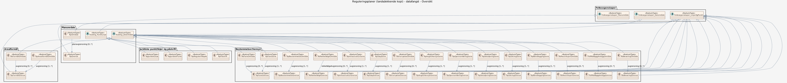
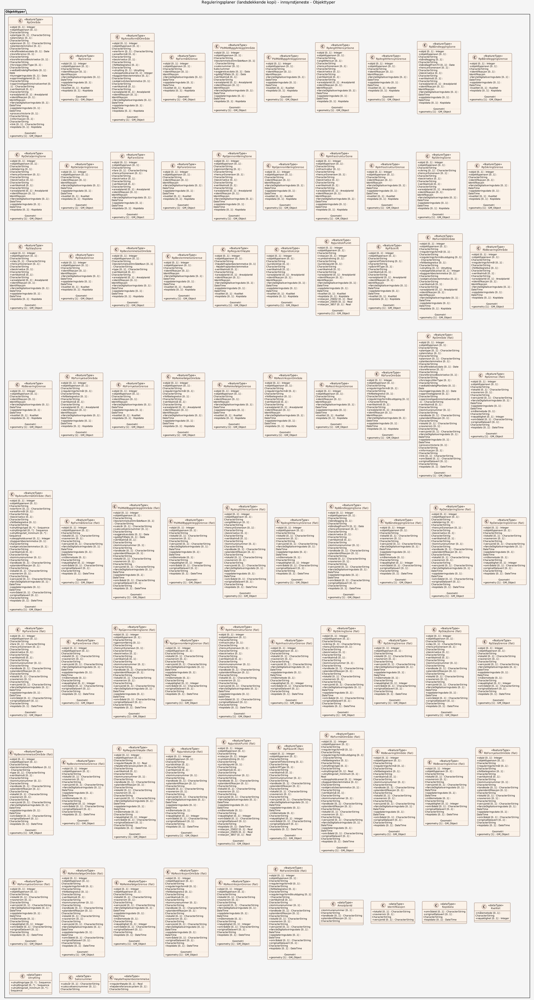

# Produktspesifikasjon: Reguleringsplaner (landsdekkende kopi)

*Fra 1.1.2026 vil Direktoratet for byggkvalitet opprettholde «Norge digitalt arealplankartløsning» (NAP) med datasett for reguleringsplaner og denne oppføringen er oppdatert med distribusjoner.

Reguleringsplan er et arealplankart med tilhørende bestemmelser som fastlegger bruk, flerbruk og vern i bestemte områder, og som gir grunnlag for avklaring av hvilke bygge- og anleggstiltak som kan gjennomføres i planområdet. Kommunestyret skal sørge for at det blir utarbeidet reguleringsplan for de områder i kommunen hvor dette følger av loven eller av kommuneplanens arealdel, samt der det ellers er behov for å sikre forsvarlig planavklaring og gjennomføring av bygge- og anleggstiltak, flerbruk og vern i forhold til berørte private og offentlige interesser. For gjennomføring av større bygge- og anleggstiltak og andre tiltak som kan få vesentlige virkninger for miljø og samfunn, kreves det reguleringsplan. Reguleringsplan kan utarbeides som en områderegulering for et større område eller som en detaljregulering for enkelttiltak eller mindre områder. Staten kan, når viktige statlige eller regionale interesser tilsier det, vedta statlig reguleringsplan. Private har rett til å fremme forslag til detaljregulering.

Datasettet genereres fra den landsdekkende kopien av reguleringsplaner. Denne holdes oppdatert med data fra de originale plandataene som forvaltes i kommunene. Oppdateringen skjer ved synkronisering eller periodisk kopiering fra kommunene sine data.*

**Nøkkelord:** Reguleringsplan, Arealplan, Områdeplan, Detaljregulering, Norges fastland, Norge, Kommune, Arealbruk, Plan

**Emnekategorier:** Plan og eiendom

**Geografisk utstrekning**:

- **Vest**: 2.0
- **Øst**: 33.0
- **Sør**: 57.0
- **Nord**: 72.0

**Tidsmessig utstrekning**:

- **Tidsperiode**:
  - **Fra**: 2025-09-16
  - **Til**: 2025-09-16

## Om spesifikasjonen

> **Denne versjonen av produktspesifikasjonen:**  
> **Opprettet dato:** 2025-09-16 
> **Endret dato:** 2025-09-16 
> **Språk:** nor 
> **Kontaktinformasjon:** Direktoratet for byggkvalitet, [ftb@dibk.no](mailto:ftb@dibk.no)

## Om produktet Reguleringsplaner (landsdekkende kopi)

> **Romlig representasjonstype:** Vektor 
> **Unik identifikator:** dac27348-5c2e-4a6a-9497-c4c792108cae 
> **Kontaktinformasjon:** Direktoratet for byggkvalitet, [ftb@dibk.no](mailto:ftb@dibk.no)
>
> **Romlig oppløsning:**
>
> **Avstand**:
>
> - **Måleenhet**: meter
> - **Verdi**: 0.01
>
> **Begrensninger:**
>
> **Ressursbegrensninger**:
>
> - **Bruksbegrensninger**: Ikke egnet for kommunens arealplanarbeid. Oppdaterte data fås hos kommunen. Private forslagsstillere må henvende seg direkte til kommunen.
>
> **Juridiske begrensninger**:
>
> - **Tilgangsbegrensninger**: Norge digitalt begrenset
> - **Bruksbegrensninger**: Lisens
> - **Lisens**: Norge digitalt-lisens
> - **Lisenslenke**: <https://www.geonorge.no/Geodataarbeid/geografisk-infrastruktur/Norge-digitalt/Avtaler-og-maler/Norge-digitalt-lisens/>
> - **Andre begrensninger**: Nedlasting av data begrenset til Norge digitalt avtaleparter.
>
> **Sikkerhetsbegrensninger**:
>
> - **Klassifisering**: Ugradert

### Formål

Dekke Norge digitalt parter sine behov for tilgang til reguleringsplaner (geografiske data - vektordata).
Vise plan for bruk, vern og utforming av arealer og fysiske omgivelser i bestemte områder.

### Bruksområde

Arealplanlegging, saksbehandling i henhold til plan og bygningsloven, utarbeidelse av statistikk, vurdering av tiltak/prosjekter, innsyn i kommunens reguleringplaner.

## Omfang

### Hele datasettet

**Nivå**: dataset

**Nivåbeskrivelse**: Gjelder hele datasettet. Hvis omfang ikke er oppgitt under en overskrift, gjelder teksten for hele datasettet og alle leveranser

### datafangst

**Nivå**: dataset

**Nivåbeskrivelse**: NPAD reguleringsplaner 2018

### innsynstjeneste

**Nivå**: dataset

**Nivåbeskrivelse**: Innsynstjeneste for reguleringsplaner

## Datainnhold og struktur

### Datamodell - datafangst

➡️ [Se full datamodell for omfang "datafangst" (diagram per pakke og objektkatalog)](datafangst/objektkatalog.html)

### Datamodell - innsynstjeneste

➡️ [Se full datamodell for omfang "innsynstjeneste" (diagram per pakke og objektkatalog)](innsynstjeneste/objektkatalog.html)

## Datakvalitet

**Nivå**: dataset

## Vedlikehold

**Vedlikeholdsfrekvens**: Daglig

**Status**: Planlagt

## Leveranse

| Tjeneste | Endepunkt | Type | Format | Leveranseenheter |
| --- | --- | --- | --- | --- |
| WMS-tjeneste | [Lenke](https://nap.ft.dibk.no/services/wms/reguleringsplaner/?service=WMS&request=GetCapabilities) | OGC:WMS | PNG | landsfiler |
| OGC API-Features | [Lenke](https://nap.ft.dibk.no/services/rest/reguleringsplaner/vn1) | OGC:API-Features | GeoJSON | landsfiler |
| OGC API-Features | [Lenke](https://nap.ft.dibk.no/services/rest/reguleringsplaner/vn2) | OGC:API-Features | GeoJSON | landsfiler |
| OGC API-Features | [Lenke](https://nap.ft.dibk.no/services/rest/reguleringsplaner/vn3) | OGC:API-Features | GeoJSON | landsfiler |
| OGC API-Features | [Lenke](https://nap.ft.dibk.no/services/rest/reguleringsplaner/vn4) | OGC:API-Features | GeoJSON | landsfiler |
| OGC API-Features | [Lenke](https://nap.ft.dibk.no/services/rest/reguleringsplaner/vn5) | OGC:API-Features | GeoJSON | landsfiler |
| Atom Feed | [Lenke](https://nap.ft.dibk.no/services/download/reguleringsplaner/atom) | W3C:AtomFeed | PostGIS | landsfiler |
| Egen nedlastningsside | [Lenke](https://nap.ft.dibk.no/services/download/klimagasskalkulator/) | WWW:DOWNLOAD-1.0-http--download | GeoJSON | landsfiler |
| Geonorge nedlastning | [Lenke](https://nap.ft.dibk.no/services/nedlasting/api/capabilities/) | GEONORGE:DOWNLOAD | GeoPackage, GML, PostGIS | landsfiler |

## Metadata

**Metadatastandard**: ISO19115

**Metadatastandardversjon**: 2003

**Metadatadato**: 2026-02-27

**språk**: nor

**Kontakt**:

- **Organisasjon**: Direktoratet for byggkvalitet
- **Kontaktperson**: Olaug Hana Nesheim
- **Logo**: <https://register.geonorge.no/data/organizations/974760223_DIBK_liten.jpg>
- **Epost**: ftb@dibk.no
- **rolle**: pointOfContact

**Metadataidentifikator**:

- **Utsteder**: Geonorge
- **kode**: dac27348-5c2e-4a6a-9497-c4c792108cae
- **koderom**: <https://kartkatalog.geonorge.no/metadata/>
- **Metadatalenke**: <https://kartkatalog.geonorge.no/metadata/dac27348-5c2e-4a6a-9497-c4c792108cae>

## Tilleggsinformasjon

Det er kun de geografiske dataene (vektordataene) av reguleringsplanene som er tilgjengelige for nedlasting. De tilhørende plandokumenter/bestemmelser finnes i kommunenes planregistre. Det ligger en lenke på planområdene i de geografiske dataene som peker til kommunenes planregistre, og dermed gjør dokumentene lettere tilgjengelig for brukerne.

En reguleringsplan kan inneholde ett eller flere vertikalnivåer; under grunnen, på grunnen/vannoverflaten, over grunnen, på bunnen og i vannsøylen.
Datasettet er delt i vertikalnivå (vn1 til vn5) avhengig av i hvilket vertikalnivå forslaget ligger, eventuelt flere vertikalnivåer.
- Under grunnen (tunnel) = 1
- På grunnen/vannoverflate = 2
- Over grunnen (bru) = 3
- På bunnen (vann/sjø) = 4
- I vannsøylen = 5
